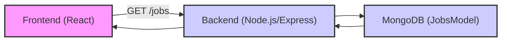
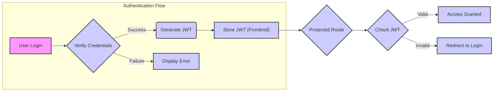

# API Endpoints and Communication

This document outlines the API endpoints used for communication between the frontend and backend of the Job Portal application. Understanding these endpoints is crucial for debugging, extending functionality, and ensuring seamless data flow.

## User Profile Management

*   **Get User Profile:** Retrieves a user's profile information.
    *   Endpoint: `GET /user/:username`
    *   File: `Backend/controllers/Logic.js`
    *   Purpose: Fetches user profile details based on the username.

    ```javascript title="Backend/controllers/Logic.js"
    const getUserProfile = async (req, res) => {
      try {
        const username = req.params.username;
        const data = await UserProfile.findOne({ username: username });
        if (!data) return res.status(404).json({ message: "User not found" });
        res.json(data);
      } catch (error) {
        res.status(500).json({ message: error.message });
      }
    };
    ```

    [View on GitHub](https://github.com/lande26/Job-Portal/blob/main/Backend/controllers/Logic.js)

*   **Save User Profile:** Updates a user's profile information.
    *   Endpoint: `PUT /user/:username`
    *   File: `Backend/controllers/Logic.js`
    *   Purpose: Saves or updates the user profile details.

    ```javascript title="Backend/controllers/Logic.js"
    const saveUserProfile = async (req, res) => {
      try {
        const username = req.params.username;
        const updateData = req.body;
        const updatedUser = await UserProfile.findOneAndUpdate(
          { username: username },
          { $set: updateData },
          { new: true }
        );
        if (!updatedUser) {
          return res.status(404).json({ message: "User not found" });
        }
        res.json({ message: "Profile updated successfully", user: updatedUser });
      } catch (error) {
        console.error("Error updating user profile:", error);
        res.status(500).json({ message: "Internal Server Error" });
      }
    };
    ```

    [View on GitHub](https://github.com/lande26/Job-Portal/blob/main/Backend/controllers/Logic.js)

## Company Profile Management

*   **Get Company Profile:** Retrieves a company's profile information.
    *   Endpoint: `GET /company/:username`
    *   File: `Backend/controllers/Logic.js`
    *   Purpose: Used to display the company profile details.

    ```javascript title="Backend/controllers/Logic.js"
    const getCompanyProfile = async (req, res) => {
      try {
        const username = req.params.username;
        const data = await CompanyProfile.findOne({ username: username });
        if (!data) return res.status(404).json({ message: "User not found" });
        res.json(data);
      } catch (error) {
        res.status(500).json({ message: error.message });
      }
    };
    ```

    [View on GitHub](https://github.com/lande26/Job-Portal/blob/main/Backend/controllers/Logic.js)

*   **Save Company Profile:** Updates a company's profile information.
    *   Endpoint: `PUT /company/:username`
    *   File: `Backend/controllers/Logic.js`
    *   Purpose: Used to save or update company profile information.

    ```javascript title="Backend/controllers/Logic.js"
    const saveCompanyProfile = async (req, res) => {
      try {
        const username = req.params.username;
        const updateData = req.body;
        const updatedUser = await CompanyProfile.findOneAndUpdate(
          { username: username },
          { $set: updateData },
          { new: true }
        );
        if (!updatedUser) {
          return res.status(404).json({ message: "User not found" });
        }
        res.json({ message: "Profile updated successfully", user: updatedUser });
      } catch (error) {
        console.error("Error updating user profile:", error);
        res.status(500).json({ message: "Internal Server Error" });
      }
    };
    ```

    [View on GitHub](https://github.com/lande26/Job-Portal/blob/main/Backend/controllers/Logic.js)

## Job Posting and Retrieval

*   **Post Job:** Creates a new job posting.
    *   Endpoint: `POST /EDashboard/jobposting`
    *   File: `Backend/controllers/Logic.js`
    *   Purpose: Allows companies to post new job openings.

    ```javascript title="Backend/controllers/Logic.js"
    const PostJob = async (req, res) => {
      try {
        const { details } = req.body;
        if (!details || !details.jobprofile || !details.location || !details.salary) {
          return res.status(400).json({ msg: "Missing job details", success: false });
        }
        const authHeader = req.headers.authorization;
        if (!authHeader || !authHeader.startsWith("Bearer ")) {
          return res.status(401).json({ msg: "JWT must be provided", success: false });
        }
        const jwtToken = authHeader.split(" ")[1];
        const decoded = jwt.verify(jwtToken, process.env.JWT_SECRET);
        const job = new JobsModel({
          jobprofile: details.jobprofile,
          companyusername: decoded.username,
          location: details.location,
          salary: details.salary,
          type: details.type,
          description: details.desc,
          requirements: details.requirements,
          deadline: details.deadline,
          openings: details.openings,
          experience: details.experience,
          createdAt: new Date(),
        });

        await job.save();

        res.status(201).json({ msg: "Job posting success!", success: true });
      } catch (error) {
        console.error("Error in PostJob:", error.message);
        res.status(500).json({ msg: "Internal server issue", error: error.message });
      }
    };
    ```

    [View on GitHub](https://github.com/lande26/Job-Portal/blob/main/Backend/controllers/Logic.js)

*   **Get Jobs:** Retrieves all job postings.
    *   Endpoint: `GET /jobs`
    *   File: `Backend/controllers/Logic.js`
    *   Purpose: Fetches all the jobs to display for the user.

    ```javascript title="Backend/controllers/Logic.js"
    const getJobs = async (req, res) => {
      try {
        const jobs = await JobsModel.find();
        if (jobs.length > 0) {
          res.json(jobs);
        } else {
          res.status(404).send({ msg: "Jobs not found", success: false });
        }
      } catch (error) {
        console.error(error);
        res.status(500).json({ msg: "Internal server issue", error });
      }
    };
    ```

    [View on GitHub](https://github.com/lande26/Job-Portal/blob/main/Backend/controllers/Logic.js)

## Candidate Shortlisting

*   **Shortlist Candidate:** Shortlists or rejects a candidate for a job.
    *   Endpoint: `POST /EDashboard/myjobs/:id`
    *   File: `Backend/controllers/Logic.js`
    *   Purpose: Allows companies to shortlist or reject candidates, updating notifications and job application statuses.

    ```javascript title="Backend/controllers/Logic.js"
    const shortlistCandidate = async (req, res) => {
      try {
        const { username, id, action } = req.body;
        const authHeader = req.headers.authorization;
        if (!authHeader || !authHeader.startsWith("Bearer ")) {
          return res.status(401).json({ msg: "No token provided", success: false });
        }
        const jwtToken = authHeader.split(" ")[1];
        const decoded = jwt.verify(jwtToken, process.env.JWT_SECRET);
        const company = decoded.username;
        const candidate = await UserProfile.findOne({ username: username });
        const job = await JobsModel.findOne({ _id: id });
        if (!candidate) {
          return res.status(404).json({ msg: "Candidate not found", success: false });
        }
        let employer = await shortlisted.findOne({ jobid: id });
        if (!employer) {
          employer = new shortlisted({
            companyid: company,
            jobid: id,
            candidates: [],
          });
        }
        let notification = {}
        if (action === "shortlist") {
          if (!employer.candidates.some((x) => x.username === username)) {
            employer.candidates.push({ username });
            notification = {
              type: "shortlisted",
              message: `You have been shortlisted by ${company}.`,
              timestamp: new Date(),
              isRead: false,
            };

          } else {
            return res.status(400).json({ msg: "Candidate already shortlisted", success: false });
          }
        } else if (action === "reject") {
          employer.candidates = employer.candidates.filter((c) => c.username !== username);
          job.appliedCandidatesID = job.appliedCandidatesID.filter((x) => x !== username);
          notification = {
            type: "rejected",
            message: `You have been rejected by ${company}.`,
            timestamp: new Date(),
            isRead: false,
          };
        } else {
          return res.status(400).json({ msg: "Invalid action", success: false });
        }
        candidate.notifications.push(notification)
        await candidate.save();
        await employer.save();
        await job.save();
        const message =
          action === "shortlist"
            ? "Candidate successfully shortlisted"
            : "Candidate successfully rejected";
        res.status(201).json({ msg: message, success: true, updatedCandidates: employer.candidates });
      } catch (error) {
        console.error("Error in shortlistCandidate:", error);
        res.status(500).json({ msg: "Server error", success: false });
      }
    };
    ```

    [View on GitHub](https://github.com/lande26/Job-Portal/blob/main/Backend/controllers/Logic.js)

## Communication Flow





This diagram illustrates the basic flow for fetching job postings. The frontend sends a GET request to the backend, which then queries the MongoDB database and returns the data to the frontend.

## Key Integration Points

*   **Authentication:** Many endpoints, especially those related to job posting and candidate management, require JWT (JSON Web Token) authentication. This ensures that only authorized users (companies) can perform these actions. The `requireAuth` middleware (mentioned in `Backend/server.js`) is likely used to protect these routes.

*   **Data Validation:** The backend performs data validation to ensure that the data received from the frontend is in the correct format and contains all the required fields. For example, the `PostJob` endpoint checks if the `jobprofile`, `location`, and `salary` fields are present in the request body.

*   **Error Handling:** The backend includes error handling to catch any exceptions that may occur during the request processing. The errors are logged to the console and a JSON response with an error message is sent to the frontend.

*   **Frontend Data Fetching:** The `Jobs.jsx` and `User.jsx` components use `fetch` or `axios` to make API requests to the backend. The components update their state with the data received from the backend and re-render the UI.





This diagram depicts the flow of authentication within the Job Portal, emphasizing how JWTs are used to secure access to protected routes.

By understanding these API endpoints and their integration points, developers can effectively maintain, troubleshoot, and extend the functionality of the Job Portal application.
```