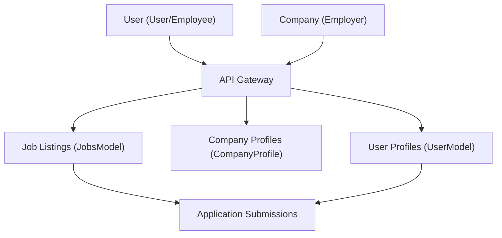

# Data Management and Persistence

This section details the database interactions and data modeling employed within the Job Portal. We utilize MongoDB as our NoSQL database, with Mongoose as the Object Data Modeling (ODM) library to define schemas and manage interactions.

## Database Connection

The application establishes a connection to the MongoDB database using environment variables for the connection string.

```javascript
// Backend/models/db.js
const mongoose = require('mongoose');
const mongo_url = process.env.MONGO_CONN;

const connectDB = async () => {
  try {
      await mongoose.connect(mongo_url, {

      });
      console.log(" MongoDB Connected");
  } catch (error) {
      console.error(" MongoDB Connection Error:", error);
      process.exit(1);
  }
};

module.exports = {connectDB}
```

## Data Models

The Job Portal defines several Mongoose schemas to structure the data for users, company profiles, and job listings.

### User Model

The `UserModel` represents standard users of the platform, storing their `username`, `email`, and `password`.

```javascript
// Backend/models/user.js
const mongoose=require("mongoose")
const Schema=mongoose.Schema;

const UserSchema=new Schema({
    username:{
        type:String,
        required:true,
        unique:true
    },
    email:{
        type:String,
        required:true,
        unique:true
    },
    password:{
        type:String,
        required:true,
        unique:true
    },
    createdAt : {
        type :Date,
        deafult:Date.now
    }
})

const UserModel=mongoose.model('users',UserSchema);
module.exports = { UserModel };
```

### Company Profile Model

The `CompanyProfile` model stores detailed information about companies, including their `companyName`, `industry`, `website`, `email`, and other relevant attributes.

```javascript
// Backend/models/companyprofile.js
const mongoose = require("mongoose");

const companySchema = new mongoose.Schema(
  {
    username: { type: String , required: true,default:""},
    companyName: { type: String,default:""},
    industry: { type: String,default:""},
    description: { type: String,default:"" },
    website: { type: String ,default:""},
    email: { type: String, required: true, unique: true,default:"" },
    phone: { type: String,default:"" },
    location: { type: String ,default:""},
    foundedYear: { type: Number,default:"" },
    revenue: { type: String,default:"" },
    linkedin: { type: String ,default:""},
    services: { type: String,default:"" },
    technologies: { type: String,default:"" },
    companypicurl: { type: String ,default:""}
  }
);

const CompanyProfile= mongoose.model("CompanyProfile", companySchema);
module.exports = CompanyProfile
```

### Jobs Model

The `JobsModel` defines the structure for job postings, including `jobprofile`, `companyusername`, `location`, `salary`, `type`, `description`, `requirements`, `deadline`, `openings`, `experience`, and an array of `appliedCandidatesID`.

```javascript
// Backend/models/Jobs.js
const mongoose = require('mongoose');

const jobSchema = new mongoose.Schema({
  jobprofile: {
    type: String,
    required: [true, "Job profile is required"],
    trim: true
  },
  companyusername: {
    type: String,
    required: [true, "Company username is required"],
    trim: true
  },
  location: {
    type: String,
    required: [true, "Location is required"],
    trim: true
  },
  salary: {
    type: Number,
    required: [true, "Salary is required"]
  },
  type: {
    type: String,
    required: [true, "Job type is required"]

  },
  description: {
    type: String,
    required: [true, "Job description is required"]
  },
  requirements: {
    type: String,
    default: "No specific requirements provided"
  },
  deadline: {
    type: Date,
    required: [true, "Application deadline is required"]
  },
  openings: {
    type: Number,
    default: 1
  },
  experience:{
    type:String,
  },
  appliedCandidatesID:{
    type:Array,
    default:[]
  }
},
{
  timestamps: true
});

const JobsModel = mongoose.model('Jobs', jobSchema);
module.exports = JobsModel;
```

## Data Flow and Relationships

The following diagram illustrates the general data flow and relationships between the core data models:





## Key Takeaways

*   MongoDB is used as the primary database for storing all application data.
*   Mongoose provides a structured way to define and interact with the data models.
*   Separate models are defined for users, company profiles, and job postings to ensure data organization and integrity.
*   Environment variables are used for secure database connection string management.