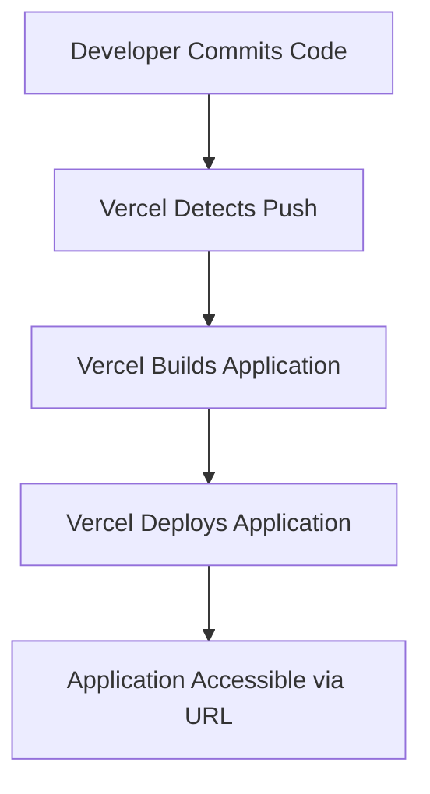

# Build and Deployment Configuration

This section details the configuration files crucial for building the frontend application and deploying it to platforms like Vercel. These configurations ensure optimal performance, efficient builds, and seamless deployment.

## Frontend Build Configuration (Vite)

The `vite.config.js` file configures the Vite build tool for the frontend. It specifies the base path for assets and includes the necessary plugin for React development.

```js
// Frontend/vite.config.js
import { defineConfig } from 'vite';
import react from '@vitejs/plugin-react';


export default defineConfig({
  base: '/',
  plugins: [react()],
});
```

## Frontend Styling Configuration (Tailwind CSS)

The `tailwind.config.js` file sets up Tailwind CSS, defining the content sources to scan for classes and allowing for theme extensions and custom plugins.

```js
// Frontend/tailwind.config.js
/** @type {import('tailwindcss').Config} */
export default {
  content: [
    "./index.html",
    "./src/**/*.{js,ts,jsx,tsx}",
  ],
  theme: {
    extend: {},
  },
  plugins: [],
}
```

## Vercel Deployment Configuration

The `vercel.json` file is used to configure deployment settings for Vercel. This specific configuration ensures that all incoming routes are rewritten to `index.html`, which is standard practice for single-page applications (SPAs) built with frameworks like React.

```json
// Frontend/vercel.json
{
    "rewrites": [
      { "source": "/(.*)", "destination": "/index.html" }
    ]
  }
```

## Deployment Flow

The following diagram illustrates a simplified deployment flow for the frontend application to Vercel.





## Key Takeaways

*   The `vite.config.js` file is essential for setting up the development server and production builds using Vite.
*   `tailwind.config.js` defines the scope and configuration for Tailwind CSS, enabling efficient styling.
*   `vercel.json` is critical for ensuring SPAs function correctly on Vercel by handling client-side routing.