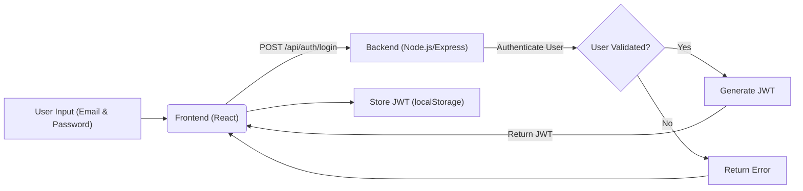
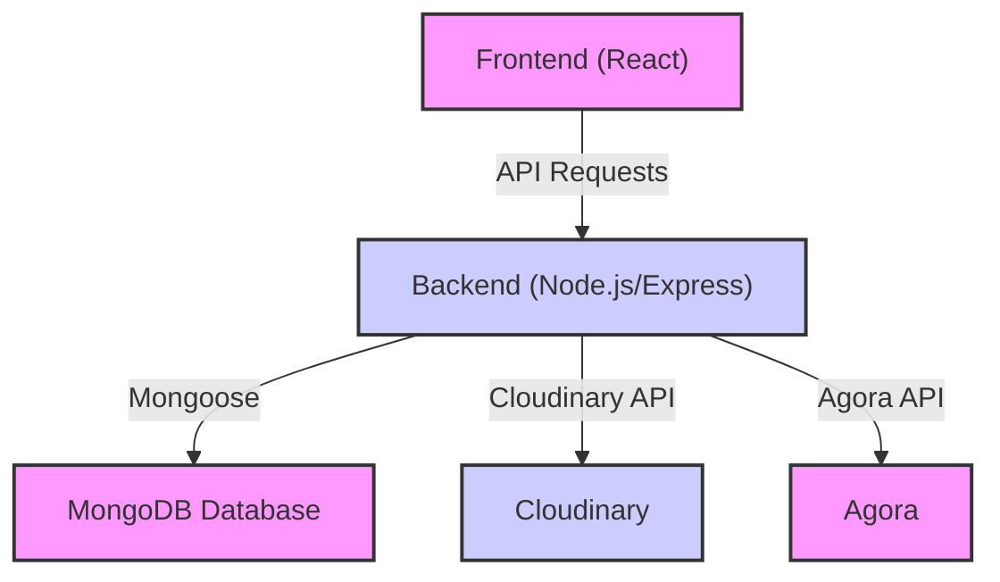

# Deployment and Configuration

This document outlines the steps and configurations required to deploy and configure the Job Portal application. It covers both the frontend (React) and backend (Node.js/Express) components, providing essential file configurations and deployment strategies.

## Frontend Deployment (Vercel)

The frontend is designed for deployment on Vercel. The `vercel.json` file configures routing for the single-page application.

### `Frontend/vercel.json`

```json
{
    "rewrites": [
      { "source": "/(.*)", "destination": "/index.html" }
    ]
  }
```

This configuration ensures that all routes are directed to `index.html`, allowing React Router to handle client-side navigation.

[View on GitHub](https://github.com/lande26/Job-Portal/blob/main/Frontend/vercel.json)

## Backend Configuration (Node.js/Express)

The backend is a Node.js application using Express. The `package.json` file defines the dependencies and scripts for running the server.

### `Backend/package.json`

```json
{
  "name": "backend",
  "version": "1.0.0",
  "main": "server.js",
  "scripts": {
    "test": "echo \"Error: no test specified\" && exit 1",
    "start": "node server.js"
  },
  "keywords": [],
  "author": "",
  "license": "ISC",
  "type": "commonjs",
  "description": "",
  "dependencies": {
    "agora-access-token": "^2.0.4",
    "bcrypt": "^5.1.1",
    "cloudinary": "^2.5.1",
    "cors": "^2.8.5",
    "dotenv": "^16.4.7",
    "express": "^4.21.2",
    "inheritance-project": "file:..",
    "joi": "^17.13.3",
    "jsonwebtoken": "^9.0.2",
    "mongoose": "^8.9.3",
    "multer": "^1.4.5-lts.1",
    "nodemon": "^3.1.9"
  }
}
```

Key dependencies include:

-   `express`: For creating the web server.
-   `mongoose`: For interacting with MongoDB.
-   `bcrypt`: For password hashing.
-   `jsonwebtoken`: For authentication.
-   `cors`: For handling Cross-Origin Resource Sharing.
-   `dotenv`: For managing environment variables.
-   `cloudinary`: For image/video management.
-   `agora-access-token`: For real-time video and voice communication.

[View on GitHub](https://github.com/lande26/Job-Portal/blob/main/Backend/package.json)

### Environment Variables

The backend relies on environment variables for configuration. A `.env` file (not included in the repository for security reasons) should define the following:

```plaintext
PORT=5000
MONGODB_URI=<your_mongodb_uri>
JWT_SECRET=<your_jwt_secret>
CLOUDINARY_CLOUD_NAME=<your_cloudinary_cloud_name>
CLOUDINARY_API_KEY=<your_cloudinary_api_key>
CLOUDINARY_API_SECRET=<your_cloudinary_api_secret>
AGORA_APP_ID=<your_agora_app_id>
AGORA_APP_CERTIFICATE=<your_agora_app_certificate>
```

Ensure these variables are set in your deployment environment.

## Frontend Configuration (React)

The frontend, built with React and Vite, utilizes `package.json` for dependency management and build configurations.

### `Frontend/package.json`

```json
{
  "name": "inheritance",
  "private": true,
  "version": "0.0.0",
  "type": "module",
  "scripts": {
    "dev": "vite",
    "build": "vite build",
    "lint": "eslint .",
    "preview": "vite preview"
  },
  "dependencies": {
    "aos": "^2.3.4",
    "axios": "^1.7.9",
    "bootstrap": "^5.3.3",
    "inheritance-project": "file:..",
    "jwt-decode": "^4.0.0",
    "lucide-react": "^0.469.0",
    "multer": "^1.4.5-lts.1",
    "react": "^18.3.1",
    "react-bootstrap": "^2.10.7",
    "react-bootstrap-icons": "^1.11.5",
    "react-dom": "^18.3.1",
    "react-hot-toast": "^2.5.1",
    "react-icons": "^5.4.0",
    "react-router-dom": "^7.1.3",
    "react-slick": "^0.30.3",
    "slick-carousel": "^1.8.1"
  },
  "devDependencies": {
    "@eslint/js": "^9.17.0",
    "@types/react": "^18.3.18",
    "@types/react-dom": "^18.3.5",
    "@vitejs/plugin-react": "^4.3.4",
    "autoprefixer": "^10.4.20",
    "eslint": "^9.17.0",
    "eslint-plugin-react": "^7.37.2",
    "eslint-plugin-react-hooks": "^5.0.0",
    "eslint-plugin-react-refresh": "^0.4.16",
    "globals": "^15.14.0",
    "postcss": "^8.4.49",
    "tailwindcss": "^3.4.17",
    "vite": "^6.0.7"
  }
}
```

Key dependencies include:

-   `react`: Core React library.
-   `react-router-dom`: For client-side routing.
-   `axios`: For making HTTP requests to the backend.
-   `bootstrap` and `react-bootstrap`: For UI components and styling.
-   `jwt-decode`: For decoding JWT tokens.

[View on GitHub](https://github.com/lande26/Job-Portal/blob/main/Frontend/package.json)

### Building the Frontend

The frontend is built using Vite. The following command generates optimized production-ready assets:

```bash
npm run build
```

These assets are then deployed to Vercel.

### Backend API Integration

The frontend interacts with the backend API using `axios`. Here's an example of making a request to fetch job listings:

```javascript
import axios from 'axios';

const API_URL = process.env.REACT_APP_API_URL || 'http://localhost:5000'; // Use env variable if available

const fetchJobs = async () => {
  try {
    const response = await axios.get(`${API_URL}/api/jobs`);
    return response.data;
  } catch (error) {
    console.error('Error fetching jobs:', error);
    return [];
  }
};

export default fetchJobs;
```

[View on GitHub](https://github.com/lande26/Job-Portal/blob/main/Frontend/src/api/jobService.js) (Example - adjust path accordingly)

**Explanation:**

1.  **API_URL Configuration:** The `API_URL` is defined using an environment variable `REACT_APP_API_URL`.  If this variable isn't set (e.g., during local development), it defaults to `http://localhost:5000`. Ensure `REACT_APP_API_URL` is correctly configured in your Vercel deployment settings to point to your deployed backend.
2.  **Error Handling:** The `try...catch` block handles potential errors during the API request and logs them to the console.

### Authentication Flow

The authentication flow involves the frontend sending user credentials to the backend, which then returns a JWT upon successful authentication.  This JWT is stored in local storage and used for subsequent requests.

```javascript
import axios from 'axios';

const API_URL = process.env.REACT_APP_API_URL || 'http://localhost:5000';

const loginUser = async (email, password) => {
  try {
    const response = await axios.post(`${API_URL}/api/auth/login`, { email, password });
    if (response.data.token) {
      localStorage.setItem('token', response.data.token);
    }
    return response.data;
  } catch (error) {
    console.error('Login failed:', error.response ? error.response.data : error.message);
    throw error;
  }
};

export default loginUser;
```

[View on GitHub](https://github.com/lande26/Job-Portal/blob/main/Frontend/src/api/authService.js) (Example - adjust path accordingly)





## Key Integration Points

-   **Frontend to Backend Communication:** The frontend communicates with the backend using RESTful APIs.  Ensure the backend API URL is correctly configured in the frontend's environment variables, especially when deploying to platforms like Vercel.
-   **Authentication and Authorization:** JWTs are used for authentication and authorization.  The frontend stores the JWT in local storage after successful login and includes it in the headers of subsequent requests to protected API endpoints. The backend verifies the JWT to authorize access.
-   **Environment Variables:**  Use environment variables to manage sensitive information such as API keys, database URIs, and JWT secrets. Never commit these values directly to the repository.
-   **CORS Configuration:** The backend must be configured to allow Cross-Origin Resource Sharing (CORS) from the frontend's domain.  This is typically done using the `cors` middleware in Express.
-   **Cloudinary integration:** Used for image and video uploading and management. Necessary API keys and cloud name should be correctly configured for the backend to successfully utilize Cloudinary.





```