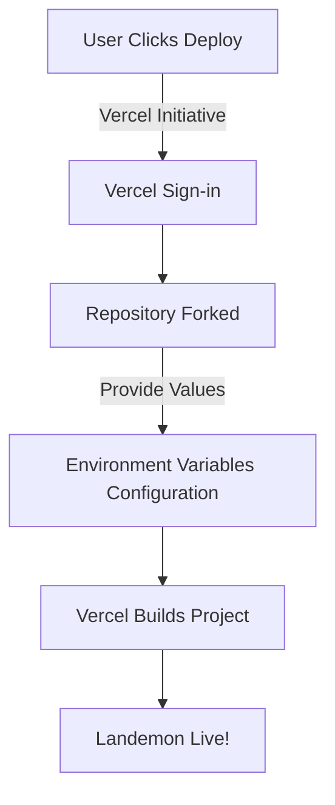

 # Introduction and Setup

Welcome to the Landemon documentation! This section provides a comprehensive overview of the Landemon project, its core purpose, and detailed instructions for setting up your development environment and deploying the application.

Landemon is a modern, full-featured movie streaming platform built with Next.js. It allows users to discover, watch, and review thousands of movies with an elegant and responsive interface, leveraging The Movie Database (TMDb) for content and Vidsrc.cc for streaming.

## Core Features

Landemon is designed to offer a rich and engaging user experience, powered by several key features:

### 🎥 Movie Discovery

*   **Extensive Library**: Access a vast collection of movies sourced from The Movie Database (TMDb).
*   **Smart Filtering**: Easily sort movies by genre, release date, popularity, and community rating.
*   **Advanced Search**: Find specific movies by title, director, cast members, or relevant keywords.
*   **Trending Content**: Stay updated with the most popular and trending movies.

### 🎯 Personalized Experience

*   **Recommendation Engine**: Receive tailored movie suggestions based on your viewing history and preferences.
*   **User Ratings**: Rate movies on a 10-point scale and view average community scores.
*   **Review System**: Write detailed reviews and explore opinions from other users.

### 🎬 Streaming Capabilities

*   **High-Quality Playback**: Enjoy direct, high-quality streaming of movies through integrated video sources.
*   **Multiple Sources**: Utilizes Vidsrc.cc to provide reliable and diverse streaming links.
*   **Seamless Experience**: Stream content without the need for redirects or external media players.

### 📱 Modern Design & Performance

*   **Responsive Layout**: Optimized for a perfect viewing experience across all devices, including desktops, tablets, and mobile phones.
*   **Fast Performance**: Built with Next.js, ensuring lightning-fast page loads and a smooth user interface.
*   **Beautiful UI**: A clean, modern, and intuitive interface crafted with Tailwind CSS.

## Tech Stack

Landemon is built upon a robust and modern technology stack to ensure performance, scalability, and an excellent developer experience:

*   **Next.js 14**: The React framework for server-side rendering, static site generation, and API routes, utilizing the App Router.
*   **TypeScript**: A superset of JavaScript that adds static types, enhancing code quality and maintainability.
*   **Tailwind CSS**: A utility-first CSS framework for rapidly building custom designs directly in your markup.
*   **TMDb API**: The primary data source for comprehensive movie information, images, and metadata.
*   **Vidsrc.cc**: Provides the streaming links for movie playback directly within the application.
*   **Vercel / Cloudflare Pages**: Platforms for high-performance deployment and hosting of the Next.js application.

The project also leverages various libraries for enhanced functionality, as seen in `package.json`, including `@radix-ui` for accessible UI components, `@tanstack/react-query` for data fetching, and `framer-motion` for animations.

## Quick Deployment

Landemon is designed for easy deployment to popular hosting platforms.

### Deploy with Vercel

Vercel provides a seamless one-click deployment experience, recommended for its integration with Next.js.

1.  **Click the "Deploy" button:**

    [](https://vercel.com/new/clone?repository-url=https%3A%2F%2Fgithub.com%2Flande26%2Fmovieko&env=NEXT_PUBLIC_APP_URL,NEXT_PUBLIC_TMDB_TOKEN,NEXT_PUBLIC_SITE_NAME&envDescription=Required%20environment%20variables%20for%20Landemon&envLink=https%3A%2F%2Fgithub.com%2Flande26%2Fmovieko%23environment-variables&project-name=landemon&repository-name=landemon)
2.  **Authentication**: Sign in to your Vercel account or create a new one.
3.  **Fork Repository**: The Landemon repository will be automatically forked to your GitHub account.
4.  **Configure Environment Variables**: You will be prompted to set the following:
    *   `NEXT_PUBLIC_APP_URL`: Your deployment URL (e.g., `https://landemon.vercel.app`).
    *   `NEXT_PUBLIC_TMDB_TOKEN`: Your API Read Access Token from TMDb (more details below).
    *   `NEXT_PUBLIC_SITE_NAME`: The display name for your platform (e.g., `Landemon`).
5.  **Deploy**: Click "Deploy" and wait for the build process to complete. Your movie streaming platform will then be live!

Here's a simplified flow of the Vercel deployment:





### Deploy with Cloudflare Pages

For deploying on Cloudflare Pages, follow these steps:

1.  **Fork the Repository**: Manually fork the Landemon repository to your GitHub account.
2.  **Connect to Cloudflare Pages**:
    *   Log in to [Cloudflare Pages](https://pages.cloudflare.com/).
    *   Click "Create a project" and then "Connect to Git".
    *   Select your forked Landemon repository.
3.  **Configure Build Settings**:
    *   **Framework preset**: `Next.js`
    *   **Build command**: `npx @cloudflare/next-on-pages@1`
    *   **Build output directory**: `.vercel/output/static`
4.  **Add Environment Variables**: Set the same environment variables as listed for Vercel deployment.
5.  **Save and Deploy**: Click "Save and Deploy" to initiate the build and deployment process.

For more detailed information on Cloudflare Pages deployment with Next.js, refer to the [Next-on-Pages documentation](https://github.com/cloudflare/next-on-pages/tree/main/packages/next-on-pages).

## Local Development

To set up Landemon for local development, follow these steps:

### Prerequisites

Before you begin, ensure you have the following installed:

*   **Node.js**: Version 18.x or higher. You can download it from [nodejs.org](https://nodejs.org/).
*   **npm or yarn**: A package manager. npm is included with Node.js; yarn can be installed globally (`npm install -g yarn`).
*   **TMDb API key**: You'll need an API Read Access Token (v4 auth) from The Movie Database. [Register for an account](https://www.themoviedb.org/signup) and obtain your key from your [API settings](https://www.themoviedb.org/settings/api).

### Setup Instructions

1.  **Clone the repository**:
    Start by cloning the Landemon project from its GitHub repository to your local machine.
    ```bash
    git clone https://github.com/lande26/movieko.git
    cd movieko
    ```
    [View `movieko` repository on GitHub](https://github.com/lande26/movieko)

2.  **Install dependencies**:
    Navigate into the cloned directory and install all required project dependencies using either npm or yarn.
    ```bash
    npm install
    # or
    yarn install
    ```
    This command reads the `dependencies` and `devDependencies` listed in your `package.json` and installs them.

3.  **Configure environment variables**:
    Landemon relies on environment variables for sensitive data and configuration. Create a `.env` file by copying the provided example.
    ```bash
    cp .env.example .env
    ```
    [View `.env.example` on GitHub](https://github.com/lande26/movieko/blob/main/.env.example)

    Now, open the newly created `.env` file and populate it with your specific values:
    ```plaintext
    NEXT_PUBLIC_APP_URL=http://localhost:3000
    NEXT_PUBLIC_TMDB_TOKEN=your_tmdb_api_key_here
    NEXT_PUBLIC_SITE_NAME=Landemon
    ```
    *   `NEXT_PUBLIC_APP_URL`: Set this to `http://localhost:3000` for local development.
    *   `NEXT_PUBLIC_TMDB_TOKEN`: Replace `your_tmdb_api_key_here` with your actual TMDb API Read Access Token.
    *   `NEXT_PUBLIC_SITE_NAME`: The desired name for your application.

4.  **Start the development server**:
    Once dependencies are installed and environment variables are configured, you can start the development server.
    ```bash
    npm run dev
    # or
    yarn dev
    ```
    This command initiates the Next.js development server, which includes hot-reloading for a smooth development workflow.

5.  **Open your browser**:
    Navigate to [http://localhost:3000](http://localhost:3000) in your web browser to see Landemon running locally.

### Build for Production

To build the application for a production environment and run it:
```bash
npm run build
npm run start
```
The `npm run build` script compiles the Next.js application into optimized production assets, and `npm run start` serves the built application.

## Environment Variables

Understanding the required environment variables is crucial for both local development and deployment.

| Variable                 | Description                                    | Required | Example                      |
| :----------------------- | :--------------------------------------------- | :------- | :--------------------------- |
| `NEXT_PUBLIC_APP_URL`    | The full URL where your application is deployed | Yes      | `https://landemon.vercel.app` |
| `NEXT_PUBLIC_TMDB_TOKEN` | Your TMDb API key for movie data access        | Yes      | `eyJhbGci...`                |
| `NEXT_PUBLIC_SITE_NAME`  | The display name for your site                 | Yes      | `Landemon`                   |

### Getting a TMDb API Key

1.  **Create Account**: Sign up for a free account at [themoviedb.org](https://www.themoviedb.org/signup).
2.  **Access Settings**: Go to your account `Settings` and then select `API`.
3.  **Request API Key**: Choose the "Developer" option and request a new API key.
4.  **Copy Token**: Locate and copy your **API Read Access Token (v4 auth)**. This is the value you will use for `NEXT_PUBLIC_TMDB_TOKEN`.

> **Note**: The `.env.example` file contains a default token for testing purposes. For any production deployment or serious development, it is **imperative** to use your own unique TMDb API key.

## Key Integration Points and Configuration Insights

Understanding the project's configuration files provides deeper insight into its structure and how various parts integrate.

### `package.json` Overview

The `package.json` file orchestrates the project's dependencies and scripts.

```json
{
  "name": "landemon",
  "version": "0.1.0",
  "private": true,
  "scripts": {
    "dev": "next dev",
    "build": "next build",
    "pages:build": "next-on-pages",
    "start": "next start",
    "lint": "next lint --cache",
    "format": "prettier --write .",
    "typecheck": "tsc --noEmit",
    "prepare": "husky install"
  },
  "dependencies": {
    // ... core dependencies
    "@cloudflare/next-on-pages": "^1.11.3"
  },
  "devDependencies": {
    // ... dev dependencies
    "husky": "^8.0.0",
    "lint-staged": "^15.2.0",
    "prettier": "^3.0.3",
    "prettier-plugin-tailwindcss": "^0.5.4",
    "tailwindcss": "^3.3.3",
    "typescript": "^5.2.2"
  }
}
```
[View `package.json` on GitHub](https://github.com/lande26/movieko/blob/main/package.json)

**Key Scripts:**
*   `dev`: Starts the Next.js development server.
*   `build`: Creates an optimized production build of the Next.js application.
*   `pages:build`: Specifically for Cloudflare Pages deployment, utilizing the `@cloudflare/next-on-pages` package.
*   `start`: Serves the production-built application.
*   `lint`: Runs ESLint to check for code quality issues.
*   `format`: Formats code using Prettier, ensuring consistent code style.
*   `typecheck`: Performs a TypeScript type check without emitting any JavaScript.
*   `prepare`: Installs Husky Git hooks, facilitating pre-commit and pre-push checks for linting and formatting.

**Dependencies:**
Notable dependencies include `@t3-oss/env-nextjs` for robust environment variable validation, `@tanstack/react-query` for server state management, `@trpc/*` for end-to-end type-safe APIs, and `@vercel/analytics` and `@vercel/speed-insights` for performance monitoring. The inclusion of `@cloudflare/next-on-pages` as both a dependency and devDependency highlights its role in enabling Cloudflare Pages deployments.

### `tsconfig.json` for TypeScript Configuration

The `tsconfig.json` file is fundamental for configuring the TypeScript compiler.

```json
{
  "compilerOptions": {
    "target": "es5",
    "lib": ["dom", "dom.iterable", "esnext"],
    "allowJs": true,
    "skipLibCheck": true,
    "strict": true,
    "noEmit": true,
    "esModuleInterop": true,
    "module": "esnext",
    "moduleResolution": "node",
    "resolveJsonModule": true,
    "isolatedModules": true,
    "jsx": "preserve",
    "incremental": true,
    "plugins": [
      {
        "name": "next"
      }
    ],
    "paths": {
      "@/*": ["./src/*"]
    },
    "forceConsistentCasingInFileNames": true
  },
  "include": [
    // ... included files
  ],
  "exclude": ["node_modules"]
}
```
[View `tsconfig.json` on GitHub](https://github.com/lande26/movieko/blob/main/tsconfig.json)

**Key Configuration Points:**
*   `"strict": true`: Enables all strict type-checking options, promoting robust code.
*   `"noEmit": true`: Ensures TypeScript only performs type checking and doesn't output JavaScript files, letting Next.js handle the compilation.
*   `"jsx": "preserve"`: Instructs TypeScript to leave JSX syntax as-is for Next.js to process.
*   `"paths": { "@/*": ["./src/*"] }`: Configures path aliases, allowing imports like `import Component from "@/components/Component"` instead of relative paths, simplifying module resolution. This is a common pattern in Next.js projects for better maintainability.
*   `"plugins": [{ "name": "next" }]`: Integrates the Next.js TypeScript plugin, providing enhanced type checking and autocompletion specific to Next.js features.

### `tailwind.config.ts` for UI Styling

The `tailwind.config.ts` file is where Tailwind CSS is configured, defining the design system for Landemon.

```typescript
import { fontFamily } from "tailwindcss/defaultTheme";
/** @type {import('tailwindcss').Config} */
module.exports = {
  darkMode: ["class"],
  content: [
    "./pages/**/*.{ts,tsx}",
    "./components/**/*.{ts,tsx}",
    "./app/**/*.{ts,tsx}",
    "./src/**/*.{ts,tsx}",
  ],
  theme: {
    screens: {
      xs: "500px",
      // ... other screen sizes
    },
    container: {
      center: true,
      padding: "4vw",
      screens: {
        "2xl": "1400px",
      },
    },
    extend: {
      colors: {
        // ... custom color palette using HSL variables
      },
      borderRadius: {
        // ... custom border radii using CSS variables
      },
      keyframes: {
        "accordion-down": {
          from: { height: 0 },
          to: { height: "var(--radix-accordion-content-height)" },
        },
        // ... other keyframes
      },
      animation: {
        // ... custom animations
      },
      fontFamily: {
        sans: ["var(--font-sans)", ...fontFamily.sans],
        heading: ["var(--font-heading)", ...fontFamily.sans],
      },
    },
  },
  plugins: [require("tailwindcss-animate")],
};
```
[View `tailwind.config.ts` on GitHub](https://github.com/lande26/movieko/blob/main/tailwind.config.ts)

**Key Configuration Points:**
*   `darkMode: ["class"]`: Enables dark mode based on the presence of a `dark` class in the HTML, allowing for theme toggling.
*   `content`: Specifies all files where Tailwind should look for classes to generate its CSS, ensuring optimized bundle sizes.
*   `theme.screens`: Defines custom breakpoints for responsive design beyond the default Tailwind sizes, like `xs` at `500px`.
*   `theme.container`: Configures a default container class for consistent content width and padding.
*   `theme.extend`: This section is crucial for customizing and extending Tailwind's default theme.
    *   `colors`: Defines a custom color palette, using CSS HSL variables (e.g., `var(--primary)`) for dynamic theming (e.g., light/dark mode).
    *   `borderRadius`: Customizes border-radius values, also referencing CSS variables for consistency.
    *   `keyframes` and `animation`: Defines custom CSS animations, particularly for Radix UI components like accordions.
    *   `fontFamily`: Integrates custom fonts (`--font-sans`, `--font-heading`), ensuring a distinct typographic style.
*   `plugins`: Includes `tailwindcss-animate`, which provides utilities for animating with CSS variables and keyframes.

These configuration files collectively define the Landemon project's technical foundation, from its development environment and build process to its styling and type safety.