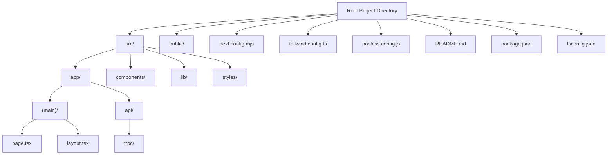
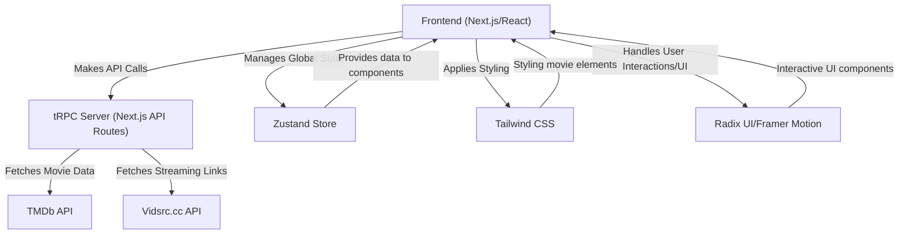

 # Introduction and Setup

This document provides a high-level overview of the Movieko project, a robust foundation for developing a movie streaming website. It outlines the project's core features, the technologies it leverages, and detailed instructions for setting up your local development environment and deploying the application.

The Movieko project is designed to be a launching point, offering a comprehensive set of functionalities and a modern development stack to streamline the creation of a feature-rich streaming platform.

## Key Features

Movieko comes equipped with a range of features to offer a complete movie browsing and interaction experience:

*   **Browse Movies**: Explore an extensive collection of films, sortable by genre, release date, or popularity.
*   **Search Functionality**: Efficiently locate movies using titles, directors, or cast members.
*   **User Reviews**: Users can read and contribute their own reviews, sharing insights and opinions.
*   **User Ratings**: Assign ratings to movies and view community-averaged scores.
*   **Recommendation Engine**: Personalized movie suggestions are provided based on user preferences and viewing history.
*   **Responsive Design**: The website offers a seamless and consistent experience across various devices and screen sizes.

## Technology Stack

The Movieko project is built upon a modern and efficient technology stack, optimized for performance and developer experience.

| Technology      | Description                                     | Purpose                    |
| :-------------- | :---------------------------------------------- | :------------------------- |
| [Next.js](https://nextjs.org/)     | React framework for production       | Frontend framework         |
| [TypeScript](https://www.typescriptlang.org/)  | Strongly typed programming language | Language                   |
| [Tailwind CSS](https://tailwindcss.com/) | Utility-first CSS framework         | Styling                    |
| [Vercel](https://vercel.com/)      | Cloud platform for frontend developers | Deployment                 |
| [TMDb](https://www.themoviedb.org/)      | Movie Database API                      | Movie data source          |
| [Vidsrc.cc](https://vidsrc.cc)   | Streaming links provider                | Movie streaming integration |
| [Axios](https://axios-http.com/)       | Promise-based HTTP client               | API requests               |
| [Zustand](https://zustand.store/)     | Small, fast, and scalable bear-bones state-management solution | State management           |
| [Radix UI](https://www.radix-ui.com/)     | Unstyled, accessible UI components | UI components              |
| [Framer Motion](https://www.framer.com/motion/) | Production-ready motion library for React | Animations and transitions |
| [TanStack Query](https://tanstack.com/query/latest) | Powerful asynchronous state management for React | Data fetching and caching  |

## Project Structure Overview

The project uses a standard Next.js directory structure, enhanced with TypeScript and specific configuration files.





**Explanation:** This diagram illustrates the high-level file and folder structure. The `src/` directory contains the main application logic, split into `app/`, `components/`, `lib/`, and `styles/`. The `app/` directory follows Next.js 13+ app router conventions, with `(main)/` for root pages and `api/` for API routes, including tRPC endpoints. Essential configuration files like `package.json` and `tsconfig.json` reside at the root.

## Local Development Setup

To get the Movieko project running on your local machine, follow these steps. This process will clone the repository, install necessary dependencies, configure environment variables, and start the development server.

1.  **Clone the Repository**:
    Begin by cloning the project from its GitHub repository to your local machine.

    ```bash
    git clone https://github.com/lande26/movieko
    ```
    [View on GitHub](https://github.com/lande26/movieko)

2.  **Navigate to the Project Directory**:
    Change your current directory to the newly cloned project folder.

    ```bash
    cd movieko
    ```

3.  **Install Dependencies**:
    Install all required Node.js packages using npm. This reads from `package.json`.

    ```bash
    npm install
    ```
    You can examine the installed dependencies in the `package.json` file.
    [View package.json on GitHub](https://github.com/lande26/movieko/blob/main/package.json)

    A snippet of key dependencies from `package.json`:
    ```json
    {
      "name": "landemon",
      "version": "0.1.0",
      "private": true,
      "scripts": {
        "dev": "next dev",
        "build": "next build",
        "pages:build": "next-on-pages",
        "start": "next start",
        "lint": "next lint --cache",
        "format": "prettier --write .",
        "typecheck": "tsc --noEmit",
        "prepare": "husky install"
      },
      "dependencies": {
        "@next/third-parties": "^14.1.0",
        "@radix-ui/react-accordion": "^1.1.2",
        "@radix-ui/react-dialog": "^1.0.5",
        "@radix-ui/react-dropdown-menu": "^2.0.6",
        "@radix-ui/react-navigation-menu": "^1.1.4",
        "@radix-ui/react-tooltip": "^1.0.7",
        "@t3-oss/env-nextjs": "^0.7.0",
        "@tanstack/react-query": "^4.35.7",
        "@tanstack/react-query-devtools": "^4.35.7",
        "@trpc/client": "^10.38.5",
        "@trpc/next": "^10.38.5",
        "@trpc/react-query": "^10.38.5",
        "@trpc/server": "^10.38.5",
        "@vercel/analytics": "^1.1.0",
        "@vercel/speed-insights": "^1.0.9",
        "axios": "^1.7.0-beta.2",
        "class-variance-authority": "^0.7.0",
        "clsx": "^2.0.0",
        "framer-motion": "^10.18.0",
        "lucide-react": "^0.279.0",
        "next": "^14.1.0",
        "next-themes": "^0.2.1",
        "react": "^18.2.0",
        "react-dom": "^18.2.0",
        "react-youtube": "^10.1.0",
        "superjson": "^1.13.3",
        "tailwind-merge": "^1.14.0",
        "tailwindcss-animate": "^1.0.7",
        "zod": "^3.22.3",
        "zustand": "^4.4.6",
        "@cloudflare/next-on-pages": "^1.11.3"
      },
      "devDependencies": {
        "@cloudflare/next-on-pages": "^1.11.3",
        "@types/eslint": "^8.44.2",
        "@types/node": "^20.6.2",
        "@types/react": "^18.2.21",
        "@types/react-dom": "^18.2.7",
        "@typescript-eslint/eslint-plugin": "^6.7.0",
        "@typescript-eslint/parser": "^6.7.0",
        "autoprefixer": "^10.4.15",
        "eslint": "^8.49.0",
        "eslint-config-next": "^14.1.0",
        "husky": "^8.0.0",
        "lint-staged": "^15.2.0",
        "postcss": "^8.4.29",
        "prettier": "^3.0.3",
        "prettier-plugin-tailwindcss": "^0.5.4",
        "tailwindcss": "^3.3.3",
        "typescript": "^5.2.2"
      }
    }
    ```

4.  **Create `.env` file**:
    Duplicate the provided `.env.example` file and rename it to `.env`. This file will hold your environment variables.

    ```bash
    cp .env.example .env
    ```
    You will need to fill in the following environment variables. For testing, you can use the default token provided in `.env.example` for `NEXT_PUBLIC_TMDB_TOKEN`.

    *   `NEXT_PUBLIC_APP_URL`: The base URL of your deployed project (e.g., `http://localhost:3000` for local development).
    *   `NEXT_PUBLIC_TMDB_TOKEN`: Your API key for The Movie Database. Obtain it from [TMDb documentation](https://www.themoviedb.org/documentation/api).
    *   `NEXT_PUBLIC_SITE_NAME`: The name you wish to give your website (e.g., "Movieko").

5.  **Start the Development Server**:
    Launch the Next.js development server. The application will be accessible, usually at `http://localhost:3000`.

    ```bash
    npm run dev
    ```

## Deployments

Movieko supports deployment to popular platforms like Vercel and Cloudflare Pages.

### Deploy with Vercel

Vercel offers a seamless deployment experience for Next.js applications.

1.  **Deploy the project on Vercel**:
    You can typically do this by importing your Git repository into Vercel.
2.  **Configure Environment Variables**:
    During the Vercel deployment process, ensure you fill in the required environment variables:
    *   `NEXT_PUBLIC_APP_URL`: The URL of your deployed project (e.g., `https://movieko.vercel.app`)
    *   `NEXT_PUBLIC_TMDB_TOKEN`: Your TMDb API key.
    *   `NEXT_PUBLIC_SITE_NAME`: The name of your website.
3.  **Initiate Deployment**:
    Click "Deploy" and await the completion of the build and deployment process.

### Deploy with Cloudflare Pages

For deploying on [Cloudflare Pages](https://pages.cloudflare.com/), refer to the official `next-on-pages` project's README for detailed instructions. This project leverages the `@cloudflare/next-on-pages` package, which is included in `package.json` for both dependencies and devDependencies.

[View next-on-pages README](https://github.com/cloudflare/next-on-pages/tree/main/packages/next-on-pages)

A snippet from `tsconfig.json` showing compiler options for TypeScript:
```json
{
  "compilerOptions": {
    "target": "es5",
    "lib": ["dom", "dom.iterable", "esnext"],
    "allowJs": true,
    "skipLibCheck": true,
    "strict": true,
    "noEmit": true,
    "esModuleInterop": true,
    "module": "esnext",
    "moduleResolution": "node",
    "resolveJsonModule": true,
    "isolatedModules": true,
    "jsx": "preserve",
    "incremental": true,
    "plugins": [
      {
        "name": "next"
      }
    ],
    "paths": {
      "@/*": ["./src/*"]
    },
    "forceConsistentCasingInFileNames": true
  },
  "include": [
    ".eslintrc.mjs",
    "next-env.d.ts",
    "**/*.ts",
    "**/*.tsx",
    "**/*.cjs",
    "**/*.mjs",
    ".next/types/**/*.ts",
    "src/app/sitemap.xml",
    "src/app/sitemap/[id]"
  ],
  "exclude": ["node_modules"]
}
```
[View tsconfig.json on GitHub](https://github.com/lande26/movieko/blob/main/tsconfig.json)

## Contributing

Contributions to the Movieko project are highly encouraged! If you wish to contribute, please follow these guidelines:

1.  **Fork the repository**.
2.  **Create a new branch**: Use a descriptive name like `git checkout -b feature/your-awesome-feature`.
3.  **Implement your changes**.
4.  **Commit your changes**: Provide a clear and concise commit message (`git commit -am 'Add new feature'`).
5.  **Push to your branch**: `git push origin feature/your-awesome-feature`.
6.  **Create a new Pull Request** detailing your changes.

## License

This project is licensed under the MIT License. For more information, refer to the [LICENSE](https://github.com/lande26/movieko/blob/main/LICENSE) file in the repository.

## Acknowledgements

The Movieko project extends its gratitude to:

*   The Movie Database (TMDb) for generously providing comprehensive movie data via their API.
*   [Vidsrc.cc](https://vidsrc.cc) for supplying movie streaming links.

## Key Integration Points

The Movieko project's architecture emphasizes a clear separation of concerns, with specific frameworks and libraries handling distinct aspects of the application.





**Explanation:** This diagram visualizes the primary data and control flow within the Movieko application. The "Frontend" built with Next.js and React communicates with a "tRPC Server" for backend operations. This server acts as an intermediary, fetching movie data from the "TMDb API" and streaming links from "Vidsrc.cc API". Client-side state is managed by the "Zustand Store", while "Tailwind CSS" and "Radix UI" with "Framer Motion" handle the visual presentation and interactive elements.

**Best Practices for Development:**

*   **Type Safety**: Leverage TypeScript throughout the project to catch errors early and improve code maintainability. Ensure `npm run typecheck` passes before committing.
*   **Consistent Styling**: Utilize Tailwind CSS classes for consistent styling and maintainability. Follow the `prettier-plugin-tailwindcss` formatting rules using `npm run format`.
*   **State Management**: Use Zustand for global state management, keeping the state minimal and relevant to the components that consume it.
*   **API Interaction**: All server-side API interactions are handled via tRPC, ensuring type safety end-to-end between the frontend and backend.
*   **Environment Variables**: Securely manage sensitive API keys and configurations using `.env` files and ensure they are not committed to version control.

Next: [Architecture and Core Frameworks](./2_architecture-and-core-frameworks.mdx)