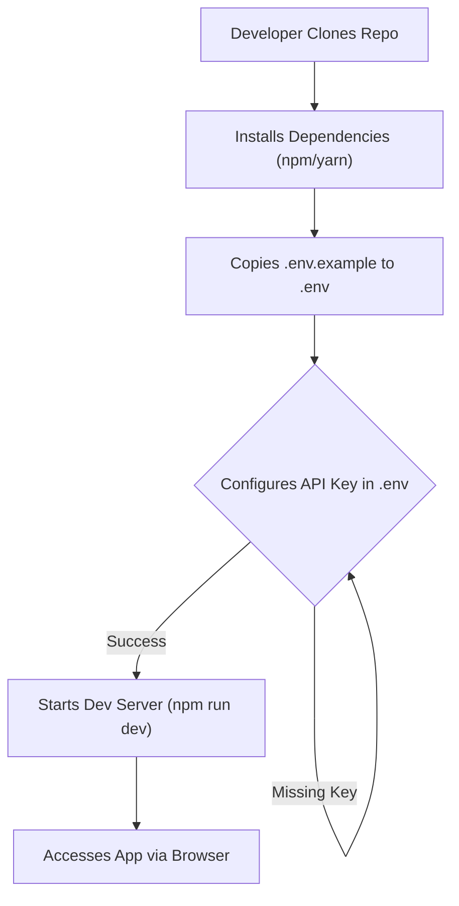
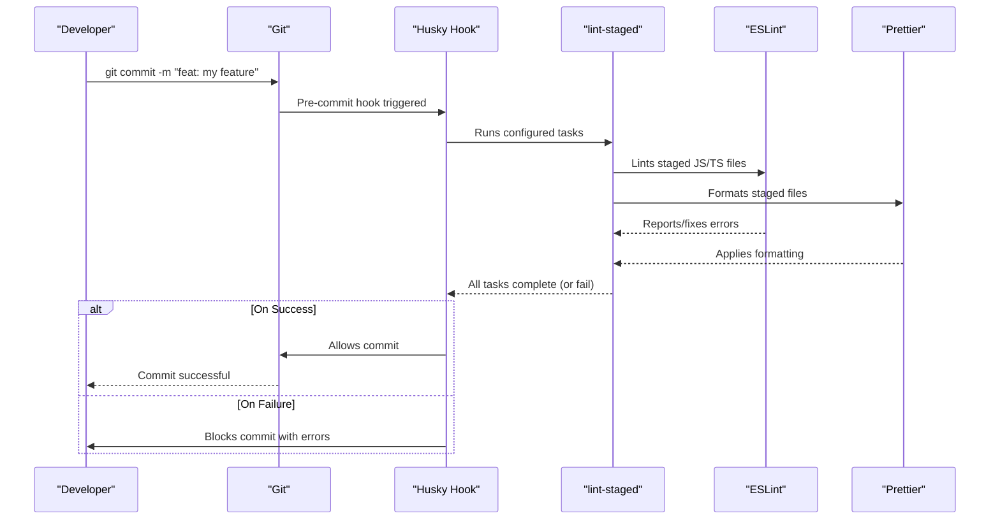

 # Introduction and Setup

Landemon 🎬 is a modern, full-featured movie streaming platform built with Next.js. Its primary purpose is to allow users to discover, watch, and review thousands of movies through an elegant, responsive interface. The project leverages various modern web technologies and integrates with external APIs to provide a rich user experience.

## ✨ Key Features Overview

The platform boasts a comprehensive set of features, categorized as follows:

*   **Movie Discovery**:
    *   Access to an extensive library from The Movie Database (TMDb).
    *   Smart filtering by genre, release date, popularity, and rating.
    *   Advanced search capabilities for titles, directors, cast, and keywords.
    *   Real-time trending content.
*   **Personalized Experience**:
    *   Recommendation engine based on user history and preferences.
    *   User rating system (10-point scale) and community averages.
    *   Detailed review system.
*   **Streaming**:
    *   High-quality playback via integrated video sources.
    *   Multiple streaming sources, powered by Vidsrc.cc.
    *   Seamless viewing experience without redirects.
*   **Modern Design**:
    *   Responsive layout for all devices (desktop, tablet, mobile).
    *   Optimized with Next.js for fast performance.
    *   Clean and beautiful UI built with Tailwind CSS.

## 🚀 Initial Setup and Configuration

To get Landemon up and running, whether for local development or deployment, follow these instructions.

### Prerequisites

Before proceeding, ensure you have the following installed:

*   **Node.js**: Version 18.x or higher.
*   **npm or Yarn**: Your preferred Node.js package manager.
*   **TMDb API Key**: A free API key from [The Movie Database (TMDb)](https://www.themoviedb.org/signup). This is essential for fetching movie data.

### Local Development

For developing on your local machine, follow these steps:

1.  **Clone the repository**:
    ```bash
    git clone https://github.com/lande26/movieko.git
    cd movieko
    ```
    This command fetches the project source code to your machine and navigates into the project directory.

2.  **Install dependencies**:
    ```bash
    npm install
    # or if you prefer yarn
    yarn install
    ```
    This command reads the `package.json` file and installs all required dependencies. [View `package.json` on GitHub](https://github.com/lande26/movieko/blob/main/package.json).

3.  **Configure environment variables**:
    Landemon requires specific environment variables to function correctly. Copy the example environment file:
    ```bash
    cp .env.example .env
    ```
    Then, open the newly created `.env` file and update the values:
    ```env
    NEXT_PUBLIC_APP_URL=http://localhost:3000
    NEXT_PUBLIC_TMDB_TOKEN=your_tmdb_api_key_here
    NEXT_PUBLIC_SITE_NAME=Landemon
    ```
    Replace `your_tmdb_api_key_here` with the API Read Access Token (v4 auth) obtained from TMDb. A default token is available in `.env.example` for testing purposes, but your own key is recommended for production.

4.  **Start the development server**:
    ```bash
    npm run dev
    # or
    yarn dev
    ```
    This command starts the Next.js development server. You can then access the application by navigating to [http://localhost:3000](http://localhost:3000) in your web browser.

### Production Build

To prepare Landemon for production deployment, use the following commands:

```bash
npm run build
npm run start
```

### Deployment

Landemon can be easily deployed to various platforms. Vercel is recommended due to its tight integration with Next.js.

#### Deploy with Vercel (Recommended)

Clicking the "Deploy with Vercel" button in the README automatically sets up a new project.
[View Deploy Button on GitHub](https://github.com/lande26/movieko#quick-deploy).

After clicking, you'll need to:
1.  Sign in to Vercel (or create an account).
2.  The repository will be forked to your GitHub account.
3.  Configure the environment variables (`NEXT_PUBLIC_APP_URL`, `NEXT_PUBLIC_TMDB_TOKEN`, `NEXT_PUBLIC_SITE_NAME`) in Vercel.
4.  Click "Deploy" and wait for the build to complete.

#### Deploy with Cloudflare Pages

For Cloudflare Pages, the process is similar:
1.  Fork the repository.
2.  Log in to [Cloudflare Pages](https://pages.cloudflare.com/).
3.  Create a new project and connect your forked repository.
4.  Configure build settings:
    *   **Framework preset**: Next.js
    *   **Build command**: `npx @cloudflare/next-on-pages@1`
    *   **Build output directory**: `.vercel/output/static`
5.  Add the same environment variables as for Vercel.
6.  Click "Save and Deploy".

## 📚 Project Structure and Relevant Files

### `README.md`

The `README.md` file serves as the project's primary entry point for anyone interested in Landemon. It provides a comprehensive overview, covering:

*   Project title and description.
*   Key features.
*   Quick deployment options (Vercel, Cloudflare Pages).
*   Detailed local development setup instructions.
*   Explanation of environment variables and how to obtain a TMDb API key.
*   The tech stack used.
*   Contribution guidelines.
*   License information and acknowledgements.

This file is crucial for onboarding new developers and users, acting as a living document that guides interaction with the project.

### `package.json` and `package-lock.json`

These files are fundamental for managing the project's dependencies and scripts.

*   **`package.json`**: Defines project metadata, scripts, and direct dependencies.
    *   **Dependencies**: Lists all runtime libraries and frameworks, such as `next`, `react`, `axios`, `@radix-ui/react-accordion`, `framer-motion`, `tailwind-merge`, and `zod`.
    *   **Dev Dependencies**: Specifies tools used only during development, like `autoprefixer`, `eslint`, `husky`, `lint-staged`, `postcss`, `prettier`, and `typescript`.
    *   **Scripts**: Defines convenient commands for development, building, linting, formatting, and type-checking. [View `package.json` on GitHub](https://github.com/lande26/movieko/blob/main/package.json).

*   **`package-lock.json`**: Ensures consistent installations across different environments. It records the exact versions of all dependencies, including sub-dependencies, used during the last `npm install` operation. This prevents unexpected behavior due to dependency version mismatches. [View `package-lock.json` on GitHub](https://github.com/lande26/movieko/blob/main/package-lock.json).

### `.lintstagedrc.js`

This configuration file defines commands to run against staged Git files. It's used in conjunction with `husky` to enforce code quality standards before commits are finalized.

```javascript
// .lintstagedrc.js
const path = require('path');

const buildEslintCommand = (filenames) =>
  `next lint --fix --file ${filenames
    .map((f) => path.relative(process.cwd(), f))
    .join(' --file ')}`;

module.exports = {
  '*.{js,jsx,ts,tsx}': [buildEslintCommand],
  '*.{css,scss,sass,less,styl,json,js,tsx,ts,cjs,mjs}': ['prettier --write'],
};
```
[View `.lintstagedrc.js` on GitHub](https://github.com/lande26/movieko/blob/main/.lintstagedrc.js).

This configuration specifies two types of tasks:
*   For JavaScript/TypeScript files (`*.{js,jsx,ts,tsx}`): It runs `next lint --fix` to automatically fix linting issues. The `buildEslintCommand` function ensures that only staged files are linted.
*   For various styling and configuration files (`*.{css,scss,sass,less,styl,json,js,tsx,ts,cjs,mjs}`): It runs `prettier --write` to automatically format these files according to the project's Prettier configuration.

## 🔑 Key Integration Points

Landemon's architecture relies on several integrations to deliver its full functionality:

### Local Development Workflow
The local development process is streamlined using Node.js tools.





### CI/CD and Code Quality

The project integrates `husky` and `lint-staged` for automated code quality checks, ensuring that only well-formatted and lint-free code makes it into the repository. This improves maintainability and reduces technical debt.





**Explanation**: When a developer attempts to commit, `husky` intercepts the action. `lint-staged` then identifies relevant staged files and applies `ESLint` for linting (with auto-fix) and `Prettier` for formatting. If all checks pass, the commit proceeds. If errors remain, the commit is blocked, providing immediate feedback to the developer.

### Environment Variable Management

The use of `@t3-oss/env-nextjs` and `.env` files is a crucial practice for managing sensitive information and configuration differences between environments.

*   **Security**: Keeps API keys and other sensitive data out of the codebase, preventing accidental exposure in version control.
*   **Flexibility**: Allows different values for development, staging, and production environments without code changes.
*   **Best Practice**: Adheres to the 12 Factor App principles for configuration.

Always ensure that your `.env` file is included in `.gitignore` to prevent sensitive data from being committed.

## 🛠️ Tech Stack Summary

Landemon is built upon a robust and modern tech stack:

*   **Next.js 14**: React framework with App Router for server-side rendering and static site generation.
*   **TypeScript**: Enhances code quality and maintainability with static type checking.
*   **Tailwind CSS**: A utility-first CSS framework for rapid UI development.
*   **TMDb API**: Provides comprehensive movie data.
*   **Vidsrc.cc**: Serves as the integrated movie streaming source provider.
*   **Vercel**: The preferred platform for seamless deployment and hosting.