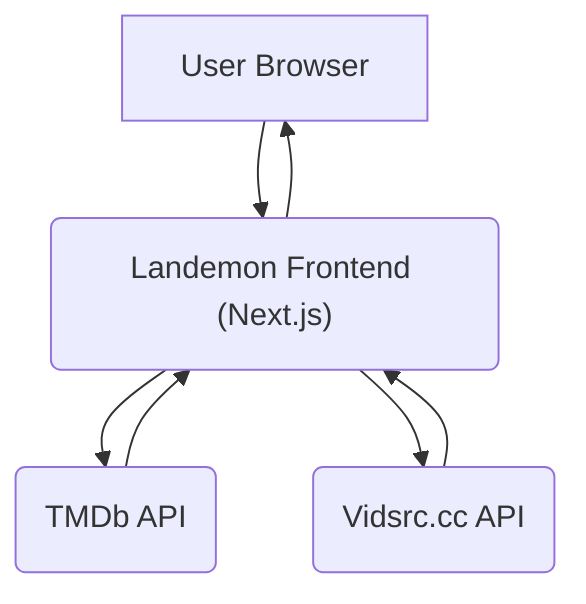

# Project Overview and Setup

Landemon is a modern, full-featured movie streaming platform built with Next.js, offering an elegant and responsive interface for discovering, watching, and reviewing movies. It leverages The Movie Database (TMDb) API for extensive movie data and Vidsrc.cc for reliable streaming links.

## ✨ Features

Landemon boasts a rich set of features designed to provide a comprehensive movie-watching experience:

*   **Movie Discovery**: Browse a vast library of movies, sort by genre, release date, popularity, and rating, and utilize advanced search capabilities.
*   **Personalized Experience**: Benefit from a recommendation engine based on viewing history and preferences, and engage with a user rating and review system.
*   **Seamless Streaming**: Enjoy high-quality playback directly within the platform, powered by Vidsrc.cc for streaming links.
*   **Modern Design**: Experience a responsive layout optimized for all devices, with fast performance and a clean, modern UI built with Tailwind CSS.

## 🚀 Deployment Options

### Deploy with Vercel (Recommended)

Deploying Landemon to Vercel is straightforward. Click the button below to initiate the deployment process:

[](https://vercel.com/new/clone?repository-url=https%3A%2F%2Fgithub.com%2Flande26%2Fmovieko&env=NEXT_PUBLIC_APP_URL,NEXT_PUBLIC_TMDB_TOKEN,NEXT_PUBLIC_SITE_NAME&envDescription=Required%20environment%20variables%20for%20Landemon&envLink=https%3A%2F%2Fgithub.com%2Flande26%2Fmovieko%23environment-variables&project-name=landemon&repository-name=landemon)

After clicking the button:

1.  Sign in to Vercel or create an account.
2.  The repository will be forked to your GitHub account.
3.  Configure the following required environment variables:
    *   `NEXT_PUBLIC_APP_URL`: Your deployment URL (e.g., `https://landemon.vercel.app`).
    *   `NEXT_PUBLIC_TMDB_TOKEN`: Your TMDb API key. You can obtain one from [the Movie Database API settings](https://www.themoviedb.org/settings/api).
    *   `NEXT_PUBLIC_SITE_NAME`: Set this to `Landemon` or your preferred site name.
4.  Click "Deploy".

### Deploy with Cloudflare Pages

For deployment on Cloudflare Pages:

1.  Fork the Landemon repository to your GitHub account.
2.  Log in to [Cloudflare Pages](https://pages.cloudflare.com/).
3.  Click "Create a project" → "Connect to Git" and select your forked repository.
4.  Configure the build settings:
    *   **Framework preset**: `Next.js`
    *   **Build command**: `npx @cloudflare/next-on-pages@1`
    *   **Build output directory**: `.vercel/output/static`
5.  Add the same environment variables as required for Vercel deployment.
6.  Click "Save and Deploy".

Refer to the [Next-on-Pages documentation](https://github.com/cloudflare/next-on-pages/tree/main/packages/next-on-pages) for more detailed instructions.

## 💻 Local Development

To set up Landemon for local development, follow these steps:

### Prerequisites

*   Node.js 18.x or higher.
*   npm or yarn package manager.
*   A TMDb API key. Register for a free account at [themoviedb.org](https://www.themoviedb.org/signup) and obtain an API Read Access Token (v4 auth).

### Setup Instructions

1.  **Clone the repository**:
    ```bash
    git clone https://github.com/lande26/movieko.git
    cd movieko
    ```

2.  **Install dependencies**:
    ```bash
    npm install
    # or
    yarn install
    ```

3.  **Configure environment variables**:
    Copy the example environment file and fill in your API key:
    ```bash
    cp .env.example .env
    ```
    Edit the `.env` file and replace `your_tmdb_api_key_here` with your actual TMDb API token:
    ```plaintext
    NEXT_PUBLIC_APP_URL=http://localhost:3000
    NEXT_PUBLIC_TMDB_TOKEN=your_tmdb_api_key_here
    NEXT_PUBLIC_SITE_NAME=Landemon
    ```

4.  **Start the development server**:
    ```bash
    npm run dev
    # or
    yarn dev
    ```

5.  **Access the application**:
    Open your browser and navigate to [http://localhost:3000](http://localhost:3000).

### Build for Production

To build the application for production:

```bash
npm run build
npm run start
```

## 🔑 Environment Variables

The following environment variables are essential for Landemon to function correctly:

| Variable                | Description                                   | Required | Example                 |
| :---------------- | :-------------------------------------------- | :------- | :---------------------- |
| `NEXT_PUBLIC_APP_URL` | The URL where your app is deployed            | Yes      | `https://landemon.vercel.app` |
| `NEXT_PUBLIC_TMDB_TOKEN` | Your TMDb API key for movie data              | Yes      | `eyJhbGc...`            |
| `NEXT_PUBLIC_SITE_NAME` | Display name for your site                  | Yes      | `Landemon`              |

### Getting a TMDb API Key

1.  Create a free account at [themoviedb.org](https://www.themoviedb.org/signup).
2.  Navigate to **Settings** → **API**.
3.  Request an API key (select the "Developer" option).
4.  Copy your API Read Access Token (v4 auth).
5.  Use this token as the value for `NEXT_PUBLIC_TMDB_TOKEN` in your environment file.

> **Note**: A default token is included in `.env.example` for testing purposes only. For production environments, always use your own API key.

## 🛠️ Tech Stack

Landemon is built using a modern and robust technology stack:

*   **Next.js 14**: A React framework with the App Router for efficient development.
*   **TypeScript**: For type safety and improved developer experience.
*   **Tailwind CSS**: A utility-first CSS framework for rapid UI development.
*   **TMDb API**: Provides a comprehensive database of movies, TV shows, and cast information.
*   **Vidsrc.cc**: A reliable source for streaming video links.
*   **Vercel**: The recommended platform for seamless deployment and hosting.

## Architectural Overview





## Key Takeaways

Landemon provides a comprehensive and user-friendly movie streaming experience, combining powerful discovery features with a seamless viewing platform. Its modern tech stack and clear deployment options make it accessible for developers to deploy and customize.