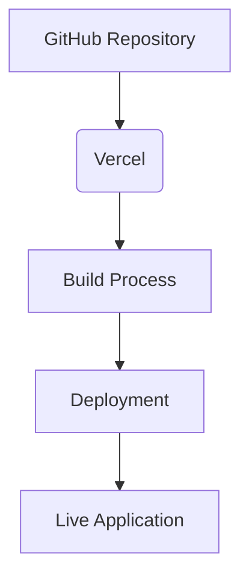
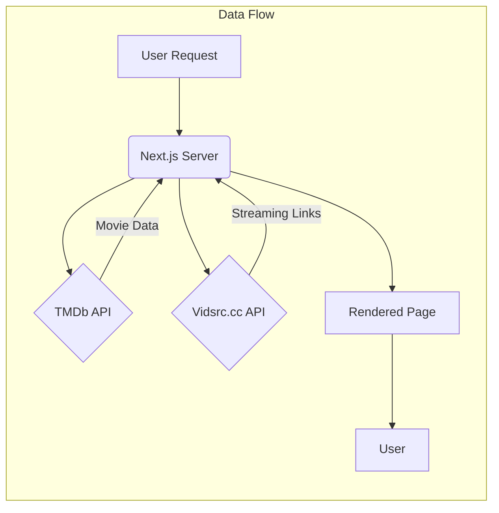

---
title: Project Overview
description: Provides a high-level understanding of the application's purpose and structure.
---

# Project Overview

Landemon is a modern movie streaming platform built with Next.js, designed for discovering, watching, and reviewing movies. It leverages the TMDb API for movie data and Vidsrc.cc for streaming links, offering a seamless and responsive user experience. This document provides an overview of the project's structure, key features, and technologies used.

## Key Features

*   **Extensive Movie Library:** Access to a vast database of movies sourced from TMDb.
*   **Personalized Recommendations:** Tailored movie suggestions based on viewing history and preferences.
*   **High-Quality Streaming:** Direct streaming through Vidsrc.cc, ensuring reliable playback.
*   **Responsive Design:** A user-friendly interface optimized for various devices.
*   **Advanced Search and Filtering**: Allows filtering by genre, release date, popularity, and rating; plus movie searches.

## Tech Stack

The application is built using the following technologies:

*   **Next.js 14:** React framework with App Router for server-side rendering and routing.
*   **TypeScript:** Type-safe JavaScript for enhanced code maintainability.
*   **Tailwind CSS:** Utility-first CSS framework for rapid UI development.
*   **TMDb API:** Provides movie data and images.
*   **Vidsrc.cc:** Offers movie streaming sources.
*   **Vercel:** Used for deployment and hosting.

## Project Structure

The project follows a standard Next.js structure with additional configuration files and custom components.

*   `README.md`: Provides a general overview of the project, setup instructions, and contribution guidelines.
*   `package.json`: Contains project dependencies, scripts, and metadata.
*   `components.json`: Configuration file for `shadcn/ui` components.
*   `configs/site.ts`: Contains site-specific configurations like the site name and URL.

## Code Snippets and Explanation

### Environment Variable Configuration

The `.env` file stores sensitive information such as API keys and site URLs.
[View on GitHub](https://github.com/lande26/LandeMon/blob/main/.env.example)

```bash
NEXT_PUBLIC_APP_URL=http://localhost:3000
NEXT_PUBLIC_TMDB_TOKEN=your_tmdb_api_key_here
NEXT_PUBLIC_SITE_NAME=Landemon
```

*   `NEXT_PUBLIC_APP_URL`: The base URL of the application.
*   `NEXT_PUBLIC_TMDB_TOKEN`: The API key for accessing The Movie Database.
*   `NEXT_PUBLIC_SITE_NAME`: The name of the website, used for branding.

### Next.js Configuration

The `next.config.js` file (or `next.config.ts`) allows you to configure your Next.js application. This includes enabling features like image optimization, setting environment variables, and configuring experimental features. Although not present in the base repository, this is a core aspect of Next.js projects.

```typescript
/** @type {import('next').NextConfig} */
const nextConfig = {
  reactStrictMode: true,
  swcMinify: true,
  images: {
    domains: ['image.tmdb.org'],
  },
}

module.exports = nextConfig
```

This snippet configures:

*   `reactStrictMode`: Enables React's strict mode for development.
*   `swcMinify`: Enables SWC minification for faster builds.
*    `images`: Configures image optimization settings for a specified domain to allow next/image to load it.

### Tailwind CSS Configuration

`tailwind.config.ts` configures Tailwind CSS, defining custom themes, breakpoints, and other styling options. [View on GitHub](https://github.com/lande26/LandeMon/blob/main/tailwind.config.ts)

```typescript
import type { Config } from "tailwindcss";

const config: Config = {
  darkMode: ["class"],
  content: [
    './components/**/*.{ts,tsx}',
    './app/**/*.{ts,tsx}',
    './src/**/*.{ts,tsx}',
	],
  prefix: "",
  theme: {
    container: {
      center: true,
      padding: "2rem",
      screens: {
        "2xl": "1400px",
      },
    },
    extend: {
      colors: {
        border: "hsl(var(--border))",
        input: "hsl(var(--input))",
        ring: "hsl(var(--ring))",
        background: "hsl(var(--background))",
        foreground: "hsl(var(--foreground))",
        primary: {
          DEFAULT: "hsl(var(--primary))",
          foreground: "hsl(var(--primary-foreground))",
        },
        secondary: {
          DEFAULT: "hsl(var(--secondary))",
          foreground: "hsl(var(--secondary-foreground))",
        },
        destructive: {
          DEFAULT: "hsl(var(--destructive))",
          foreground: "hsl(var(--destructive-foreground))",
        },
        muted: {
          DEFAULT: "hsl(var(--muted))",
          foreground: "hsl(var(--muted-foreground))",
        },
        accent: {
          DEFAULT: "hsl(var(--accent))",
          foreground: "hsl(var(--accent-foreground))",
        },
        popover: {
          DEFAULT: "hsl(var(--popover))",
          foreground: "hsl(var(--popover-foreground))",
        },
        card: {
          DEFAULT: "hsl(var(--card))",
          foreground: "hsl(var(--card-foreground))",
        },
      },
      borderRadius: {
        lg: "var(--radius)",
        md: "calc(var(--radius) - 2px)",
        sm: "calc(var(--radius) - 4px)",
      },
      keyframes: {
        "accordion-down": {
          from: { height: "0" },
          to: { height: "var(--radix-accordion-content-height)" },
        },
        "accordion-up": {
          from: { height: "var(--radix-accordion-content-height)" },
          to: { height: "0" },
        },
      },
      animation: {
        "accordion-down": "accordion-down 0.2s ease-out",
        "accordion-up": "accordion-up 0.2s ease-out",
      },
    },
  },
  plugins: [require("tailwindcss-animate")],
}
export default config
```

This configuration:

*   Specifies the files to scan for Tailwind CSS classes using the `content` array.
*   Defines custom colors and border radii under the `theme` section.
*   Adds animations using `keyframes` and `animation`.
*   Includes the `tailwindcss-animate` plugin for adding animations.

### Shadcn UI component aliases configuration

The `components.json` file configures the aliases used by `shadcn/ui` for components and utilities.  [View on GitHub](https://github.com/lande26/LandeMon/blob/main/components.json)

```json
{
  "$schema": "https://ui.shadcn.com/schema.json",
  "style": "default",
  "rsc": true,
  "tsx": true,
  "tailwind": {
    "config": "tailwind.config.ts",
    "css": "src/styles/globals.css",
    "baseColor": "slate",
    "cssVariables": true
  },
  "aliases": {
    "components": "@/components",
    "utils": "@/lib/utils"
  }
}
```

This configuration:

*   Sets the style to "default".
*   Enables React Server Components (`rsc`).
*   Enables TypeScript (`tsx`).
*   Specifies the Tailwind CSS configuration and CSS files.
*   Defines aliases for the `components` and `utils` directories.

### Analytics Component from Vercel

The `@vercel/analytics` package provides tools for collecting and analyzing website traffic data. The Analytics component can be integrated into the application to gain insights into user behavior and performance metrics.

```typescript
import { Analytics } from '@vercel/analytics/react';

function MyApp({ Component, pageProps }) {
  return (
    <>
      <Component {...pageProps} />
      <Analytics />
    </>
  );
}

export default MyApp;
```

By including the `<Analytics />` component in the main application layout, Vercel Analytics automatically collects data on page views, user interactions, and other relevant metrics. This data can then be analyzed to improve the user experience and optimize website performance.

## Deployment Flow

The following diagram illustrates the deployment flow of Landemon using Vercel:





This diagram shows that the deployment process starts with a GitHub repository, which is connected to Vercel. Vercel then builds the application and deploys it, making it accessible as a live application.

## Key Integration Points

*   **TMDb API Integration:** Landemon uses the TMDb API to fetch movie data. Proper API key management and request handling are crucial for performance and data accuracy. Implement caching mechanisms to reduce API calls and improve response times.
*   **Vidsrc.cc Integration:**  Vidsrc.cc provides the streaming sources. Error handling and fallback mechanisms are essential to ensure a smooth viewing experience if a source is unavailable.
*   **Frontend Framework Integration:** The interaction between Next.js, React, and Tailwind CSS determines the application's performance and user experience. Optimizing components and CSS styles is vital for delivering a fast and responsive interface.

## Best Practices

*   **Code Style:** Follow a consistent code style and use linting tools to enforce it.
*   **Component Design:** Create reusable components for common UI elements.
*   **API Handling:** Implement robust error handling and data validation when interacting with external APIs.
*   **Performance Optimization:** Optimize images, components, and API calls to ensure fast page loads and a smooth user experience.
*   **Security:** Protect API keys and other sensitive information using environment variables.




