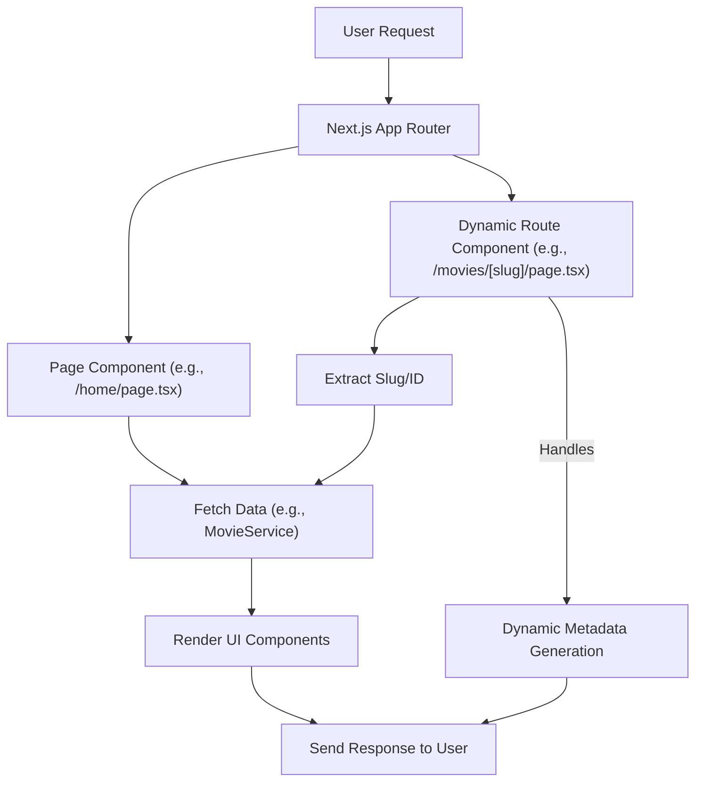

# Page and Route Handling

LandeMon employs a structured approach to manage pages and dynamic routes, leveraging Next.js's App Router conventions for efficient routing and data fetching.

## Homepage (`/home`)

The homepage (`src/app/(front)/home/page.tsx`) serves as the primary landing page, displaying a hero section and various curated collections of shows. It fetches trending, Netflix, and genre-specific content to populate the `ShowsContainer` component.

```tsx
// src/app/(front)/home/page.tsx
import Hero from '@/components/hero';
import ShowsContainer from '@/components/shows-container';
import { MediaType, type Show } from '@/types';
import { siteConfig } from '@/configs/site';
import { RequestType, type ShowRequest } from '@/enums/request-type';
import MovieService from '@/services/MovieService';
import { Genre } from '@/enums/genre';
import { getRandomShow } from '@/lib/utils';

export const revalidate = 3600;

export default async function Home() {
  const h1 = `${siteConfig.name} Home`;
  const requests: ShowRequest[] = [
    {
      title: 'Trending Now',
      req: { requestType: RequestType.TRENDING, mediaType: MediaType.ALL },
      visible: true,
    },
    // ... other requests
  ];
  const allShows = await MovieService.getShows(requests);
  const randomShow: Show | null = getRandomShow(allShows);
  return (
    <>
      <h1 className="hidden">{h1}</h1>
      <Hero randomShow={randomShow} />
      <ShowsContainer shows={allShows} />
    </>
  );
}
```

## Dynamic Content Pages (`/movies/[slug]`, `/tv-shows/[slug]`)

Dynamic routes for individual movies and TV shows are handled within the `(front)` directory. Pages like `/movies/[slug]` and `/tv-shows/[slug]` are designed to display details for a specific content item identified by its `slug`.

These pages utilize a shared `MoviePage` and `TvShowPage` component respectively, abstracting the core rendering logic. The `generateMetadata` function is crucial here, dynamically generating metadata based on the `slug` to ensure proper SEO for each unique content page.

```tsx
// src/app/(front)/movies/[slug]/page.tsx
import { type Metadata } from 'next';
import { handleMetadata } from '@/lib/utils';
import MoviePage from '../page';

type Props = {
  params: { slug: string };
  searchParams: Record<string, string | string[] | undefined>;
};

export const revalidate = 3600;

export async function generateMetadata({ params }: Props): Promise<Metadata> {
  return handleMetadata(params.slug, 'movies', 'movie');
}

export default async function Home() {
  return MoviePage();
}
```

## Watch Page (`/watch/movie/[slug]`)

The watch page is dedicated to embedding video players for movies. The route `src/app/watch/movie/[slug]/page.tsx` extracts the movie ID from the `slug`, formats it, and passes it to the `EmbedPlayer` component to display the video content.

```tsx
// src/app/watch/movie/[slug]/page.tsx
import React from 'react';
import EmbedPlayer from '@/components/watch/embed-player';

export const revalidate = 3600;

export default async function Page({ params }: { params: Promise<{ slug: string }> }) {
  const { slug } = await params;
  const id = slug.split('-').pop();
  return <EmbedPlayer url={`https://vidsrc.cc/v2/embed/movie/${id}`} />;
}
```

## Route Handling Flow

The following diagram illustrates the general flow of how different routes are handled within LandeMon.





## Key Takeaways

*   **App Router Convention**: LandeMon strictly adheres to Next.js App Router conventions for defining pages and routes.
*   **Dynamic Routing**: The use of `[slug]` in file paths enables dynamic routes for individual content items, allowing for unique URLs per movie or TV show.
*   **Metadata Generation**: `generateMetadata` functions are vital for creating SEO-friendly, dynamic meta tags for each content page.
*   **Component Abstraction**: Reusable components like `MoviePage` and `TvShowPage` promote code maintainability and reduce duplication.
*   **Data Fetching**: Server-side data fetching is integrated directly into page components, ensuring content is readily available upon request.