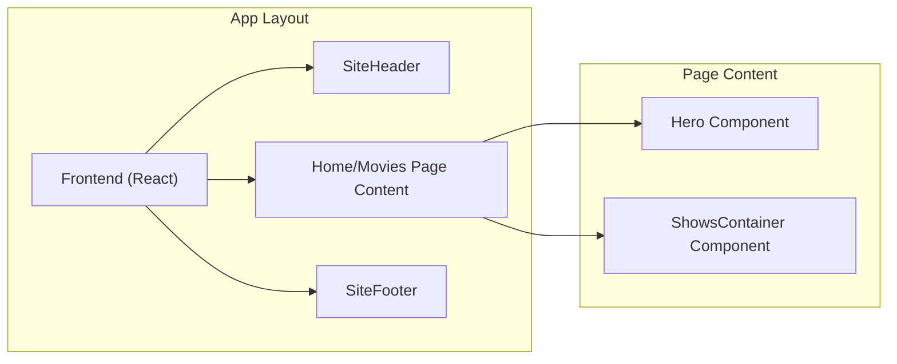

# Page Routing and Layouts

This document explains how routing is handled and the different layout structures used within the LandeMon application. The application leverages Next.js's file-system routing, making navigation intuitive and maintainable.

## File-System Routing in Next.js

Next.js uses the file system to define routes. Each file within the `src/app` directory becomes a route based on its file name.  Special files like `page.tsx` define the content for a route, and `layout.tsx` defines the shared UI for a route and all its children.  Parentheses `()` are used to create route groups, which organize files without affecting the URL structure.

For example, the `src/app/(front)/home/page.tsx` file defines the content for the `/home` route, and `src/app/(front)/layout.tsx` defines the layout shared by all routes under the `(front)` route group (including `/home` and `/movies`). The `src/app/page.tsx` file defines the content for the root `/` route.

## Layout Structures

The LandeMon application utilizes layouts to maintain a consistent user interface across different sections. The primary layout is defined in `src/app/(front)/layout.tsx`.

### `src/app/(front)/layout.tsx`

This layout component wraps the main content of the application with shared elements like the header and footer.  It also adds some background styling.

```typescript filename="src/app/(front)/layout.tsx"
import SiteFooter from '@/components/main/site-footer';
import SiteHeader from '@/components/main/site-header';

const FrontLayout = ({ children }: { children: React.ReactNode }) => {
  return (
    <div className="min-h-screen">
          <div className="absolute inset-0 bg-gradient-to-b from-primary/10 via-transparent to-transparent pointer-events-none" />
              <div className="absolute top-1/4 left-1/4 h-72 w-72 rounded-full bg-primary/20 blur-3xl animate-pulse pointer-events-none" />
              <div 
                className="absolute bottom-1/4 right-1/4 h-96 w-96 rounded-full bg-blue-500/20 blur-3xl animate-pulse pointer-events-none" 
                style={{ animationDelay: '1s' }} 
              />
      <SiteHeader />
      <main>{children}</main>
      <SiteFooter />
    </div>
  );
};

export default FrontLayout;
```

[View on GitHub](https://github.com/lande26/LandeMon/blob/main/src/app/(front)/layout.tsx)

The `FrontLayout` component renders the `SiteHeader`, `SiteFooter`, and the main content (`children`) within a `div`. The background styling with gradients and blurred circles adds a visually appealing backdrop.

### Route Handlers and Page Components

Page components, such as `src/app/(front)/home/page.tsx` and `src/app/(front)/movies/page.tsx`, define the content displayed for their respective routes.

#### `src/app/(front)/home/page.tsx`

```typescript filename="src/app/(front)/home/page.tsx"
import Hero from '@/components/hero';
import ShowsContainer from '@/components/shows-container';
import { MediaType, type Show } from '@/types';
import { siteConfig } from '@/configs/site';
import { RequestType, type ShowRequest } from '@/enums/request-type';
import MovieService from '@/services/MovieService';
import { Genre } from '@/enums/genre';
import { getRandomShow } from '@/lib/utils';

export const revalidate = 3600;

export default async function Home() {
  const h1 = `${siteConfig.name} Home`;
  const requests: ShowRequest[] = [
    {
      title: 'Trending Now',
      req: { requestType: RequestType.TRENDING, mediaType: MediaType.ALL },
      visible: true,
    },
    {
      title: 'Netflix TV Shows',
      req: { requestType: RequestType.NETFLIX, mediaType: MediaType.TV },
      visible: true,
    },
    {
      title: 'Popular TV Shows',
      req: {
        requestType: RequestType.TOP_RATED,
        mediaType: MediaType.TV,
        genre: Genre.TV_MOVIE,
      },
      visible: true,
    },
    {
      title: 'Korean Movies',
      req: {
        requestType: RequestType.KOREAN,
        mediaType: MediaType.MOVIE,
        genre: Genre.THRILLER,
      },
      visible: true,
    },
    {
      title: 'Comedy Movies',
      req: {
        requestType: RequestType.GENRE,
        mediaType: MediaType.MOVIE,
        genre: Genre.COMEDY,
      },
      visible: true,
    },
    {
      title: 'Action Movies',
      req: {
        requestType: RequestType.GENRE,
        mediaType: MediaType.MOVIE,
        genre: Genre.ACTION,
      },
      visible: true,
    },
    {
      title: 'Romance Movies',
      req: {
        requestType: RequestType.GENRE,
        mediaType: MediaType.MOVIE,
        genre: Genre.ROMANCE,
      },
      visible: true,
    },
    {
      title: 'Scary Movies',
      req: {
        requestType: RequestType.GENRE,
        mediaType: MediaType.MOVIE,
        genre: Genre.THRILLER,
      },
      visible: true,
    },
  ];
  const allShows = await MovieService.getShows(requests);
  const randomShow: Show | null = getRandomShow(allShows);
  return (
    <>
      <h1 className="hidden">{h1}</h1>
      <Hero randomShow={randomShow} />
      <ShowsContainer shows={allShows} />
    </>
  );
}
```

[View on GitHub](https://github.com/lande26/LandeMon/blob/main/src/app/(front)/home/page.tsx)

This component fetches show data using `MovieService.getShows`, selects a random show for the hero section, and renders the hero and shows container components. The `revalidate = 3600` setting enables static site generation (SSG) with incremental static regeneration (ISR), meaning the page is regenerated at most every hour.

#### `src/app/(front)/movies/page.tsx`

```typescript filename="src/app/(front)/movies/page.tsx"
import Hero from '@/components/hero';
import ShowsContainer from '@/components/shows-container';
import { siteConfig } from '@/configs/site';
import { Genre } from '@/enums/genre';
import { RequestType, type ShowRequest } from '@/enums/request-type';
import { getRandomShow } from '@/lib/utils';
import MovieService from '@/services/MovieService';
import { MediaType, type Show } from '@/types';

export const revalidate = 3600;

export default async function MoviePage() {
  const h1 = `${siteConfig.name} Movie`;
  const requests: ShowRequest[] = [
    {
      title: 'Trending Now',
      req: { requestType: RequestType.TRENDING, mediaType: MediaType.MOVIE },
      visible: true,
    },
    {
      title: 'Netflix Movies',
      req: { requestType: RequestType.NETFLIX, mediaType: MediaType.MOVIE },
      visible: true,
    },
    {
      title: 'Popular',
      req: { requestType: RequestType.POPULAR, mediaType: MediaType.MOVIE },
      visible: true,
    },
    {
      title: 'Comedy Movies',
      req: {
        requestType: RequestType.GENRE,
        mediaType: MediaType.MOVIE,
        genre: Genre.COMEDY,
      },
      visible: true,
    },
    {
      title: 'Action Movies',
      req: {
        requestType: RequestType.GENRE,
        mediaType: MediaType.MOVIE,
        genre: Genre.ACTION,
      },
      visible: true,
    },
    {
      title: 'Romance Movies',
      req: {
        requestType: RequestType.GENRE,
        mediaType: MediaType.MOVIE,
        genre: Genre.ROMANCE,
      },
      visible: true,
    },
    {
      title: 'Scary Movies',
      req: {
        requestType: RequestType.GENRE,
        mediaType: MediaType.MOVIE,
        genre: Genre.THRILLER,
      },
      visible: true,
    },
  ];
  const allShows = await MovieService.getShows(requests);
  const randomShow: Show | null = getRandomShow(allShows);
  return (
    <>
      <h1 className="hidden">{h1}</h1>
      <Hero randomShow={randomShow} />
      <ShowsContainer shows={allShows} />
    </>
  );
}
```

[View on GitHub](https://github.com/lande26/LandeMon/blob/main/src/app/(front)/movies/page.tsx)

Similar to the `Home` component, the `MoviePage` component fetches movie data using `MovieService.getShows`, selects a random movie for the hero section, and renders the hero and shows container components. It also utilizes ISR with a revalidation period of 3600 seconds.

## Routing Flow

The following diagram illustrates the routing flow for the `Home` and `Movies` pages:





## Data Fetching

The `MovieService` plays a crucial role in fetching data for the pages. The components define an array of `ShowRequest` objects that specify the type of shows to fetch.

```typescript filename="src/app/(front)/home/page.tsx"
  const requests: ShowRequest[] = [
    {
      title: 'Trending Now',
      req: { requestType: RequestType.TRENDING, mediaType: MediaType.ALL },
      visible: true,
    },
    // ... other requests
  ];
  const allShows = await MovieService.getShows(requests);
```

[View on GitHub](https://github.com/lande26/LandeMon/blob/main/src/app/(front)/home/page.tsx#L27-L64)

Each `ShowRequest` includes a `requestType` and `mediaType`, allowing the `MovieService` to make targeted API calls.

## Key Integration Points

-   **Next.js File-System Routing:** The application leverages Next.js's file-system routing for intuitive navigation.
-   **Layout Components:** Layouts are used to maintain a consistent UI across different sections of the application.
-   **Data Fetching:** The `MovieService` handles data fetching, allowing page components to focus on rendering the UI.
-   **Incremental Static Regeneration (ISR):** ISR is used to improve performance by pre-rendering pages and updating them periodically.

## Best Practices

-   **Maintain a clear directory structure:** Organize files within the `src/app` directory to reflect the application's route structure.
-   **Use layouts for shared UI:** Define layouts to encapsulate shared UI elements and maintain a consistent look and feel.
-   **Implement efficient data fetching:** Use a service layer to handle data fetching and caching.
-   **Leverage ISR for performance:** Use ISR to pre-render pages and update them periodically, improving performance and SEO.

By following these guidelines, you can create a well-structured and performant Next.js application with clear routing and layout conventions.
```