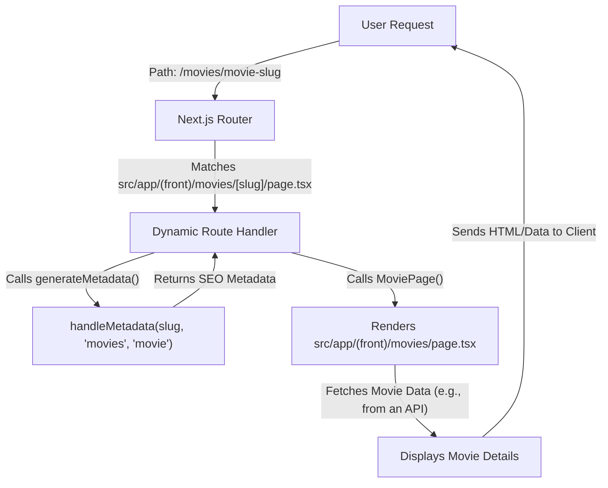
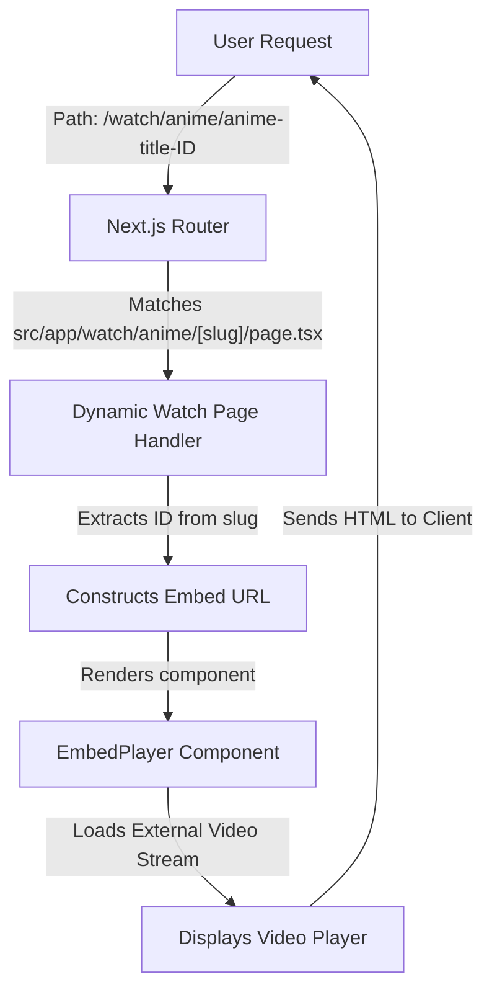

 # Page Routing and Views

This document outlines the core principles and implementation details of page routing and view rendering within the application, focusing on how user-facing pages are structured, particularly utilizing Next.js App Router features for both static and dynamic routes. The application leverages a clear directory-based routing convention, enabling intuitive navigation and content delivery.

## Core Page Structures

The application's routing strategy is built upon Next.js's file-system based routing. This approach automatically creates routes based on the directory and file names within the `src/app` folder. We employ route groups (e.g., `(front)`) to organize routes without affecting the URL path, allowing for shared layouts or styling for specific sections of the application.

### The Homepage

The primary landing page for the application is defined by `src/app/(front)/page.tsx`. This file serves as the entry point for users visiting the root URL of the application. It's designed to provide an engaging introduction to the platform, highlighting key features and inviting users to explore.

```tsx filename="src/app/(front)/page.tsx" {11-20}
import { Icons } from "@/components/icons";
import { Badge } from "@/components/ui/badge";
import { buttonVariants } from "@/components/ui/button";
import { siteConfig } from "@/configs/site";
import { ArrowRight } from "lucide-react";
import Link from "next/link";

export default function Index() {
  return (
    <>
      <section
        id="hero"
        aria-labelledby="hero-heading"
        className="relative container mx-auto flex min-h-[90vh] flex-col items-center justify-center gap-8 overflow-hidden px-4 pt-20 pb-16 text-center lg:min-h-screen"
      >
        <div className="relative z-10 flex flex-col items-center gap-6">
          <h1 className="font-heading text-5xl sm:text-6xl md:text-7xl lg:text-8xl font-extrabold bg-gradient-to-r from-foreground via-foreground to-foreground/60 bg-clip-text text-transparent">
            {siteConfig.name}
          </h1>
          <p className="text-xl sm:text-2xl md:text-3xl text-foreground/80 font-medium">
            {siteConfig.slogan}
          </p>
          
          <p className="max-w-3xl text-base sm:text-lg md:text-xl text-muted-foreground leading-relaxed">
            Welcome to your personal movie universe. Explore thousands of films, binge the latest releases, and rediscover classics that defined cinema.
          </p>
          
          <div className="flex flex-col sm:flex-row gap-4 mt-4">
            <Link 
              href="/home"
              className="group relative px-8 py-4 bg-primary text-primary-foreground rounded-lg font-semibold text-lg hover:scale-105 transition-transform duration-200 shadow-lg shadow-primary/50 flex items-center justify-center gap-2"
            >
              Watch Now
              <ArrowRight className="w-5 h-5 group-hover:translate-x-1 transition-transform" />
            </Link>
            
            <Link
              href="/home"
              className="px-8 py-4 bg-secondary text-secondary-foreground rounded-lg font-semibold text-lg hover:bg-secondary/80 transition-all duration-200 border border-border"
            >
              Browse Library
            </Link>
          </div>
          
          <div className="flex flex-wrap justify-center gap-8 sm:gap-12 mt-8 text-muted-foreground">
            <div className="flex flex-col items-center">
              <span className="text-3xl sm:text-4xl font-bold text-foreground">10K+</span>
              <span className="text-sm sm:text-base">Movies</span>
            </div>
            <div className="flex flex-col items-center">
              <span className="text-3xl sm:text-4xl font-bold text-foreground">4K</span>
              <span className="text-sm sm:text-base">Quality</span>
            </div>
            <div className="flex flex-col items-center">
              <span className="text-3xl sm:text-4xl font-bold text-foreground">24/7</span>
              <span className="text-sm sm:text-base">Streaming</span>
            </div>
          </div>
        </div>
      </section>

      <section
        id="features"
        className="container space-y-6 bg-slate-50 py-8 dark:bg-transparent md:py-12 lg:py-24"
      >
        <div className="mx-auto flex max-w-[58rem] flex-col items-center space-y-4 text-center">
          <h2 className="font-heading text-3xl leading-[1.1] sm:text-3xl md:text-6xl">
            Features
          </h2>
          <p className="max-w-[85%] leading-normal text-muted-foreground sm:text-lg sm:leading-7">
            {siteConfig.name} offers a host of powerful features designed to
            enhance your movie-watching experience.
          </p>
        </div>
        <div className="mx-auto grid justify-center gap-4 sm:grid-cols-2 md:max-w-[64rem] md:grid-cols-3">
          <div className="relative overflow-hidden rounded-lg border bg-background p-2">
            <div className="flex h-[180px] flex-col justify-between rounded-md p-6">
              <svg viewBox="0 0 24 24" className="h-12 w-12 fill-current">
                <path d="M0 12C0 5.373 5.373 0 12 0c4.873 0 9.067 2.904 10.947 7.077l-15.87 15.87a11.981 11.981 0 0 1-1.935-1.099L14.99 12H12l-8.485 8.485A11.962 11.962 0 0 1 0 12Zm12.004 12L24 12.004C23.998 18.628 18.628 23.998 12.004 24Z" />
              </svg>
              <div className="space-y-2">
                <h3 className="font-bold">Vast Movie Library</h3>
                <p className="text-sm text-muted-foreground">
                  Thousands of movies, spanning diverse genres, languages, and
                  decades.
                </p>
              </div>
            </div>
          </div>
          <div className="relative overflow-hidden rounded-lg border bg-background p-2">
            <div className="flex h-[180px] flex-col justify-between rounded-md p-6">
              <svg className="h-12 w-12 fill-current" viewBox="0 0 24 24">
                <polygon points="12 2 15.09 8.26 22 9.27 17 14.14 18.18 21.02 12 17.77 5.82 21.02 7 14.14 2 9.27 8.91 8.26 12 2" />
              </svg>
              <div className="space-y-2">
                <h3 className="font-bold">Personalized Recommendations</h3>
                <p className="text-sm text-muted-foreground">
                  Suggesting movies and shows tailored to your taste.
                </p>
              </div>
            </div>
          </div>
          <div className="relative overflow-hidden rounded-lg border bg-background p-2">
            <div className="flex h-[180px] flex-col justify-between rounded-md p-6">
              <svg className="h-12 w-12 fill-current" viewBox="0 0 24 24">
                <path d="M4 1.5C2.17363 1.5 0.5 2.9003 0.5 4.85714V14.1429C0.5 16.0997 2.17363 17.5 4 17.5H10.5V19.5H7.5C6.94772 19.5 6.5 19.9477 6.5 20.5V21.5C6.5 22.0523 6.94771 22.5 7.5 22.5H16.5C17.0523 22.5 17.5 22.0523 17.5 21.5V20.5C17.5 19.9477 17.0523 19.5 16.5 19.5H13.5V17.5H20C21.8264 17.5 23.5 16.0997 23.5 14.1429V4.85714C23.5 2.9003 21.8264 1.5 20 1.5H4Z" />
              </svg>
              <div className="space-y-2">
                <h3 className="font-bold">Multiple Device Support</h3>
                <p className="text-sm text-muted-foreground">
                  Including smart TVs, smartphones, tablets, laptops, and gaming
                  consoles.
                </p>
              </div>
            </div>
          </div>
          <div className="relative overflow-hidden rounded-lg border bg-background p-2">
            <div className="flex h-[180px] flex-col justify-between rounded-md p-6">
              <svg viewBox="0 0 24 24" className="h-12 w-12 fill-current">
                <path d="M12.001 4.8c-3.2 0-5.2 1.6-6 4.8 1.2-1.6 2.6-2.2 4.2-1.8.913.228 1.565.89 2.288 1.624C13.666 10.618 15.027 12 18.001 12c3.2 0 5.2-1.6 6-4.8-1.2 1.6-2.6 2.2-4.2 1.8-.913-.228-1.565-.89-2.288-1.624C16.337 6.182 14.976 4.8 12.001 4.8zm-6 7.2c-3.2 0-5.2 1.6-6 4.8 1.2-1.6 2.6-2.2 4.2-1.8.913.228 1.565.89 2.288 1.624 1.177 1.194 2.538 2.576 5.512 2.576 3.2 0 5.2-1.6 6-4.8-1.2 1.6-2.6 2.2-4.2 1.8-.913-.228-1.565-.89-2.288-1.624C10.337 13.382 8.976 12 6.001 12z" />
              </svg>
              <div className="space-y-2">
                <h3 className="font-bold">Watch Party</h3>
                <p className="text-sm text-muted-foreground">
                  Watch together with friends. Chat and react in real time to
                  the same stream.
                </p>
              </div>
            </div>
          </div>
          <div className="relative overflow-hidden rounded-lg border bg-background p-2">
            <div className="flex h-[180px] flex-col justify-between rounded-md p-6">
              <svg
                viewBox="0 0 24 24"
                fill="none"
                stroke="currentColor"
                strokeWidth="1"
                className="h-12 w-12 fill-current"
              >
                <path d="M12 22s8-4 8-10V5l-8-3-8 3v7c0 6 8 10 8 10z"></path>
              </svg>
              <div className="space-y-2">
                <h3 className="font-bold">High-Definition Streaming</h3>
                <p className="text-sm text-muted-foreground">
                  Stunning visuals with content available in 4K, Ultra HD and
                  HDR.
                </p>
              </div>
            </div>
          </div>
          <div className="relative overflow-hidden rounded-lg border bg-background p-2">
            <div className="flex h-[180px] flex-col justify-between rounded-md p-6">
              <svg viewBox="0 0 24 24" className="h-12 w-12 fill-current">
                <path d="M13.976 9.15c-2.172-.806-3.356-1.426-3.356-2.409 0-.831.683-1.305 1.901-1.305 2.227 0 4.515.858 6.09 1.631l.89-5.494C18.252.975 15.697 0 12.165 0 9.667 0 7.589.654 6.104 1.872 4.56 3.147 3.757 4.992 3.757 7.218c0 4.039 2.467 5.76 6.476 7.219 2.585.92 3.445 1.574 3.445 2.583 0 .98-.84 1.545-2.354 1.545-1.875 0-4.965-.921-6.99-2.109l-.9 5.555C5.175 22.99 8.385 24 11.714 24c2.641 0 4.843-.624 6.328-1.813 1.664-1.305 2.525-3.236 2.525-5.732 0-4.128-2.524-5.851-6.594-7.305h.003z" />
              </svg>
              <div className="space-y-2">
                <h3 className="font-bold">Free</h3>
                <p className="text-sm text-muted-foreground">
                  Everything is free, no subscription or credit card required.
                </p>
              </div>
            </div>
          </div>
        </div>
      </section>
    </>
  );
}
```
[View on GitHub](https://github.com/lande26/LandeMon/blob/main/src/app/(front)/page.tsx)

This page showcases prominent branding, a compelling slogan, and calls to action for users to "Watch Now" or "Browse Library". It also highlights key statistics and features, utilizing modern UI components and design patterns.

### Dynamic Movie Pages

To display details for individual movies, the application uses dynamic routes. The `[slug]` convention in `src/app/(front)/movies/[slug]/page.tsx` allows the application to capture a dynamic segment (the movie `slug`) from the URL.

```tsx filename="src/app/(front)/movies/[slug]/page.tsx" {1,5,10,17}
import { type Metadata } from 'next';
import { handleMetadata } from '@/lib/utils';
import MoviePage from '../page'; // This likely points to src/app/(front)/movies/page.tsx

type Props = {
  params: { slug: string };
  searchParams: Record<string, string | string[] | undefined>;
};

export const revalidate = 3600;

export async function generateMetadata({ params }: Props): Promise<Metadata> {
  return handleMetadata(params.slug, 'movies', 'movie');
}

export default async function Home() {
  return MoviePage(); // Renders the content defined in src/app/(front)/movies/page.tsx
}
```
[View on GitHub](https://github.com/lande26/LandeMon/blob/main/src/app/(front)/movies/[slug]/page.tsx)

Notably, this `page.tsx` file for the dynamic route primarily serves two purposes:
1.  **Metadata Generation**: The `generateMetadata` function dynamically sets SEO-friendly metadata for each movie page based on its slug. This is crucial for discoverability.
2.  **Content Rendering**: Instead of defining its own UI, it imports and renders `MoviePage` from `../page`. This implies that the actual UI for displaying movie details resides in `src/app/(front)/movies/page.tsx` (not provided in the snippet, but inferred). This pattern allows for a single content component to be used across different movie-related routes, promoting reusability. The `revalidate = 3600` ensures that movie data is refreshed periodically, maintaining content freshness.

### Dynamic Anime Watching Pages

Similar to dynamic movie pages, anime watching pages also employ dynamic routes to serve specific content based on a unique identifier. The path `src/app/watch/anime/[slug]/page.tsx` handles requests for watching anime titles.

```tsx filename="src/app/watch/anime/[slug]/page.tsx" {1,5-6,11-13}
import React from 'react';
import EmbedPlayer from '@/components/watch/embed-player';
import { MediaType } from '@/types';

export const revalidate = 3600;

export default function Page({ params }: { params: { slug: string } }) {
  const id = params.slug.split('-').pop(); // Extracts the ID from the slug
  const movieId: string | undefined = params.slug.split('/').pop(); // Gets the full slug as movieId
  return (
    <EmbedPlayer
      movieId={movieId}
      mediaType={movieId?.includes('t') ? MediaType.ANIME : undefined}
      url={`https://vidsrc.cc/v2/embed/anime/tmdb${id}/1/sub?autoPlay=false`}
    />
  );
}
```
[View on GitHub](https://github.com/lande26/LandeMon/blob/main/src/app/watch/anime/[slug]/page.tsx)

In this setup:
- The `slug` parameter in the URL is processed to extract a numerical `id` (e.g., from `anime-title-12345`, `12345` is extracted).
- An `EmbedPlayer` component is used to render the actual video content, receiving `movieId` and `mediaType` props.
- The `url` prop constructs the embed source using the extracted `id`, pointing to an external video player service.
- The `revalidate = 3600` ensures that the embed URLs are periodically refreshed, helpful for updating stream availability.

### Search Page

The search functionality is managed by `src/app/(front)/search/page.tsx`, which handles user queries and displays results. This page utilizes URL search parameters (`q`) to determine the search query.

```tsx filename="src/app/(front)/search/page.tsx" {5-7,13,16-17}
import SearchContainer from '@/components/search-container';
import MovieService from '@/services/MovieService';
import { redirect } from 'next/navigation';

interface SearchProps {
  searchParams: {
    q?: string; // The search query parameter
  };
}

export const revalidate = 3600;

export default async function SearchPage({ searchParams }: SearchProps) {
  // If no search query is provided, redirect to the homepage
  if (!searchParams?.q?.trim()?.length) {
    redirect('/home');
  }

  // Fetch movies based on the search query
  const shows = await MovieService.searchMovies(searchParams.q);
  return <SearchContainer query={searchParams.q} shows={shows.results} />;
}
```
[View on GitHub](https://github.com/lande26/LandeMon/blob/main/src/app/(front)/search/page.tsx)

Key aspects of the search page:
- It expects a `q` search parameter in the URL (e.g., `/search?q=action`).
- If no query is present, it automatically redirects the user to `/home`, preventing empty search result pages.
- It uses `MovieService.searchMovies` to fetch relevant results, demonstrating integration with backend data services.
- The `SearchContainer` component is responsible for rendering the search results, making the `SearchPage` primarily a data fetching and routing orchestrator.
- `revalidate = 3600` allows the search results to be cached and refreshed hourly, improving performance for common queries.

## Routing and Data Flow

The routing mechanism orchestrates how user requests are processed and how data is fetched and displayed. The Next.js App Router provides a robust framework for server-side rendering (SSR), static site generation (SSG), and incremental static regeneration (ISR) capabilities, all of which are utilized to deliver a performant and up-to-date user experience.

Here's a simplified view of the data flow for dynamic pages:





Similarly, for the watch page:





## Key Integration Points

The page routing and view structure are tightly integrated with several other parts of the application:

-   **Metadata Utilities (`handleMetadata`)**: For dynamic content pages like `/movies/[slug]`, the `handleMetadata` utility (likely found in `src/lib/utils.ts`) is crucial. This ensures that each dynamically generated page has accurate and descriptive metadata for search engines and social media sharing. This promotes better SEO and user engagement.
    ```typescript filename="src/lib/utils.ts" {1-3}
    // Simplified representation of handleMetadata function
    import { type Metadata } from 'next';

    export const handleMetadata = (slug: string, type: 'movies' | 'anime', contentCategory: 'movie' | 'show'): Metadata => {
      // Logic to fetch title, description, and image based on slug and type
      // ...
      return {
        title: `${slug.replace(/-/g, ' ').split(' ').map(s => s.charAt(0).toUpperCase() + s.slice(1)).join(' ')} | AppName`,
        description: `Details for the ${contentCategory}: ${slug}.`,
        // ogImage, twitterCard, etc.
      };
    };
    ```
-   **Service Layer (`MovieService`)**: The search page (`src/app/(front)/search/page.tsx`) directly interacts with `MovieService`. This separation of concerns ensures that data fetching logic is centralized and reusable, keeping page components focused on rendering. This pattern facilitates easier maintenance and testing of data-related operations.
    ```typescript filename="src/services/MovieService.ts"
    // Simplified MovieService for demonstration
    class MovieService {
      static async searchMovies(query: string) {
        // In a real application, this would make an API call
        console.log(`Searching for movies with query: "${query}"`);
        const dummyResults = [
          { id: 1, title: `${query} Movie 1` },
          { id: 2, title: `${query} Movie 2` },
        ];
        return { results: dummyResults }; // Simulate API response
      }
      // Other methods like getMovieDetails, getAnimeDetails, etc.
    }
    export default MovieService;
    ```
-   **Shared Components**: Components like `SearchContainer` and `EmbedPlayer` are critical for maintaining a consistent UI and behavior across different routes. By encapsulating complex logic (e.g., video embedding, search result display) within these components, the page files remain lightweight and focused on routing and data orchestration.
-   **Redirects**: The use of `redirect('/home')` in the search page ensures a smooth user experience by guiding users back to the homepage if they land on the search page without a valid query. This prevents broken experiences and improves usability.

This modular and dynamic routing system, powered by Next.js, allows the application to efficiently serve a wide range of content, from static marketing pages to dynamic content and interactive watch experiences, while maintaining good performance and SEO practices.