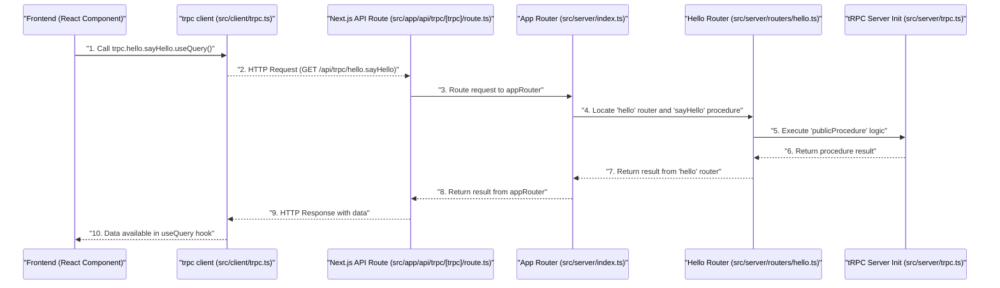

 # TRPC API Layer

The TRPC API layer in this application provides a robust, type-safe, and efficient way to build and consume APIs. By leveraging tRPC, the frontend and backend are tightly coupled by shared types, eliminating the need for code generation or runtime validation. This significantly enhances developer experience and reduces common API-related errors. This section details the core components and their interactions, illustrating how tRPC is set up for both server-side handling and client-side consumption within the Next.js application structure.

## Core Concepts and Architecture

At its heart, tRPC allows you to build fully type-safe APIs without GraphQL, REST, or OpenAPI. It uses TypeScript to infer API types directly from your backend code, making API calls on the client-side feel like calling a local function. This setup ensures that any change in the backend API definition is immediately reflected and enforced on the client side during development, catching potential issues early.

The architecture revolves around a few key files:
-   `src/server/trpc.ts`: Initializes the tRPC instance and defines base procedures.
-   `src/server/index.ts`: Combines individual routers into the main `appRouter`.
-   `src/app/api/trpc/[trpc]/route.ts`: Sets up the Next.js API route to expose the tRPC server.
-   `src/client/trpc.ts`: Configures the tRPC client for frontend consumption.

This structured approach ensures a clear separation of concerns while maintaining the benefits of type-safety across the stack.


```mermaid
graph TD
    A["Frontend Application"] -->| "Makes API calls via trpc client" | B["src/client/trpc.ts"];
    B -->| "Sends requests to Next.js API route" | C["src/app/api/trpc/[trpc]/route.ts"];
    C -->| "Handles incoming requests" | D["src/server/index.ts"];
    D -->| "Combines API routers" | E["src/server/routers/hello.ts"];
    E -->| "Defines API procedures" | F["src/server/trpc.ts"];
    F -->| "Provides base tRPC setup" | G["Database / External Services"];
    E --> G;
```


## Server-Side Implementation

The server-side implementation of tRPC involves defining the core tRPC instance, combining various API routers, and exposing these through a Next.js API route.

### Initializing tRPC (`src/server/trpc.ts`)

This file is the bedrock of the tRPC server. It initializes tRPC, setting up transformers and defining base procedures. The use of `superjson` as a transformer is crucial for handling complex data types like Dates, Maps, and Sets, which are not natively supported by JSON. This ensures that data passed between the client and server remains type-safe and correctly serialized/deserialized.

```typescript
import { initTRPC } from "@trpc/server";
import superjson from "superjson";

// Avoid exporting the entire t-object
// since it's not very descriptive.
// For instance, the use of a t variable
// is common in i18n libraries.
const t = initTRPC.create({
  transformer: superjson,
});

// Base router and procedure helpers
export const router = t.router;
export const publicProcedure = t.procedure;
```
This snippet defines `router` and `publicProcedure`. `router` is used to create API routes, while `publicProcedure` is the base for defining API endpoints that are publicly accessible. Additional procedures (e.g., authenticated procedures) could be built on top of `publicProcedure` with middleware for authentication.
[View on GitHub](https://github.com/lande26/LandeMon/blob/main/src/server/trpc.ts#L10-L22)

### Defining the App Router (`src/server/index.ts`)

The `appRouter` aggregates all individual API routers into a single, comprehensive API. This modular approach keeps the codebase organized as the application grows. Each domain-specific API (e.g., `helloRouter`, `userRouter`, `postRouter`) can reside in its own file, then be combined here.

```typescript
import { helloRouter } from "@/server/routers/hello";
import { router } from "@/server/trpc";

export const appRouter = router({
  hello: helloRouter,
});

export type AppRouter = typeof appRouter;
```
Here, `helloRouter` (presumably defined in `src/server/routers/hello.ts`) is mounted under the `hello` namespace. This means client-side calls would look like `api.hello.someProcedure()`. The `AppRouter` type export is vital; it's used by the client to infer all available API types and procedures.
[View on GitHub](https://github.com/lande26/LandeMon/blob/main/src/server/index.ts#L4-L9)

### Exposing the API (`src/app/api/trpc/[trpc]/route.ts`)

Next.js App Router API routes provide the entry point for HTTP requests. This file acts as an adapter, translating incoming HTTP requests into tRPC procedure calls and vice-versa. The `fetchRequestHandler` from `@trpc/server/adapters/fetch` is specifically designed for environments that use the Web Fetch API, making it ideal for Next.js App Router.

```typescript
import { fetchRequestHandler } from "@trpc/server/adapters/fetch";
import { appRouter } from "@/server/index";

const handler = (req: Request) =>
  fetchRequestHandler({
    endpoint: "/api/trpc",
    req,
    router: appRouter,
    createContext: () => ({}),
  });

export { handler as GET, handler as POST };
```
The `[trpc]` dynamic segment in the file name `[trpc]/route.ts` captures any path segment after `/api/trpc`, allowing tRPC to handle all sub-routes. The `createContext` function is currently empty but can be extended to pass request-specific data (like user session, authentication tokens) down to tRPC procedures, enabling powerful server-side logic and authentication. By exporting `handler as GET` and `handler as POST`, the same handler can process both GET and POST requests, supporting tRPC's query and mutation operations.
[View on GitHub](https://github.com/lande26/LandeMon/blob/main/src/app/api/trpc/[trpc]/route.ts#L2-L13)

## Client-Side Consumption

The client-side setup focuses on creating a type-safe API client that seamlessly integrates with React Query for data fetching, caching, and state management.

### Initializing the tRPC Client (`src/client/trpc.ts`)

This file generates the client-side hooks and utilities used throughout the frontend. It bridges the gap between your React components and the backend tRPC API, providing a fully type-safe experience.

```typescript
/**
 * This is the client-side entrypoint for your tRPC API. It is used to create the `api` object which
 * contains the Next.js App-wrapper, as well as your type-safe React Query hooks.
 *
 * We also create a few inference helpers for input and output types.
 */

import { type AppRouter } from "@/server/index";
import { createTRPCReact } from "@trpc/react-query";

/** A set of type-safe react-query hooks for your tRPC API. */
export const trpc = createTRPCReact<AppRouter>({});
```
The `createTRPCReact` function, imported from `@trpc/react-query`, is responsible for generating the React Query hooks. By passing `AppRouter` (imported from `src/server/index.ts`), the `trpc` object becomes fully type-aware of all backend procedures, their inputs, and their outputs. This enables features like auto-completion in IDEs and compile-time error checking for API calls.
[View on GitHub](https://github.com/lande26/LandeMon/blob/main/src/client/trpc.ts#L10-L16)

## Example Flow: Client to Server Interaction

To better understand the interaction between client and server components, let's trace a typical API call.





## Key Integration Points

The integration of tRPC into a Next.js application creates a powerful development experience characterized by end-to-end type safety and streamlined API development.

### Type Safety End-to-End

The most significant benefit of this setup is the complete type safety from the database to the UI. The `AppRouter` type, exported from `src/server/index.ts` and imported into `src/client/trpc.ts`, is the linchpin. It provides all the necessary type information for the client to interact with the server, ensuring that:
-   API call arguments match server-side expectations.
-   API response shapes are known and correctly typed.
-   Refactors on the backend immediately highlight client-side breaking changes at compile time, not runtime.

This eliminates a whole class of bugs related to API contract mismatches, often found in traditional REST or GraphQL setups where manual type generation or runtime validation is required.

### Performance and Developer Experience

-   **Reduced Payload Size**: tRPC avoids transmitting unnecessary metadata (like schema definitions) with each request, resulting in smaller payloads compared to GraphQL.
-   **No Code Generation**: Unlike GraphQL or OpenAPI, tRPC requires zero code generation. Your TypeScript definitions are your API definitions.
-   **IDE Autocompletion**: With full type inference, your IDE provides rich autocompletion for API calls, parameters, and responses, significantly speeding up development.
-   **Seamless Integration with React Query**: The `createTRPCReact` adapter means you get all the benefits of React Query (caching, background refetching, optimistic updates) out-of-the-box with tRPC's type safety.

### Future Enhancements

The current setup provides a solid foundation. Future enhancements could include:
-   **Authentication Middleware**: Extending `createContext` and defining authenticated procedures in `src/server/trpc.ts` to secure API endpoints.
-   **Error Handling**: Implementing centralized error handling strategies for tRPC procedures.
-   **Logging**: Integrating robust logging within `createContext` or specific procedures.
-   **Input Validation**: Leveraging Zod or similar libraries for input validation on procedures to ensure data integrity at the API boundary.

By embracing this tRPC architecture, the application benefits from a modern, efficient, and highly maintainable API layer that truly brings frontend and backend development closer together.

Next: [Frontend Application Structure](./3_frontend-application-structure.mdx)