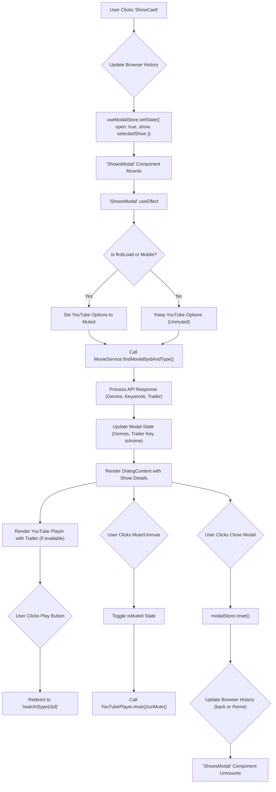

 # UI Components

This section provides comprehensive documentation for the reusable UI components within the application. These components range from generic, foundational elements like `Button` to more complex, application-specific modules such as `ShowsCarousel` and `ShowsModal`, which encapsulate significant presentation and interaction logic. Understanding these components is crucial for maintaining a consistent user interface, ensuring reusability, and streamlining development efforts.

## Button

The `Button` component located at `src/components/ui/button.tsx` is a foundational UI element built upon [shadcn/ui](https://ui.shadcn.com/) primitives. It leverages `class-variance-authority` (cva) for flexible styling based on `variant` and `size` props, allowing for a wide range of button appearances while maintaining consistency. It also integrates `radix-ui/react-slot` for rendering as a different HTML element when `asChild` is `true`.

### Features

*   **Variant-based Styling:** Supports multiple visual styles (e.g., `default`, `destructive`, `outline`, `secondary`, `ghost`, `link`).
*   **Size Options:** Provides different sizes (`default`, `sm`, `lg`, `icon`) for various contexts.
*   **Polymorphic Rendering:** Can render as a `button` or another HTML element by passing the `asChild` prop, inheriting styles.
*   **Accessibility:** Includes default focus, disabled states, and ARIA attributes via `radix-ui`.

### Usage Example

The `Button` component is used throughout the application to render interactive elements. Here's how its variants and sizes are defined:

```typescript filename="src/components/ui/button.tsx" {16-39}
import * as React from 'react';
import { Slot } from '@radix-ui/react-slot';
import { cva, type VariantProps } from 'class-variance-authority';

import { cn } from '@/lib/utils';

const buttonVariants = cva(
  'inline-flex items-center justify-center rounded-md text-sm font-medium ring-offset-background transition-colors focus-visible:outline-none disabled:pointer-events-none disabled:opacity-50',
  {
    variants: {
      variant: {
        default: 'bg-primary text-primary-foreground hover:bg-primary/90',
        destructive:
          'bg-destructive text-destructive-foreground hover:bg-destructive/90',
        outline:
          'border border-input bg-background hover:bg-accent hover:text-accent-foreground',
        secondary:
          'bg-secondary text-secondary-foreground hover:bg-secondary/80',
        ghost: 'hover:bg-accent hover:text-accent-foreground',
        link: 'text-primary underline-offset-4 hover:underline',
      },
      size: {
        default: 'h-10 px-4 py-2',
        sm: 'h-9 rounded-md px-3',
        lg: 'h-11 rounded-md px-8',
        icon: 'h-10 w-10',
      },
    },
    defaultVariants: {
      variant: 'default',
      size: 'default',
    },
  },
);

export interface ButtonProps
  extends React.ButtonHTMLAttributes<HTMLButtonElement>,
    VariantProps<typeof buttonVariants> {
  asChild?: boolean;
}

const Button = React.forwardRef<HTMLButtonElement, ButtonProps>(
  ({ className, variant, size, asChild = false, ...props }, ref) => {
    const Comp = asChild ? Slot : 'button';
    return (
      <Comp
        className={cn(buttonVariants({ variant, size, className }))}
        ref={ref}
        {...props}
      />
    );
  },
);
Button.displayName = 'Button';

export { Button, buttonVariants };
```
[View on GitHub](https://github.com/lande26/LandeMon/blob/main/src/components/ui/button.tsx)

## ShowsCarousel

The `ShowsCarousel` component (`src/components/shows-carousel.tsx`) displays a horizontal scrollable list of `ShowCard` components, typically used for categories like "Trending Now" or "Popular Movies." It includes navigation buttons to scroll the content.

### Features

*   **Dynamic Content:** Accepts an array of `Show` objects to display.
*   **Horizontal Scrolling:** Implements smooth horizontal scrolling with left/right navigation buttons.
*   **Responsive Design:** Adjusts card layout based on screen size (`auto-cols-[calc(100%/3)]` for mobile, `sm:auto-cols-[25%]`, etc.).
*   **`ShowCard` Integration:** Renders individual show items using the `ShowCard` sub-component.

### Carousel Scroll Logic

The `scrollToDirection` function manages the horizontal scrolling behavior, including wrapping from end to start and vice versa.

```typescript filename="src/components/shows-carousel.tsx" {21-38}
'use client';

import { useModalStore } from '@/stores/modal';
import { MediaType, type Show } from '@/types';
import * as React from 'react';

import { Icons } from '@/components/icons';
import { Button } from '@/components/ui/button';
import { cn, getNameFromShow, getSlug } from '@/lib/utils';
import { usePathname } from 'next/navigation';
import CustomImage from './custom-image';

interface ShowsCarouselProps {
  title: string;
  shows: Show[];
}

const ShowsCarousel = ({ title, shows }: ShowsCarouselProps) => {
  const pathname = usePathname();

  const showsRef = React.useRef<HTMLDivElement>(null);
  const [isScrollable, setIsScrollable] = React.useState(false);

  // handle scroll to left and right
  const scrollToDirection = (direction: 'left' | 'right') => {
    if (!showsRef.current) return;

    setIsScrollable(true);
    const { scrollLeft, offsetWidth } = showsRef.current;
    const handleSize = offsetWidth > 1400 ? 60 : 0.04 * offsetWidth;
    const offset =
      direction === 'left'
        ? scrollLeft - (offsetWidth - 2 * handleSize)
        : scrollLeft + (offsetWidth - 2 * handleSize);
    showsRef.current.scrollTo({ left: offset, behavior: 'smooth' });

    if (scrollLeft === 0 && direction === 'left') {
      showsRef.current.scrollTo({
        left: showsRef.current.scrollWidth,
        behavior: 'smooth',
      });
    } else if (
      scrollLeft + offsetWidth === showsRef.current.scrollWidth &&
      direction === 'right'
    ) {
      showsRef.current.scrollTo({
        left: 0,
        behavior: 'smooth',
      });
    }
  };

  return (
    <section aria-label="Carousel of shows" className="relative my-[3vw] p-0">
      {shows.length !== 0 && (
        <div className="space-y-1 sm:space-y-2.5">
          <h2 className="m-0 px-[4%] text-lg font-semibold text-foreground/80 transition-colors hover:text-foreground sm:text-xl 2xl:px-[60px]">
            {title ?? '-'}
          </h2>
          <div className="relative w-full items-center justify-center overflow-hidden">
            <Button
              aria-label="Scroll to left"
              variant="ghost"
              className={cn(
                'absolute left-0 top-0 z-10 mr-2 hidden h-full w-[4%] items-center justify-center rounded-l-none bg-transparent py-0 text-transparent hover:bg-secondary/90 hover:text-foreground md:block 2xl:w-[60px]',
                isScrollable ? 'md:block' : 'md:hidden',
              )}
              onClick={() => scrollToDirection('left')}>
              <Icons.chevronLeft className="h-8 w-8" aria-hidden="true" />
            </Button>
            <div
              ref={showsRef}
              className="no-scrollbar m-0 grid auto-cols-[calc(100%/3)] grid-flow-col overflow-x-auto overflow-y-hidden px-[4%] py-0 duration-500 ease-in-out sm:auto-cols-[25%] md:touch-pan-y lg:auto-cols-[20%] xl:auto-cols-[calc(100%/6)] 2xl:px-[60px]">
              {shows.map((show) => (
                <ShowCard key={show.id} show={show} pathname={pathname} />
              ))}
            </div>
            <Button
              aria-label="Scroll to right"
              variant="ghost"
              className="absolute right-0 top-0 z-10 m-0 ml-2 hidden h-full w-[4%] items-center justify-center rounded-r-none bg-transparent py-0 text-transparent hover:bg-secondary/70 hover:text-foreground md:block 2xl:w-[60px]"
              onClick={() => scrollToDirection('right')}>
              <Icons.chevronRight className="h-8 w-8" aria-hidden="true" />
            </Button>
          </div>
        </div>
      )}
    </section>
  );
};

export default ShowsCarousel;

export const ShowCard = ({ show }: { show: Show; pathname: string }) => {
  const imageOnErrorHandler = (
    event: React.SyntheticEvent<HTMLImageElement, Event>,
  ) => {
    event.currentTarget.src = '/images/grey-thumbnail.jpg';
  };

  return (
    // <picture className="relative aspect-[2/3] md:aspect-video">
    <picture className="relative aspect-[2/3]">
      <a
        className="pointer-events-none"
        aria-hidden={false}
        role="link"
        aria-label={getNameFromShow(show)}
        href={`/${show.media_type}/${getSlug(show.id, getNameFromShow(show))}`}
      />
      {/* <source */}
      {/*   // srcSet={`https://image.tmdb.org/t/p/w342/${show.poster_path ?? show.backdrop_path}`} */}
      {/*   srcSet={ */}
      {/*     show.backdrop_path ?? show.poster_path */}
      {/*       ? `https://image.tmdb.org/t/p/w500/${ */}
      {/*           show.backdrop_path ?? show.poster_path */}
      {/*         }` */}
      {/*       : '/images/grey-thumbnail.jpg' */}
      {/*   } */}
      {/*   media="(min-width: 780px)" */}
      {/* /> */}
      <CustomImage
        src={
          show.poster_path ?? show.backdrop_path
            ? `https://image.tmdb.org/t/p/w500${
                show.poster_path ?? show.backdrop_path
              }`
            : '/images/grey-thumbnail.jpg'
        }
        alt={show.title ?? show.name ?? 'poster'}
        className="h-full w-full cursor-pointer rounded-lg px-1 transition-all md:hover:scale-110"
        fill
        sizes="(max-width: 768px) 50vw, (max-width: 1200px) 100vw, 33vw"
        style={{
          objectFit: 'cover',
        }}
        onClick={() => {
          const name = getNameFromShow(show);
          const path: string =
            show.media_type === MediaType.TV ? 'tv-shows' : 'movies';
          window.history.pushState(
            null,
            '',
            `${path}/${getSlug(show.id, name)}`,
          );
          useModalStore.setState({
            show: show,
            open: true,
            play: true,
          });
        }}
        onError={imageOnErrorHandler}
      />
    </picture>
  );
};
```
[View on GitHub](https://github.com/lande26/LandeMon/blob/main/src/components/shows-carousel.tsx)

### `ShowCard` Interaction

The `ShowCard` component is responsible for rendering an individual show thumbnail. When clicked, it updates the browser history and opens the `ShowsModal` with the selected show's details.

```typescript filename="src/components/shows-carousel.tsx" {136-150}
export const ShowCard = ({ show }: { show: Show; pathname: string }) => {
  const imageOnErrorHandler = (
    event: React.SyntheticEvent<HTMLImageElement, Event>,
  ) => {
    event.currentTarget.src = '/images/grey-thumbnail.jpg';
  };

  return (
    // <picture className="relative aspect-[2/3] md:aspect-video">
    <picture className="relative aspect-[2/3]">
      <a
        className="pointer-events-none"
        aria-hidden={false}
        role="link"
        aria-label={getNameFromShow(show)}
        href={`/${show.media_type}/${getSlug(show.id, getNameFromShow(show))}`}
      />
      <CustomImage
        src={
          show.poster_path ?? show.backdrop_path
            ? `https://image.tmdb.org/t/p/w500${
                show.poster_path ?? show.backdrop_path
              }`
            : '/images/grey-thumbnail.jpg'
        }
        alt={show.title ?? show.name ?? 'poster'}
        className="h-full w-full cursor-pointer rounded-lg px-1 transition-all md:hover:scale-110"
        fill
        sizes="(max-width: 768px) 50vw, (max-width: 1200px) 100vw, 33vw"
        style={{
          objectFit: 'cover',
        }}
        onClick={() => {
          const name = getNameFromShow(show);
          const path: string =
            show.media_type === MediaType.TV ? 'tv-shows' : 'movies';
          window.history.pushState(
            null,
            '',
            `${path}/${getSlug(show.id, name)}`,
          );
          useModalStore.setState({
            show: show,
            open: true,
            play: true,
          });
        }}
        onError={imageOnErrorHandler}
      />
    </picture>
  );
};
```
[View on GitHub](https://github.com/lande26/LandeMon/blob/main/src/components/shows-carousel.tsx#L136-L150)

## ShowsModal

The `ShowsModal` component (`src/components/shows-modal.tsx`) is a dialog that displays detailed information about a selected movie or TV show, including a trailer (if available). It uses a global Zod store (`useModalStore`) to manage its open/closed state and the data it displays.

### Features

*   **Trailer Playback:** Embeds a YouTube player for trailers with auto-play and mute functionality.
*   **Dynamic Data Fetching:** Fetches additional show details (genres, keywords, videos) from `MovieService`.
*   **Responsive Muting:** Automatically mutes the trailer on mobile devices.
*   **Interactive Controls:** Play button to navigate to the watch page and mute/unmute toggle.
*   **Accessibility:** Utilizes `Dialog` components from `shadcn/ui` for proper ARIA attributes.

### Trailer Options Configuration

The default YouTube player options are configured to handle different playback behaviors based on device type (e.g., mute on mobile).

```typescript filename="src/components/shows-modal.tsx" {37-53}
const userAgent =
  typeof navigator === 'undefined' ? 'SSR' : navigator.userAgent;
const { isMobile } = getMobileDetect(userAgent);
const defaultOptions: Record<string, object> = {
  playerVars: {
    // https://developers.google.com/youtube/player_parameters
    rel: 0,
    mute: isMobile() ? 1 : 0,
    loop: 1,
    autoplay: 1,
    controls: 0,
    showinfo: 0,
    disablekb: 1,
    enablejsapi: 1,
    playsinline: 1,
    cc_load_policy: 0,
    modestbranding: 3,
  },
};

const ShowModal = () => {
  // stores
  const modalStore = useModalStore();
  const IS_MOBILE: boolean = isMobile();
```
[View on GitHub](https://github.com/lande26/LandeMon/blob/main/src/components/shows-modal.tsx#L37-L53)

### Data Fetching and State Management

Upon the modal opening, `handleGetData` fetches supplementary details like genres and trailer keys, updating the component's state.

```typescript filename="src/components/shows-modal.tsx" {79-106}
  const handleGetData = async () => {
    const id: number | undefined = modalStore.show?.id;
    const type: string =
      modalStore.show?.media_type === MediaType.TV ? 'tv' : 'movie';
    if (!id || !type) {
      return;
    }
    const data: ShowWithGenreAndVideo = await MovieService.findMovieByIdAndType(
      id,
      type,
    );

    const keywords: KeyWord[] =
      data?.keywords?.results || data?.keywords?.keywords;

    if (keywords?.length) {
      setIsAnime(
        !!keywords.find((keyword: KeyWord) => keyword.name === 'anime'),
      );
    }

    if (data?.genres) {
      setGenres(data.genres);
    }
    if (data.videos?.results?.length) {
      const videoData: VideoResult[] = data.videos?.results;
      const result: VideoResult | undefined = videoData.find(
        (item: VideoResult) => item.type === 'Trailer',
      );
      if (result?.key) setTrailer(result.key);
    }
  };
```
[View on GitHub](https://github.com/lande26/LandeMon/blob/main/src/components/shows-modal.tsx#L79-L106)

### Modal Interaction Flow

The following diagram illustrates the key interactions when a `ShowCard` is clicked, leading to the display of the `ShowsModal`.





## SearchContainer

The `SearchContainer` component (`src/components/search-container.tsx`) is responsible for initializing the search state and displaying search results using `ShowsGrid`. It interacts with a global `useSearchStore` to manage search queries and results.

### Features

*   **Search State Initialization:** Sets the search query and results in a global store upon mounting.
*   **Utility Integration:** Calls `handleDefaultSearchBtn` and `handleDefaultSearchInp` from `lib/utils` to interact with global DOM elements, likely for focusing or triggering search-related UI.
*   **Result Display:** Delegates the rendering of search results to the `ShowsGrid` component.

### Initialization of Search State

Upon component mount, the `SearchContainer` uses a `useEffect` hook to initialize the `useSearchStore` with the provided `query` and `shows` data. This ensures the search UI is populated correctly.

```typescript filename="src/components/search-container.tsx" {16-29}
'use client';

import React from 'react';
import type { Show } from '@/types';
import ShowsGrid from '@/components/shows-grid';
import { useSearchStore } from '@/stores/search';
import { handleDefaultSearchBtn, handleDefaultSearchInp } from '@/lib/utils';

interface SearchContainer {
  query: string;
  shows: Show[];
}

function SearchContainer({ shows, query }: SearchContainer) {
  const searchStore = useSearchStore();

  React.useEffect(() => {
    searchStore.setOpen(true);
    searchStore.setQuery(query);
    searchStore.setShows(shows);
    const timer1: NodeJS.Timeout = setTimeout(() => {
      handleDefaultSearchBtn();
    }, 5);
    const timer2: NodeJS.Timeout = setTimeout(() => {
      handleDefaultSearchInp();
    }, 10);

    return () => {
      clearTimeout(timer1);
      clearTimeout(timer2);
    };
  }, []);

  return <ShowsGrid shows={searchStore.shows} query={searchStore.query} />;
}

export default SearchContainer;
```
[View on GitHub](https://github.com/lande26/LandeMon/blob/main/src/components/search-container.tsx)

## Key Integration Points

These UI components are central to the application's user experience, demonstrating a clear separation of concerns and effective state management.

*   **Global State Management:** `ShowsModal` and `SearchContainer` heavily rely on Zustand stores (`useModalStore`, `useSearchStore`) for managing global UI state. This pattern allows for decoupled components and simplifies state synchronization across the application.
*   **Component Composition:** `ShowsCarousel` effectively composes `ShowCard` components, showcasing how smaller, focused components can be combined to build more complex UI elements.
*   **Styling Consistency:** The `Button` component, built with `class-variance-authority`, provides a robust foundation for maintaining visual consistency across all interactive elements. This approach reduces design drift and accelerates UI development.
*   **Dynamic Routing & Modals:** The interaction between `ShowCard` (within `ShowsCarousel`) and `ShowsModal` demonstrates a common pattern for handling dynamic content display and detailed views, integrating seamlessly with `next/navigation` for URL updates.
*   **External Service Integration:** `ShowsModal`'s interaction with `MovieService` exemplifies how UI components can orchestrate data fetching from external APIs to enrich the user experience.
*   **Client-Side Interactivity:** The `'use client'` directive is used in `ShowsCarousel`, `ShowsModal`, and `SearchContainer` to enable interactive features and hooks (`useState`, `useEffect`, `useRef`, `usePathname`), making them dynamic and responsive.