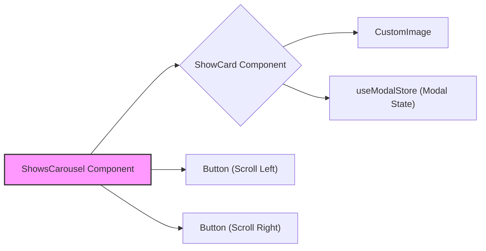

# UI Components

This section describes the reusable UI components used throughout the frontend of LandeMon. These components are designed to be modular and easily configurable, promoting consistency and maintainability across the application.

## Button Component

The `Button` component (`src/components/ui/button.tsx`) is a core UI element, built using Radix UI's `Slot` and `class-variance-authority` (cva) for styling. It provides a consistent look and feel for buttons across the application.

**Key Features:**

*   **Variants:** Supports different button styles (default, destructive, outline, secondary, ghost, link).
*   **Sizes:** Offers various size options (default, sm, lg, icon).
*   **Customizable:** Can accept any standard HTML button attributes.
*   **Radix UI Slot:**  Leverages Radix UI's `Slot` component for enhanced composability.

```typescript filename="src/components/ui/button.tsx"
import * as React from 'react';
import { Slot } from '@radix-ui/react-slot';
import { cva, type VariantProps } from 'class-variance-authority';

import { cn } from '@/lib/utils';

const buttonVariants = cva(
  'inline-flex items-center justify-center rounded-md text-sm font-medium ring-offset-background transition-colors focus-visible:outline-none disabled:pointer-events-none disabled:opacity-50',
  {
    variants: {
      variant: {
        default: 'bg-primary text-primary-foreground hover:bg-primary/90',
        destructive:
          'bg-destructive text-destructive-foreground hover:bg-destructive/90',
        outline:
          'border border-input bg-background hover:bg-accent hover:text-accent-foreground',
        secondary:
          'bg-secondary text-secondary-foreground hover:bg-secondary/80',
        ghost: 'hover:bg-accent hover:text-accent-foreground',
        link: 'text-primary underline-offset-4 hover:underline',
      },
      size: {
        default: 'h-10 px-4 py-2',
        sm: 'h-9 rounded-md px-3',
        lg: 'h-11 rounded-md px-8',
        icon: 'h-10 w-10',
      },
    },
    defaultVariants: {
      variant: 'default',
      size: 'default',
    },
  },
);

export interface ButtonProps
  extends React.ButtonHTMLAttributes<HTMLButtonElement>,
    VariantProps<typeof buttonVariants> {
  asChild?: boolean;
}

const Button = React.forwardRef<HTMLButtonElement, ButtonProps>(
  ({ className, variant, size, asChild = false, ...props }, ref) => {
    const Comp = asChild ? Slot : 'button';
    return (
      <Comp
        className={cn(buttonVariants({ variant, size, className }))}
        ref={ref}
        {...props}
      />
    );
  },
);
Button.displayName = 'Button';

export { Button, buttonVariants };

```

The `cva` function from `class-variance-authority` allows defining different styles based on the `variant` and `size` props. The `cn` function likely combines the base styles with the variant-specific styles using `tailwind-merge` and `clsx`.  [View on GitHub](https://github.com/lande26/LandeMon/blob/main/src/components/ui/button.tsx)

## Input Component

The `Input` component (`src/components/ui/input.tsx`) provides a styled input field.

**Key Features:**

*   Styled with `tailwind-merge` and `clsx`.
*   Accepts all standard HTML input attributes.

```typescript filename="src/components/ui/input.tsx"
import * as React from "react";

import { cn } from "@/lib/utils";

export interface InputProps
  extends React.InputHTMLAttributes<HTMLInputElement> {}

const Input = React.forwardRef<HTMLInputElement, InputProps>(
  ({ className, type, ...props }, ref) => {
    return (
      <input
        type={type}
        className={cn(
          "flex h-10 w-full rounded-md border border-input bg-background px-3 py-2 text-sm ring-offset-background file:border-0 file:bg-transparent file:text-sm file:font-medium placeholder:text-muted-foreground focus-visible:outline-none focus-visible:ring-2 focus-visible:ring-ring focus-visible:ring-offset-2 disabled:cursor-not-allowed disabled:opacity-50",
          className,
        )}
        ref={ref}
        {...props}
      />
    );
  },
);
Input.displayName = "Input";

export { Input };
```

This component is a simple wrapper around the standard HTML `<input>` element, providing consistent styling using Tailwind CSS classes. The `cn` utility function likely combines the base styles with any additional class names passed in as props. [View on GitHub](https://github.com/lande26/LandeMon/blob/main/src/components/ui/input.tsx)

## Search Input Component

The `SearchInput` component (`src/components/search-input.tsx`) utilizes the `Input` component and adds a search icon.

**Key Features:**

*   Combines the `Input` component with a search icon for a visually appealing search bar.
*   Uses `lucide-react` for the search icon.

```typescript filename="src/components/search-input.tsx"
import { Search } from "lucide-react";
import React from "react";
import { Input } from "@/components/ui/input";

export default function SearchInput() {
  return (
    <div className="relative w-full">
      <Search className="absolute left-3 top-3 h-4 w-4 text-slate-600" />
      <Input className="rounded-full pl-9" placeholder="Search movie" />
    </div>
  );
}
```

The `Search` icon from `lucide-react` is positioned absolutely within a relative container.  The `Input` component is then styled to accommodate the icon. [View on GitHub](https://github.com/lande26/LandeMon/blob/main/src/components/search-input.tsx)

## Shows Carousel Component

The `ShowsCarousel` component (`src/components/shows-carousel.tsx`) displays a horizontal carousel of shows.

**Key Features:**

*   Dynamically renders show cards.
*   Implements smooth scrolling with navigation buttons.
*   Uses a `CustomImage` component for optimized image loading.
*   Utilizes `useModalStore` to open a modal when a show card is clicked.

```typescript filename="src/components/shows-carousel.tsx"
'use client';

import { useModalStore } from '@/stores/modal';
import { MediaType, type Show } from '@/types';
import * as React from 'react';

import { Icons } from '@/components/icons';
import { Button } from '@/components/ui/button';
import { cn, getNameFromShow, getSlug } from '@/lib/utils';
import { usePathname } from 'next/navigation';
import CustomImage from './custom-image';

interface ShowsCarouselProps {
  title: string;
  shows: Show[];
}

const ShowsCarousel = ({ title, shows }: ShowsCarouselProps) => {
  const pathname = usePathname();

  const showsRef = React.useRef<HTMLDivElement>(null);
  const [isScrollable, setIsScrollable] = React.useState(false);

  // handle scroll to left and right
  const scrollToDirection = (direction: 'left' | 'right') => {
    if (!showsRef.current) return;

    setIsScrollable(true);
    const { scrollLeft, offsetWidth } = showsRef.current;
    const handleSize = offsetWidth > 1400 ? 60 : 0.04 * offsetWidth;
    const offset =
      direction === 'left'
        ? scrollLeft - (offsetWidth - 2 * handleSize)
        : scrollLeft + (offsetWidth - 2 * handleSize);
    showsRef.current.scrollTo({ left: offset, behavior: 'smooth' });

    if (scrollLeft === 0 && direction === 'left') {
      showsRef.current.scrollTo({
        left: showsRef.current.scrollWidth,
        behavior: 'smooth',
      });
    } else if (
      scrollLeft + offsetWidth === showsRef.current.scrollWidth &&
      direction === 'right'
    ) {
      showsRef.current.scrollTo({
        left: 0,
        behavior: 'smooth',
      });
    }
  };

  return (
    <section aria-label="Carousel of shows" className="relative my-[3vw] p-0">
      {shows.length !== 0 && (
        <div className="space-y-1 sm:space-y-2.5">
          <h2 className="m-0 px-[4%] text-lg font-semibold text-foreground/80 transition-colors hover:text-foreground sm:text-xl 2xl:px-[60px]">
            {title ?? '-'}
          </h2>
          <div className="relative w-full items-center justify-center overflow-hidden">
            <Button
              aria-label="Scroll to left"
              variant="ghost"
              className={cn(
                'absolute left-0 top-0 z-10 mr-2 hidden h-full w-[4%] items-center justify-center rounded-l-none bg-transparent py-0 text-transparent hover:bg-secondary/90 hover:text-foreground md:block 2xl:w-[60px]',
                isScrollable ? 'md:block' : 'md:hidden',
              )}
              onClick={() => scrollToDirection('left')}>
              <Icons.chevronLeft className="h-8 w-8" aria-hidden="true" />
            </Button>
            <div
              ref={showsRef}
              className="no-scrollbar m-0 grid auto-cols-[calc(100%/3)] grid-flow-col overflow-x-auto overflow-y-hidden px-[4%] py-0 duration-500 ease-in-out sm:auto-cols-[25%] md:touch-pan-y lg:auto-cols-[20%] xl:auto-cols-[calc(100%/6)] 2xl:px-[60px]">
              {shows.map((show) => (
                <ShowCard key={show.id} show={show} pathname={pathname} />
              ))}
            </div>
            <Button
              aria-label="Scroll to right"
              variant="ghost"
              className="absolute right-0 top-0 z-10 m-0 ml-2 hidden h-full w-[4%] items-center justify-center rounded-r-none bg-transparent py-0 text-transparent hover:bg-secondary/70 hover:text-foreground md:block 2xl:w-[60px]"
              onClick={() => scrollToDirection('right')}>
              <Icons.chevronRight className="h-8 w-8" aria-hidden="true" />
            </Button>
          </div>
        </div>
      )}
    </section>
  );
};

export default ShowsCarousel;

export const ShowCard = ({ show }: { show: Show; pathname: string }) => {
  const imageOnErrorHandler = (
    event: React.SyntheticEvent<HTMLImageElement, Event>,
  ) => {
    event.currentTarget.src = '/images/grey-thumbnail.jpg';
  };

  return (
    // <picture className="relative aspect-[2/3] md:aspect-video">
    <picture className="relative aspect-[2/3]">
      <a
        className="pointer-events-none"
        aria-hidden={false}
        role="link"
        aria-label={getNameFromShow(show)}
        href={`/${show.media_type}/${getSlug(show.id, getNameFromShow(show))}`}
      />
      {/* <source */}
      {/*   // srcSet={`https://image.tmdb.org/t/p/w342/${show.poster_path ?? show.backdrop_path}`} */}
      {/*   srcSet={ */}
      {/*     show.backdrop_path ?? show.poster_path */}
      {/*       ? `https://image.tmdb.org/t/p/w500/${ */}
      {/*           show.backdrop_path ?? show.poster_path */}
      {/*         }` */}
      {/*       : '/images/grey-thumbnail.jpg' */}
      {/*   } */}
      {/*   media="(min-width: 780px)" */}
      {/* /> */}
      <CustomImage
        src={
          show.poster_path ?? show.backdrop_path
            ? `https://image.tmdb.org/t/p/w500${
                show.poster_path ?? show.backdrop_path
              }`
            : '/images/grey-thumbnail.jpg'
        }
        alt={show.title ?? show.name ?? 'poster'}
        className="h-full w-full cursor-pointer rounded-lg px-1 transition-all md:hover:scale-110"
        fill
        sizes="(max-width: 768px) 50vw, (max-width: 1200px) 100vw, 33vw"
        style={{
          objectFit: 'cover',
        }}
        onClick={() => {
          const name = getNameFromShow(show);
          const path: string =
            show.media_type === MediaType.TV ? 'tv-shows' : 'movies';
          window.history.pushState(
            null,
            '',
            `${path}/${getSlug(show.id, name)}`,
          );
          useModalStore.setState({
            show: show,
            open: true,
            play: true,
          });
        }}
        onError={imageOnErrorHandler}
      />
    </picture>
  );
};
```

This component uses `React.useRef` to manage the scrollable container and `React.useState` to track scrollable state.  The `scrollToDirection` function handles the smooth scrolling logic.  The `ShowCard` component displays the individual show information with a clickable image that updates the history and opens a modal. [View on GitHub](https://github.com/lande26/LandeMon/blob/main/src/components/shows-carousel.tsx)

```javascript filename="src/components/shows-carousel.tsx"
onClick={() => {
  const name = getNameFromShow(show);
  const path: string =
    show.media_type === MediaType.TV ? 'tv-shows' : 'movies';
  window.history.pushState(
    null,
    '',
    `${path}/${getSlug(show.id, name)}`,
  );
  useModalStore.setState({
    show: show,
    open: true,
    play: true,
  });
}}
```

This snippet within the `ShowCard` component highlights how clicking a show updates the browser history using `window.history.pushState` and opens a modal using `useModalStore` (likely a Zustand or Jotai store).

```typescript filename="src/components/shows-carousel.tsx"
const scrollToDirection = (direction: 'left' | 'right') => {
    if (!showsRef.current) return;

    setIsScrollable(true);
    const { scrollLeft, offsetWidth } = showsRef.current;
    const handleSize = offsetWidth > 1400 ? 60 : 0.04 * offsetWidth;
    const offset =
      direction === 'left'
        ? scrollLeft - (offsetWidth - 2 * handleSize)
        : scrollLeft + (offsetWidth - 2 * handleSize);
    showsRef.current.scrollTo({ left: offset, behavior: 'smooth' });
  };
```
This function from `ShowsCarousel` handles the scroll logic. It calculates the scroll offset based on the direction, and then scrolls the carousel to the new position using `showsRef.current.scrollTo`.





## Key Integration Points

These UI components are integrated throughout the frontend to create a consistent and user-friendly experience. The `Button` and `Input` components provide the basic building blocks for interactive elements, while the `SearchInput` and `ShowsCarousel` components offer more specialized functionality.

**Best Practices:**

*   **Consistency:**  Using these components ensures a consistent look and feel across the application.
*   **Reusability:**  The components are designed to be reusable, reducing code duplication.
*   **Maintainability:**  Changes to the components are automatically reflected throughout the application.
*   **Component Driven Architecture:** Promote component driven architecture to build more complex UIs with ease.
```