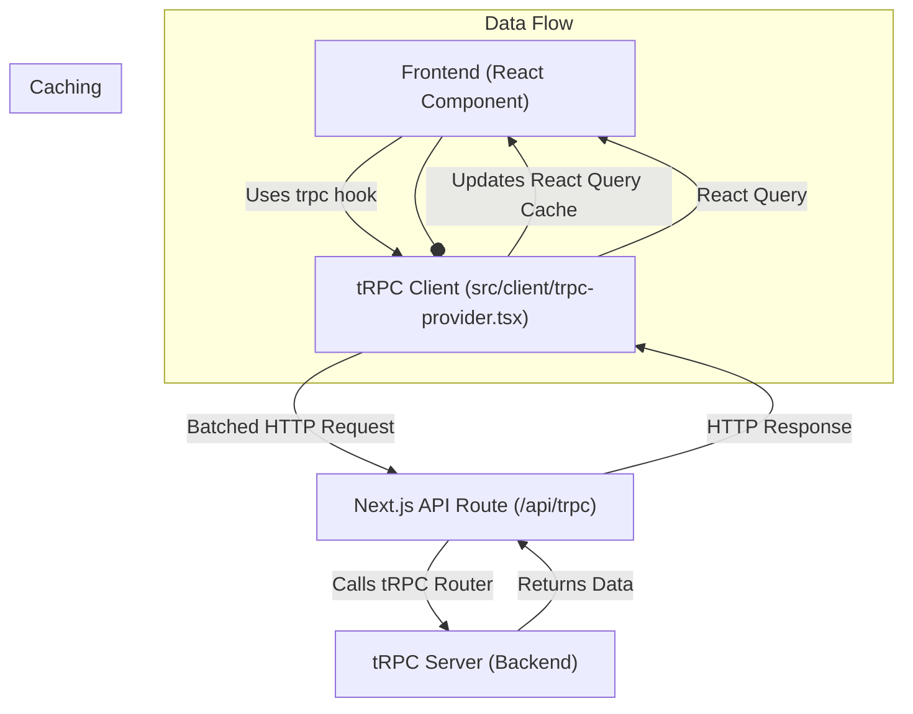
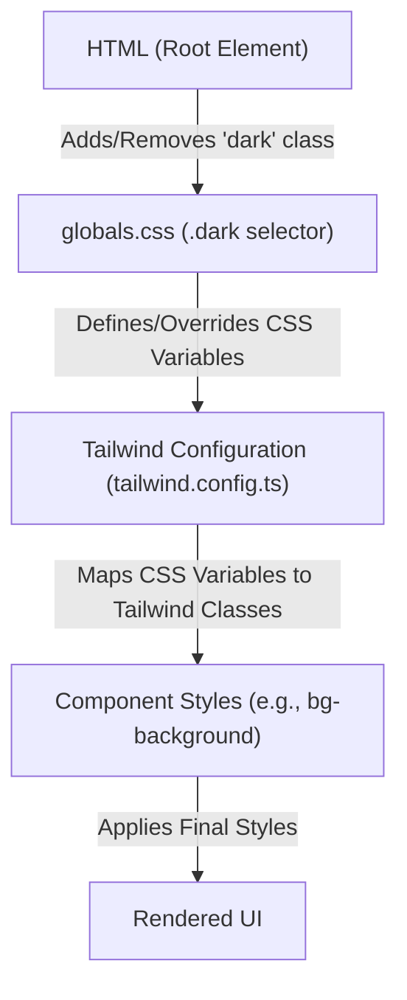

 # Architecture and Core Frameworks

This document provides a comprehensive overview of the core architectural patterns and frameworks utilized in the project. It details the structure and purpose of the Next.js application, the implementation of tRPC for type-safe API communication, and the styling approach using Tailwind CSS.

## Next.js Application Structure

The project leverages Next.js, specifically its App Router, to build a modern, full-stack web application. The App Router introduces a file-system-based routing system and enhances capabilities like server components, streaming, and nested layouts.

### Root Layout (`src/app/layout.tsx`)

The `src/app/layout.tsx` file serves as the root layout for the entire application, defining the global structure and functionalities that apply to all pages.

```tsx title="src/app/layout.tsx" {1-18, 59-67}
import { TailwindIndicator } from '@/components/tailwind-indicator';
import { ThemeProvider } from '@/components/theme-provider';
import { cn } from '@/lib/utils';
import '@/styles/globals.css';
// import { TrpcProvider } from '@/client/trpc-provider';
import type { Metadata, Viewport } from 'next';
import { Inter as FontSans } from 'next/font/google';
import localFont from 'next/font/local';
// import { Analytics } from '@/components/analytics';
import { siteConfig } from '@/configs/site';
import { env } from '@/env.mjs';
// import { SpeedInsights } from '@vercel/speed-insights/next';
import { GoogleAnalytics } from '@next/third-parties/google';
import Script from 'next/script';

export const runtime = 'edge';

const fontSans = FontSans({
  subsets: ['latin'],
  variable: '--font-sans',
  display: 'swap',
});

// Font files can be colocated inside of `pages`
const fontHeading = localFont({
  src: '../assets/fonts/CalSans-SemiBold.woff2',
  variable: '--font-heading',
});

export const viewport: Viewport = {
  themeColor: [
    { media: '(prefers-color-scheme: light)', color: 'white' },
    { media: '(prefers-color-scheme: dark)', color: 'black' },
  ],
};

export const metadata: Metadata = {
  metadataBase: new URL(env.NEXT_PUBLIC_APP_URL),
  title: {
    default: siteConfig.name,
    template: `%s - ${siteConfig.name}`,
  },
  description: siteConfig.description,
  keywords: siteConfig.keywords,
  authors: [
    {
      name: siteConfig.author,
      url: siteConfig.url,
    },
  ],
  creator: siteConfig.author,
  openGraph: {
    type: 'website',
    locale: 'en_US',
    url: siteConfig.url,
    title: siteConfig.name,
    images: siteConfig.ogImage,
    description: siteConfig.description,
    siteName: siteConfig.name,
  },
  twitter: {
    card: 'summary_large_image',
    title: siteConfig.name,
    description: siteConfig.description,
    images: [siteConfig.ogImage],
    creator: siteConfig.author,
  },
  icons: {
    icon: '/favicon.ico',
  },
  other: { referrer: 'no-referrer-when-downgrade' },
};

export default function RootLayout({
  children,
}: {
  children: React.ReactNode;
}) {
  return (
    <html lang="en" suppressHydrationWarning>
      <body
        className={cn(
          'overlflow-y-auto min-h-screen overflow-x-hidden bg-background font-sans antialiased',
          fontSans.variable,
          fontHeading.variable,
        )}>
        <ThemeProvider
          attribute="class"
          defaultTheme="system"
          enableSystem
          disableTransitionOnChange>
          {/* <TrpcProvider> */}
          {children}
          <TailwindIndicator />
          {/* <Analytics />
          <SpeedInsights /> */}
          {/* </TrpcProvider> */}
          {env.NEXT_PUBLIC_GOOGLE_ANALYTICS_ID && (
            <>
              <Script
                id="_next-ga-init"
                dangerouslySetInnerHTML={{
                  __html: `
          window.dataLayer = window.dataLayer || [];
          function gtag(){window.dataLayer.push(arguments);}
          gtag('js', new Date());

          gtag('config', '${env.NEXT_PUBLIC_GOOGLE_ANALYTICS_ID}', { cookie_flags: 'max-age=86400;secure;samesite=none' });`,
                }}
              />
              <Script
                id="_next-ga"
                src={`https://www.googletagmanager.com/gtag/js?id=${env.NEXT_PUBLIC_GOOGLE_ANALYTICS_ID}`}
              />
            </>
          )}
        </ThemeProvider>
      </body>
    </html>
  );
}
```

Key features configured in `src/app/layout.tsx`:

*   **Edge Runtime**: The `export const runtime = 'edge'` declaration configures the root layout to run on the Edge Runtime, enabling faster cold starts and lower latency for regions near users. [View on GitHub](https://github.com/lande26/LandeMon/blob/main/src/app/layout.tsx#L19)
*   **Font Configuration**: Utilizes `@next/font/google` for Google Fonts (Inter) and `@next/font/local` for self-hosted fonts (CalSans-SemiBold), ensuring optimal performance and consistent typography. [View on GitHub](https://github.com/lande26/LandeMon/blob/main/src/app/layout.tsx#L21-L32)
*   **Metadata and SEO**: Extensive `metadata` and `viewport` configurations are defined to enhance SEO, control how content is displayed on different devices, and integrate with social media platforms (OpenGraph, Twitter cards). [View on GitHub](https://github.com/lande26/LandeMon/blob/main/src/app/layout.tsx#L34-L83)
*   **Theme Provider**: The `ThemeProvider` component from `@/components/theme-provider` (likely using `next-themes`) enables dynamic theme switching (light/dark mode) across the application, persisting user preferences. [View on GitHub](https://github.com/lande26/LandeMon/blob/main/src/app/layout.tsx#L94)
*   **Google Analytics**: Integrates Google Analytics using `@next/third-parties/google` for tracking user behavior and application performance, conditionally loaded based on `NEXT_PUBLIC_GOOGLE_ANALYTICS_ID`. [View on GitHub](https://github.com/lande26/LandeMon/blob/main/src/app/layout.tsx#L102-L117)

## tRPC Integration

tRPC is used to build type-safe APIs, allowing developers to define API routes and consume them on the frontend with end-to-end type safety, eliminating the need for code generation.

### tRPC Provider (`src/client/trpc-provider.tsx`)

The `src/client/trpc-provider.tsx` file sets up the client-side tRPC context and integrates with React Query for data fetching and caching.

```tsx title="src/client/trpc-provider.tsx" {1-11, 27-44}
"use client";

import { QueryClient, QueryClientProvider } from "@tanstack/react-query";
import { httpBatchLink, loggerLink } from "@trpc/client";
import { useState } from "react";
import superjson from "superjson";
import { trpc } from "@/client/trpc";
import { ReactQueryDevtools } from "@tanstack/react-query-devtools";

export const TrpcProvider: React.FC<{ children: React.ReactNode }> = ({
  children,
}) => {
  const [queryClient] = useState(
    () =>
      new QueryClient({
        defaultOptions: {
          queries: { staleTime: 5000, refetchOnWindowFocus: false },
        },
      }),
  );

  const getBaseUrl = () => {
    if (typeof window !== "undefined") return ""; // browser should use relative url
    if (process.env.VERCEL_URL) return `https://${process.env.VERCEL_URL}`; // SSR should use vercel url
    return `http://localhost:${process.env.PORT ?? 3000}`; // dev SSR should use localhost
  };

  const [trpcClient] = useState(() =>
    trpc.createClient({
      links: [
        loggerLink({
          enabled: (opts) =>
            process.env.NODE_ENV === "development" ||
            (opts.direction === "down" && opts.result instanceof Error),
        }),
        httpBatchLink({
          url: `${getBaseUrl()}/api/trpc`,
        }),
      ],
      transformer: superjson,
    }),
  );
  return (
    <trpc.Provider client={trpcClient} queryClient={queryClient}>
      <QueryClientProvider client={queryClient}>
        {children}
        <ReactQueryDevtools />
      </QueryClientProvider>
    </trpc.Provider>
  );
};
```

Highlights of the `TrpcProvider`:

*   **Client-Side Component**: The `"use client"` directive ensures this component runs on the client, which is necessary for React Hooks like `useState` and browser-specific API calls. [View on GitHub](https://github.com/lande26/LandeMon/blob/main/src/client/trpc-provider.tsx#L1)
*   **React Query Integration**: A `QueryClient` is initialized with default options for query caching (`staleTime`) and refetching behavior. The `QueryClientProvider` makes the `queryClient` available to all descendant components. [View on GitHub](https://github.com/lande26/LandeMon/blob/main/src/client/trpc-provider.tsx#L13-L21)
*   **Dynamic Base URL**: The `getBaseUrl` function dynamically determines the tRPC API endpoint based on the environment (browser, Vercel deployment, or local development), ensuring correct API calls in both client-side and server-side rendering contexts. [View on GitHub](https://github.com/lande26/LandeMon/blob/main/src/client/trpc-provider.tsx#L23-L28)
*   **tRPC Client Configuration**: The `trpc.createClient` call configures the tRPC client with:
    *   `loggerLink`: Logs tRPC requests and responses in development, aiding debugging.
    *   `httpBatchLink`: Batches multiple tRPC requests into a single HTTP request for efficiency, pointing to the `/api/trpc` endpoint.
    *   `superjson`: A serializer/deserializer for handling advanced data types (e.g., Dates, Maps, Sets) over the API. [View on GitHub](https://github.com/lande26/LandeMon/blob/main/src/client/trpc-provider.tsx#L30-L42)
*   **React Query Devtools**: Includes `ReactQueryDevtools` for an enhanced developer experience, allowing inspection and debugging of React Query cache. [View on GitHub](https://github.com/lande26/LandeMon/blob/main/src/client/trpc-provider.tsx#L48)

The following diagram illustrates the data flow involving tRPC and React Query:





## Styling Methodologies

The project employs a modern and flexible styling approach centered around Tailwind CSS, complemented by custom CSS for specific component behaviors.

### Global Styles (`src/styles/globals.css`)

The `src/styles/globals.css` file is the entry point for all global styles, importing Tailwind's base, components, and utilities, and defining custom CSS variables and utility classes.

```css title="src/styles/globals.css" {1-11, 22-83}
@tailwind base;
@tailwind components;
@tailwind utilities;

html,
body,
:root {
  height: 100%;
}

@layer utilities {
  .no-scrollbar::-webkit-scrollbar {
    display: none;
  }

  .no-scrollbar {
    -ms-overflow-style: none;
    /* IE and Edge */
    scrollbar-width: none;
    /* Firefox */
  }
}

@layer base {
  :root {
    --background: 0 0% 100%;
    --foreground: 222.2 84% 4.9%;

    --card: 0 0% 100%;
    --card-foreground: 222.2 84% 4.9%;

    /* ... other light mode variables ... */
  }

  .dark {
    --background: 222.2 84% 4.9%;
    --foreground: 210 40% 98%;

    --card: 222.2 84% 4.9%;
    --card-foreground: 210 40% 98%;

    /* ... other dark mode variables ... */
  }
}

@layer base {
  * {
    @apply border-border;
  }

  body {
    @apply bg-background text-foreground;
  }
}

.video-wrapper {
  width: 100%;
  height: 100%;
  position: relative;
  background-size: cover;
  /* ... rest of .video-wrapper styles ... */
}
/* ... rest of custom CSS classes ... */
```

Key aspects of `globals.css`:

*   **Tailwind Imports**: The `@tailwind` directives inject Tailwind's pre-flight styles, component-specific styles (if any), and utility classes. [View on GitHub](https://github.com/lande26/LandeMon/blob/main/src/styles/globals.css#L1-L3)
*   **Custom Utility Layers**: An `@layer utilities` block defines project-specific utility classes, such as `no-scrollbar` for hiding scrollbars across different browsers. [View on GitHub](https://github.com/lande26/LandeMon/blob/main/src/styles/globals.css#L10-L19)
*   **CSS Variables for Theming**: The `@layer base` block defines CSS custom properties (`--background`, `--foreground`, etc.) using HSL color values. These variables are overridden within the `.dark` class, enabling robust light and dark mode support. [View on GitHub](https://github.com/lande26/LandeMon/blob/main/src/styles/globals.css#L22-L83)
*   **Base Element Styling**: Global resets and default styles for `*` and `body` are applied using Tailwind's `@apply` directive, ensuring consistency. [View on GitHub](https://github.com/lande26/LandeMon/blob/main/src/styles/globals.css#L86-L93)
*   **Component-Specific CSS**: Several custom CSS classes (e.g., `.video-wrapper`, `.panel`, `.btn`, `.episodes`, `.b-loading`) are defined for complex layouts or animations that are harder to achieve purely with utility classes, or for legacy reasons. [View on GitHub](https://github.com/lande26/LandeMon/blob/main/src/styles/globals.css#L95)

### Tailwind Configuration (`tailwind.config.ts`)

The `tailwind.config.ts` file customizes Tailwind CSS to align with the project's design system and requirements.

```javascript title="tailwind.config.ts" {5-12, 21-69}
import { fontFamily } from "tailwindcss/defaultTheme";
/** @type {import('tailwindcss').Config} */
module.exports = {
  darkMode: ["class"],
  content: [
    "./pages/**/*.{ts,tsx}",
    "./components/**/*.{ts,tsx}",
    "./app/**/*.{ts,tsx}",
    "./src/**/*.{ts,tsx}",
  ],
  theme: {
    screens: {
      xs: "500px",
      // => @media (min-width: 500px) { ... }

      sm: "640px",
      // => @media (min-width: 640px) { ... }

      md: "768px",
      // => @media (min-width: 768px) { ... }

      lg: "1024px",
      // => @media (min-width: 1024px) { ... }

      xl: "1280px",
      // => @media (min-width: 1280px) { ... }

      "2xl": "1400px",
      // => @media (min-width: 1536px) { ... }
    },
    container: {
      center: true,
      padding: "4vw",
      screens: {
        "2xl": "1400px",
      },
    },
    extend: {
      colors: {
        border: "hsl(var(--border))",
        input: "hsl(var(--input))",
        ring: "hsl(var(--ring))",
        background: "hsl(var(--background))",
        foreground: "hsl(var(--foreground))",
        primary: {
          DEFAULT: "hsl(var(--primary))",
          foreground: "hsl(var(--primary-foreground))",
        },
        secondary: {
          DEFAULT: "hsl(var(--secondary))",
          foreground: "hsl(var(--secondary-foreground))",
        },
        destructive: {
          DEFAULT: "hsl(var(--destructive))",
          foreground: "hsl(var(--destructive-foreground))",
        },
        muted: {
          DEFAULT: "hsl(var(--muted))",
          foreground: "hsl(var(--muted-foreground))",
        },
        accent: {
          DEFAULT: "hsl(var(--accent))",
          foreground: "hsl(var(--accent-foreground))",
        },
        popover: {
          DEFAULT: "hsl(var(--popover))",
          foreground: "hsl(var(--popover-foreground))",
        },
        card: {
          DEFAULT: "hsl(var(--card))",
          foreground: "hsl(var(--card-foreground))",
        },
      },
      borderRadius: {
        lg: "var(--radius)",
        md: "calc(var(--radius) - 2px)",
        sm: "calc(var(--radius) - 4px)",
      },
      keyframes: {
        "accordion-down": {
          from: { height: 0 },
          to: { height: "var(--radix-accordion-content-height)" },
        },
        "accordion-up": {
          from: { height: "var(--radix-accordion-content-height)" },
          to: { height: 0 },
        },
      },
      animation: {
        "accordion-down": "accordion-down 0.2s ease-out",
        "accordion-up": "accordion-up 0.2s ease-out",
      },
      fontFamily: {
        sans: ["var(--font-sans)", ...fontFamily.sans],
        heading: ["var(--font-heading)", ...fontFamily.sans],
      },
    },
  },
  plugins: [require("tailwindcss-animate")],
};
```

Important configurations in `tailwind.config.ts`:

*   **Dark Mode Strategy**: `darkMode: ["class"]` configures Tailwind to switch between light and dark modes based on the presence of a `dark` class on the `html` element, typically managed by `next-themes`. [View on GitHub](https://github.com/lande26/LandeMon/blob/main/tailwind.config.ts#L4)
*   **Content Purge Paths**: The `content` array specifies all files where Tailwind classes are used, ensuring that only necessary CSS is included in the final bundle, optimizing performance. [View on GitHub](https://github.com/lande26/LandeMon/blob/main/tailwind.config.ts#L5-L10)
*   **Custom Screens**: Extends Tailwind's default breakpoints with a custom `xs` breakpoint and overrides `2xl` for finer control over responsive design. [View on GitHub](https://github.com/lande26/LandeMon/blob/main/tailwind.config.ts#L13-L29)
*   **Themed Colors**: The `colors` object maps custom CSS variables (defined in `globals.css`) to Tailwind utility class names (e.g., `bg-background`, `text-primary`). This enables dynamic theming by simply changing the CSS variable values. [View on GitHub](https://github.com/lande26/LandeMon/blob/main/tailwind.config.ts#L36-L69)
*   **Custom Fonts**: Configures `fontFamily` to use the custom CSS variables `--font-sans` and `--font-heading` for consistent font usage across the application, leveraging the fonts loaded in `layout.tsx`. [View on GitHub](https://github.com/lande26/LandeMon/blob/main/tailwind.config.ts#L88-L91)
*   **Plugins**: Includes `tailwindcss-animate` for easy animation utilities. [View on GitHub](https://github.com/lande26/LandeMon/blob/main/tailwind.config.ts#L93)

The styling architecture leverages CSS variables for theme flexibility and Tailwind CSS for rapid UI development:





## Key Integration Points

*   **Next.js Layouts & Components**: The root `layout.tsx` is crucial for global configurations. Features like theme switching (`ThemeProvider`), font loading, and analytics are integrated here, affecting the entire application.
*   **Type-Safe APIs with tRPC**: `trpc-provider.tsx` establishes the foundation for all API interactions. Its reliance on `React Query` ensures efficient data fetching, caching, and state management on the client side, while `superjson` handles complex data types.
*   **Unified Styling**: The combination of `globals.css` and `tailwind.config.ts` creates a robust and maintainable styling system. Custom CSS variables provide a central control point for theming, which is then consumed by Tailwind's utility classes for component-level styling.

This architectural setup provides a scalable, performant, and developer-friendly environment for building modern web applications, emphasizing type safety, efficient data handling, and flexible styling.

Next: [TRPC API Layer](./2.1_trpc-api-layer.mdx)