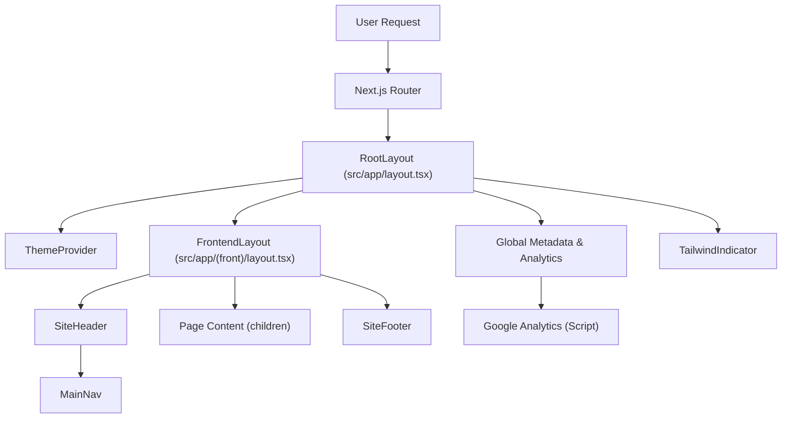

 # Frontend Architecture

The frontend architecture of this application is built on Next.js, leveraging its powerful file-system based routing and server-side rendering capabilities. It incorporates React for building interactive user interfaces, Tailwind CSS for utility-first styling, and tRPC for type-safe API communication. This document delves into the core components that define the application's structure, data flow, and overall user experience.

The design emphasizes modularity and maintainability, separating concerns into distinct layouts and components while integrating essential services like theme management, analytics, and robust data fetching.

## Core Layouts and Global Configuration

Next.js provides a robust system for managing application-wide layouts and configurations. The architecture utilizes two primary layout files to define the global structure and specific frontend presentation.

### Root Layout (`src/app/layout.tsx`)

The root layout is the highest-level component, wrapping the entire application. It's responsible for defining global HTML structure, metadata, fonts, and integrating essential third-party services like theme providers and analytics. This layout ensures consistent styling, accessibility, and SEO across all pages.

Key responsibilities include:

*   **HTML Structure & Fonts**: Sets up the `<html>` and `<body>` tags, applying global fonts (Inter for sans-serif, CalSans for headings) and basic styling.
*   **Metadata & SEO**: Defines `viewport` and `metadata` for search engines, including title, description, keywords, Open Graph, and Twitter card information, pulling from `siteConfig` and environment variables.
*   **Theme Provider**: Integrates `ThemeProvider` to support light/dark mode switching.
*   **Global CSS**: Imports the main `globals.css` file for base styles and Tailwind CSS.
*   **Analytics**: Incorporates Google Analytics using `@next/third-parties/google` and inline scripts, conditionally enabled based on environment variables.
*   **Developer Tools**: Includes `TailwindIndicator` for visual debugging of Tailwind CSS breakpoints.

```typescript
// src/app/layout.tsx
import { TailwindIndicator } from '@/components/tailwind-indicator';
import { ThemeProvider } from '@/components/theme-provider';
import { cn } from '@/lib/utils';
import '@/styles/globals.css';
import type { Metadata, Viewport } from 'next';
import { Inter as FontSans } from 'next/font/google';
import localFont from 'next/font/local';
import { siteConfig } from '@/configs/site';
import { env } from '@/env.mjs';
import { GoogleAnalytics } from '@next/third-parties/google';
import Script from 'next/script';

export const metadata: Metadata = {
  // ... metadata definitions ...
};

export default function RootLayout({
  children,
}: {
  children: React.ReactNode;
}) {
  return (
    <html lang="en" suppressHydrationWarning>
      <body
        className={cn(
          'overlflow-y-auto min-h-screen overflow-x-hidden bg-background font-sans antialiased',
          fontSans.variable,
          fontHeading.variable,
        )}>
        <ThemeProvider
          attribute="class"
          defaultTheme="system"
          enableSystem
          disableTransitionOnChange>
          {children}
          <TailwindIndicator />
          {env.NEXT_PUBLIC_GOOGLE_ANALYTICS_ID && (
            <>
              <Script
                id="_next-ga-init"
                dangerouslySetInnerHTML={{
                  __html: `
          window.dataLayer = window.dataLayer || [];
          function gtag(){window.dataLayer.push(arguments);}
          gtag('js', new Date());

          gtag('config', '${env.NEXT_PUBLIC_GOOGLE_ANALYTICS_ID}', { cookie_flags: 'max-age=86400;secure;samesite=none' });`,
                }}
              />
              <Script
                id="_next-ga"
                src={`https://www.googletagmanager.com/gtag/js?id=${env.NEXT_PUBLIC_GOOGLE_ANALYTICS_ID}`}
              />
            </>
          )}
        </ThemeProvider>
      </body>
    </html>
  );
}
```
[View on GitHub](https://github.com/lande26/LandeMon/blob/main/src/app/layout.tsx)

### Frontend Specific Layout (`src/app/(front)/layout.tsx`)

This layout is nested within the root layout and specifically applies to the frontend-facing pages (e.g., marketing pages, public content). It defines the visual structure common to these pages, such as the header, footer, and specific background aesthetics.

The `(front)` directory convention in Next.js indicates a route group that doesn't affect the URL path but allows for applying distinct layouts to a subset of routes.

```typescript
// src/app/(front)/layout.tsx
import SiteFooter from '@/components/main/site-footer';
import SiteHeader from '@/components/main/site-header';

const FrontLayout = ({ children }: { children: React.ReactNode }) => {
  return (
    <div className="min-h-screen">
          <div className="absolute inset-0 bg-gradient-to-b from-primary/10 via-transparent to-transparent pointer-events-none" />
              <div className="absolute top-1/4 left-1/4 h-72 w-72 rounded-full bg-primary/20 blur-3xl animate-pulse pointer-events-none" />
              <div 
                className="absolute bottom-1/4 right-1/4 h-96 w-96 rounded-full bg-blue-500/20 blur-3xl animate-pulse pointer-events-none" 
                style={{ animationDelay: '1s' }} 
              />
      <SiteHeader />
      <main>{children}</main>
      <SiteFooter />
    </div>
  );
};

export default FrontLayout;
```
[View on GitHub](https://github.com/lande26/LandeMon/blob/main/src/app/(front)/layout.tsx)





## Core Components

Components are the building blocks of the user interface. They are designed to be reusable and encapsulate specific functionalities or UI elements.

### SiteHeader (`src/components/main/site-header.tsx`)

The `SiteHeader` component provides a consistent header across the frontend pages. It typically contains the main navigation (`MainNav`) and possibly other elements like a logo, user authentication status, or theme toggles. It's designed to be sticky at the top, ensuring navigation is always accessible.

```typescript
// src/components/main/site-header.tsx
import { siteConfig } from "@/configs/site";
import React from "react";
import MainNav from "@/components/navigation/main-nav";

const SiteHeader = () => {
  return (
    <header className="sticky top-0 z-50">
      <MainNav items={siteConfig.mainNav} />
    </header>
  );
};

export default SiteHeader;
```
[View on GitHub](https://github.com/lande26/LandeMon/blob/main/src/components/main/site-header.tsx)

## Data Fetching with tRPC and React Query

For efficient and type-safe data fetching, the application integrates tRPC with React Query. This combination provides a powerful pattern for interacting with the backend API, offering benefits like automatic type inference, caching, and background refetching.

### tRPC Provider (`src/client/trpc-provider.tsx`)

The `TrpcProvider` is a client-side component that sets up the tRPC client and wraps the application with `QueryClientProvider` from React Query. This makes the tRPC client and React Query's context available to all descendant components, enabling them to make type-safe API calls and manage server state.

Key functionalities:

*   **QueryClient Setup**: Initializes `QueryClient` with default options for caching and refetching behavior.
*   **Base URL Resolution**: Dynamically determines the base URL for API requests, supporting both client-side (relative) and server-side (absolute for Vercel or localhost) environments.
*   **tRPC Client Creation**: Configures the tRPC client with `httpBatchLink` for efficient batching of requests, `loggerLink` for development debugging, and `superjson` for advanced serialization.
*   **React Query Devtools**: Includes developer tools for inspecting and debugging React Query's cache.

```typescript
// src/client/trpc-provider.tsx
"use client";

import { QueryClient, QueryClientProvider } from "@tanstack/react-query";
import { httpBatchLink, loggerLink } from "@trpc/client";
import { useState } from "react";
import superjson from "superjson";
import { trpc } from "@/client/trpc";
import { ReactQueryDevtools } from "@tanstack/react-query-devtools";

export const TrpcProvider: React.FC<{ children: React.ReactNode }> = ({
  children,
}) => {
  const [queryClient] = useState(
    () =>
      new QueryClient({
        defaultOptions: {
          queries: { staleTime: 5000, refetchOnWindowFocus: false },
        },
      }),
  );

  const getBaseUrl = () => {
    if (typeof window !== "undefined") return ""; 
    if (process.env.VERCEL_URL) return `https://${process.env.VERCEL_URL}`;
    return `http://localhost:${process.env.PORT ?? 3000}`; 
  };

  const [trpcClient] = useState(() =>
    trpc.createClient({
      links: [
        loggerLink({
          enabled: (opts) =>
            process.env.NODE_ENV === "development" ||
            (opts.direction === "down" && opts.result instanceof Error),
        }),
        httpBatchLink({
          url: `${getBaseUrl()}/api/trpc`,
        }),
      ],
      transformer: superjson,
    }),
  );
  return (
    <trpc.Provider client={trpcClient} queryClient={queryClient}>
      <QueryClientProvider client={queryClient}>
        {children}
        <ReactQueryDevtools />
      </QueryClientProvider>
    </trpc.Provider>
  );
};
```
[View on GitHub](https://github.com/lande26/LandeMon/blob/main/src/client/trpc-provider.tsx)

## Key Integration Points

### Request Flow with tRPC

The integration of tRPC with React Query simplifies data fetching by providing a type-safe and efficient communication layer between the client and server. When a client-side component needs data, it uses the `trpc` client to initiate a request. This request is then handled by the `TrpcProvider` which uses `react-query` to manage the request lifecycle, including caching, background refetching, and error handling.


```mermaid
sequenceDiagram
    participant C as "Client Component"
    participant TP as "TrpcProvider"
    participant T as "tRPC Client"
    participant RQ as "React Query"
    participant S as "tRPC Server"
    participant DB as "Database/Backend"

    C -->|"Call trpc.useQuery()"| T;
    T -->|"Execute Query"| RQ;
    RQ -->|"Check Cache"| RQ;
    alt Cache Hit
        RQ -->|"Return Cached Data"| C;
    else Cache Miss / Stale
        RQ -->|"Send HTTP Batch Link Request"| S;
        S -->|"Process Procedure"| DB;
        DB -->|"Return Data"| S;
        S -->|"Send Response (superjson)"| T;
        T -->|"Transform Data"| RQ;
        RQ -->|"Update Cache"| RQ;
        RQ -->|"Return Fresh Data"| C;
    end
```


### Global Configuration and Layouts

The modular approach with `RootLayout` and `FrontLayout` ensures a clear separation of concerns. Global configurations like theme settings, analytics scripts, and essential metadata are handled at the root. Specific UI elements like headers and footers, and visual effects relevant to the public-facing application, are encapsulated within the `FrontLayout`. This layered layout strategy allows for flexibility and easier management of different sections of the application, should additional layouts (e.g., for an admin panel) be introduced later.

### Best Practices

*   **Strict Typing**: Utilizing TypeScript with tRPC ensures end-to-end type safety, significantly reducing runtime errors and improving developer experience.
*   **Performance Optimization**: Next.js features like automatic code splitting, image optimization, and static site generation (where applicable) are inherent to the framework. The use of `httpBatchLink` in tRPC further optimizes network requests by bundling multiple calls into a single HTTP request.
*   **Accessibility & SEO**: Comprehensive metadata in `layout.tsx` and semantic HTML in components are crucial for search engine optimization and accessibility.
*   **Maintainability**: Components are kept focused on single responsibilities (e.g., `SiteHeader` for navigation, `TrpcProvider` for data layer setup), making the codebase easier to understand, test, and maintain.