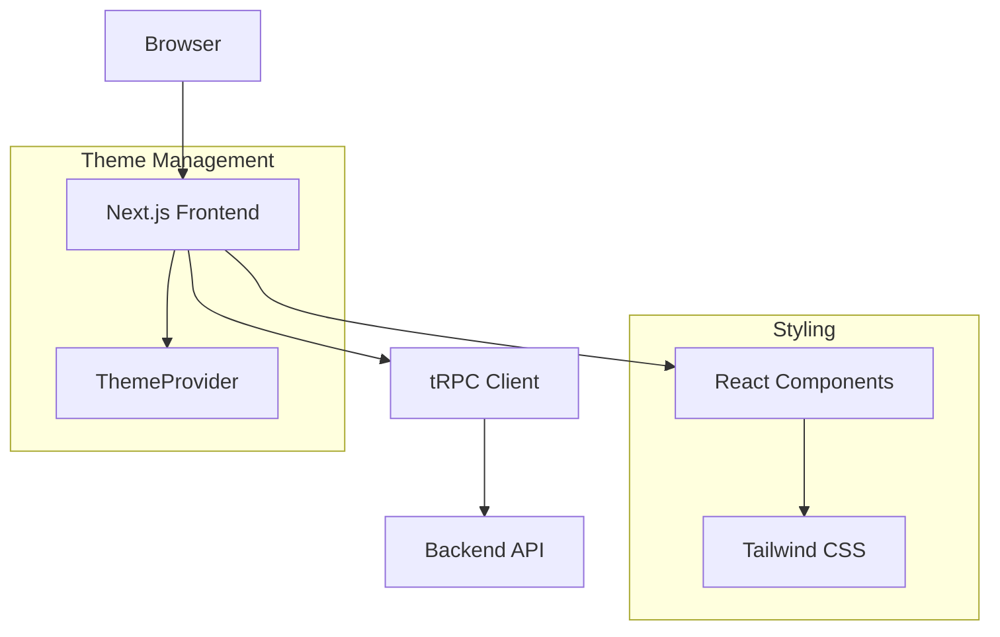
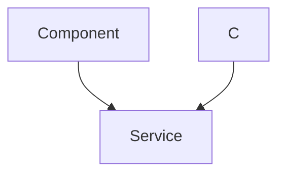

# Frontend Architecture

This document details the architecture of the frontend for LandeMon, a Next.js application. It outlines the key components, their organization, and the technologies used to create a responsive and interactive user interface.

## Core Components

The frontend is built using React with Next.js, leveraging TypeScript for type safety and maintainability. Tailwind CSS provides a utility-first approach to styling, and `trpc` facilitates end-to-end type-safe APIs.

### `src/app/layout.tsx` - Root Layout

The `layout.tsx` file defines the root layout of the application. It is responsible for setting up the basic HTML structure, including metadata, font loading, and theme management.

```typescript
// src/app/layout.tsx
import { ThemeProvider } from '@/components/theme-provider';
import { cn } from '@/lib/utils';
import '@/styles/globals.css';
import type { Metadata, Viewport } from 'next';
import { Inter as FontSans } from 'next/font/google';
import localFont from 'next/font/local';
import { siteConfig } from '@/configs/site';
import { env } from '@/env.mjs';
import Script from 'next/script';

export const metadata: Metadata = {
  metadataBase: new URL(env.NEXT_PUBLIC_APP_URL),
  title: {
    default: siteConfig.name,
    template: `%s - ${siteConfig.name}`,
  },
  description: siteConfig.description,
  keywords: siteConfig.keywords,
  authors: [
    {
      name: siteConfig.author,
      url: siteConfig.url,
    },
  ],
  creator: siteConfig.author,
  openGraph: {
    type: 'website',
    locale: 'en_US',
    url: siteConfig.url,
    title: siteConfig.name,
    images: siteConfig.ogImage,
    description: siteConfig.description,
    siteName: siteConfig.name,
  },
  twitter: {
    card: 'summary_large_image',
    title: siteConfig.name,
    description: siteConfig.description,
    images: [siteConfig.ogImage],
    creator: siteConfig.author,
  },
  icons: {
    icon: '/favicon.ico',
  },
  other: { referrer: 'no-referrer-when-downgrade' },
};

export default function RootLayout({
  children,
}: {
  children: React.ReactNode;
}) {
  return (
    <html lang="en" suppressHydrationWarning>
      <body
        className={cn(
          'overlflow-y-auto min-h-screen overflow-x-hidden bg-background font-sans antialiased',
          fontSans.variable,
          fontHeading.variable,
        )}>
        <ThemeProvider
          attribute="class"
          defaultTheme="system"
          enableSystem
          disableTransitionOnChange>
          {children}
          </ThemeProvider>
      </body>
    </html>
  );
}
```

**Explanation:**

-   `Metadata` configuration defines SEO-related information.
-   Font loading is handled using `next/font/google` and `next/font/local`.
-   The `ThemeProvider` component manages the application's theme (light/dark mode).
-   `cn` is a utility function (likely from `class-variance-authority`) for conditionally joining class names.

[View on GitHub](https://github.com/lande26/LandeMon/blob/main/src/app/layout.tsx)

### Theme Provider

```typescript
// Example of ThemeProvider Component
"use client";

import * as React from "react"
import { ThemeProvider as NextThemesProvider } from "next-themes"

interface ThemeProviderProps extends React.PropsWithChildren {}

export function ThemeProvider({ children, ...props }: ThemeProviderProps) {
  return (
    <NextThemesProvider attribute="class" defaultTheme="system" enableSystem {...props}>
      {children}
    </NextThemesProvider>
  )
}
```

**Explanation:**
This code snippet sets up the `ThemeProvider` using `next-themes`. The `attribute="class"` configures `next-themes` to apply themes by modifying the `class` attribute of the `html` element. The `defaultTheme="system"` sets the initial theme to match the user's system preference, and `enableSystem` allows the theme to dynamically update based on changes to the system's color scheme.

[View on GitHub](https://github.com/lande26/LandeMon/blob/main/src/components/theme-provider.tsx)

### `src/client/trpc-provider.tsx` - tRPC Provider

This component sets up the `trpc` client for making type-safe API calls to the backend.  It initializes the `QueryClient` from `tanstack/react-query` for managing server state.

```typescript
// src/client/trpc-provider.tsx
"use client";

import { QueryClient, QueryClientProvider } from "@tanstack/react-query";
import { httpBatchLink, loggerLink } from "@trpc/client";
import { useState } from "react";
import superjson from "superjson";
import { trpc } from "@/client/trpc";
import { ReactQueryDevtools } from "@tanstack/react-query-devtools";

export const TrpcProvider: React.FC<{ children: React.ReactNode }> = ({
  children,
}) => {
  const [queryClient] = useState(
    () =>
      new QueryClient({
        defaultOptions: {
          queries: { staleTime: 5000, refetchOnWindowFocus: false },
        },
      }),
  );

  const getBaseUrl = () => {
    if (typeof window !== "undefined") return ""; // browser should use relative url
    if (process.env.VERCEL_URL) return `https://${process.env.VERCEL_URL}`; // SSR should use vercel url
    return `http://localhost:${process.env.PORT ?? 3000}`; // dev SSR should use localhost
  };

  const [trpcClient] = useState(() =>
    trpc.createClient({
      links: [
        loggerLink({
          enabled: (opts) =>
            process.env.NODE_ENV === "development" ||
            (opts.direction === "down" && opts.result instanceof Error),
        }),
        httpBatchLink({
          url: `${getBaseUrl()}/api/trpc`,
        }),
      ],
      transformer: superjson,
    }),
  );
  return (
    <trpc.Provider client={trpcClient} queryClient={queryClient}>
      <QueryClientProvider client={queryClient}>
        {children}
        <ReactQueryDevtools />
      </QueryClientProvider>
    </trpc.Provider>
  );
};
```

**Explanation:**

-   `QueryClient` is configured with default options for `staleTime` and `refetchOnWindowFocus`.
-   `getBaseUrl` determines the correct base URL for API calls based on the environment.
-   `trpc.createClient` initializes the tRPC client with `httpBatchLink` for efficient batching of requests and `loggerLink` for debugging.
-   `superjson` is used as the transformer for serializing and deserializing data.

[View on GitHub](https://github.com/lande26/LandeMon/blob/main/src/client/trpc-provider.tsx)

### Tailwind CSS Configuration - `tailwind.config.ts`

The `tailwind.config.ts` file configures Tailwind CSS, defining the color palette, breakpoints, font families, and other styling options.

```typescript
// tailwind.config.ts
import { fontFamily } from "tailwindcss/defaultTheme";
/** @type {import('tailwindcss').Config} */
module.exports = {
  darkMode: ["class"],
  content: [
    "./pages/**/*.{ts,tsx}",
    "./components/**/*.{ts,tsx}",
    "./app/**/*.{ts,tsx}",
    "./src/**/*.{ts,tsx}",
  ],
  theme: {
    screens: {
      xs: "500px",
      sm: "640px",
      md: "768px",
      lg: "1024px",
      xl: "1280px",
      "2xl": "1400px",
    },
    container: {
      center: true,
      padding: "4vw",
      screens: {
        "2xl": "1400px",
      },
    },
    extend: {
      colors: {
        border: "hsl(var(--border))",
        input: "hsl(var(--input))",
        ring: "hsl(var(--ring))",
        background: "hsl(var(--background))",
        foreground: "hsl(var(--foreground))",
        primary: {
          DEFAULT: "hsl(var(--primary))",
          foreground: "hsl(var(--primary-foreground))",
        },
        // ... other colors
      },
      borderRadius: {
        lg: "var(--radius)",
        md: "calc(var(--radius) - 2px)",
        sm: "calc(var(--radius) - 4px)",
      },
      fontFamily: {
        sans: ["var(--font-sans)", ...fontFamily.sans],
        heading: ["var(--font-heading)", ...fontFamily.sans],
      },
    },
  },
  plugins: [require("tailwindcss-animate")],
};
```

**Explanation:**

-   `darkMode: ["class"]` enables dark mode based on CSS class.
-   `content` specifies the files to be scanned for Tailwind CSS classes.
-   `theme.extend.colors` defines custom colors using CSS variables.
-   `theme.extend.fontFamily` extends the default font families.
-   `plugins: [require("tailwindcss-animate")]` adds the `tailwindcss-animate` plugin for animations.

[View on GitHub](https://github.com/lande26/LandeMon/blob/main/tailwind.config.ts)

### Global Styles - `src/styles/globals.css`

This file contains global CSS styles, including Tailwind CSS directives and custom styles.  It sets up CSS variables for theming and defines styles for the entire application.

```css
// src/styles/globals.css
@tailwind base;
@tailwind components;
@tailwind utilities;

html,
body,
:root {
  height: 100%;
}

@layer base {
  :root {
    --background: 0 0% 100%;
    --foreground: 222.2 84% 4.9%;
    // ... other CSS variables
  }

  .dark {
    --background: 222.2 84% 4.9%;
    --foreground: 210 40% 98%;
    // ... other dark mode CSS variables
  }
}

@layer base {
  * {
    @apply border-border;
  }

  body {
    @apply bg-background text-foreground;
  }
}

```

**Explanation:**

-   `@tailwind base`, `@tailwind components`, and `@tailwind utilities` inject Tailwind's base styles, components, and utility classes.
-   CSS variables are defined for theming, allowing easy customization of colors and other styles.
-   The `.dark` class defines styles for dark mode.
-   Base styles are applied to the `html` and `body` elements.

[View on GitHub](https://github.com/lande26/LandeMon/blob/main/src/styles/globals.css)

## Frontend Architecture Diagram





## Key Integration Points

### Data Fetching with tRPC

The frontend uses `trpc` for type-safe API calls. This allows developers to define API endpoints on the backend and generate TypeScript types that are automatically available on the frontend.

```typescript
// Example of a tRPC procedure
import { z } from "zod";
import { publicProcedure, router } from "./trpc";

export const appRouter = router({
  hello: publicProcedure
    .input(
      z.object({
        text: z.string().nullish(),
      }),
    )
    .query(({ input }) => {
      return {
        greeting: `Hello ${input?.text ?? "world"}`,
      };
    }),
});

export type AppRouter = typeof appRouter;
```

**Explanation:**

-   This code defines a simple tRPC router with a `hello` procedure.
-   The procedure takes an optional `text` input and returns a greeting.
-   `zod` is used for input validation.

[View on GitHub](https://github.com/lande26/LandeMon/blob/main/src/server/api/routers/example.ts)

### State Management with React Query

React Query, integrated via the `TrpcProvider`, is used for managing server state on the frontend. It provides caching, background updates, and other features that simplify data fetching and management.

```typescript
//Example React Component Using Trpc
import { useQuery } from "@tanstack/react-query";
import { trpc } from "../utils/trpc";

function MyComponent() {
  const { data, isLoading, error } = trpc.hello.useQuery({ text: "from tRPC" });

  if (isLoading) return <div>Loading...</div>;
  if (error) return <div>Error: {error.message}</div>;

  return <div>{data?.greeting}</div>;
}

export default MyComponent;
```

**Explanation:**

-   The `useQuery` hook from `@tanstack/react-query` is used to fetch data from the tRPC endpoint.
-   The hook automatically handles loading, error, and data states.

[View on GitHub](https://github.com/t3-oss/create-t3-app)
### Component Structure

The frontend is organized into reusable React components. These components are responsible for rendering the UI and handling user interactions. The `components` directory typically contains smaller, reusable UI elements, while the `app` directory contains page-specific components.

## Best Practices

-   **Type Safety:** Leverage TypeScript and tRPC to ensure type safety throughout the frontend and backend.
-   **Component Reusability:** Design reusable React components to reduce code duplication and improve maintainability.
-   **Consistent Styling:** Use Tailwind CSS classes consistently to maintain a uniform look and feel across the application.
-   **State Management:** Use React Query for managing server state to simplify data fetching and caching.




