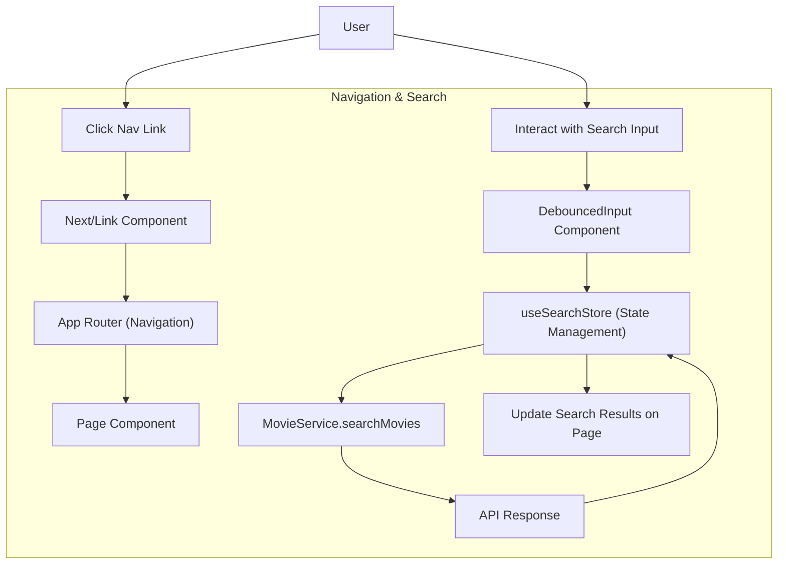

# Frontend Architecture

This section details the frontend structure, routing, and core UI components of LandeMon. The application leverages Next.js for its framework, with a focus on server-side rendering, static generation, and client-side interactivity.

## Layout Structure

The application utilizes a root `layout.tsx` file for global configurations and a specific `(front)/layout.tsx` for the public-facing sections of the application.

### Root Layout (`src/app/layout.tsx`)

The `RootLayout` component is the entry point for the entire application. It sets up global styles, fonts, theme providers, and metadata. It also includes configurations for Google Analytics and a Tailwind CSS indicator for development.

```tsx
// src/app/layout.tsx
import { TailwindIndicator } from '@/components/tailwind-indicator';
import { ThemeProvider } from '@/components/theme-provider';
import { cn } from '@/lib/utils';
import '@/styles/globals.css';
import type { Metadata, Viewport } from 'next';
import { Inter as FontSans } from 'next/font/google';
import localFont from 'next/font/local';
import { siteConfig } from '@/configs/site';
import { env } from '@/env.mjs';
import { GoogleAnalytics } from '@next/third-parties/google';
import Script from 'next/script';

export const runtime = 'edge';

const fontSans = FontSans({
  subsets: ['latin'],
  variable: '--font-sans',
  display: 'swap',
});

const fontHeading = localFont({
  src: '../assets/fonts/CalSans-SemiBold.woff2',
  variable: '--font-heading',
});

export const viewport: Viewport = {
  themeColor: [
    { media: '(prefers-color-scheme: light)', color: 'white' },
    { media: '(prefers-color-scheme: dark)', color: 'black' },
  ],
};

export const metadata: Metadata = {
  metadataBase: new URL(env.NEXT_PUBLIC_APP_URL),
  title: {
    default: siteConfig.name,
    template: `%s - ${siteConfig.name}`,
  },
  description: siteConfig.description,
  // ... other metadata
};

export default function RootLayout({
  children,
}: {
  children: React.ReactNode;
}) {
  return (
    <html lang="en" suppressHydrationWarning>
      <body
        className={cn(
          'overlflow-y-auto min-h-screen overflow-x-hidden bg-background font-sans antialiased',
          fontSans.variable,
          fontHeading.variable,
        )}>
        <ThemeProvider
          attribute="class"
          defaultTheme="system"
          enableSystem
          disableTransitionOnChange>
          {children}
          <TailwindIndicator />
          {env.NEXT_PUBLIC_GOOGLE_ANALYTICS_ID && (
            <>
              <Script
                id="_next-ga-init"
                dangerouslySetInnerHTML={{
                  __html: `
          window.dataLayer = window.dataLayer || [];
          function gtag(){window.dataLayer.push(arguments);}
          gtag('js', new Date());

          gtag('config', '${env.NEXT_PUBLIC_GOOGLE_ANALYTICS_ID}', { cookie_flags: 'max-age=86400;secure;samesite=none' });`,
                }}
              />
              <Script
                id="_next-ga"
                src={`https://www.googletagmanager.com/gtag/js?id=${env.NEXT_PUBLIC_GOOGLE_ANALYTICS_ID}`}
              />
            </>
          )}
        </ThemeProvider>
      </body>
    </html>
  );
}
```

### Frontend Layout (`src/app/(front)/layout.tsx`)

This layout wraps the content for the public-facing pages. It includes visual elements like gradients and animations, along with `SiteHeader` and `SiteFooter` components.

```tsx
// src/app/(front)/layout.tsx
import SiteFooter from '@/components/main/site-footer';
import SiteHeader from '@/components/main/site-header';

const FrontLayout = ({ children }: { children: React.ReactNode }) => {
  return (
    <div className="min-h-screen">
          <div className="absolute inset-0 bg-gradient-to-b from-primary/10 via-transparent to-transparent pointer-events-none" />
              <div className="absolute top-1/4 left-1/4 h-72 w-72 rounded-full bg-primary/20 blur-3xl animate-pulse pointer-events-none" />
              <div 
                className="absolute bottom-1/4 right-1/4 h-96 w-96 rounded-full bg-blue-500/20 blur-3xl animate-pulse pointer-events-none" 
                style={{ animationDelay: '1s' }} 
              />
      <SiteHeader />
      <main>{children}</main>
      <SiteFooter />
    </div>
  );
};

export default FrontLayout;
```

## Routing

The application utilizes Next.js's App Router for defining routes. The `(front)` directory indicates a route group specific to the frontend. Navigation is handled using the `next/link` component.

## Core UI Components

### Max Width Wrapper (`src/components/max-width-wrapper.tsx`)

This reusable component ensures content is constrained within a maximum width and horizontally centered, providing consistent layout across different screen sizes.

```tsx
// src/components/max-width-wrapper.tsx
import React from "react";

import { cn } from "@/lib/utils";

export default function MaxWidthWrapper({
  className,
  children,
}: {
  className?: string;
  children: React.ReactNode;
}) {
  return (
    <div
      className={cn(
        "mx-auto w-full max-w-screen-xl px-2.5 md:px-20",
        className,
      )}
    >
      {children}
    </div>
  );
}
```

### Main Navigation (`src/components/navigation/main-nav.tsx`)

The `MainNav` component provides the primary navigation for the application. It includes a logo, site name, navigation links, a search input, and a theme toggle. It dynamically adjusts its appearance based on scroll position and handles search functionality with debouncing.

```tsx
// src/components/navigation/main-nav.tsx
'use client';

import React from 'react';
import { type Show, type NavItem } from '@/types';
import Link from 'next/link';
import {
  cn,
  getSearchValue,
  handleDefaultSearchBtn,
  handleDefaultSearchInp,
} from '@/lib/utils';
import { siteConfig } from '@/configs/site';
import { Icons } from '@/components/icons';
import {
  DropdownMenu,
  DropdownMenuContent,
  DropdownMenuItem,
  DropdownMenuLabel,
  DropdownMenuSeparator,
  DropdownMenuTrigger,
} from '@/components/ui/dropdown-menu';
import { Button } from '@/components/ui/button';
import { usePathname, useRouter } from 'next/navigation';
import { useSearchStore } from '@/stores/search';
import { ModeToggle as ThemeToggle } from '@/components/theme-toggle';
import { DebouncedInput } from '@/components/debounced-input';
import MovieService from '@/services/MovieService';

interface MainNavProps {
  items?: NavItem[];
}

interface SearchResult {
  results: Show[];
  variant?: 'default' | 'light' | 'dark' | 'transparent';
  textColor?: 'light' | 'dark';
  hideOnScroll?: boolean;
}

export function MainNav({ items }: MainNavProps) {
  const path = usePathname();
  const router = useRouter();
  const searchStore = useSearchStore();
  const [isScrolled, setIsScrolled] = React.useState(false);

  // ... (useEffect for popstate, searchShowsByQuery, useEffect for scroll)

  return (
    <nav
      className={cn(
        'relative flex h-12 w-full items-center justify-between overflow-hidden px-[4vw] transition-colors duration-300 md:sticky md:h-16',
        isScrolled ? 'bg-secondary shadow-md' : 'bg-transparent',
      )}>
      <div className="relative z-10 flex items-center gap-6 md:gap-10">
        <Link
          href="/"
          className="hidden md:block"
          onClick={() => handleChangeStatusOpen(false)}>
          <div className="flex items-center space-x-2">
            <Icons.logo className="h-6 w-6" aria-hidden="true" />
            <span className="inline-block font-bold">{siteConfig.name}</span>
            <span className="sr-only">Home</span>
          </div>
        </Link>
        {items?.length ? (
          <nav className="hidden gap-6 md:flex">
            {items?.map(
              (item, index) =>
                item.href && (
                  <Link
                    key={index}
                    href={item.href}
                    className={cn(
                      'flex items-center text-sm font-medium text-foreground/60 transition hover:text-foreground/80',
                      path === item.href && 'font-bold text-foreground',
                      item.disabled && 'cursor-not-allowed opacity-80',
                    )}
                    onClick={() => handleChangeStatusOpen(false)}>
                    {item.title}
                  </Link>
                ),
            )}
          </nav>
        ) : null}
        <div className="block md:hidden">
          <DropdownMenu>
            <DropdownMenuTrigger asChild>
              <Button
                variant="ghost"
                className="flex items-center space-x-2 px-0 hover:bg-transparent focus:ring-0">
                <Icons.logo className="h-6 w-6" />
                <span className="text-base font-bold">Menu</span>
              </Button>
            </DropdownMenuTrigger>
            <DropdownMenuContent
              align="start"
              sideOffset={20}
              className="w-52 overflow-y-auto overflow-x-hidden rounded-sm">
              <DropdownMenuLabel>
                <Link
                  href="/"
                  className="flex items-center justify-center"
                  onClick={() => handleChangeStatusOpen(false)}>
                  <span className="">{siteConfig.name}</span>
                </Link>
              </DropdownMenuLabel>
              <DropdownMenuSeparator />
              {items?.map((item, index) => (
                <DropdownMenuItem
                  key={index}
                  asChild
                  className="items-center justify-center">
                  {item.href && (
                    <Link
                      href={item.href}
                      onClick={() => handleChangeStatusOpen(false)}>
                      <span
                        className={cn(
                          'line-clamp-1 text-foreground/60 hover:text-foreground/80',
                          path === item.href && 'font-bold text-foreground',
                        )}>
                        {item.title}
                      </span>
                    </Link>
                  )}
                </DropdownMenuItem>
              ))}
            </DropdownMenuContent>
          </DropdownMenu>
        </div>
      </div>
      
      <div className="relative z-10 flex items-center gap-1">
        <DebouncedInput
          id="search-input"
          open={searchStore.isOpen}
          value={searchStore.query}
          onChange={searchShowsByQuery}
          onChangeStatusOpen={handleChangeStatusOpen}
          containerClassName={cn(path === '/' ? 'hidden' : 'flex')}
        />
        <Link
          rel="noreferrer"
          target="_blank"
          href={siteConfig.links.github}
          className={cn(path === '/' ? 'flex' : 'hidden')}>
          <Icons.gitHub className="h-5 w-5 hover:bg-transparent" />
        </Link>
        <ThemeToggle />
      </div>
    </nav>
  );
}

export default MainNav;
```

## Architecture Flow (Simplified)

The following diagram illustrates a simplified flow of how navigation and search interact within the frontend.





## Key Takeaways

*   The frontend architecture is built upon Next.js, leveraging its routing and rendering capabilities.
*   Layouts are structured to provide consistent headers, footers, and global styling.
*   Reusable UI components like `MaxWidthWrapper` and `MainNav` promote modularity and maintainability.
*   State management for search functionality is handled by `useSearchStore`, ensuring a responsive user experience.
*   Integration with external services like Google Analytics is configured at the root layout level.