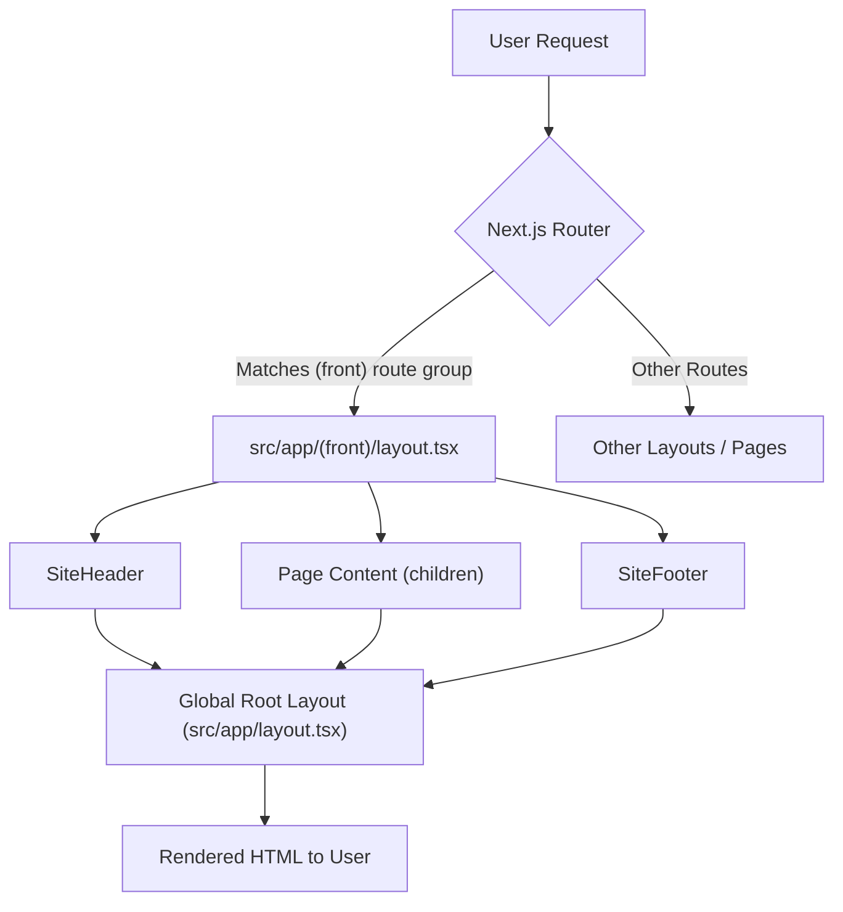

 # Frontend Architecture

The frontend architecture of this application is built on Next.js, leveraging its powerful routing and server-side rendering capabilities. It's designed to be modular, scalable, and maintainable, focusing on a clear separation of concerns between global layouts, feature-specific layouts, and data fetching mechanisms. This document outlines the core components and their interactions that form the client-side application.

## Core Layouts and Routing

The application utilizes Next.js App Router for defining layouts and routes. There are two primary layout files: `src/app/layout.tsx` for the global root layout and `src/app/(front)/layout.tsx` for a specific frontend-facing layout group.

### Global Root Layout (`src/app/layout.tsx`)

The `RootLayout` component in `src/app/layout.tsx` serves as the highest-level wrapper for the entire application. It sets up essential configurations like HTML language attributes, font variables, theming, and global styles. It also handles metadata generation, viewport settings, and integrates third-party scripts like Google Analytics.

```tsx title="src/app/layout.tsx" {16-37, 85-94}
import { TailwindIndicator } from '@/components/tailwind-indicator';
import { ThemeProvider } from '@/components/theme-provider';
import { cn } from '@/lib/utils';
import '@/styles/globals.css';
import type { Metadata, Viewport } from 'next';
import { Inter as FontSans } from 'next/font/google';
import localFont from 'next/font/local';
import { siteConfig } from '@/configs/site';
import { env } from '@/env.mjs';
import { GoogleAnalytics } from '@next/third-parties/google';
import Script from 'next/script';

export const runtime = 'edge';

const fontSans = FontSans({
  subsets: ['latin'],
  variable: '--font-sans',
  display: 'swap',
});

// Font files can be colocated inside of `pages`
const fontHeading = localFont({
  src: '../assets/fonts/CalSans-SemiBold.woff2',
  variable: '--font-heading',
});

export const viewport: Viewport = {
  themeColor: [
    { media: '(prefers-color-scheme: light)', color: 'white' },
    { media: '(prefers-color-scheme: dark)', color: 'black' },
  ],
};

export const metadata: Metadata = {
  metadataBase: new URL(env.NEXT_PUBLIC_APP_URL),
  title: {
    default: siteConfig.name,
    template: `%s - ${siteConfig.name}`,
  },
  description: siteConfig.description,
  keywords: siteConfig.keywords,
  authors: [
    {
      name: siteConfig.author,
      url: siteConfig.url,
    },
  ],
  creator: siteConfig.author,
  openGraph: {
    type: 'website',
    locale: 'en_US',
    url: siteConfig.url,
    title: siteConfig.name,
    images: siteConfig.ogImage,
    description: siteConfig.description,
    siteName: siteConfig.name,
  },
  twitter: {
    card: 'summary_large_image',
    title: siteConfig.name,
    description: siteConfig.description,
    images: [siteConfig.ogImage],
    creator: siteConfig.author,
  },
  icons: {
    icon: '/favicon.ico',
  },
  other: { referrer: 'no-referrer-when-downgrade' },
};

export default function RootLayout({
  children,
}: {
  children: React.ReactNode;
}) {
  return (
    <html lang="en" suppressHydrationWarning>
      <body
        className={cn(
          'overlflow-y-auto min-h-screen overflow-x-hidden bg-background font-sans antialiased',
          fontSans.variable,
          fontHeading.variable,
        )}>
        <ThemeProvider
          attribute="class"
          defaultTheme="system"
          enableSystem
          disableTransitionOnChange>
          {children}
          <TailwindIndicator />
          {env.NEXT_PUBLIC_GOOGLE_ANALYTICS_ID && (
            <>
              <Script
                id="_next-ga-init"
                dangerouslySetInnerHTML={{
                  __html: `
          window.dataLayer = window.dataLayer || [];
          function gtag(){window.dataLayer.push(arguments);}
          gtag('js', new Date());

          gtag('config', '${env.NEXT_PUBLIC_GOOGLE_ANALYTICS_ID}', { cookie_flags: 'max-age=86400;secure;samesite=none' });`,
                }}
              />
              <Script
                id="_next-ga"
                src={`https://www.googletagmanager.com/gtag/js?id=${env.NEXT_PUBLIC_GOOGLE_ANALYTICS_ID}`}
              />
            </>
          )}
        </ThemeProvider>
      </body>
    </html>
  );
}
```
[View on GitHub](https://github.com/lande26/LandeMon/blob/main/src/app/layout.tsx)

This layout is responsible for:
*   **Metadata Management:** Dynamically sets page titles, descriptions, and Open Graph/Twitter card data using `siteConfig` from `src/configs/site.ts`.
*   **Theming:** Integrates `ThemeProvider` for light/dark mode functionality.
*   **Global Styling:** Applies global CSS and font variables.
*   **Analytics:** Conditionally includes Google Analytics scripts.
*   **Tailwind Indicator:** Provides a visual indicator for Tailwind CSS breakpoints in development.

### Frontend Group Layout (`src/app/(front)/layout.tsx`)

The `FrontLayout` in `src/app/(front)/layout.tsx` is an example of a nested layout, applied to all routes within the `(front)` route group. This allows for specific UI elements, such as a site header and footer, to be consistently present across a section of the application without affecting other parts (e.g., an admin dashboard might have a different layout).

```tsx title="src/app/(front)/layout.tsx" {8-11}
import SiteFooter from '@/components/main/site-footer';
import SiteHeader from '@/components/main/site-header';

const FrontLayout = ({ children }: { children: React.ReactNode }) => {
  return (
    <div className="min-h-screen">
          <div className="absolute inset-0 bg-gradient-to-b from-primary/10 via-transparent to-transparent pointer-events-none" />
              <div className="absolute top-1/4 left-1/4 h-72 w-72 rounded-full bg-primary/20 blur-3xl animate-pulse pointer-events-none" />
              <div
                className="absolute bottom-1/4 right-1/4 h-96 w-96 rounded-full bg-blue-500/20 blur-3xl animate-pulse pointer-events-none"
                style={{ animationDelay: '1s' }}
              />
      <SiteHeader />
      <main>{children}</main>
      <SiteFooter />
    </div>
  );
};

export default FrontLayout;
```
[View on GitHub](https://github.com/lande26/LandeMon/blob/main/src/app/(front)/layout.tsx)

This layout wraps the `children` (page content) with `SiteHeader` and `SiteFooter` components, ensuring a consistent navigational and branding experience for the public-facing pages. It also includes decorative background elements for visual appeal.

### Frontend Layout Flow

Here's a basic flow of how requests interact with the Next.js layouts:





## Data Fetching with tRPC

For efficient and type-safe data communication between the client and server, the application uses tRPC. The `TrpcProvider` component wraps the application's children to provide the tRPC client and React Query client context.

### tRPC Provider (`src/client/trpc-provider.tsx`)

The `TrpcProvider` sets up the tRPC client, configuring links for logging and batching HTTP requests. It also initializes a `QueryClient` from `@tanstack/react-query` to manage client-side caching, re-fetching, and data synchronization.

```tsx title="src/client/trpc-provider.tsx" {10-14, 28-36}
"use client";

import { QueryClient, QueryClientProvider } from "@tanstack/react-query";
import { httpBatchLink, loggerLink } from "@trpc/client";
import { useState } from "react";
import superjson from "superjson";
import { trpc } from "@/client/trpc";
import { ReactQueryDevtools } from "@tanstack/react-query-devtools";

export const TrpcProvider: React.FC<{ children: React.ReactNode }> = ({
  children,
}) => {
  const [queryClient] = useState(
    () =>
      new QueryClient({
        defaultOptions: {
          queries: { staleTime: 5000, refetchOnWindowFocus: false },
        },
      }),
  );

  const getBaseUrl = () => {
    if (typeof window !== "undefined") return ""; // browser should use relative url
    if (process.env.VERCEL_URL) return `https://${process.env.VERCEL_URL}`; // SSR should use vercel url
    return `http://localhost:${process.env.PORT ?? 3000}`; // dev SSR should use localhost
  };

  const [trpcClient] = useState(() =>
    trpc.createClient({
      links: [
        loggerLink({
          enabled: (opts) =>
            process.env.NODE_ENV === "development" ||
            (opts.direction === "down" && opts.result instanceof Error),
        }),
        httpBatchLink({
          url: `${getBaseUrl()}/api/trpc`,
        }),
      ],
      transformer: superjson,
    }),
  );
  return (
    <trpc.Provider client={trpcClient} queryClient={queryClient}>
      <QueryClientProvider client={queryClient}>
        {children}
        <ReactQueryDevtools />
      </QueryClientProvider>
    </trpc.Provider>
  );
};
```
[View on GitHub](https://github.com/lande26/LandeMon/blob/main/src/client/trpc-provider.tsx)

While `TrpcProvider` is currently commented out in `src/app/layout.tsx`, its structure demonstrates the intended integration for a tRPC-powered data layer. When active, it would allow any child component to make type-safe API calls using the `trpc` hook, with automatic caching and revalidation handled by React Query. The `getBaseUrl` function intelligently determines the correct API endpoint for both client-side and server-side rendering environments.

## Site Configuration (`src/configs/site.ts`)

The `src/configs/site.ts` file centralizes all site-wide configuration details. This includes the application name, description, keywords, author, URL, and social media links. It also defines navigational items for the main header and footer.

```typescript title="src/configs/site.ts" {9-11, 23-40}
import { Icons } from '@/components/icons';
import { env } from '@/env.mjs';

export type SiteConfig = typeof siteConfig;

export const siteConfig = {
  name: env.NEXT_PUBLIC_SITE_NAME,
  author: env.NEXT_PUBLIC_SITE_NAME,
  slogan: 'Cinema at Your Fingertips.',
  description:
    'Watch movies & TV shows online or stream right to your smart TV, game console, PC, Mac, mobile, tablet and more.',
  keywords: [
    'watch movies',
    'movies online',
    'watch TV',
    'TV online',
    'TV shows online',
    'watch TV shows',
    'stream movies',
    'stream tv',
    'instant streaming',
    'watch online',
    'movies',
    'watch TV online',
    'no download',
    'full length movies',
    env.NEXT_PUBLIC_SITE_NAME,
  ],
  url: env.NEXT_PUBLIC_APP_URL,
  ogImage: `${env.NEXT_PUBLIC_APP_URL}/images/hero.jpg`,
  links: {
    twitter: `${env.NEXT_PUBLIC_TWITTER}`,
    github: 'https://github.com/lande26/LandeMon',
    githubAccount: '',
  },
  footerItems: [
    { title: 'About', href: '/' },
    { title: 'Help Center', href: '/' },
    { title: 'Contact Us', href: '/' },
    { title: 'Privacy Policy', href: '/' },
  ],
  mainNav: [
    {
      title: 'Home',
      href: '/home',
    },
    {
      title: 'TV Shows',
      href: '/tv-shows',
    },
    {
      title: 'Movies',
      href: '/movies',
    },
    {
      title: 'Anime',
      href: '/anime',
    },
    {
      title: 'New & Popular',
      href: '/new-and-popular',
    },
  ],
};
```
[View on GitHub](https://github.com/lande26/LandeMon/blob/main/src/configs/site.ts)

This configuration is critical for:
*   **SEO:** Provides default metadata for search engines and social media.
*   **Branding:** Centralizes the site name, slogan, and description.
*   **Navigation:** Defines the structure and links for `SiteHeader` and `SiteFooter` components, ensuring consistency across the application.
*   **Environment Variables:** Leverages `env.NEXT_PUBLIC_SITE_NAME` and `env.NEXT_PUBLIC_APP_URL` for dynamic configuration based on the deployment environment.

## Key Integration Points

The frontend architecture demonstrates several key integration points and best practices:

*   **Next.js App Router for Modular Layouts:** The use of `app/layout.tsx` for global settings and `app/(front)/layout.tsx` for specific route groups allows for a highly organized and efficient way to manage shared UI components and functionality. This promotes reusability and simplifies maintenance.
*   **Centralized Site Configuration:** `src/configs/site.ts` acts as a single source of truth for all global site information. This simplifies updates to metadata, navigation, and external links, reducing the risk of inconsistencies. It's especially useful for SEO and brand consistency.
*   **Type-Safe Data Layer (tRPC/React Query):** Although currently commented out, the `TrpcProvider` outlines a robust approach to data fetching. When active, it would provide end-to-end type safety, automatic request batching, and powerful caching mechanisms via React Query, leading to a more reliable and performant application. The `getBaseUrl` function highlights careful consideration for both client and server environments.
*   **Environmental Variables for Flexibility:** Utilizing `env.mjs` throughout the configuration (e.g., `siteConfig`, `layout.tsx`) ensures that sensitive or environment-specific values are managed securely and dynamically, adapting the application behavior based on deployment context (development, production, etc.).
*   **Theming and Global Styles:** The integration of `ThemeProvider` and global CSS imports in the root layout ensures a consistent look and feel across the application while supporting user preferences like dark mode.
*   **Third-Party Script Management:** The conditional rendering of Google Analytics scripts within `app/layout.tsx` demonstrates a best practice for managing external scripts, ensuring they are loaded only when necessary and configured correctly.