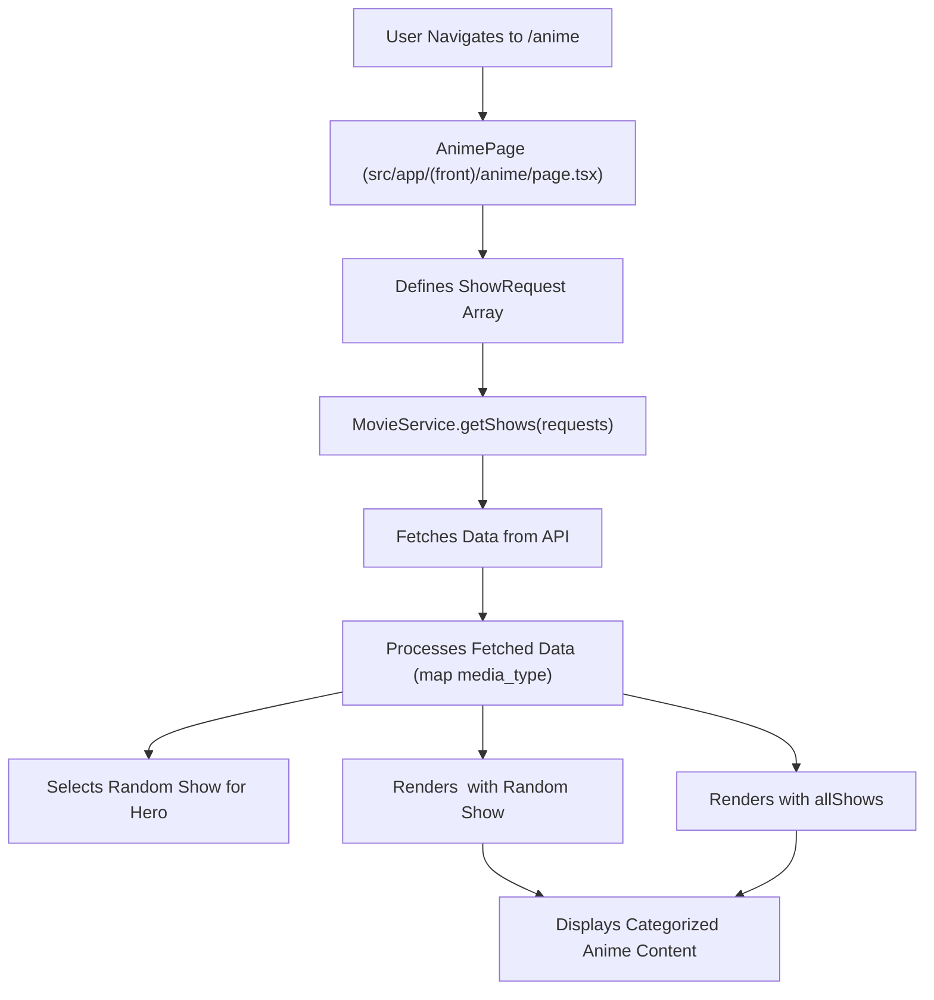

 # Content Browsing and Details

This section details the architecture behind how users browse different media types (movies, TV shows, anime) and view their specific details within the application. It covers the primary pages responsible for listing content categories and rendering individual show information, as well as the search functionality.

## Content Browsing Pages

The application provides dedicated pages for browsing various categories of anime. These pages are responsible for fetching structured content from the backend and presenting it through reusable components.

### Anime Browsing Page (`src/app/(front)/anime/page.tsx`)

The `anime/page.tsx` file serves as the main entry point for displaying categorized anime content. It orchestrates multiple API requests to fetch different sets of anime (latest TV shows, trending, top-rated, Netflix exclusives, latest movies, top-rated movies) and then renders them using a `Hero` component for a featured item and a `ShowsContainer` for categorized lists.

Here's how content requests are defined:

```typescript
// src/app/(front)/anime/page.tsx
// View on GitHub: https://github.com/lande26/LandeMon/blob/main/src/app/(front)/anime/page.tsx#L18-L53
const requests: ShowRequest[] = [
  {
    title: 'Anime TV Shows Latest',
    req: { requestType: RequestType.ANIME_LATEST, mediaType: MediaType.TV },
    visible: true,
  },
  {
    title: 'Anime TV Shows Trending',
    req: {
      requestType: RequestType.ANIME_TRENDING,
      mediaType: MediaType.TV,
    },
    visible: true,
  },
  {
    title: 'Anime TV Shows Top Rated',
    req: {
      requestType: RequestType.ANIME_TOP_RATED,
      mediaType: MediaType.TV,
    },
    visible: true,
  },
  {
    title: 'Netflix Anime TV Shows',
    req: { requestType: RequestType.ANIME_NETFLIX, mediaType: MediaType.TV },
    visible: true,
  },
  {
    title: 'Anime Movies Latest',
    req: {
      requestType: RequestType.ANIME_LATEST,
      mediaType: MediaType.MOVIE,
    },
    visible: true,
  },
  {
    title: 'Anime Movies Top Rated',
    req: {
      requestType: RequestType.ANIME_TOP_RATED,
      mediaType: MediaType.MOVIE,
    },
    visible: true,
  },
];
```

These `ShowRequest` objects define the types of content to be fetched. The `MovieService.getShows` method then processes these requests to retrieve the actual show data:

```typescript
// src/app/(front)/anime/page.tsx
// View on GitHub: https://github.com/lande26/LandeMon/blob/main/src/app/(front)/anime/page.tsx#L55-L56
let allShows = await MovieService.getShows(requests);
// ... data processing ...
```

The fetched `allShows` data is then passed to the `ShowsContainer` component, which is responsible for rendering the categorized lists of anime. A random show from `allShows` is also selected to be displayed prominently in the `Hero` component.

```typescript
// src/app/(front)/anime/page.tsx
// View on GitHub: https://github.com/lande26/LandeMon/blob/main/src/app/(front)/anime/page.tsx#L70-L73
return (
  <>
    <h1 className="hidden">{h1}</h1>
    <Hero randomShow={randomShow} />
    <ShowsContainer shows={allShows} />
  </>
);
```

### Content Browsing Flow (Anime Example)

The following diagram illustrates the flow for the anime browsing page:





## Detail Pages

The application utilizes dynamic routes to render individual detail pages for movies and TV shows. These pages are designed to display comprehensive information about a specific piece of media identified by its slug.

### Movie Detail Page (`src/app/(front)/movies/[slug]/page.tsx`)

This page handles the display of individual movie details. It primarily focuses on setting dynamic metadata based on the movie's slug and then delegates the actual content rendering to a shared `MoviePage` component (likely located at `src/app/(front)/movies/page.tsx` although not provided, the `import MoviePage from '../page';` indicates this structure).

The `generateMetadata` function is crucial for SEO and provides a tailored title and description for each movie:

```typescript
// src/app/(front)/movies/[slug]/page.tsx
// View on GitHub: https://github.com/lande26/LandeMon/blob/main/src/app/(front)/movies/[slug]/page.tsx#L12-L14
export async function generateMetadata({ params }: Props): Promise<Metadata> {
  return handleMetadata(params.slug, 'movies', 'movie');
}
```

The `handleMetadata` utility (from `lib/utils`) is responsible for fetching metadata based on the `slug` and the media type.

### TV Show Detail Page (`src/app/(front)/tv-shows/[slug]/page.tsx`)

Similar to movie detail pages, the TV show detail page uses a dynamic route to display specific TV show information. It follows the same pattern as the movie detail page for metadata generation and content rendering.

```typescript
// src/app/(front)/tv-shows/[slug]/page.tsx
// View on GitHub: https://github.com/lande26/LandeMon/blob/main/src/app/(front)/tv-shows/[slug]/page.tsx#L12-L14
export async function generateMetadata({ params }: Props): Promise<Metadata> {
  return handleMetadata(params.slug, 'tv-shows', 'tv');
}
```

This ensures consistent metadata generation across different media types, leveraging the `handleMetadata` helper.

## Search Functionality

The search page provides a way for users to find content across all media types.

### Search Results Page (`src/app/(front)/search/page.tsx`)

The `search/page.tsx` file processes user search queries, fetches relevant content, and displays the results. A key feature is the immediate redirection if the search query is empty or just whitespace.

```typescript
// src/app/(front)/search/page.tsx
// View on GitHub: https://github.com/lande26/LandeMon/blob/main/src/app/(front)/search/page.tsx#L14-L16
export default async function SearchPage({ searchParams }: SearchProps) {
  if (!searchParams?.q?.trim()?.length) {
    redirect('/home');
  }
  // ... rest of the code
}
```

If a valid query (`q`) is provided, the `MovieService.searchMovies` method is invoked to retrieve matching content:

```typescript
// src/app/(front)/search/page.tsx
// View on GitHub: https://github.com/lande26/LandeMon/blob/main/src/app/(front)/search/page.tsx#L18-L19
const shows = await MovieService.searchMovies(searchParams.q);
return <SearchContainer query={searchParams.q} shows={shows.results} />;
```

The `SearchContainer` component is then responsible for rendering the search results, using the `query` for display and `shows.results` for the actual content.

## Key Integration Points

*   **`MovieService`**: This service acts as a central data access layer, abstracting the details of fetching content from external APIs for both browsing pages and search functionality.
*   **`handleMetadata`**: A shared utility function in `lib/utils` ensures consistent and SEO-friendly metadata generation across dynamic detail pages, preventing duplication of logic.
*   **Reusable Components**: `Hero`, `ShowsContainer`, and `SearchContainer` are examples of components that promote reusability and maintain a consistent UI across different content browsing and display contexts.
*   **Next.js Dynamic Routes**: The use of `[slug]` in page paths (`movies/[slug]/page.tsx`, `tv-shows/[slug]/page.tsx`) enables a clean, RESTful URL structure for individual content items.

This structure ensures that content browsing is dynamic and efficient, providing a seamless user experience while maintaining a clear separation of concerns in the codebase.

Next: [Watch Pages and Player](./3.2_watch-pages-and-player.mdx)