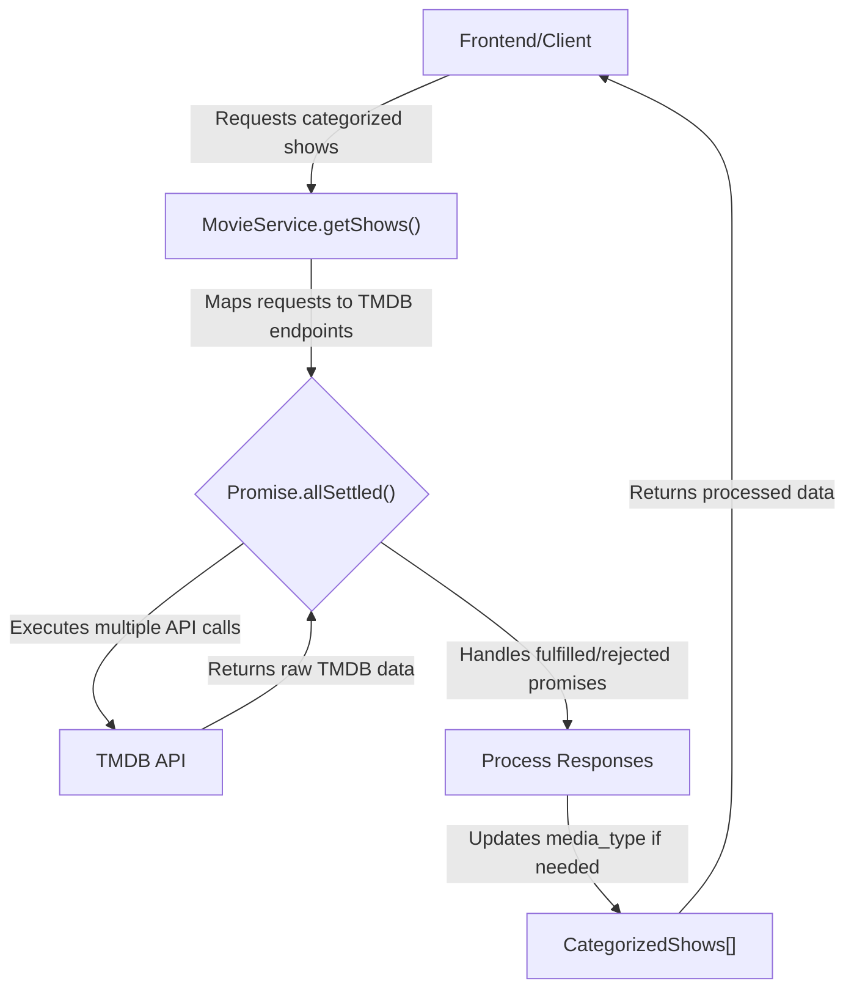

 # Data Services and Integrations

This document provides an overview of the data fetching and processing services within the application, with a particular focus on how it interacts with external APIs like The Movie Database (TMDB). These services are crucial for populating the application with dynamic content, including movie and TV show details, trending lists, and search results.

The architecture separates concerns, with a dedicated API client for TMDB, a robust `MovieService` for complex data orchestration and caching, and utility functions for direct, simpler TMDB interactions. A basic tRPC router is also included, demonstrating server-side endpoint definition.

## Core API Client

The foundation of external API interactions is established through a central `apiClient`. This file configures an Axios instance specifically for the TMDB API, ensuring all requests to TMDB use a consistent base URL.

```typescript
// src/lib/apiClient.ts
import BaseService from '@/services/BaseService';

const tmdbClient = BaseService.axios(`https://api.themoviedb.org/3/`);
export default tmdbClient;
```
This `tmdbClient` is an instance of Axios configured with the base URL for TMDB's API version 3. It leverages a `BaseService` abstraction, which likely handles common concerns such as API key injection or error handling, although its implementation is not detailed here. By exporting this pre-configured client, other services can easily make requests to TMDB without repeatedly defining the base URL.

[View on GitHub](https://github.com/lande26/LandeMon/blob/main/src/lib/apiClient.ts)

## Movie Service

The `MovieService` (`src/services/MovieService/MovieService.ts`) is the primary interface for fetching and processing movie and TV show data. It extends a `BaseService`, inheriting common functionalities like `axios` instance creation and promise handling. This service is designed to abstract away the complexities of the TMDB API, providing simplified methods for retrieving various types of content.

### Request Building and Execution

A key feature of `MovieService` is its `urlBuilder` method, which dynamically constructs TMDB API endpoints based on a defined `RequestType` enum. This allows for flexible and centralized management of different API queries, such as trending movies, top-rated series, Netflix originals, or content filtered by genre.

```typescript
// src/services/MovieService/MovieService.ts
  static urlBuilder(req: TmdbRequest) {
    switch (req.requestType) {
      case RequestType.ANIME_LATEST:
        return `/discover/${req.mediaType}?with_keywords=210024%2C&language=en-US&sort_by=primary_release_date.desc&release_date.lte=2024-11-10&with_runtime.gte=1`;
      case RequestType.TRENDING:
        return `/trending/${
          req.mediaType
        }/day?language=en-US&with_original_language=en&page=${req.page ?? 1}`;
      case RequestType.TOP_RATED:
        return `/${req.mediaType}/top_rated?page=${
          req.page ?? 1
        }&with_original_language=en&language=en-US`;
      // ... other request types
      default:
        throw new Error(
          `request type ${req.requestType} is not implemented yet`,
        );
    }
  }
```
The `urlBuilder` method is a central piece for generating specific TMDB API paths. It takes a `TmdbRequest` object, which encapsulates the `requestType`, `mediaType` (e.g., 'movie' or 'tv'), and optional parameters like `page` or `genre`. This design promotes reusability and maintainability of API endpoint configurations.

[View on GitHub](https://github.com/lande26/LandeMon/blob/main/src/services/MovieService/MovieService.ts#L80-L127)

### Data Aggregation and Caching

The `getShows` method demonstrates advanced data fetching patterns. It takes an array of `ShowRequest` objects, each specifying a type of content to fetch (e.g., "Trending Movies", "Netflix Originals"). It then uses `Promise.allSettled` to execute multiple TMDB API requests concurrently, handles success and failure cases gracefully, and aggregates the results into categorized lists.

```typescript
// src/services/MovieService/MovieService.ts
  static getShows = cache(async (requests: ShowRequest[]) => {
    const shows: CategorizedShows[] = [];
    const promises = requests.map((m) => this.executeRequest(m.req));
    const responses = await Promise.allSettled(promises);
    for (let i = 0; i < requests.length; i++) {
      const res = responses[i];
      if (this.isRejected(res)) {
        console.warn(`Failed to fetch shows ${requests[i].title}`, res.reason);
        shows.push({
          title: requests[i].title,
          shows: [],
          visible: requests[i].visible,
        });
      } else if (this.isFulfilled(res)) {
        if (
          requestTypesNeedUpdateMediaType.indexOf(requests[i].req.requestType) >
          -1
        ) {
          res.value.data.results.forEach(
            (f) => (f.media_type = requests[i].req.mediaType),
          );
        }
        shows.push({
          title: requests[i].title,
          shows: res.value.data.results,
          visible: requests[i].visible,
        });
      } else {
        throw new Error('unexpected response');
      }
    }
    return shows;
  });
```
The `getShows` method is critical for fetching multiple categories of shows simultaneously, which is typical for a dashboard or home page. The `cache` decorator (from React) is applied to this method, indicating that its results will be cached to improve performance for subsequent calls with the same arguments. This ensures that repeated requests for the same content don't trigger unnecessary API calls.

[View on GitHub](https://github.com/lande26/LandeMon/blob/main/src/services/MovieService/MovieService.ts#L143-L177)

### Detailed Content Retrieval

Beyond categorized lists, `MovieService` also provides methods for fetching specific show details by ID, differentiating between movies and TV series, and retrieving associated data like keywords or seasons.

```typescript
// src/services/MovieService/MovieService.ts
  static findMovieByIdAndType = cache(async (id: number, type: string) => {
    const params: Record<string, string> = {
      language: 'en-US',
      append_to_response: 'videos,keywords',
    };
    const response: AxiosResponse<ShowWithGenreAndVideo> = await this.axios(
      baseUrl,
    ).get<ShowWithGenreAndVideo>(`/${type}/${id}`, { params });
    return Promise.resolve(response.data);
  });
```
The `findMovieByIdAndType` method is responsible for fetching detailed information about a single movie or TV series, including its videos and keywords. The use of `append_to_response` parameter in the TMDB API call allows fetching multiple related data points in a single request, optimizing network usage. This method is also `cache`d for performance.

[View on GitHub](https://github.com/lande26/LandeMon/blob/main/src/services/MovieService/MovieService.ts#L67-L77)

### Movie Service Data Flow
The following diagram illustrates the high-level flow when the `MovieService` fetches and processes show data.





## TMDB Service Utilities

In addition to the comprehensive `MovieService`, there's a set of utility functions in `src/services/MovieService/tmdbService.ts`. These functions offer more direct, single-purpose interactions with the TMDB API, primarily utilizing the `tmdbClient` for straightforward requests. They often handle common tasks like fetching trending content, top-rated items, or performing searches with minimal abstraction.

```typescript
// src/services/MovieService/tmdbService.ts
import { type Genre } from '@/enums/genre';
import { type TmdbPagingResponse } from '@/enums/request-type';
import tmdbClient from '@/lib/apiClient';
import { type MediaType } from '@/types';

export async function getTrendingMovies(mediaType: MediaType, page: number) {
  const { data } = await tmdbClient.get<TmdbPagingResponse>(
    `/trending/${mediaType}/day?language=en-US&page=${page}`,
  );
  return data;
}

export async function searchMovies(query: string, page: number) {
  const { data } = await tmdbClient.get<TmdbPagingResponse>(
    `/search/multi?query=${encodeURIComponent(
      query,
    )}&language=en-US&page=${page}`,
  );
  data.results.sort((a, b) => {
    return b.popularity - a.popularity;
  });
  return data;
}
```
These utility functions provide a simpler, more direct way to interact with specific TMDB API endpoints. For example, `getTrendingMovies` directly fetches trending content, while `searchMovies` performs a multi-search query. Unlike `MovieService` which builds complex requests, these functions are for common, pre-defined API patterns. They directly use `tmdbClient` from `src/lib/apiClient.ts` for their HTTP requests.

[View on GitHub](https://github.com/lande26/LandeMon/blob/main/src/services/MovieService/tmdbService.ts#L7-L38)

## Server-Side Router Example

The `src/server/routers/hello.ts` file provides a basic example of a server-side tRPC procedure. While simple, it demonstrates the setup for defining API endpoints that can be called from the client-side using tRPC's type-safe query mechanisms.

```typescript
// src/server/routers/hello.ts
import { publicProcedure } from "@/server/trpc";

export const helloRouter = publicProcedure.query(() => {
  console.count("helloRouter called");
  return new Date().toISOString();
});
```
This `helloRouter` defines a simple public procedure that, when queried, logs its call count and returns the current timestamp. It serves as a minimal working example for server-side API routes within the tRPC framework, useful for health checks or basic connectivity tests.

[View on GitHub](https://github.com/lande26/LandeMon/blob/main/src/server/routers/hello.ts)

## Key Integration Points

The data services are integrated into the application through several key flows:

*   **Client-side Data Fetching**: Frontend components typically call methods from `MovieService` (e.g., `MovieService.getShows()`) to populate various sections of the UI, such as home page carousels or search results. The caching mechanisms within `MovieService` (using `React.cache`) are crucial for optimizing performance and reducing redundant API calls.
*   **Dynamic URL Construction**: The `urlBuilder` in `MovieService` is a central point for abstracting TMDB API paths, ensuring consistency and making it easier to add new content categories or modify existing ones without altering individual API calls.
*   **Error Handling**: Both `MovieService` and `tmdbService` are designed to handle potential API errors. `MovieService.getShows()` explicitly uses `Promise.allSettled` to manage individual request failures gracefully, preventing a single failed request from crashing the entire data fetching operation.
*   **Type Safety**: The extensive use of TypeScript throughout these services, including interfaces for `Show`, `TmdbPagingResponse`, `KeyWordResponse`, and `ISeason`, ensures strong type checking for API responses and service method arguments, significantly reducing runtime errors.
*   **Direct vs. Orchestrated Calls**: The existence of both `MovieService` (orchestrated, cached, complex requests) and `tmdbService.ts` (direct, simpler utility calls) allows developers to choose the appropriate level of abstraction for their data fetching needs. For aggregated data displays, `MovieService` is preferred, while specific, one-off queries might use `tmdbService` utilities directly.