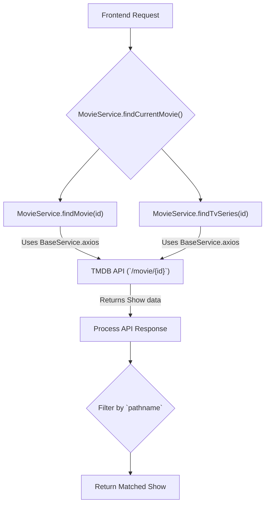

 # Data Services

The Data Services section outlines the core components responsible for handling external API interactions, specifically with The Movie Database (TMDB), and managing internal data processing. This includes a robust `BaseService` for generalized API communication, a dedicated `MovieService` for TMDB-specific operations, and a client configuration for streamlined requests.

## Architecture Overview

At the heart of our data interaction strategy is the `BaseService`, which provides a standardized `Axios` instance for making HTTP requests. This service is enhanced with request interceptors for dynamic header manipulation, such as adding API keys or tokens, and error handling. Building upon this foundation, `MovieService` extends `BaseService` to offer specialized methods for fetching movie and TV show data, handling various request types, and performing search operations. A simple `apiClient` configures the `BaseService` for the primary TMDB endpoint.

### Core Components

-   **`BaseService`**: A foundational class providing an `Axios` instance with pre-configured settings and interceptors. It handles common concerns like timeouts, base URLs, and authentication token injection.
-   **`apiClient`**: A pre-configured `Axios` instance for TMDB, created using `BaseService`, ready for immediate use.
-   **`MovieService`**: Extends `BaseService` to encapsulate all TMDB-specific data fetching logic, including methods for finding individual movies/TV series, retrieving keywords, seasons, and executing various categorized requests (e.g., trending, top-rated, genre-specific).
-   **`tmdbService`**: A collection of utility functions that leverage the `apiClient` for specific TMDB endpoints, providing direct access to common data types like trending, top-rated, and search results.

### Base Service Implementation

The `BaseService` class is designed as a non-instantiable utility class, providing static methods for creating and configuring `Axios` instances. This ensures that all API interactions benefit from consistent settings and error handling.

```typescript
// src/services/BaseService/BaseService.ts
import axios, {
  type AxiosRequestConfig,
  type AxiosError,
  type AxiosInstance,
  type InternalAxiosRequestConfig,
} from 'axios';
import { env } from '@/env.mjs';

/**
 * @class BaseService
 */
class BaseService {
  constructor() {
    if (this.constructor === BaseService) {
      throw new Error("Classes can't be instantiated.");
    }
  }

  static axios(baseUrl: string) {
    const instanceConfig: AxiosRequestConfig = this.getConfig(baseUrl);
    const instance: AxiosInstance = axios.create(instanceConfig);

    const onRequest = (
      config: InternalAxiosRequestConfig,
    ): InternalAxiosRequestConfig => {
      if (config.baseURL?.includes('themoviedb')) {
        config.headers.Authorization = `Bearer ${env.NEXT_PUBLIC_TMDB_TOKEN}`;
      }
      return config;
    };

    const onErrorResponse = (
      error: AxiosError | Error,
    ): Promise<AxiosError> => {
      console.error(`error in request: ${error.message}`);
      return Promise.reject(error);
    };

    instance.interceptors.request.use(onRequest, onErrorResponse);

    return instance;
  }
  // ... other methods
}

export default BaseService;
```

This snippet shows how `BaseService` creates an `Axios` instance with a request interceptor that automatically injects the TMDB bearer token for requests targeting the TMDB API. This centralizes authentication logic and simplifies downstream service implementations.
[View on GitHub](https://github.com/lande26/LandeMon/blob/main/src/services/BaseService/BaseService.ts#L17-L44)

The `apiClient.ts` file is a straightforward configuration that initializes the `tmdbClient` by calling the static `axios` method on `BaseService`, pointing it to the TMDB API endpoint.

```typescript
// src/lib/apiClient.ts
import BaseService from '@/services/BaseService';

const tmdbClient = BaseService.axios(`https://api.themoviedb.org/3/`);
export default tmdbClient;
```

This ensures that any service or component importing `tmdbClient` gets an `Axios` instance pre-configured with the base URL and authentication interceptor for TMDB.
[View on GitHub](https://github.com/lande26/LandeMon/blob/main/src/lib/apiClient.ts#L1-L4)

### Movie Service Functionality

The `MovieService` extends the `BaseService`, providing a layer of abstraction and specific methods for interacting with the TMDB API. It handles diverse requests, from fetching individual movie/TV show details to orchestrating complex category-based content retrieval.

```typescript
// src/services/MovieService/MovieService.ts
// ... imports
class MovieService extends BaseService {
  static async findCurrentMovie(id: number, pathname: string): Promise<Show> {
    const data = await Promise.allSettled([
      this.findMovie(id),
      this.findTvSeries(id),
    ]);
    const response = data
      .filter(this.isFulfilled)
      .map(
        (item: PromiseFulfilledResult<AxiosResponse<Show>>) => item.value?.data,
      )
      .filter((item: Show) => {
        return pathname.includes(getSlug(item.id, getNameFromShow(item)));
      });
    if (!response?.length) {
      return Promise.reject('not found');
    }
    return Promise.resolve<Show>(response[0]);
  }

  static findMovie = cache(async (id: number) => {
    return this.axios(baseUrl).get<Show>(
      `/movie/${id}?append_to_response=keywords`,
    );
  });

  static findTvSeries = cache(async (id: number) => {
    return this.axios(baseUrl).get<Show>(
      `/tv/${id}?append_to_response=keywords`,
    );
  });
  // ... other methods
}
export default MovieService;
```

The `findCurrentMovie` method demonstrates a robust approach to content retrieval by concurrently attempting to find a show as both a movie and a TV series. This flexibility is crucial for handling TMDB's `multi` search results where the media type isn't always definitively known upfront.
[View on GitHub](https://github.com/lande26/LandeMon/blob/main/src/services/MovieService/MovieService.ts#L29-L49)

A key feature of `MovieService` is its `urlBuilder` method, which dynamically constructs TMDB API endpoints based on various request types. This centralizes URL generation, reducing redundancy and ensuring correctness across different content categories.

```typescript
// src/services/MovieService/MovieService.ts
// ...
  static urlBuilder(req: TmdbRequest) {
    switch (req.requestType) {
      case RequestType.ANIME_LATEST:
        return `/discover/${req.mediaType}?with_keywords=210024%2C&language=en-US&sort_by=primary_release_date.desc&release_date.lte=2024-11-10&with_runtime.gte=1`;
      case RequestType.TRENDING:
        return `/trending/${
          req.mediaType
        }/day?language=en-US&with_original_language=en&page=${req.page ?? 1}`;
      case RequestType.NETFLIX:
        return `/discover/${
          req.mediaType
        }?with_networks=213&with_original_language=en&language=en-US&page=${
          req.page ?? 1
        }`;
      case RequestType.GENRE:
        return `/discover/${req.mediaType}?with_genres=${
          req.genre
        }&language=en-US&with_original_language=en&page=${
          req.page ?? 1
        }&without_genres=${Genre.TALK},${Genre.NEWS}`;
      // ... other cases
      default:
        throw new Error(
          `request type ${req.requestType} is not implemented yet`,
        );
    }
  }
// ...
```

This `urlBuilder` method is vital for generating specific API paths for various content categories like "Trending," "Netflix Originals," or "Anime by Genre." It ensures that all parameters are correctly included, abstracting the complexity of URL construction from the actual API call.
[View on GitHub](https://github.com/lande26/LandeMon/blob/main/src/services/MovieService/MovieService.ts#L86-L141)

### Dedicated TMDB Service Utilities

The `tmdbService.ts` file provides a collection of individual asynchronous functions that directly utilize the `tmdbClient` to fetch data from common TMDB endpoints. These functions offer a simpler, direct interface for scenarios where the full complexity of `MovieService`'s request building is not required.

```typescript
// src/services/MovieService/tmdbService.ts
import { type Genre } from '@/enums/genre';
import { type TmdbPagingResponse } from '@/enums/request-type';
import tmdbClient from '@/lib/apiClient';
import { type MediaType } from '@/types';

export async function getTrendingMovies(mediaType: MediaType, page: number) {
  const { data } = await tmdbClient.get<TmdbPagingResponse>(
    `/trending/${mediaType}/day?language=en-US&page=${page}`,
  );
  return data;
}

export async function searchMovies(query: string, page: number) {
  const { data } = await tmdbClient.get<TmdbPagingResponse>(
    `/search/multi?query=${encodeURIComponent(
      query,
    )}&language=en-US&page=${page}`,
  );
  data.results.sort((a, b) => {
    return b.popularity - a.popularity;
  });
  return data;
}
// ... other functions
```

Functions like `getTrendingMovies` and `searchMovies` provide direct access to specific TMDB data. They use the pre-configured `tmdbClient`, which already includes the base URL and authorization headers, simplifying the API call to just defining the endpoint path and parameters.
[View on GitHub](https://github.com/lande26/LandeMon/blob/main/src/services/MovieService/tmdbService.ts#L6-L12) and [View on GitHub](https://github.com/lande26/LandeMon/blob/main/src/services/MovieService/tmdbService.ts#L43-L52)

## Data Flow for Movie/TV Show Retrieval

The following diagram illustrates a simplified data flow for retrieving movie or TV show details from the TMDB API, highlighting the interaction between the application's components and the external service.





## Key Integration Points

### Centralized API Client Configuration

The `apiClient.ts` serves as a single source of truth for the TMDB API base URL and ensures that all requests originating from this client automatically include necessary authentication headers via the `BaseService` interceptor. This greatly simplifies client-side service implementations by abstracting away authentication concerns.

### Request Caching for Performance

Both `MovieService.findMovie`, `MovieService.findTvSeries`, `MovieService.findMovieByIdAndType`, `MovieService.getShows`, and `MovieService.searchMovies` leverage React's `cache` utility. This ensures that repeated requests for the same data within a render cycle or across server-side rendering (SSR) are optimized, preventing redundant API calls and improving application performance.

```typescript
// src/services/MovieService/MovieService.ts
// ...
  static findMovie = cache(async (id: number) => {
    return this.axios(baseUrl).get<Show>(
      `/movie/${id}?append_to_response=keywords`,
    );
  });
// ...
  static getShows = cache(async (requests: ShowRequest[]) => {
    // ...
  });
// ...
```

Wrapping API calls with `cache` is a simple yet powerful optimization for data fetching functions, especially in React environments where data might be requested multiple times.
[View on GitHub](https://github.com/lande26/LandeMon/blob/main/src/services/MovieService/MovieService.ts#L51-L55) and [View on GitHub](https://github.com/lande26/LandeMon/blob/main/src/services/MovieService/MovieService.ts#L159-L189)

### Robust Error Handling

The `BaseService` includes a global `onErrorResponse` interceptor that logs API errors. This provides a centralized mechanism for monitoring and debugging API-related issues, ensuring that network failures or invalid responses are consistently handled across all services that use `BaseService`.

```typescript
// src/services/BaseService/BaseService.ts
// ...
    const onErrorResponse = (
      error: AxiosError | Error,
    ): Promise<AxiosError> => {
      console.error(`error in request: ${error.message}`);
      return Promise.reject(error);
    };

    instance.interceptors.request.use(onRequest, onErrorResponse);
// ...
```

This interceptor provides a single point for logging and rejecting erroneous API responses, standardizing error handling.
[View on GitHub](https://github.com/lande26/LandeMon/blob/main/src/services/BaseService/BaseService.ts#L36-L41)

### Categorized Show Request Processing

The `MovieService.getShows` method handles multiple show requests concurrently using `Promise.allSettled`. This design allows for fetching various categories of shows (e.g., trending, popular, genre-specific) in parallel, enhancing efficiency. It also includes logic to adjust `media_type` if necessary, ensuring data consistency.

```typescript
// src/services/MovieService/MovieService.ts
// ...
  static getShows = cache(async (requests: ShowRequest[]) => {
    const shows: CategorizedShows[] = [];
    const promises = requests.map((m) => this.executeRequest(m.req));
    const responses = await Promise.allSettled(promises);
    for (let i = 0; i < requests.length; i++) {
      const res = responses[i];
      if (this.isRejected(res)) {
        console.warn(`Failed to fetch shows ${requests[i].title}`, res.reason);
        shows.push({
          title: requests[i].title,
          shows: [],
          visible: requests[i].visible,
        });
      } else if (this.isFulfilled(res)) {
        if (
          requestTypesNeedUpdateMediaType.indexOf(requests[i].req.requestType) >
          -1
        ) {
          res.value.data.results.forEach(
            (f) => (f.media_type = requests[i].req.mediaType),
          );
        }
        shows.push({
          title: requests[i].title,
          shows: res.value.data.results,
          visible: requests[i].visible,
        });
      } else {
        throw new Error('unexpected response');
      }
    }
    return shows;
  });
// ...
```

This method efficiently retrieves multiple categories of shows, handles individual request failures gracefully, and ensures data consistency by updating the `media_type` where necessary.
[View on GitHub](https://github.com/lande26/LandeMon/blob/main/src/services/MovieService/MovieService.ts#L159-L189)

### Best Practices

-   **Abstraction**: The layered approach (BaseService -> MovieService/tmdbService) provides clear separation of concerns, making the codebase modular and easier to maintain.
-   **Static Methods**: Using static methods for `BaseService` and `MovieService` ensures utility-like behavior, preventing unnecessary class instantiations and promoting functional programming paradigms.
-   **Environment Variables**: API keys and tokens are loaded from environment variables (`env.mjs`), ensuring sensitive information is not hardcoded and can be managed securely.
-   **`Promise.allSettled`**: For fetching multiple, independent data sets, `Promise.allSettled` is used over `Promise.all` to ensure that even if one request fails, others can still resolve, preventing a single failure from blocking the entire operation.
-   **Type Safety**: Extensive use of TypeScript interfaces and types (`Show`, `TmdbPagingResponse`, `MediaType`) ensures strong type checking throughout the data services, leading to fewer runtime errors and improved code quality.