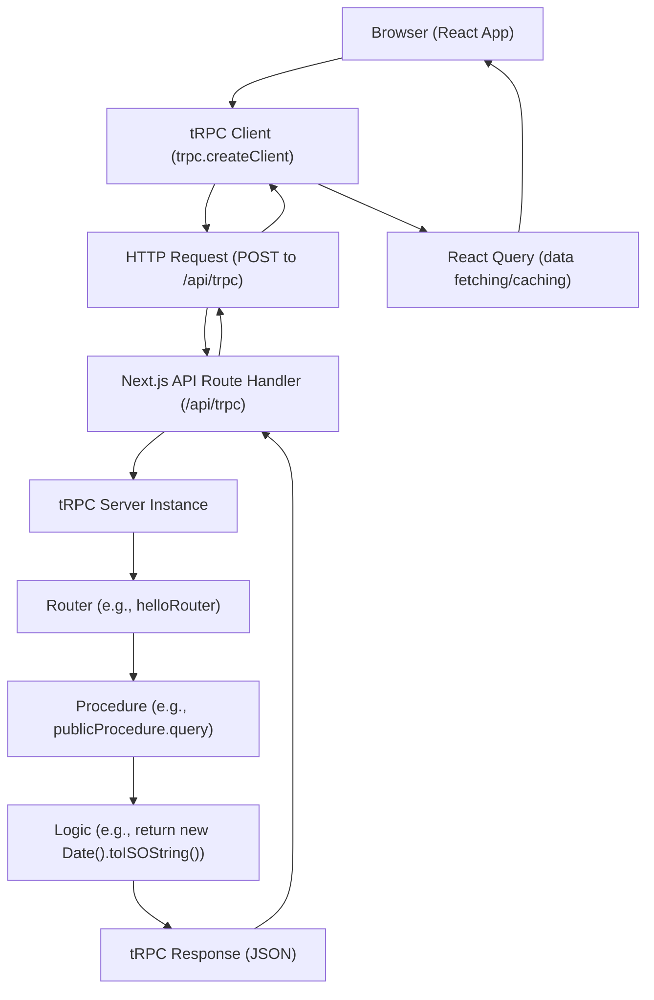

# tRPC Configuration

This section details the configuration and usage of tRPC within LandeMon, facilitating seamless backend-frontend interaction. tRPC provides a type-safe way to communicate between your Next.js frontend and your backend API, leveraging React Query for efficient data fetching and state management.

## tRPC Client Setup

The tRPC client is initialized in `src/client/trpc-provider.tsx`. This component wraps your application, providing the tRPC client and a React Query client to all its descendants.

The `trpc.createClient` function configures the client with essential links:

-   **`loggerLink`**: Logs tRPC requests and responses, particularly useful for debugging in development mode or when errors occur.
-   **`httpBatchLink`**: Handles sending requests to the tRPC API endpoint. It automatically batches requests for better performance.

The `getBaseUrl` function dynamically determines the correct API URL based on the environment (development, Vercel deployment, or other SSR environments).

```tsx
// src/client/trpc-provider.tsx
import { QueryClient, QueryClientProvider } from "@tanstack/react-query";
import { httpBatchLink, loggerLink } from "@trpc/client";
import { useState } from "react";
import superjson from "superjson";
import { trpc } from "@/client/trpc";
import { ReactQueryDevtools } from "@tanstack/react-query-devtools";

export const TrpcProvider: React.FC<{ children: React.ReactNode }> = ({
  children,
}) => {
  const [queryClient] = useState(
    () =>
      new QueryClient({
        defaultOptions: {
          queries: { staleTime: 5000, refetchOnWindowFocus: false },
        },
      }),
  );

  const getBaseUrl = () => {
    if (typeof window !== "undefined") return ""; // browser should use relative url
    if (process.env.VERCEL_URL) return `https://${process.env.VERCEL_URL}`; // SSR should use vercel url
    return `http://localhost:${process.env.PORT ?? 3000}`; // dev SSR should use localhost
  };

  const [trpcClient] = useState(() =>
    trpc.createClient({
      links: [
        loggerLink({
          enabled: (opts) =>
            process.env.NODE_ENV === "development" ||
            (opts.direction === "down" && opts.result instanceof Error),
        }),
        httpBatchLink({
          url: `${getBaseUrl()}/api/trpc`,
        }),
      ],
      transformer: superjson,
    }),
  );
  return (
    <trpc.Provider client={trpcClient} queryClient={queryClient}>
      <QueryClientProvider client={queryClient}>
        {children}
        <ReactQueryDevtools />
      </QueryClientProvider>
    </trpc.Provider>
  );
};
```

## tRPC React Hooks

`src/client/trpc.ts` exports the `trpc` object, which is a strongly-typed instance of `createTRPCReact`. This object provides type-safe React Query hooks that mirror your tRPC API routes.

```tsx
// src/client/trpc.ts
/**
 * This is the client-side entrypoint for your tRPC API. It is used to create the `api` object which
 * contains the Next.js App-wrapper, as well as your type-safe React Query hooks.
 *
 * We also create a few inference helpers for input and output types.
 */

import { type AppRouter } from "@/server/index";
import { createTRPCReact } from "@trpc/react-query";

/** A set of type-safe react-query hooks for your tRPC API. */
export const trpc = createTRPCReact<AppRouter>({});
```

## Server-Side API Definition

The server-side tRPC API is defined using routers. For example, `src/server/routers/hello.ts` defines a simple `helloRouter` with a `publicProcedure` that returns the current ISO date string.

```tsx
// src/server/routers/hello.ts
import { publicProcedure } from "@/server/trpc";

export const helloRouter = publicProcedure.query(() => {
  console.count("helloRouter called");
  return new Date().toISOString();
});
```

## Architecture Overview

The following diagram illustrates the flow of a tRPC request from the client to the server and back.





## Key Takeaways

*   tRPC ensures type safety between your frontend and backend API calls.
*   `QueryClientProvider` and `trpc.Provider` are essential for initializing React Query and tRPC.
*   `httpBatchLink` is used for efficient request handling.
*   `loggerLink` is invaluable for debugging tRPC requests.
*   The `trpc` object from `src/client/trpc.ts` exposes type-safe hooks for interacting with your API.