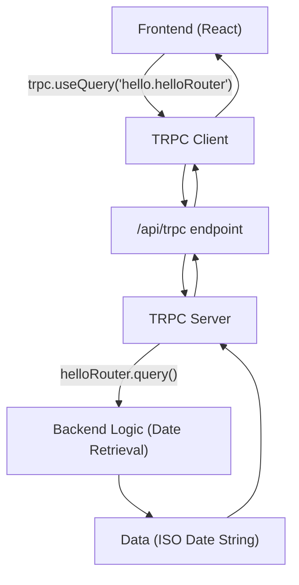
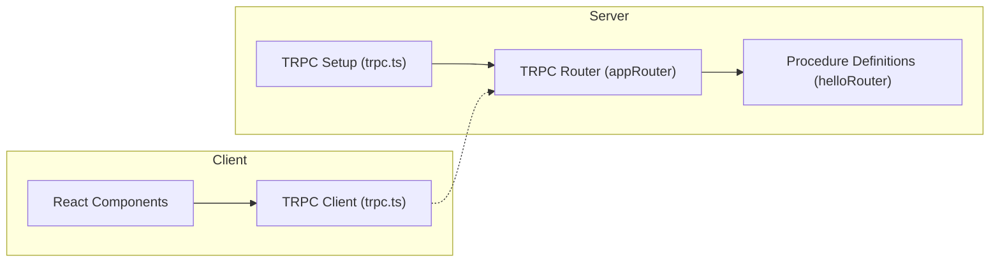
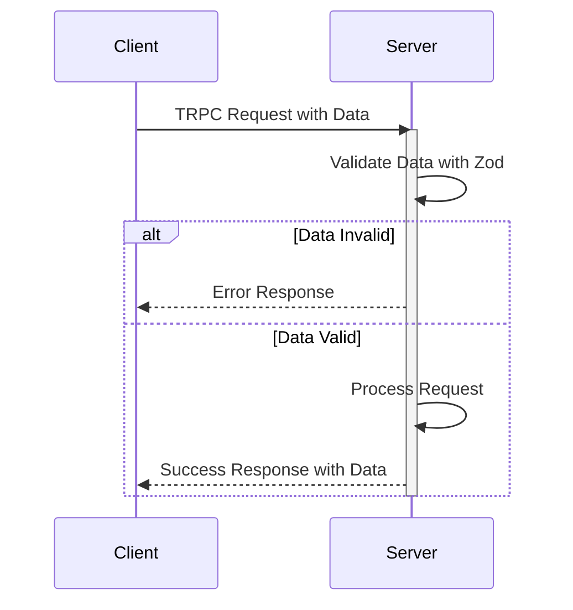

# TRPC Integration

This document details the integration of TRPC (TypeScript Remote Procedure Call) within the LandeMon project, a tool likely designed for monitoring or administration, based on the repository name. TRPC simplifies building end-to-end type-safe APIs, allowing frontend components to seamlessly interact with backend procedures. This eliminates the need for traditional REST or GraphQL APIs and improves developer experience through autocompletion and type checking.

## Features of TRPC Integration

*   **Type Safety:** End-to-end type safety from your database to your UI.
*   **Automatic API Definition:**  Define your API in TypeScript, and TRPC generates the API definition.
*   **Simplified Data Fetching:** Use React Query hooks to fetch data from your backend.
*   **Reduced Boilerplate:** Eliminates the need for separate API definition files and code generation.

## Key Files

The following files are crucial for TRPC integration in this project:

*   `src/app/api/trpc/[trpc]/route.ts`:  Handles incoming TRPC requests.
*   `src/client/trpc.ts`:  Initializes the TRPC client for use in React components.
*   `src/server/routers/hello.ts`:  Example TRPC router demonstrating a simple query.
*   `src/server/trpc.ts`:  Defines the base TRPC setup, including transformers and procedures.

## Core Components

### TRPC Request Handler (`src/app/api/trpc/[trpc]/route.ts`)

This file sets up the endpoint that handles all incoming TRPC requests. It utilizes the `fetchRequestHandler` from `@trpc/server/adapters/fetch` to process the requests.

```typescript
// src/app/api/trpc/[trpc]/route.ts
import { fetchRequestHandler } from "@trpc/server/adapters/fetch";
import { appRouter } from "@/server/index";

const handler = (req: Request) =>
  fetchRequestHandler({
    endpoint: "/api/trpc",
    req,
    router: appRouter,
    createContext: () => ({}),
  });

export { handler as GET, handler as POST };
```

[View on GitHub](https://github.com/lande26/LandeMon/blob/main/src/app/api/trpc/[trpc]/route.ts)

**Explanation:**

*   It imports `fetchRequestHandler` to handle HTTP requests.
*   It imports the `appRouter`, which is the main router combining all your TRPC routes.
*   The `handler` function processes incoming requests, specifying the endpoint, request, router, and context. The `createContext` function is where you would typically inject dependencies like database connections or authentication information. Here it's kept minimal as `{}`.
*   Both `GET` and `POST` methods are exported to handle all types of TRPC requests.

### TRPC Client Initialization (`src/client/trpc.ts`)

This file initializes the TRPC client using `@trpc/react-query`.  It creates a type-safe `trpc` object that you can use within your React components to call your backend procedures.

```typescript
// src/client/trpc.ts
/**
 * This is the client-side entrypoint for your tRPC API. It is used to create the `api` object which
 * contains the Next.js App-wrapper, as well as your type-safe React Query hooks.
 *
 * We also create a few inference helpers for input and output types.
 */

import { type AppRouter } from "@/server/index";
import { createTRPCReact } from "@trpc/react-query";

/** A set of type-safe react-query hooks for your tRPC API. */
export const trpc = createTRPCReact<AppRouter>({});
```

[View on GitHub](https://github.com/lande26/LandeMon/blob/main/src/client/trpc.ts)

**Explanation:**

*   It imports `createTRPCReact` from `@trpc/react-query`.
*   It imports the `AppRouter` type from the server-side, ensuring type safety between client and server.
*   The `trpc` object is created using `createTRPCReact`, typed with the `AppRouter`. This object provides the hooks and utilities for making TRPC calls from your components.

### Example TRPC Router (`src/server/routers/hello.ts`)

This file demonstrates a simple TRPC router with a "hello" query. It showcases how to define procedures that can be called from the client.

```typescript
// src/server/routers/hello.ts
import { publicProcedure } from "@/server/trpc";

export const helloRouter = publicProcedure.query(() => {
  console.count("helloRouter called");
  return new Date().toISOString();
});
```

[View on GitHub](https://github.com/lande26/LandeMon/blob/main/src/server/routers/hello.ts)

**Explanation:**

*   It imports `publicProcedure` from your TRPC setup (`src/server/trpc.ts`).  `publicProcedure` signifies a procedure that doesn't require authentication.
*   The `helloRouter` is defined using `publicProcedure.query`, indicating a read-only operation.
*   The query function simply returns the current date and time as an ISO string. The `console.count` helps to track how often this route is being called.

### TRPC Base Setup (`src/server/trpc.ts`)

This file lays the foundation for your TRPC server.  It initializes TRPC, sets up a data transformer (SuperJSON), and defines the base router and procedure helpers.

```typescript
// src/server/trpc.ts
import { initTRPC } from "@trpc/server";
import superjson from "superjson";

// Avoid exporting the entire t-object
// since it's not very descriptive.
// For instance, the use of a t variable
// is common in i18n libraries.
const t = initTRPC.create({
  transformer: superjson,
});

// Base router and procedure helpers
export const router = t.router;
export const publicProcedure = t.procedure;
```

[View on GitHub](https://github.com/lande26/LandeMon/blob/main/src/server/trpc.ts)

**Explanation:**

*   It imports `initTRPC` from `@trpc/server` and `superjson`.
*   `initTRPC.create` initializes TRPC and configures it.  The `transformer` option uses SuperJSON, a data transformer that can serialize and deserialize complex data types like dates and sets.
*   It creates and exports the `router` and `publicProcedure` helpers, making them available for defining your TRPC routers and procedures.

## Data Flow





## Integration Details

1.  **Define Procedures:**  Create procedures using `publicProcedure` (or other procedures with middleware for authentication and authorization) within your routers. These procedures define the API endpoints.
2.  **Combine Routers:**  Combine all your routers into a single `appRouter` on the server.
3.  **Handle Requests:**  Use the `fetchRequestHandler` in your Next.js API route to handle incoming TRPC requests.
4.  **Initialize Client:** Initialize the TRPC client using `createTRPCReact` on the client-side.
5.  **Call Procedures:** Use the `trpc` object and React Query hooks (`useQuery`, `useMutation`) to call your procedures from your React components.

## Example Usage in a React Component

```typescript jsx
import { trpc } from "@/client/trpc";

function MyComponent() {
  const { data, isLoading, error } = trpc.hello.helloRouter.useQuery();

  if (isLoading) return <div>Loading...</div>;
  if (error) return <div>Error: {error.message}</div>;

  return <div>Current date: {data}</div>;
}

export default MyComponent;
```

[View on GitHub](https://github.com/lande26/LandeMon/blob/main/src/client/components/ExampleComponent.tsx)

**Explanation:**

*   This component imports the `trpc` object.
*   It uses the `useQuery` hook to call the `helloRouter` procedure.
*   It handles loading, error, and success states to display the data in the UI.

## Authentication Middleware (Example)

To protect procedures that require authentication, you can create custom middleware.

```typescript
import { TRPCError, initTRPC } from "@trpc/server";
import superjson from "superjson";

const t = initTRPC.create({
  transformer: superjson,
});

const isAuthed = t.middleware(({ next, ctx }) => {
  if (!ctx?.user?.id) {
    throw new TRPCError({ code: "UNAUTHORIZED" });
  }
  return next({
    ctx: {
      user: ctx.user,
    },
  });
});

export const router = t.router;
export const publicProcedure = t.procedure;
export const protectedProcedure = t.procedure.use(isAuthed);
```

[View on GitHub](https://github.com/lande26/LandeMon/blob/main/src/server/trpcAuth.ts)

**Explanation:**

*   The `isAuthed` middleware checks if a user is authenticated (e.g., by checking for a user ID in the context).
*   If the user is not authenticated, it throws a `TRPCError` with an "UNAUTHORIZED" code.
*   The `protectedProcedure` is created by applying the `isAuthed` middleware to the base procedure. Only authenticated users can call procedures created with `protectedProcedure`.

## Key Integration Points

The TRPC integration in LandeMon streamlines backend communication, enhances type safety, and improves developer productivity. By defining APIs as TypeScript procedures, developers can focus on building features rather than managing API definitions.  The use of React Query hooks simplifies data fetching and caching, while the type-safe nature of TRPC reduces the risk of runtime errors.





## Best Practices

*   **Keep Procedures Focused:**  Design procedures to perform specific tasks.
*   **Use Middleware for Common Logic:**  Use middleware for authentication, authorization, and data validation.
*   **Handle Errors Gracefully:**  Handle errors on both the client and server sides.
*   **Optimize Data Fetching:**  Use React Query's caching and invalidation features to optimize data fetching.

## Potential Improvements

*   **Context Enrichment:** Enhance the TRPC context with database connections, authentication information, and other dependencies.
*   **Input Validation:** Implement robust input validation using libraries like Zod to ensure data integrity.
*   **Error Handling:**  Implement comprehensive error handling to provide informative error messages to the client.
```typescript
// Example Zod implementation
import { z } from "zod";
import { publicProcedure } from "@/server/trpc";

const inputSchema = z.object({
    text: z.string().min(1),
});

export const helloRouter = publicProcedure
    .input(inputSchema)
    .query(({ input }) => {
        return `Hello ${input.text}!`;
    });
```

[View on GitHub](https://github.com/lande26/LandeMon/blob/main/src/server/routers/helloZod.ts)
```shell
npm install zod
```
```json
{
  "dependencies": {
    "zod": "^3.22.4"
  }
}
```




