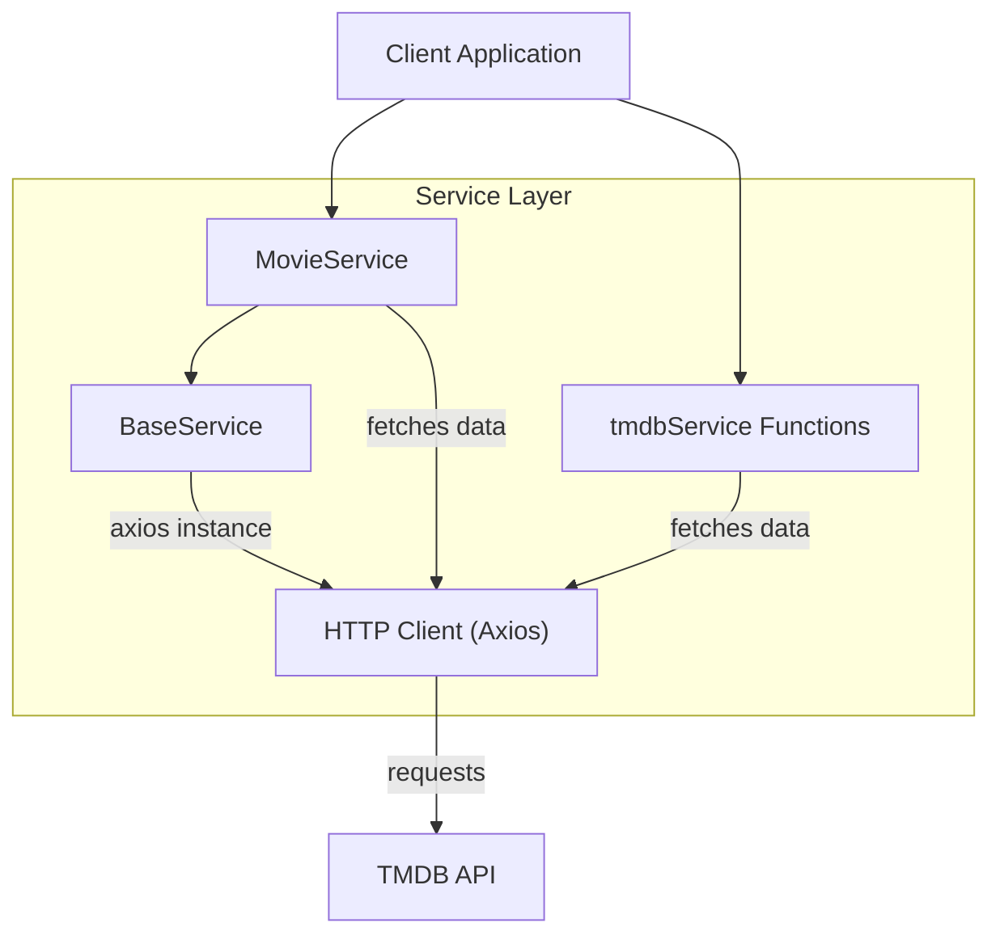

# Service Layer

This section details the service layer responsible for interacting with external APIs, primarily The Movie Database (TMDB), and encapsulating the business logic for data retrieval and manipulation within the LandeMon application.

## Base Service

The `BaseService` class provides a foundational layer for all service classes, abstracting common functionalities such as HTTP client configuration and request interceptors. It ensures consistent API interaction across the application.

The `BaseService` cannot be instantiated directly, enforcing its use as a base class.

```typescript
/**
 * @class BaseService
 */
class BaseService {
  constructor() {
    if (this.constructor === BaseService) {
      throw new Error("Classes can't be instantiated.");
    }
  }

  static axios(baseUrl: string) {
    const instanceConfig: AxiosRequestConfig = this.getConfig(baseUrl);
    const instance: AxiosInstance = axios.create(instanceConfig);

    const onRequest = (
      config: InternalAxiosRequestConfig,
    ): InternalAxiosRequestConfig => {
      if (config.baseURL?.includes('themoviedb')) {
        config.headers.Authorization = `Bearer ${env.NEXT_PUBLIC_TMDB_TOKEN}`;
      }
      return config;
    };

    const onErrorResponse = (
      error: AxiosError | Error,
    ): Promise<AxiosError> => {
      console.error(`error in request: ${error.message}`);
      return Promise.reject(error);
    };

    instance.interceptors.request.use(onRequest, onErrorResponse);

    return instance;
  }

  static getConfig(baseUrl: string): AxiosRequestConfig {
    return {
      timeout: 15000,
      baseURL: baseUrl,
      responseType: 'json',
      maxContentLength: 100000,
      validateStatus: (status: number) => status >= 200 && status < 300,
      maxRedirects: 5,
    };
  }

  static isRejected = (
    input: PromiseSettledResult<unknown>,
  ): input is PromiseRejectedResult => input.status === 'rejected';

  static isFulfilled = <T>(
    input: PromiseSettledResult<T>,
  ): input is PromiseFulfilledResult<T> => input.status === 'fulfilled';
}

export default BaseService;
```

The `axios` static method creates an Axios instance configured with common settings and includes interceptors for requests. Specifically, it appends the TMDB API token to the `Authorization` header for requests targeting 'themoviedb'.

## Movie Service

The `MovieService` class extends `BaseService` and provides a comprehensive set of methods for fetching movie and TV series data from TMDB. It utilizes caching (`react`'s `cache` decorator) for frequently accessed data to improve performance.

Key functionalities include:

*   **Fetching Specific Movies/TV Series**: `findMovie` and `findTvSeries` retrieve details for a given ID. `findCurrentMovie` attempts to fetch both movie and TV series data and filters based on the current path.
*   **Fetching Related Data**: `getKeywords` and `getSeasons` are available for retrieving additional metadata.
*   **Dynamic Request Building**: `urlBuilder` constructs TMDB API endpoints based on various request types (e.g., trending, top-rated, genre-specific, Netflix originals).
*   **Batch Data Fetching**: `getShows` allows fetching multiple categorized lists of shows concurrently using `Promise.allSettled`.
*   **Search Functionality**: `searchMovies` enables searching for movies and TV series across the TMDB API.

```typescript
import { getNameFromShow, getSlug } from '@/lib/utils';
import type {
  CategorizedShows,
  ISeason,
  KeyWordResponse,
  MediaType,
  Show,
  ShowWithGenreAndVideo,
} from '@/types';
import { type AxiosResponse } from 'axios';
import BaseService from '../BaseService/BaseService';
import {
  RequestType,
  type ShowRequest,
  type TmdbPagingResponse,
  type TmdbRequest,
} from '@/enums/request-type';
import { Genre } from '@/enums/genre';
import { cache } from 'react';

const baseUrl = 'https://api.themoviedb.org/3';

class MovieService extends BaseService {
  // ... other methods

  static urlBuilder(req: TmdbRequest) {
    switch (req.requestType) {
      case RequestType.ANIME_LATEST:
        return `/discover/${req.mediaType}?with_keywords=210024%2C&language=en-US&sort_by=primary_release_date.desc&${
          req.mediaType === 'movie' ? 'release_date' : 'air_date'
        }.lte=2024-11-10&with_runtime.gte=1`;
      case RequestType.TRENDING:
        return `/trending/${
          req.mediaType
        }/day?language=en-US&with_original_language=en&page=${req.page ?? 1}`;
      // ... other cases
      default:
        throw new Error(
          `request type ${req.requestType} is not implemented yet`,
        );
    }
  }

  static executeRequest(req: {
    requestType: RequestType;
    mediaType: MediaType;
    page?: number;
  }) {
    return this.axios(baseUrl).get<TmdbPagingResponse>(this.urlBuilder(req));
  }

  static getShows = cache(async (requests: ShowRequest[]) => {
    const shows: CategorizedShows[] = [];
    const promises = requests.map((m) => this.executeRequest(m.req));
    const responses = await Promise.allSettled(promises);
    // ... processing responses
    return shows;
  });

  static searchMovies = cache(async (query: string, page?: number) => {
    const { data } = await this.axios(baseUrl).get<TmdbPagingResponse>(
      `/search/multi?query=${encodeURIComponent(query)}&language=en-US&page=${
        page ?? 1
      }`,
    );

    data.results.sort((a, b) => {
      return b.popularity - a.popularity;
    });
    return data;
  });
}

export default MovieService;
```

## TMDB Service

The `tmdbService.ts` file contains a set of standalone asynchronous functions that abstract common TMDB API calls. These functions are intended to be used as utility functions for fetching specific types of data, such as trending movies, top-rated movies, Netflix originals, and popular movies, as well as performing genre-based queries and searching. They directly use a pre-configured `tmdbClient` (presumably an Axios instance) for making requests.

```typescript
// src/services/MovieService/tmdbService.ts
import { type Genre } from '@/enums/genre';
import { type TmdbPagingResponse } from '@/enums/request-type';
import tmdbClient from '@/lib/apiClient'; // Assuming tmdbClient is configured elsewhere
import { type MediaType } from '@/types';

export async function getTrendingMovies(mediaType: MediaType, page: number) {
  const { data } = await tmdbClient.get<TmdbPagingResponse>(
    `/trending/${mediaType}/day?language=en-US&page=${page}`,
  );
  return data;
}

export async function getTopRatedMovies(mediaType: MediaType, page: number) {
  const { data } = await tmdbClient.get<TmdbPagingResponse>(
    `/${mediaType}/top_rated?page=${page}&language=en-US`,
  );
  data.results.forEach((movie) => (movie.media_type = mediaType));
  return data;
}

// ... other functions like getNetflixOriginals, getPopularMovies, etc.
```

## Architecture Overview

The service layer follows a hierarchical structure, with `BaseService` providing common utilities and `MovieService` building upon it to handle specific TMDB API interactions. The `tmdbService.ts` file offers a functional approach for direct API access, complementing the class-based structure of `MovieService`. This separation of concerns ensures maintainability and testability.

## Mermaid Diagram





## Key Takeaways

*   The `BaseService` handles common HTTP client configuration and request interceptors.
*   `MovieService` encapsulates complex data fetching logic for movies and TV series, employing caching for performance.
*   `tmdbService.ts` provides utility functions for direct TMDB API interactions.
*   The service layer is designed for scalability and maintainability, separating concerns effectively.
*   Authentication with TMDB is managed via API tokens injected through request interceptors.