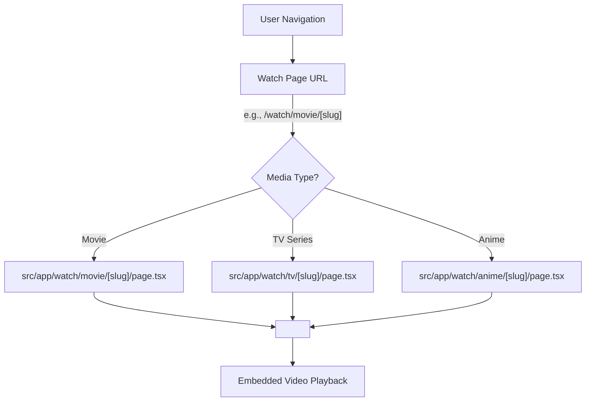
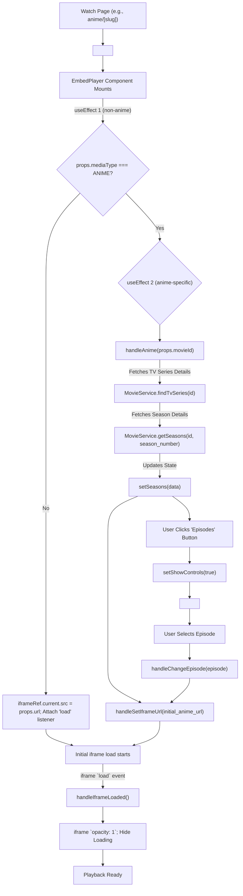

 # Watch Pages and Player

This document outlines the architecture and functionality of the dedicated content watching pages and the core `EmbedPlayer` component. These pages are responsible for rendering an embedded video player for movies, TV series, and anime, providing a seamless viewing experience within the application.

## Overview of Watch Pages

The application utilizes dynamic routing to create specific watch pages for different media types. Each page (`movie`, `tv`, `anime`) is responsible for extracting the necessary content identifier from the URL slug and passing it to the central `EmbedPlayer` component, which then handles the actual video embedding and playback.

These pages are designed to be light-weight wrappers around the `EmbedPlayer`, focusing primarily on URL parsing and initial player setup.

<br />





<br />

### Movie Watch Page

The movie watch page handles the display of individual movies. It extracts the movie ID from the URL slug and constructs the appropriate embed URL for the `EmbedPlayer`.

**File:** `src/app/watch/movie/[slug]/page.tsx`

```tsx
import React from 'react';
import EmbedPlayer from '@/components/watch/embed-player';

export const revalidate = 3600; // Revalidate data every hour

export default function Page({ params }: { params: { slug: string } }) {
  const id = params.slug.split('-').pop(); // Extracts ID from 'title-12345' slug
  return <EmbedPlayer url={`https://vidsrc.cc/v2/embed/movie/${id}`} />;
}
```

[View on GitHub](https://github.com/lande26/LandeMon/blob/main/src/app/watch/movie/[slug]/page.tsx)

*   **Slug Parsing**: The `slug` parameter in the URL (e.g., `/watch/movie/my-movie-title-12345`) is split to extract the numerical ID. This ID is typically a TMDB (The Movie Database) identifier.
*   **`EmbedPlayer` Integration**: The `EmbedPlayer` component is rendered, receiving a dynamically constructed `url` prop pointing to the `vidsrc.cc` embed service for movies.
*   **`revalidate`**: The `revalidate = 3600` export ensures that the page's data (if any server-side fetching were to be added, though not explicitly shown in this snippet for this simple wrapper) is revalidated at most once every hour.

### TV Series Watch Page

Similar to the movie page, the TV series watch page handles individual TV show episodes. It follows the same pattern for slug parsing and `EmbedPlayer` integration.

**File:** `src/app/watch/tv/[slug]/page.tsx`

```tsx
import React from 'react';
import EmbedPlayer from '@/components/watch/embed-player';

export const revalidate = 3600; // Revalidate data every hour

export default function Page({ params }: { params: { slug: string } }) {
  const id = params.slug.split('-').pop(); // Extracts ID from 'tv-series-title-67890' slug
  return <EmbedPlayer url={`https://vidsrc.cc/v2/embed/tv/${id}`} />;
}
```

[View on GitHub](https://github.com/lande26/LandeMon/blob/main/src/app/watch/tv/[slug]/page.tsx)

*   **Slug Parsing**: Extracts the TV series ID from the `slug`.
*   **`EmbedPlayer` Integration**: Passes an embed URL specific to TV series on `vidsrc.cc`.

### Anime Watch Page

The anime watch page is slightly more complex, as it needs to handle both the base anime ID and potentially specific episode numbers. It also leverages the `mediaType` prop for `EmbedPlayer` to trigger anime-specific logic.

**File:** `src/app/watch/anime/[slug]/page.tsx`

```tsx
import React from 'react';
import EmbedPlayer from '@/components/watch/embed-player';
import { MediaType } from '@/types'; // Enum for media types

export const revalidate = 3600; // Revalidate data every hour

export default function Page({ params }: { params: { slug: string } }) {
  const id = params.slug.split('-').pop(); // Extracts ID, e.g., from 'anime-title-t-12345'
  const movieId: string | undefined = params.slug.split('/').pop(); // Gets the full 't-12345' part
  return (
    <EmbedPlayer
      movieId={movieId} // Passes the full ID for anime-specific handling
      mediaType={movieId?.includes('t') ? MediaType.ANIME : undefined} // Identifies as ANIME
      url={`https://vidsrc.cc/v2/embed/anime/tmdb${id}/1/sub?autoPlay=false`} // Initial embed URL for anime
    />
  );
}
```

[View on GitHub](https://github.com/lande26/LandeMon/blob/main/src/app/watch/anime/[slug]/page.tsx)

*   **Slug Parsing**: It extracts two identifiers: `id` (the raw TMDB ID) and `movieId` (the full slug part, often prefixed with 't-' for TV/anime IDs, used internally by `EmbedPlayer`).
*   **`EmbedPlayer` Integration**:
    *   `movieId`: The full `movieId` (e.g., `t-12345`) is passed to `EmbedPlayer`.
    *   `mediaType`: Set to `MediaType.ANIME` to signal the player to activate its anime-specific episode fetching and control logic.
    *   `url`: An initial embed URL is provided, usually pointing to the first episode (or general series playback) for `vidsrc.cc`. The `EmbedPlayer` will update this as episodes are selected.

## The `EmbedPlayer` Component

The `EmbedPlayer` component (`src/components/watch/embed-player.tsx`) is the heart of the watch functionality. It's a client-side component responsible for rendering the `iframe` that embeds external video content, handling loading states, and (for anime) managing season and episode selection.

**File:** `src/components/watch/embed-player.tsx`

```tsx
'use client'; // Marks this component as client-side

import React from 'react';
import Loading from '../ui/loading'; // Loading spinner component
import { useRouter } from 'next/navigation'; // Next.js router for navigation
import { MediaType, type IEpisode, type ISeason, type Show } from '@/types'; // Custom types
import MovieService from '@/services/MovieService'; // API service for movie/TV data
import { type AxiosResponse } from 'axios'; // Axios type for API responses
import Season from '../season'; // Component to display seasons and episodes

interface EmbedPlayerProps {
  url: string; // Initial embed URL
  movieId?: string; // ID for anime/TV series, used for fetching seasons
  mediaType?: MediaType; // Type of media, e.g., ANIME
}

function EmbedPlayer(props: EmbedPlayerProps) {
  const router = useRouter(); // Initialize Next.js router

  const [seasons, setSeasons] = React.useState<ISeason[] | null>(null); // State for seasons data
  const [showControls, setShowControls] = React.useState(false); // State to toggle season/episode controls

  const loadingRef = React.useRef<HTMLDivElement>(null); // Ref for loading indicator
  const iframeRef = React.useRef<HTMLIFrameElement>(null); // Ref for the iframe element

  // Effect for initial setup and non-anime media types
  React.useEffect(() => {
    if (props.mediaType === MediaType.ANIME) {
      return; // Anime handled by a separate effect
    }
    if (iframeRef.current) {
      iframeRef.current.src = props.url; // Set initial iframe src
    }

    const { current } = iframeRef;
    const iframe: HTMLIFrameElement | null = current;
    iframe?.addEventListener('load', handleIframeLoaded); // Listen for iframe load
    return () => {
      iframe?.removeEventListener('load', handleIframeLoaded); // Cleanup
    };
  }, [props.mediaType, props.url]); // Re-run if mediaType or url changes

  // Effect for anime-specific logic (fetching seasons/episodes)
  React.useEffect(() => {
    if (!props.movieId || props.mediaType !== MediaType.ANIME) {
      return; // Only run for anime with a movieId
    }

    void handleAnime(props.movieId); // Initiate anime data fetching
  }, [props.movieId, props.mediaType]); // Re-run if movieId or mediaType changes

  const handleChangeEpisode = (episode: IEpisode): void => {
    const { show_id: id, episode_number: eps } = episode;
    // Construct new URL for selected episode and update iframe
    handleSetIframeUrl(`https://vidsrc.cc/v2/embed/anime/tmdb${id}/${eps}/sub`);
  };

  const handleAnime = async (movieId: string) => {
    const id = Number(movieId.replace('t-', '')); // Clean movieId to get TMDB ID
    const response: AxiosResponse<Show> = await MovieService.findTvSeries(id); // Fetch TV series details
    const { data } = response;
    if (!data?.seasons?.length) {
      return;
    }
    const seasons = data.seasons.filter(
      (season: ISeason) => season.season_number,
    ); // Filter for valid seasons
    const promises = seasons.map(async (season: ISeason) => {
      return MovieService.getSeasons(id, season.season_number); // Fetch details for each season
    });

    const seasonWithEpisodes = await Promise.all(promises); // Wait for all season details
    setSeasons(
      seasonWithEpisodes.map((res: AxiosResponse<ISeason>) => res.data),
    ); // Update seasons state
    handleSetIframeUrl(
      `https://vidsrc.cc/v2/embed/anime/tmdb${id}/1/sub?autoPlay=false`,
    ); // Set initial URL for anime (usually first episode)
  };

  const handleSetIframeUrl = (url: string): void => {
    if (!iframeRef.current) {
      return;
    }
    iframeRef.current.src = url; // Update iframe source
    const { current } = iframeRef;
    const iframe: HTMLIFrameElement | null = current;
    iframe.addEventListener('load', handleIframeLoaded); // Re-attach load listener
    if (loadingRef.current) loadingRef.current.style.display = 'flex'; // Show loading
  };

  const handleIframeLoaded = () => {
    if (!iframeRef.current) {
      return;
    }
    const iframe: HTMLIFrameElement = iframeRef.current;
    if (iframe) {
      iframe.style.opacity = '1'; // Make iframe visible
      iframe.removeEventListener('load', handleIframeLoaded); // Remove listener
      if (loadingRef.current) loadingRef.current.style.display = 'none'; // Hide loading
    }
  };

  return (
    <div // Full-screen container for the player
      style={{
        width: '100%',
        height: '100%',
        position: 'absolute',
        backgroundColor: '#000',
      }}>
      {/* Seasons and Episode Selector (for anime) */}
      {seasons && showControls && (
        <div
          className="absolute top-4 left-4 z-[3] bg-black/90 rounded-lg p-4 max-h-[70vh] max-w-[300px] overflow-y-auto"
          onMouseLeave={() => setShowControls(false)}
        >
          <Season seasons={seasons ?? []} onChangeEpisode={handleChangeEpisode} />
        </div>
      )}

      {/* Top controls: episode toggle and back button */}
      <div className="absolute left-0 right-0 top-4 z-[2] flex flex-col items-end gap-2 px-4">
        {seasons && ( // Show episode button only if seasons data is available
          <button
            onClick={() => setShowControls(!showControls)} // Toggle episode controls visibility
            className="flex items-center gap-2 px-4 py-2 rounded-lg bg-black/50 hover:bg-black/70 transition-all text-white text-sm font-medium"
          >
            <svg /* SVG for episodes icon */
              className="w-5 h-5"
              fill="none"
              stroke="currentColor"
              viewBox="0 0 24 24"
              xmlns="http://www.w3.org/2000/svg"
            >
              <path
                strokeLinecap="round"
                strokeLinejoin="round"
                strokeWidth={2}
                d="M4 6h16M4 12h16M4 18h16"
              />
            </svg>
            Episodes
          </button>
        )}
        
        <button // Back button
          onClick={() => router.back()} // Navigates back in browser history
          className="flex items-center justify-center w-8 h-8 rounded-full bg-black/50 hover:bg-black/70 transition-all hover:scale-110"
          aria-label="Go back"
        >
          <svg /* SVG for back arrow icon */
            className="w-5 h-5"
            stroke="#fff"
            fill="#fff"
            strokeWidth="0"
            viewBox="0 0 16 16"
            xmlns="http://www.w3.org/2000/svg"
          >
            <path
              fillRule="evenodd"
              d="M15 8a.5.5 0 0 0-.5-.5H2.707l3.147-3.146a.5.5 0 1 0-.708-.708l-4 4a.5.5 0 0 0 0 .708l4 4a.5.5 0 0 0 .708-.708L2.707 8.5H14.5A.5.5 0 0 0 15 8z"
            />
          </svg>
        </button>
      </div>

      {/* Loading Indicator */}
      <div
        ref={loadingRef}
        className="absolute z-[1] flex h-full w-full items-center justify-center">
        <Loading />
      </div>
      {/* The main iframe for video playback */}
      <iframe
        width="100%"
        height="100%"
        allowFullScreen
        ref={iframeRef} // Attach ref to iframe
        style={{ opacity: 0 }} // Initially hidden
        referrerPolicy="no-referrer-when-downgrade" // Important for cross-origin embeds
      />
    </div>
  );
}

export default EmbedPlayer;
```

[View on GitHub](https://github.com/lande26/LandeMon/blob/main/src/components/watch/embed-player.tsx)

### `EmbedPlayer` Component Details

1.  **Client-Side Component**: Marked with `'use client'`, indicating it runs in the browser. This is crucial for using hooks like `useState`, `useEffect`, and `useRef`, as well as interacting with the DOM.
2.  **Props**:
    *   `url`: The primary URL for the `iframe` source.
    *   `movieId`: Used specifically for anime/TV series to fetch additional details.
    *   `mediaType`: An enum (`MediaType.ANIME`) to trigger conditional logic for episode selection.
3.  **State Management**:
    *   `seasons`: Stores fetched season and episode data for anime.
    *   `showControls`: Controls the visibility of the season/episode selection UI.
4.  **Refs**:
    *   `iframeRef`: A `useRef` hook attached to the `iframe` element, allowing direct DOM manipulation (e.g., setting `src`, adding/removing event listeners).
    *   `loadingRef`: A `useRef` hook attached to the loading indicator `div`.
5.  **`useEffect` Hooks**:
    *   **Initial URL and Listener (Non-Anime)**: The first `useEffect` sets the `iframe` `src` with the initial `url` prop and attaches a `load` event listener. This is for general movie/TV playback. It cleans up the event listener on unmount.
    *   **Anime Data Fetching**: A second `useEffect` specifically handles `MediaType.ANIME`. When `movieId` and `mediaType` indicate an anime, it calls `handleAnime` to fetch all seasons and their episodes from `MovieService`.
6.  **`handleAnime` Function**:
    *   Takes `movieId` (e.g., `t-12345`).
    *   Cleans the ID to get the numerical TMDB ID.
    *   Calls `MovieService.findTvSeries` to get basic series information.
    *   Filters for valid seasons and then uses `Promise.all` to fetch detailed episode lists for each season via `MovieService.getSeasons`.
    *   Updates the `seasons` state and sets an initial `iframe` URL, typically for the first episode.
7.  **`handleChangeEpisode` Function**:
    *   Triggered when a user selects a new episode from the `Season` component.
    *   Constructs a new `vidsrc.cc` URL with the selected episode's `show_id` and `episode_number`.
    *   Calls `handleSetIframeUrl` to update the `iframe` source and manage loading.
8.  **Loading and Visibility**:
    *   The `iframe` starts with `opacity: 0` and a `Loading` spinner is displayed.
    *   `handleSetIframeUrl` shows the `Loading` spinner.
    *   `handleIframeLoaded` makes the `iframe` visible (`opacity: 1`) and hides the `Loading` spinner once the embedded content has loaded.
9.  **Controls**:
    *   A "back" button uses `router.back()` to navigate to the previous page.
    *   For anime, an "Episodes" button toggles the visibility of the `Season` component, allowing users to select different seasons and episodes. The `Season` component itself (imported from `../season`) is responsible for rendering the hierarchical list of seasons and episodes.
10. **Security**: `referrerPolicy="no-referrer-when-downgrade"` is used on the `iframe` to manage referrer information sent to the embedded content, which can be important for privacy and avoiding issues with some embed providers.

<br />





<br />

## Key Integration Points

*   **Dynamic Routing & URL Parsing**: The Next.js dynamic routes (`[slug]`) are fundamental. Each watch page correctly parses its specific slug to extract the content ID, which is then passed to `EmbedPlayer`.
*   **`EmbedPlayer` as Central Hub**: Rather than duplicating `iframe` logic across movie, TV, and anime pages, the `EmbedPlayer` component centralizes all the embedding, loading, and interactive logic. This promotes reusability and maintainability.
*   **External Embed Service (`vidsrc.cc`)**: The application relies on `vidsrc.cc` for embedding video content. The `EmbedPlayer` dynamically constructs URLs for this service based on media type and ID. This offloads video hosting and streaming complexity.
*   **API Integration for Anime/TV Series**: For anime and TV series, the `EmbedPlayer` integrates with `MovieService` to fetch detailed season and episode information from a backend/TMDB API. This allows the in-player episode selection functionality.
*   **Client-Side Interactivity**: The `'use client'` directive is essential. It enables the use of React hooks for state management (loading, seasons, controls) and DOM manipulation (iframe `src`, opacity), providing a dynamic user experience.
*   **User Navigation**: The `useRouter().back()` functionality ensures a smooth user flow, allowing users to easily return from the full-screen player view to the content details page.

Next: [Reusable UI Components](./4_reusable-ui-components.mdx)