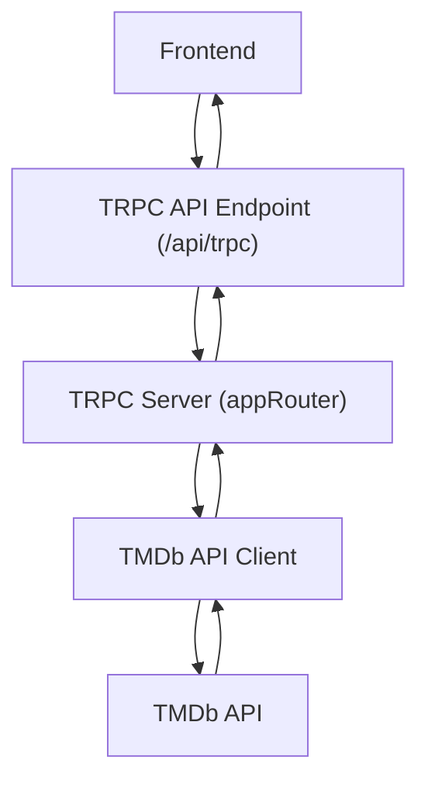

# Backend and API Integration

This section details the backend architecture of LandeMon, focusing on its TRPC implementation and integration with external APIs, specifically The Movie Database (TMDb).

## TRPC Setup

LandeMon utilizes tRPC for efficient and type-safe communication between the frontend and backend. The core TRPC setup is defined in `src/server/trpc.ts`, which initializes tRPC with the `superjson` transformer for improved data serialization.

```typescript
// src/server/trpc.ts
import { initTRPC } from "@trpc/server";
import superjson from "superjson";

const t = initTRPC.create({
  transformer: superjson,
});

export const router = t.router;
export const publicProcedure = t.procedure;
```

The main application router, `appRouter`, is defined in `src/server/index.ts` and aggregates all the individual routers. Currently, it includes a `hello` router.

```typescript
// src/server/index.ts
import { helloRouter } from "@/server/routers/hello";
import { router } from "@/server/trpc";

export const appRouter = router({
  hello: helloRouter,
});

export type AppRouter = typeof appRouter;
```

The TRPC API endpoint is exposed via `src/app/api/trpc/[trpc]/route.ts`, which acts as a fetch request handler for both GET and POST requests.

```typescript
// src/app/api/trpc/[trpc]/route.ts
import { fetchRequestHandler } from "@trpc/server/adapters/fetch";
import { appRouter } from "@/server/index";

const handler = (req: Request) =>
  fetchRequestHandler({
    endpoint: "/api/trpc",
    req,
    router: appRouter,
    createContext: () => ({}),
  });

export { handler as GET, handler as POST };
```

## External API Integration (TMDb)

LandeMon integrates with The Movie Database (TMDb) API to fetch movie and TV show data. A pre-configured Axios client, `tmdbClient`, is exported from `src/lib/apiClient.ts` for this purpose.

```typescript
// src/lib/apiClient.ts
import BaseService from '@/services/BaseService';

const tmdbClient = BaseService.axios(`https://api.themoviedb.org/3/`);
export default tmdbClient;
```

This `tmdbClient` can be used within the backend routers to make requests to the TMDb API.

## Architecture Overview

The backend operates as a TRPC server, exposing an API endpoint that the frontend consumes. This server also handles communication with external services like TMDb.





## Key Takeaways

*   **Type Safety**: TRPC ensures type safety between frontend and backend operations.
*   **Efficient Communication**: tRPC streamlines API calls, reducing boilerplate and improving performance.
*   **External Data**: TMDb API integration allows LandeMon to leverage a comprehensive media database.
*   **Centralized Logic**: Backend routers encapsulate business logic and external API interactions.