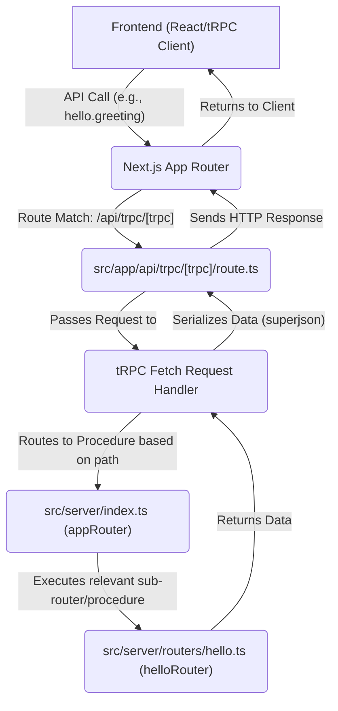
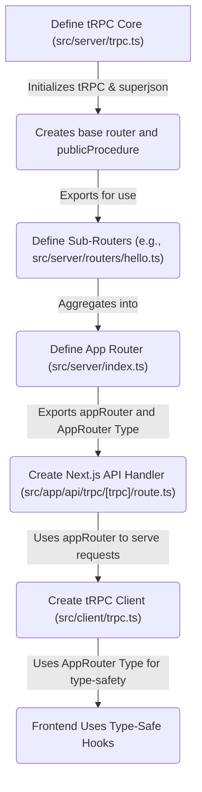

 # Backend Services and API

The backend services in this application are built around a robust, type-safe API powered by [tRPC](https://trpc.io/). tRPC allows for building fully end-to-end type-safe APIs without the need for schema generation or code generation steps. This significantly enhances developer experience by providing immediate feedback on API usage, reducing common errors, and streamlining development between frontend and backend teams. The architecture leverages Next.js API routes to expose the tRPC server, integrating seamlessly with the application's client-side for data fetching.

At its core, the backend architecture focuses on modularity and clear separation of concerns. The tRPC setup involves initializing a tRPC instance, defining a root router that aggregates various sub-routers (each handling specific domains like 'hello'), and exposing this router via a Next.js API endpoint. On the client side, a dedicated utility creates type-safe hooks for interacting with the API, leveraging React Query for efficient data management.

## tRPC Initialization and Core Setup

The foundation of the tRPC API is established in `src/server/trpc.ts`. This file is responsible for initializing the tRPC server and setting up shared configurations, such as data transformers. It exports `router` and `publicProcedure`, which are essential building blocks for defining API endpoints. `superjson` is used here to enable serialization of complex JavaScript types like `Date` or `Map` over the wire, which standard JSON cannot handle natively.

```typescript
// src/server/trpc.ts
import { initTRPC } from "@trpc/server";
import superjson from "superjson";

// Avoid exporting the entire t-object
// since it's not very descriptive.
// For instance, the use of a t variable
// is common in i18n libraries.
const t = initTRPC.create({
  transformer: superjson,
});

// Base router and procedure helpers
export const router = t.router;
export const publicProcedure = t.procedure;
```
[View on GitHub](https://github.com/lande26/LandeMon/blob/main/src/server/trpc.ts)

The `initTRPC.create()` call sets up the tRPC context. The `transformer: superjson` line is particularly important as it allows for automatic serialization and deserialization of non-JSON-native data types, ensuring type integrity across the network boundary. The `router` and `publicProcedure` exports provide the basic constructs for defining API routes and their corresponding handlers. `publicProcedure` signifies an endpoint that doesn't require authentication or specific middleware, making it accessible to any client.

## API Router Definition

With the tRPC core initialized, the next step is to define the application's root router, which aggregates all individual API routes. This is done in `src/server/index.ts`. This file imports specific sub-routers, like `helloRouter`, and combines them into a single `appRouter`. This modular approach promotes organization and maintainability, especially as the API grows.

```typescript
// src/server/index.ts
import { helloRouter } from "@/server/routers/hello";
import { router } from "@/server/trpc";

export const appRouter = router({
  hello: helloRouter,
});

export type AppRouter = typeof appRouter;
```
[View on GitHub](https://github.com/lande26/LandeMon/blob/main/src/server/index.ts)

The `appRouter` object is the central point where all API endpoints are registered. Each key in this object, such as `hello`, corresponds to a sub-router. This structure naturally segments the API by domain or feature, making it easy to locate and manage related endpoints. The `AppRouter` type export is crucial for client-side type inference, ensuring that the frontend has full type awareness of the available API calls and their expected inputs/outputs.

## Next.js API Route Handler

To expose the tRPC backend via HTTP, a Next.js API route handler is utilized. The file `src/app/api/trpc/[trpc]/route.ts` acts as the entry point for all tRPC API requests. It uses `@trpc/server/adapters/fetch` to adapt the tRPC `appRouter` to a standard Fetch API handler compatible with Next.js's App Router. This handler routes all incoming requests under the `/api/trpc` path to the tRPC server.

```typescript
// src/app/api/trpc/[trpc]/route.ts
import { fetchRequestHandler } from "@trpc/server/adapters/fetch";
import { appRouter } from "@/server/index";

const handler = (req: Request) =>
  fetchRequestHandler({
    endpoint: "/api/trpc",
    req,
    router: appRouter,
    createContext: () => ({}), // Context can be expanded for auth, database connections, etc.
  });

export { handler as GET, handler as POST };
```
[View on GitHub](https://github.com/lande26/LandeMon/blob/main/src/app/api/trpc/[trpc]/route.ts)

The dynamic route `[trpc]` ensures that any path segment after `/api/trpc` is captured and passed to the tRPC router, allowing for flexible API endpoint definitions. The `fetchRequestHandler` function abstracts away the complexities of handling HTTP requests and responses, mapping them directly to tRPC procedures. The `createContext` function is a placeholder here, but in a real-world application, it would be used to inject request-specific data (like user authentication details, database connections, etc.) into the tRPC procedures.

### API Request Flow

The following diagram illustrates the lifecycle of an API request from the client to the tRPC server:





## Client-Side tRPC Integration

On the client side, `src/client/trpc.ts` provides the necessary utilities to interact with the tRPC API in a type-safe manner. It uses `@trpc/react-query` to create a `trpc` object, which contains React Query hooks automatically inferred from the `AppRouter` type. This setup enables seamless data fetching, caching, and mutation management within React components.

```typescript
// src/client/trpc.ts
/**
 * This is the client-side entrypoint for your tRPC API. It is used to create the `api` object which
 * contains the Next.js App-wrapper, as well as your type-safe React Query hooks.
 *
 * We also create a few inference helpers for input and output types.
 */

import { type AppRouter } from "@/server/index";
import { createTRPCReact } from "@trpc/react-query";

/** A set of type-safe react-query hooks for your tRPC API. */
export const trpc = createTRPCReact<AppRouter>({});
```
[View on GitHub](https://github.com/lande26/LandeMon/blob/main/src/client/trpc.ts)

The `createTRPCReact<AppRouter>({})` call is pivotal. By passing the `AppRouter` type, `createTRPCReact` generates hooks (e.g., `trpc.hello.useQuery()`) that are fully type-aware of the API's structure, input parameters, and return types. This eliminates the need for manual type assertions or guessing API contract, leading to a highly productive and error-resistant development workflow. React Query integration means developers get powerful caching, background refetching, and mutation management out-of-the-box.

### tRPC Setup Process

Understanding the order of operations for setting up tRPC components is crucial for maintaining the API.





## Key Integration Points

The integration of tRPC with Next.js provides a streamlined and highly efficient development experience for building full-stack applications.

*   **End-to-End Type Safety**: The most significant benefit is the complete type safety from backend to frontend. Changes in API definitions immediately reflect on the client-side, catching potential errors at compile time rather than runtime. This is achieved through the `AppRouter` type being shared between `src/server/index.ts` and `src/client/trpc.ts`.
*   **Simplified API Development**: Developers can define API procedures directly in TypeScript, eliminating the need for schema definition languages (like OpenAPI/Swagger) or complex code generation. This reduces boilerplate and speeds up API iteration.
*   **Seamless Client Integration**: The `@trpc/react-query` adapter automatically generates custom React Query hooks, providing powerful data fetching capabilities (caching, retries, optimistic updates) with minimal configuration.
*   **Modular Architecture**: The separation of `src/server/trpc.ts` (core setup), `src/server/index.ts` (root router), and individual sub-routers promotes a clean and scalable architecture. New features can be added by simply creating new routers and registering them with the `appRouter`.
*   **Contextual Flexibility**: The `createContext` function in the Next.js API handler (`src/app/api/trpc/[trpc]/route.ts`) is a powerful mechanism for injecting request-scoped data like user session information, database client instances, or logging utilities into every tRPC procedure. This ensures that procedures have access to all necessary resources and context without explicit passing of parameters.

By centralizing the API definition and leveraging TypeScript's type inference capabilities, this backend architecture ensures maintainability, robustness, and a highly productive development environment for modern web applications.