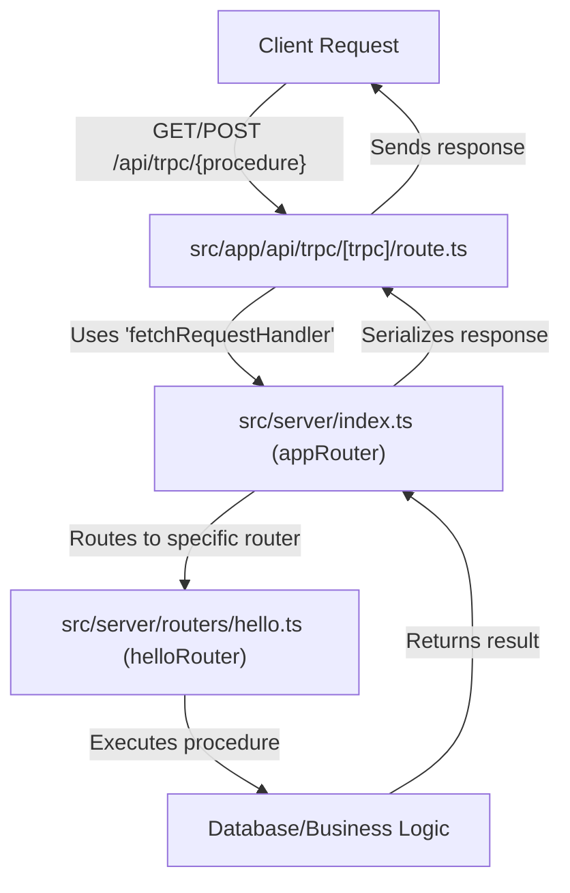
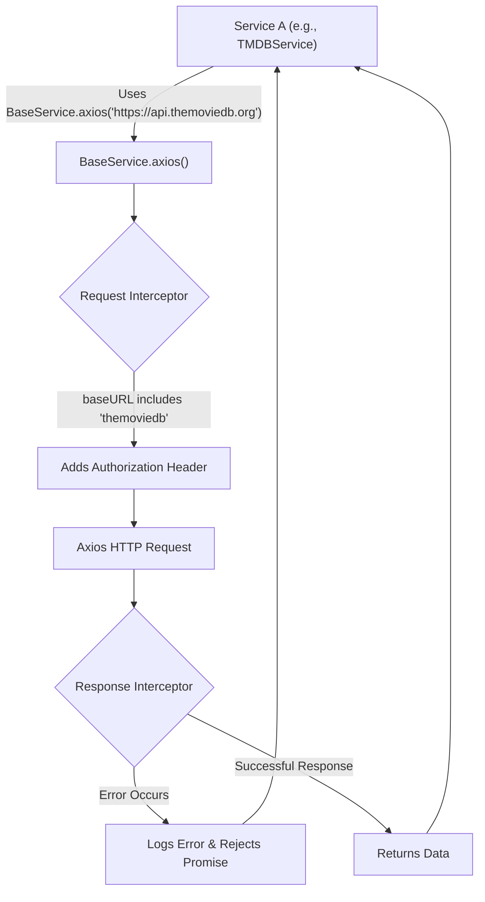

 # Backend Services and API

This document details the server-side architecture, focusing on the API endpoints and data fetching strategies. The application leverages **tRPC** for type-safe API interactions between the client and server, alongside a **service layer** built with Axios for interacting with external third-party APIs. This combination ensures robust, type-checked internal communication and flexible, configurable external data fetching.

## tRPC Setup and API Endpoints

tRPC provides an elegant way to build fully type-safe APIs without the need for code generation. It allows you to write API definitions directly in TypeScript on the server and then consume them with end-to-end type safety on the client.

### Core tRPC Initialization

The `src/server/trpc.ts` file is central to initializing tRPC. It sets up the core `t` object, which provides the necessary utilities to define routers and procedures. The use of `superjson` ensures that complex data types like Dates, Maps, and Sets are correctly serialized and deserialized across the network.

```typescript filename="src/server/trpc.ts"
import { initTRPC } from "@trpc/server";
import superjson from "superjson";

// Avoid exporting the entire t-object
// since it's not very descriptive.
// For instance, the use of a t variable
// is common in i18n libraries.
const t = initTRPC.create({
  transformer: superjson,
});

// Base router and procedure helpers
export const router = t.router;
export const publicProcedure = t.procedure;
```
[View on GitHub](https://github.com/lande26/LandeMon/blob/main/src/server/trpc.ts)

Here, `router` is a helper to create new tRPC routers, and `publicProcedure` is a basic procedure that can be called by clients without any authentication or authorization.

### Assembling the Application Router

The application's various individual routers are combined into a single `appRouter` in `src/server/index.ts`. This `appRouter` serves as the root for all tRPC API calls, making all defined procedures accessible through a single entry point.

```typescript filename="src/server/index.ts"
import { helloRouter } from "@/server/routers/hello";
import { router } from "@/server/trpc";

export const appRouter = router({
  hello: helloRouter,
});

export type AppRouter = typeof appRouter;
```
[View on GitHub](https://github.com/lande26/LandeMon/blob/main/src/server/index.ts)

In this example, `helloRouter` (presumably defined elsewhere) is registered under the `hello` namespace. This modular approach keeps the API organized and scalable, allowing new features to be added by simply creating new routers and integrating them here. The `AppRouter` type export is crucial for providing end-to-end type safety on the client side.

### tRPC API Endpoint Handler

The `src/app/api/trpc/[trpc]/route.ts` file defines the actual API endpoint that Next.js exposes to the client. This dynamic route `[trpc]` catches all requests under `/api/trpc` and forwards them to the tRPC `fetchRequestHandler`.

```typescript filename="src/app/api/trpc/[trpc]/route.ts"
import { fetchRequestHandler } from "@trpc/server/adapters/fetch";
import { appRouter } from "@/server/index";

const handler = (req: Request) =>
  fetchRequestHandler({
    endpoint: "/api/trpc",
    req,
    router: appRouter,
    createContext: () => ({}),
  });

export { handler as GET, handler as POST };
```
[View on GitHub](https://github.com/lande26/LandeMon/blob/main/src/app/api/trpc/[trpc]/route.ts)

This handler is responsible for processing incoming GET and POST requests, routing them through the `appRouter`, and returning the appropriate responses. The `createContext` function is where you would typically inject per-request context, such as user authentication information, into your tRPC procedures.





## Service Layer with `BaseService`

Beyond internal tRPC APIs, applications often need to interact with external APIs. The `src/services/BaseService/BaseService.ts` provides a robust, centralized mechanism for making HTTP requests to external services, built on top of `axios`. This base class handles common configurations, error handling, and request interception logic.

### `BaseService` Class Definition

The `BaseService` is designed to be a foundational class, not to be instantiated directly. It provides static methods for creating configured Axios instances, ensuring consistency across all external API calls.

```typescript filename="src/services/BaseService/BaseService.ts"
import axios, {
  type AxiosRequestConfig,
  type AxiosError,
  type AxiosInstance,
  type InternalAxiosRequestConfig,
} from 'axios';
import { env } from '@/env.mjs';

/**
 * @class BaseService
 */
class BaseService {
  constructor() {
    if (this.constructor === BaseService) {
      throw new Error("Classes can't be instantiated.");
    }
  }

  static axios(baseUrl: string) {
    const instanceConfig: AxiosRequestConfig = this.getConfig(baseUrl);
    const instance: AxiosInstance = axios.create(instanceConfig);

    const onRequest = (
      config: InternalAxiosRequestConfig,
    ): InternalAxiosRequestConfig => {
      if (config.baseURL?.includes('themoviedb')) {
        // const params = config.params as Record<string, unknown>;
        // config.params = { ...params, api_key: env.NEXT_PUBLIC_TMDB_API_KEY };
        config.headers.Authorization = `Bearer ${env.NEXT_PUBLIC_TMDB_TOKEN}`;
      }
      return config;
    };

    const onErrorResponse = (
      error: AxiosError | Error,
    ): Promise<AxiosError> => {
      console.error(`error in request: ${error.message}`);
      return Promise.reject(error);
    };

    instance.interceptors.request.use(onRequest, onErrorResponse);

    return instance;
  }

  static getConfig(baseUrl: string): AxiosRequestConfig {
    return {
      timeout: 15000,
      baseURL: baseUrl,
      responseType: 'json',
      maxContentLength: 100000,
      validateStatus: (status: number) => status >= 200 && status < 300,
      maxRedirects: 5,
    };
  }

  static isRejected = (
    input: PromiseSettledResult<unknown>,
  ): input is PromiseRejectedResult => input.status === 'rejected';

  static isFulfilled = <T>(
    input: PromiseSettledResult<T>,
  ): input is PromiseFulfilledResult<T> => input.status === 'fulfilled';
}

export default BaseService;
```
[View on GitHub](https://github.com/lande26/LandeMon/blob/main/src/services/BaseService/BaseService.ts)

The `constructor` explicitly throws an error if `BaseService` is instantiated directly, enforcing its role as an abstract base.

### Configured Axios Instances

The `static axios(baseUrl: string)` method is the primary way to get an Axios instance. It first calls `getConfig` to set up common Axios parameters like `timeout`, `baseURL`, and `responseType`. Crucially, it then configures request interceptors:

*   **`onRequest`**: This interceptor allows modifications to the request configuration before it's sent. For example, if the `baseURL` includes `'themoviedb'`, it automatically adds an `Authorization` header with a Bearer token from environment variables. This centralizes API key/token management, preventing repetition in individual service classes.
*   **`onErrorResponse`**: This interceptor handles any errors that occur during the request. It logs the error and re-rejects the promise, allowing calling code to handle the specific error.

### Utility Methods

`BaseService` also includes static utility methods like `isRejected` and `isFulfilled`. These are generic type guards that are particularly useful when dealing with `Promise.allSettled`, allowing for robust handling of multiple concurrent asynchronous operations.





## Key Integration Points

The integration of tRPC for internal API communication and a `BaseService`-driven approach for external APIs creates a powerful and flexible backend architecture:

*   **Type Safety Everywhere**: tRPC ensures that all internal API interactions are fully type-safe from the server to the client, reducing runtime errors and improving developer experience.
*   **Centralized External API Configuration**: The `BaseService` standardizes how external APIs are called, providing consistent configuration (timeouts, error handling) and simplifying the addition of common features like API key injection via interceptors. This prevents boilerplate code in every service that interacts with a third-party API.
*   **Clear Separation of Concerns**: The application's server-side logic is distinctly split:
    *   **tRPC routers** handle business logic and data manipulation that directly serves the frontend client.
    *   **Service classes (extending BaseService)** abstract away the details of interacting with external systems, providing a clean interface for tRPC procedures or other server-side components to consume.
*   **Scalability and Maintainability**: The modular nature of tRPC routers and dedicated service classes makes the codebase easier to understand, test, and scale. New API endpoints or integrations with external services can be added without disrupting existing functionality.

By adhering to these patterns, the backend is robust, maintainable, and well-equipped to handle both internal data flows and complex external data fetching requirements.