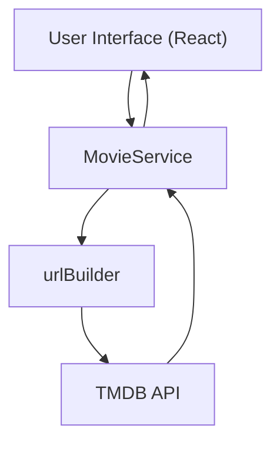

# Data Fetching and Management

This section explains how LandeMon fetches data from external APIs, specifically the Movie Database (TMDB), and manages it within the application. Efficient data fetching and management are crucial for providing a seamless user experience and ensuring the application's responsiveness.

## Data Fetching Strategy

LandeMon employs a layered approach to data fetching, involving an API client, dedicated services for movies and TV shows, and type definitions to ensure data consistency.

- **API Client**: Abstraction over `axios` for making HTTP requests to the TMDB API.
- **Movie Service**: Provides methods for fetching movie and TV show data, handling different request types, and caching responses.
- **Type Definitions**: Defines the structure of the data received from the API, ensuring type safety throughout the application.

### `apiClient.ts`: Base Axios Instance

The `src/lib/apiClient.ts` file initializes an `axios` instance with the base URL of the TMDB API. This client is then used by other services to make specific requests.

```typescript
// File: src/lib/apiClient.ts
import BaseService from '@/services/BaseService';

const tmdbClient = BaseService.axios(`https://api.themoviedb.org/3/`);
export default tmdbClient;
```

[View on GitHub](https://github.com/lande26/LandeMon/blob/main/src/lib/apiClient.ts)

This code snippet demonstrates the creation of a reusable `tmdbClient` using a `BaseService` class. This approach promotes code reusability and simplifies the process of making API requests. The `BaseService` likely handles common configurations such as headers and error handling.

### `MovieService.ts`: Centralized Data Access

The `src/services/MovieService/MovieService.ts` file contains the `MovieService` class, which provides various methods for fetching and processing movie and TV show data. It utilizes caching and different request types for optimized data retrieval.

```typescript
// File: src/services/MovieService/MovieService.ts
import { getNameFromShow, getSlug } from '@/lib/utils';
import type {
  CategorizedShows,
  ISeason,
  KeyWordResponse,
  MediaType,
  Show,
  ShowWithGenreAndVideo,
} from '@/types';
import { type AxiosResponse } from 'axios';
import BaseService from '../BaseService/BaseService';
import {
  RequestType,
  type ShowRequest,
  type TmdbPagingResponse,
  type TmdbRequest,
} from '@/enums/request-type';
import { Genre } from '@/enums/genre';
import { cache } from 'react';

// ... (rest of the file)

export default MovieService;
```

[View on GitHub](https://github.com/lande26/LandeMon/blob/main/src/services/MovieService/MovieService.ts)

This snippet illustrates the `MovieService` class, which acts as a central point for accessing movie and TV show data. It imports various types and enums, demonstrating a strong emphasis on type safety and code organization. The use of `cache` from `react` indicates that the service is designed to optimize performance by caching API responses.

### Caching with `cache`

The `MovieService` utilizes React's `cache` function to memoize the results of API calls. This significantly improves performance by reducing the number of requests made to the TMDB API.

```typescript
static findMovie = cache(async (id: number) => {
  return this.axios(baseUrl).get<Show>(
    `/movie/${id}?append_to_response=keywords`,
  );
});

static findTvSeries = cache(async (id: number) => {
  return this.axios(baseUrl).get<Show>(
    `/tv/${id}?append_to_response=keywords`,
  );
});
```

[View on GitHub](https://github.com/lande26/LandeMon/blob/main/src/services/MovieService/MovieService.ts)

The `cache` function wraps the `findMovie` and `findTvSeries` methods, ensuring that the results are cached based on the `id` parameter. Subsequent calls with the same `id` will return the cached result, avoiding unnecessary API requests.

### Dynamic URL Building

The `urlBuilder` method in `MovieService.ts` dynamically constructs API URLs based on the specified `RequestType`. This approach allows the application to handle a wide range of requests with a single method.

```typescript
static urlBuilder(req: TmdbRequest) {
  switch (req.requestType) {
    case RequestType.ANIME_LATEST:
      return `/discover/${req.mediaType}?with_keywords=210024%2C&language=en-US&sort_by=primary_release_date.desc&release_date.lte=2024-11-10&with_runtime.gte=1`;
    // ... other cases
    default:
      throw new Error(
        `request type ${req.requestType} is not implemented yet`,
      );
  }
}
```

[View on GitHub](https://github.com/lande26/LandeMon/blob/main/src/services/MovieService/MovieService.ts)

This code demonstrates how different API endpoints are constructed based on the `requestType`. The `TmdbRequest` type likely contains information such as `mediaType`, `genre`, and `page`, which are used to build the complete URL. This approach enhances flexibility and maintainability.

### Handling Multiple Requests

The `getShows` method efficiently handles multiple API requests concurrently using `Promise.allSettled`. This allows the application to fetch data for different categories of shows in parallel, improving loading times.

```typescript
static getShows = cache(async (requests: ShowRequest[]) => {
  const shows: CategorizedShows[] = [];
  const promises = requests.map((m) => this.executeRequest(m.req));
  const responses = await Promise.allSettled(promises);
  // ... (rest of the method)
  return shows;
});
```

[View on GitHub](https://github.com/lande26/LandeMon/blob/main/src/services/MovieService/MovieService.ts)

This snippet showcases the use of `Promise.allSettled` to handle multiple asynchronous requests. The `map` function creates an array of promises, and `Promise.allSettled` ensures that all promises are either fulfilled or rejected, providing a comprehensive overview of the results. The method then processes the responses and constructs an array of `CategorizedShows`.

### Search Functionality

The `searchMovies` method provides search functionality by querying the TMDB API with a user-provided query string.

```typescript
static searchMovies = cache(async (query: string, page?: number) => {
  const { data } = await this.axios(baseUrl).get<TmdbPagingResponse>(
    `/search/multi?query=${encodeURIComponent(query)}&language=en-US&page=${
      page ?? 1
    }`,
  );

  data.results.sort((a, b) => {
    return b.popularity - a.popularity;
  });
  return data;
});
```

[View on GitHub](https://github.com/lande26/LandeMon/blob/main/src/services/MovieService/MovieService.ts)

This code snippet illustrates the `searchMovies` method, which takes a `query` string and an optional `page` number as input. It encodes the query string using `encodeURIComponent` to ensure that it is properly formatted for the API request. The results are then sorted by popularity before being returned.

## Data Flow Diagram





This diagram illustrates the basic flow of data from the user interface to the TMDB API and back. The `MovieService` acts as an intermediary, handling request construction and response processing.

## Type Definitions

The `src/types/index.ts` file defines various types used throughout the application, ensuring type safety and data consistency.

```typescript
// File: src/types/index.ts
export type Show = {
  adult: boolean;
  backdrop_path: string | null;
  media_type: MediaType;
  // media_type: string;
  budget: number | null;
  homepage: string | null;
  showId: string;
  id: number;
  imdb_id: string | null;
  original_language: string;
  original_title: string | null;
  overview: string | null;
  popularity: number;
  poster_path: string | null;
  number_of_seasons: number | null;
  number_of_episodes: number | null;
  release_date: string | null;
  first_air_date: string | null;
  last_air_date: string | null;
  revenue: number | null;
  runtime: number | null;
  status: string | null;
  tagline: string | null;
  title: string | null;
  name: string | null;
  video: boolean;
  vote_average: number;
  vote_count: number;
  original_name?: string;
  keywords: KeyWordResponse;
  seasons: ISeason[];
};

export enum MediaType {
  ALL = 'all',
  TV = 'tv',
  MOVIE = 'movie',
  ANIME = 'anime',
}
```

[View on GitHub](https://github.com/lande26/LandeMon/blob/main/src/types/index.ts)

The `Show` type defines the structure of movie and TV show data, including properties such as `title`, `overview`, `popularity`, and `release_date`. The `MediaType` enum defines the possible media types, such as `TV`, `MOVIE`, and `ANIME`.

## Key Integration Points

- The `apiClient` provides a centralized way to interact with the TMDB API, simplifying the process of making requests and handling responses.
- The `MovieService` encapsulates the logic for fetching and processing movie and TV show data, providing a clean and consistent interface for other parts of the application.
- The use of `cache` significantly improves performance by reducing the number of API requests made to the TMDB API.
- Type definitions ensure data consistency and type safety throughout the application, reducing the risk of errors.

By combining these elements, LandeMon provides a robust and efficient data fetching and management system.
```