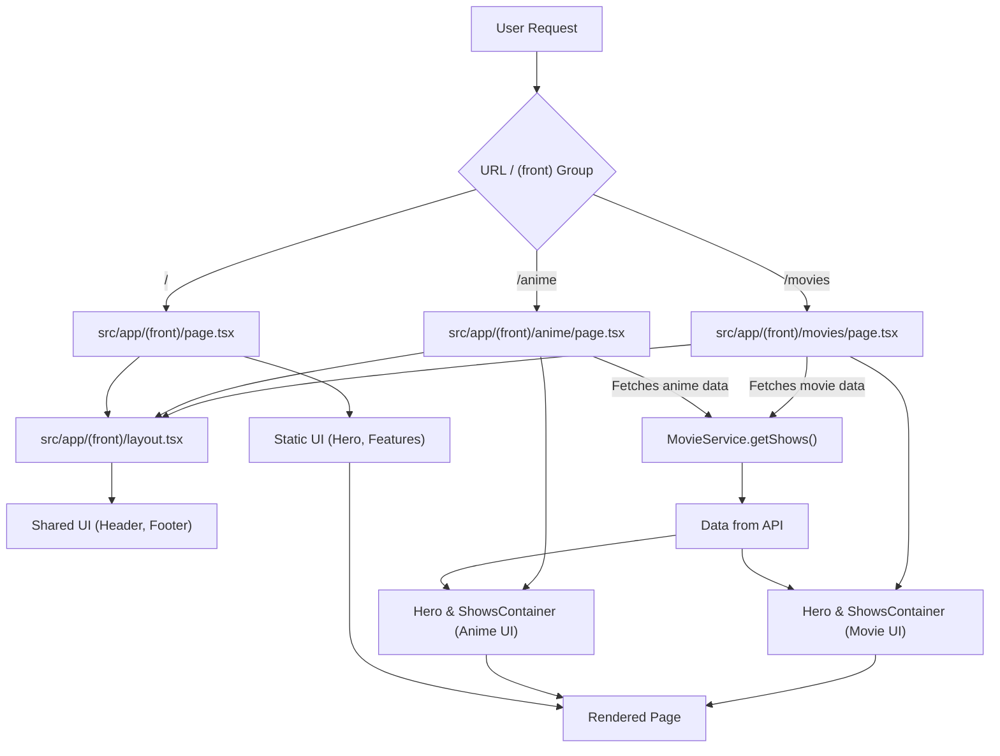

 # Frontend Application Structure

The frontend of the application is built using Next.js and leverages the `app` directory structure for efficient routing, data fetching, and UI organization. A key aspect of this structure is the use of route groups, specifically `(front)`, which allows for applying a shared layout to multiple pages without affecting the URL path.

## Route Grouping with `(front)`

The `(front)` directory is a Next.js route group. This convention allows developers to logically group routes without having the folder name appear in the URL. All pages and layouts within `src/app/(front)` share a common structure and styling, forming the main user-facing part of the application.

For instance:
*   `src/app/(front)/page.tsx` maps to `/`
*   `src/app/(front)/movies/page.tsx` maps to `/movies`
*   `src/app/(front)/anime/page.tsx` maps to `/anime`

This approach keeps the URL clean while providing a clear organizational structure for the application's main sections.

## Shared Frontend Layout

The `src/app/(front)/layout.tsx` file defines the shared layout for all pages within the `(front)` route group. This layout typically includes persistent UI elements like the header and footer, which remain consistent across different pages. It acts as a wrapper, providing a common visual and structural foundation.

```tsx
// src/app/(front)/layout.tsx
import SiteFooter from '@/components/main/site-footer';
import SiteHeader from '@/components/main/site-header';

const FrontLayout = ({ children }: { children: React.ReactNode }) => {
  return (
    <div className="min-h-screen">
          <div className="absolute inset-0 bg-gradient-to-b from-primary/10 via-transparent to-transparent pointer-events-none" />
              <div className="absolute top-1/4 left-1/4 h-72 w-72 rounded-full bg-primary/20 blur-3xl animate-pulse pointer-events-none" />
              <div
                className="absolute bottom-1/4 right-1/4 h-96 w-96 rounded-full bg-blue-500/20 blur-3xl animate-pulse pointer-events-none"
                style={{ animationDelay: '1s' }}
              />
      <SiteHeader />
      <main>{children}</main>
      <SiteFooter />
    </div>
  );
};

export default FrontLayout;
```
[View on GitHub](https://github.com/lande26/LandeMon/blob/main/src/app/(front)/layout.tsx)

As seen in the snippet, `FrontLayout` wraps the `children` prop with `SiteHeader` and `SiteFooter`, ensuring these components are rendered on every page within the `(front)` group. The background elements provide decorative visual effects.

## Home Page (`/`)

The `src/app/(front)/page.tsx` file serves as the main landing page or home page for the application. It's designed to introduce users to the platform, highlight key features, and provide calls to action for content browsing. This page focuses on static content and user engagement.

```tsx
// src/app/(front)/page.tsx
import { Icons } from "@/components/icons";
import { Badge } from "@/components/ui/badge";
import { buttonVariants } from "@/components/ui/button";
import { siteConfig } from "@/configs/site";
import { ArrowRight } from "lucide-react";
import Link from "next/link";

export default function Index() {
  return (
    <>
      <section
        id="hero"
        aria-labelledby="hero-heading"
        className="relative container mx-auto flex min-h-[90vh] flex-col items-center justify-center gap-8 overflow-hidden px-4 pt-20 pb-16 text-center lg:min-h-screen"
      >
        <div className="relative z-10 flex flex-col items-center gap-6">
          <h1 className="font-heading text-5xl sm:text-6xl md:text-7xl lg:text-8xl font-extrabold bg-gradient-to-r from-foreground via-foreground to-foreground/60 bg-clip-text text-transparent">
            {siteConfig.name}
          </h1>
          <p className="text-xl sm:text-2xl md:text-3xl text-foreground/80 font-medium">
            {siteConfig.slogan}
          </p>

          <p className="max-w-3xl text-base sm:text-lg md:text-xl text-muted-foreground leading-relaxed">
            Welcome to your personal movie universe. Explore thousands of films, binge the latest releases, and rediscover classics that defined cinema.
          </p>

          <div className="flex flex-col sm:flex-row gap-4 mt-4">
            <Link
              href="/home" // Redirects to the main content browsing page
              className="group relative px-8 py-4 bg-primary text-primary-foreground rounded-lg font-semibold text-lg hover:scale-105 transition-transform duration-200 shadow-lg shadow-primary/50 flex items-center justify-center gap-2"
            >
              Watch Now
              <ArrowRight className="w-5 h-5 group-hover:translate-x-1 transition-transform" />
            </Link>

            <Link
              href="/home" // Redirects to the main content browsing page
              className="px-8 py-4 bg-secondary text-secondary-foreground rounded-lg font-semibold text-lg hover:bg-secondary/80 transition-all duration-200 border border-border"
            >
              Browse Library
            </Link>
          </div>
        </div>
      </section>

      <section
        id="features"
        className="container space-y-6 bg-slate-50 py-8 dark:bg-transparent md:py-12 lg:py-24"
      >
        <div className="mx-auto flex max-w-[58rem] flex-col items-center space-y-4 text-center">
          <h2 className="font-heading text-3xl leading-[1.1] sm:text-3xl md:text-6xl">
            Features
          </h2>
          <p className="max-w-[85%] leading-normal text-muted-foreground sm:text-lg sm:leading-7">
            {siteConfig.name} offers a host of powerful features designed to
            enhance your movie-watching experience.
          </p>
        </div>
        <div className="mx-auto grid justify-center gap-4 sm:grid-cols-2 md:max-w-[64rem] md:grid-cols-3">
          {/* ... Feature Cards (omitted for brevity) ... */}
        </div>
      </section>
    </>
  );
}
```
[View on GitHub](https://github.com/lande26/LandeMon/blob/main/src/app/(front)/page.tsx)

This `Index` component renders a hero section with the application name and slogan, followed by a features section. The "Watch Now" and "Browse Library" links navigate to `/home` (or potentially `/movies` or `/anime` depending on actual implementation, though `/home` is shown as target here).

## Movies Page (`/movies`)

The `src/app/(front)/movies/page.tsx` file is dedicated to displaying a collection of movies. It's an asynchronous server component that fetches various categories of movie data using the `MovieService` and then renders them using reusable UI components.

```tsx
// src/app/(front)/movies/page.tsx
import Hero from '@/components/hero';
import ShowsContainer from '@/components/shows-container';
import { siteConfig } from '@/configs/site';
import { Genre } from '@/enums/genre';
import { RequestType, type ShowRequest } from '@/enums/request-type';
import { getRandomShow } from '@/lib/utils';
import MovieService from '@/services/MovieService';
import { MediaType, type Show } from '@/types';

export const revalidate = 3600; // Revalidate data every hour

export default async function MoviePage() {
  const h1 = `${siteConfig.name} Movie`;
  const requests: ShowRequest[] = [
    {
      title: 'Trending Now',
      req: { requestType: RequestType.TRENDING, mediaType: MediaType.MOVIE },
      visible: true,
    },
    {
      title: 'Netflix Movies',
      req: { requestType: RequestType.NETFLIX, mediaType: MediaType.MOVIE },
      visible: true,
    },
    // ... more movie requests
  ];
  const allShows = await MovieService.getShows(requests);
  const randomShow: Show | null = getRandomShow(allShows);
  return (
    <>
      <h1 className="hidden">{h1}</h1>
      <Hero randomShow={randomShow} />
      <ShowsContainer shows={allShows} />
    </>
  );
}
```
[View on GitHub](https://github.com/lande26/LandeMon/blob/main/src/app/(front)/movies/page.tsx)

The `MoviePage` fetches different categories of movies (e.g., Trending, Netflix, Popular, by Genre) via `MovieService.getShows()`. It then passes this data to the `Hero` component for a prominent display of a random movie and to `ShowsContainer` to display categorized lists of movies. The `revalidate = 3600` export indicates that the data for this page should be re-fetched at most once every hour, enabling efficient caching.

## Anime Page (`/anime`)

Similar to the movies page, `src/app/(front)/anime/page.tsx` is an asynchronous server component designed to display various categories of anime content. It leverages the same `Hero` and `ShowsContainer` components, demonstrating UI reusability across different content types.

```tsx
// src/app/(front)/anime/page.tsx
import Hero from '@/components/hero';
import ShowsContainer from '@/components/shows-container';
import { siteConfig } from '@/configs/site';
import { Genre } from '@/enums/genre';
import { RequestType, type ShowRequest } from '@/enums/request-type';
import { getRandomShow } from '@/lib/utils';
import MovieService from '@/services/MovieService';
import { type CategorizedShows, MediaType, type Show } from '@/types';

export const revalidate = 3600; // Revalidate data every hour

export default async function AnimePage() {
  const h1 = `${siteConfig.name} Anime`;
  const requests: ShowRequest[] = [
    {
      title: 'Anime TV Shows Latest',
      req: { requestType: RequestType.ANIME_LATEST, mediaType: MediaType.TV },
      visible: true,
    },
    {
      title: 'Anime TV Shows Trending',
      req: {
        requestType: RequestType.ANIME_TRENDING,
        mediaType: MediaType.TV,
      },
      visible: true,
    },
    // ... more anime requests
  ];
  let allShows = await MovieService.getShows(requests);
  allShows = allShows.map((category: CategorizedShows) => {
    return {
      ...category,
      shows: category.shows.map((show: Show) => {
        return {
          ...show,
          media_type: category.title.includes('Movies')
            ? MediaType.MOVIE
            : MediaType.TV,
        };
      }),
    };
  });
  const randomShow: Show | null = getRandomShow(allShows);

  return (
    <>
      <h1 className="hidden">{h1}</h1>
      <Hero randomShow={randomShow} />
      <ShowsContainer shows={allShows} />
    </>
  );
}
```
[View on GitHub](https://github.com/lande26/LandeMon/blob/main/src/app/(front)/anime/page.tsx)

The `AnimePage` fetches specific anime categories (e.g., Latest TV Shows, Trending TV Shows, Movies) and processes the results to ensure correct `media_type` assignment before rendering. The `Hero` and `ShowsContainer` components are reused here, demonstrating a consistent presentation layer for different media types.

## Frontend Routing and Data Flow

The following diagram illustrates the basic routing and data flow for the frontend application, particularly focusing on how pages within the `(front)` route group leverage the shared layout and fetch data.





## Key Integration Points

*   **Next.js App Router**: The `app` directory with route groups (`(front)`) provides a structured way to define routes and layouts. Pages within this group are Server Components by default, enabling efficient server-side data fetching.
*   **Shared Layouts**: The `src/app/(front)/layout.tsx` file is a critical integration point, ensuring a consistent user experience with shared `SiteHeader` and `SiteFooter` components across all main content pages.
*   **Server Component Data Fetching**: Pages like `movies/page.tsx` and `anime/page.tsx` demonstrate server-side data fetching directly within the component using an external `MovieService`. This pattern allows for fetching data before rendering the page, improving performance and SEO.
*   **Reusability of UI Components**: Components like `Hero` and `ShowsContainer` are designed to be generic enough to display both movie and anime data, promoting code reusability and maintaining a consistent UI across different content types.
*   **Static Site Generation (SSG) with Revalidation**: The `export const revalidate = 3600;` line in the movie and anime pages indicates that these pages leverage Next.js's Incremental Static Regeneration (ISR). This means the pages are statically generated at build time or on the first request, and then revalidated in the background every hour, combining the benefits of static sites with fresh data.

Next: [Content Browsing and Details](./3.1_content-browsing-and-details.mdx)