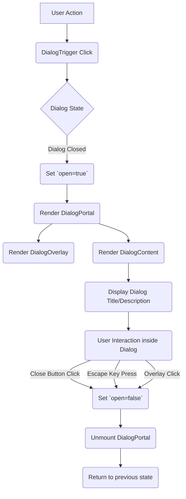
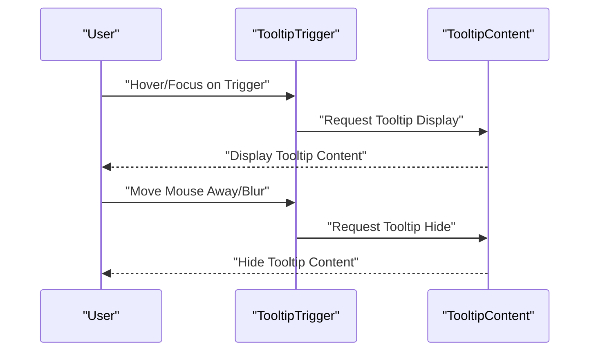

 # Core UI Elements

This section provides comprehensive documentation for the foundational UI components that form the building blocks of our application's user interface. These elements, including dialogs, inputs, skeletons, and tooltips, are designed for reusability, accessibility, and a consistent user experience. They leverage modern web development practices, primarily utilizing [Radix UI](https://www.radix-ui.com/) primitives for robust functionality and [Tailwind CSS](https://tailwindcss.com/) for flexible styling.

## Dialog

The `Dialog` component provides an accessible and customizable way to present information or request user input in a modal overlay. It's built upon Radix UI's `DialogPrimitive`, ensuring high accessibility standards and predictable behavior.

### Structure and Usage

The `Dialog` component is composed of several sub-components, each responsible for a specific part of the modal experience:

*   **`Dialog`**: The root component, managing the dialog's open/closed state.
*   **`DialogTrigger`**: The element that triggers the dialog to open.
*   **`DialogPortal`**: Renders the dialog content outside the current DOM hierarchy, typically at the `body` level, to ensure proper layering.
*   **`DialogOverlay`**: A semi-transparent overlay that covers the rest of the page when the dialog is open, preventing interaction with underlying content.
*   **`DialogContent`**: Contains the actual content of the dialog, including its title, description, and any interactive elements. It includes a default close button.
*   **`DialogHeader` / `DialogFooter`**: Utility components for structuring the dialog content, often used for titles/descriptions and action buttons, respectively.
*   **`DialogTitle` / `DialogDescription`**: Accessible titles and descriptions for the dialog content.
*   **`DialogClose`**: A button or element that closes the dialog.

Here's a typical example of how to construct a dialog:

```tsx filename="src/components/ui/dialog.tsx" {1-2,10-14,20-23}
import {
  Dialog,
  DialogPortal,
  DialogOverlay,
  DialogClose,
  DialogTrigger,
  DialogContent,
  DialogHeader,
  DialogFooter,
  DialogTitle,
  DialogDescription,
} from '@/components/ui/dialog';
import { Button } from '@/components/ui/button'; // Assuming a Button component

function MyDialogComponent() {
  return (
    <Dialog>
      <DialogTrigger asChild>
        <Button variant="outline">Edit Profile</Button>
      </DialogTrigger>
      <DialogContent className="sm:max-w-[425px]">
        <DialogHeader>
          <DialogTitle>Edit Profile</DialogTitle>
          <DialogDescription>
            Make changes to your profile here. Click save when you're done.
          </DialogDescription>
        </DialogHeader>
        <div className="grid gap-4 py-4">
          {/* Form fields or other content */}
        </div>
        <DialogFooter>
          <Button type="submit">Save changes</Button>
        </DialogFooter>
      </DialogContent>
    </Dialog>
  );
}
```
The `Dialog` component exports all necessary sub-components for building accessible and styled modal experiences.
[View on GitHub](https://github.com/lande26/LandeMon/blob/main/src/components/ui/dialog.tsx)

### Dialog Flow
The interaction flow for opening and closing a dialog can be visualized as follows:





## Input

The `Input` component provides a styled and accessible HTML `<input>` element. It abstracts away common styling and ensures consistency across all input fields in the application.

### Customization and Styling

The `Input` component accepts all standard HTML `input` attributes and can be easily styled using Tailwind CSS classes passed via the `className` prop. It includes default styling for focus states, disabled states, and placeholders.

```tsx filename="src/components/ui/input.tsx" {15-22}
import * as React from "react";
import { cn } from "@/lib/utils";

export interface InputProps
  extends React.InputHTMLAttributes<HTMLInputElement> {}

const Input = React.forwardRef<HTMLInputElement, InputProps>(
  ({ className, type, ...props }, ref) => {
    return (
      <input
        type={type}
        className={cn(
          "flex h-10 w-full rounded-md border border-input bg-background px-3 py-2 text-sm ring-offset-background file:border-0 file:bg-transparent file:text-sm file:font-medium placeholder:text-muted-foreground focus-visible:outline-none focus-visible:ring-2 focus-visible:ring-ring focus-visible:ring-offset-2 disabled:cursor-not-allowed disabled:opacity-50",
          className,
        )}
        ref={ref}
        {...props}
      />
    );
  },
);
Input.displayName = "Input";

export { Input };
```
The `Input` component is a straightforward wrapper around the native HTML `<input>` element, enhancing it with consistent styling and responsiveness.
[View on GitHub](https://github.com/lande26/LandeMon/blob/main/src/components/ui/input.tsx)

### Example Usage

```tsx
import { Input } from '@/components/ui/input';

function MyFormComponent() {
  return (
    <div>
      <label htmlFor="email">Email Address</label>
      <Input type="email" id="email" placeholder="you@example.com" />

      <label htmlFor="password">Password</label>
      <Input type="password" id="password" />

      <Input type="text" placeholder="Disabled input" disabled />
    </div>
  );
}
```

## Skeleton

The `Skeleton` component is used to display a placeholder preview of content while it is being loaded. This improves perceived performance and user experience by providing visual feedback rather than an empty, abrupt layout.

### Implementation

The `Skeleton` component is a simple `div` element with a pulsing animation and a muted background color. It can be customized with additional Tailwind CSS classes for specific dimensions or shapes.

```tsx filename="src/components/ui/skeleton.tsx" {7-11}
import { cn } from "@/lib/utils";

function Skeleton({
  className,
  ...props
}: React.HTMLAttributes<HTMLDivElement>) {
  return (
    <div
      className={cn("animate-pulse rounded-md bg-muted", className)}
      {...props}
    />
  );
}

export { Skeleton };
```
The `Skeleton` component provides a simple yet effective way to indicate loading states.
[View on GitHub](https://github.com/lande26/LandeMon/blob/main/src/components/ui/skeleton.tsx)

### Example Usage

```tsx
import { Skeleton } from '@/components/ui/skeleton';

function LoadingCard() {
  return (
    <div className="flex items-center space-x-4">
      <Skeleton className="h-12 w-12 rounded-full" />
      <div className="space-y-2">
        <Skeleton className="h-4 w-[250px]" />
        <Skeleton className="h-4 w-[200px]" />
      </div>
    </div>
  );
}
```

## Tooltip

The `Tooltip` component displays a small, informative popover when a user hovers over or focuses on an element. It's built using Radix UI's `TooltipPrimitive` for robust accessibility and behavior.

### Components and Props

*   **`TooltipProvider`**: Manages the open/closed state of tooltips for an entire application or subtree.
*   **`Tooltip`**: The root component for a single tooltip, managing its state.
*   **`TooltipTrigger`**: The element that, when hovered or focused, causes the tooltip to appear.
*   **`TooltipContent`**: The actual content displayed within the tooltip.
    *   `sideOffset` (number): Adjusts the spacing between the trigger and the tooltip content. Default is 4.
    *   `className`: Allows for custom styling of the tooltip content.

```tsx filename="src/components/ui/tooltip.tsx" {17-30}
"use client";

import * as React from "react";
import * as TooltipPrimitive from "@radix-ui/react-tooltip";

import { cn } from "@/lib/utils";

const TooltipProvider = TooltipPrimitive.Provider;
const Tooltip = TooltipPrimitive.Root;
const TooltipTrigger = TooltipPrimitive.Trigger;

const TooltipContent = React.forwardRef<
  React.ElementRef<typeof TooltipPrimitive.Content>,
  React.ComponentPropsWithoutRef<typeof TooltipPrimitive.Content>
>(({ className, sideOffset = 4, ...props }, ref) => (
  <TooltipPrimitive.Content
    ref={ref}
    sideOffset={sideOffset}
    className={cn(
      "z-50 overflow-hidden rounded-md border bg-popover px-3 py-1.5 text-sm text-popover-foreground shadow-md animate-in fade-in-0 zoom-in-95 data-[state=closed]:animate-out data-[state=closed]:fade-out-0 data-[state=closed]:zoom-out-95 data-[side=bottom]:slide-in-from-top-2 data-[side=left]:slide-in-from-right-2 data-[side=right]:slide-in-from-left-2 data-[side=top]:slide-in-from-bottom-2",
      className,
    )}
    {...props}
  />
));
TooltipContent.displayName = TooltipPrimitive.Content.displayName;

export { Tooltip, TooltipTrigger, TooltipContent, TooltipProvider };
```
The `Tooltip` component provides accessible and styled tooltips.
[View on GitHub](https://github.com/lande26/LandeMon/blob/main/src/components/ui/tooltip.tsx)

### Tooltip Interaction Flow
The lifecycle of a tooltip can be depicted as:





### Example Usage

```tsx
import {
  Tooltip,
  TooltipContent,
  TooltipProvider,
  TooltipTrigger,
} from '@/components/ui/tooltip';
import { Button } from '@/components/ui/button';

function MyTooltipComponent() {
  return (
    <TooltipProvider>
      <Tooltip>
        <TooltipTrigger asChild>
          <Button variant="outline">Hover me</Button>
        </TooltipTrigger>
        <TooltipContent>
          <p>This is a helpful tooltip!</p>
        </TooltipContent>
      </Tooltip>
    </TooltipProvider>
  );
}
```

## Key Integration Points

These core UI elements are designed to be highly composable and flexible, making them integral to various aspects of the application:

*   **Forms and Data Entry**: `Input` components are fundamental for all user input. They are often combined with form libraries (e.g., React Hook Form) for validation and state management, and `Dialog` for multi-step forms or confirmation prompts.
*   **User Feedback and Guidance**: `Tooltip`s are essential for providing contextual help and explanations without cluttering the main UI. `Dialog`s are used for critical alerts, confirmations, or displaying detailed information.
*   **Loading States**: `Skeleton` components are crucial for enhancing the user experience during data fetching or component rendering, ensuring the UI doesn't appear broken or unresponsive. They should be integrated where content is dynamically loaded, creating a smooth transition.
*   **Accessibility (A11y)**: All components leverage Radix UI primitives, inheriting their robust accessibility features. Developers should ensure that their implementations maintain these standards, for example, by providing meaningful labels for inputs and descriptive titles for dialogs.
*   **Theming and Branding**: The styling is managed via Tailwind CSS and `cn` utility, allowing for easy adaptation to global themes and branding guidelines defined in `tailwind.config.ts`. Consistency in class usage and variant definitions (`bg-background`, `border-input`, `text-muted-foreground`) is key for a cohesive look and feel.

By using these standardized UI components, developers can maintain a consistent design language, improve development speed, and ensure a high-quality user experience across the entire application.