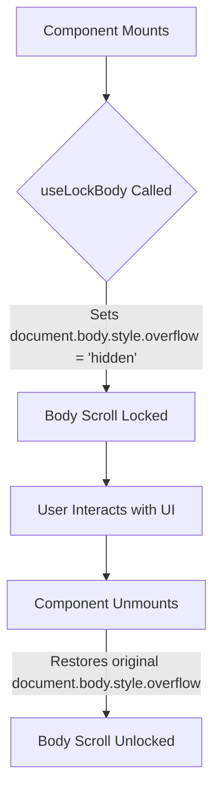
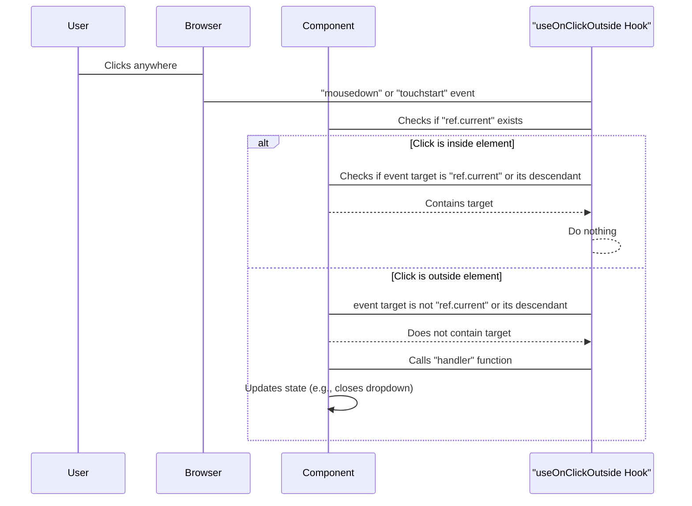

 # Custom Hooks

This section provides comprehensive documentation for the custom React hooks implemented across the application. These hooks are designed to encapsulate reusable logic, promote cleaner component code, and enhance maintainability by abstracting complex stateful behaviors and side effects. By centralizing common functionalities, these hooks ensure consistency and reduce redundancy throughout the codebase.

## `useLockBody`

The `useLockBody` hook provides a simple yet effective mechanism to prevent body scrolling. This is particularly useful for scenarios such as opening modals, sidebars, or any overlay that requires the background content to remain static. It works by temporarily setting the `overflow` CSS property of the `document.body` to `hidden` when the component using the hook is mounted, and reverts it to its original state upon unmounting.

### Usage

This hook is straightforward to use. Simply call it within any functional component where you need to disable body scrolling. It does not take any arguments or return any values.

```typescript
import * as React from "react";

// @see https://usehooks.com/useLockBodyScroll.
export function useLockBody() {
  React.useLayoutEffect((): (() => void) => {
    const originalStyle: string = window.getComputedStyle(
      document.body,
    ).overflow;
    document.body.style.overflow = "hidden";
    return () => (document.body.style.overflow = originalStyle);
  }, []);
}
```

[View on GitHub](https://github.com/lande26/LandeMon/blob/main/src/hooks/use-lock-body.ts)

### Example Integration

```typescript
import { useLockBody } from "../hooks/use-lock-body";

function Modal({ isOpen, onClose, children }) {
  if (isOpen) {
    useLockBody(); // Lock body scroll when modal is open
  }

  return isOpen ? (
    <div className="modal-overlay" onClick={onClose}>
      <div className="modal-content" onClick={(e) => e.stopPropagation()}>
        {children}
        <button onClick={onClose}>Close</button>
      </div>
    </div>
  ) : null;
}
```

### Flow Diagram

This diagram illustrates the lifecycle of the `useLockBody` hook in relation to a component's rendering.





### Best Practices

*   **Conditional Usage:** Only call `useLockBody` when absolutely necessary, typically within a conditional render (e.g., when a modal is open) or a component that truly requires the body to be locked for its entire lifecycle.
*   **Performance:** `useLayoutEffect` is used to ensure that the DOM update happens synchronously before the browser repaints, preventing any potential scroll flicker.

## `useMounted`

The `useMounted` hook provides a simple way to track whether a component has mounted or not. It returns a boolean value that is `true` after the component has mounted and `false` if it is unmounted. This is particularly useful for preventing state updates on unmounted components, which can lead to memory leaks and React warnings.

### Usage

Call `useMounted` within your functional component. It returns a boolean indicating the mounted status.

```typescript
import * as React from "react";

export function useMounted() {
  const [mounted, setMounted] = React.useState(false);

  React.useEffect(() => {
    setMounted(true);

    return () => setMounted(false);
  }, []);

  return mounted;
}
```

[View on GitHub](https://github.com/lande26/LandeMon/blob/main/src/hooks/use-mounted.ts)

### Example Integration

```typescript
import * as React from "react";
import { useMounted } from "../hooks/use-mounted";

function DataFetcher() {
  const isMounted = useMounted();
  const [data, setData] = React.useState(null);
  const [loading, setLoading] = React.useState(true);

  React.useEffect(() => {
    const fetchData = async () => {
      // Simulate API call
      await new Promise((resolve) => setTimeout(resolve, 1000));
      if (isMounted) { // Only update state if component is still mounted
        setData({ message: "Data loaded!" });
        setLoading(false);
      }
    };

    fetchData();
  }, [isMounted]); // Dependency on isMounted ensures re-run if it changes

  if (loading) return <div>Loading...</div>;
  return <div>{data?.message}</div>;
}
```

### Best Practices

*   **Preventing Memory Leaks:** Primarily use `isMounted` to gate asynchronous operations (like API calls) that update component state. This prevents `Can't perform a React state update on an unmounted component` warnings.
*   **Conditional Rendering:** While `isMounted` is primarily for state updates, it can also be used in rare cases for conditional rendering logic that strictly depends on the component being fully mounted.

## `useOnClickOutside`

The `useOnClickOutside` hook provides a convenient way to detect clicks that occur outside of a specified DOM element. This is highly useful for implementing common UI patterns like closing dropdowns, modals, or side navigation menus when a user clicks anywhere else on the screen.

### Usage

This hook requires a `ref` to the element you want to monitor and a `handler` function to execute when an outside click occurs.

```typescript
import * as React from "react";

export function useOnClickOutside<T extends HTMLElement = HTMLElement>(
  ref: React.RefObject<T>,
  handler: (event: Event) => void,
) {
  React.useEffect(() => {
    const listener = (e: Event) => {
      // Do nothing if clicking ref's element or descendent elements
      if (!ref.current || ref.current.contains(e.target as Node) || null) {
        return;
      }
      handler(e);
    };
    document.addEventListener("mousedown", listener);
    document.addEventListener("touchstart", listener);

    return () => {
      document.removeEventListener("mousedown", listener);
      document.removeEventListener("touchstart", listener);
    };
  }, [ref, handler]);
}
```

[View on GitHub](https://github.com/lande26/LandeMon/blob/main/src/hooks/use-on-click-outside.ts)

### Example Integration

```typescript
import * as React from "react";
import { useOnClickOutside } from "../hooks/use-on-click-outside";

function Dropdown() {
  const [isOpen, setIsOpen] = React.useState(false);
  const dropdownRef = React.useRef(null);

  useOnClickOutside(dropdownRef, () => setIsOpen(false));

  return (
    <div ref={dropdownRef} style={{ position: "relative", display: "inline-block" }}>
      <button onClick={() => setIsOpen(!isOpen)}>
        {isOpen ? "Close" : "Open"} Dropdown
      </button>
      {isOpen && (
        <ul
          style={{
            position: "absolute",
            border: "1px solid #ccc",
            padding: "10px",
            background: "white",
            minWidth: "150px",
            marginTop: "5px",
            listStyle: "none",
            zIndex: 1000
          }}
        >
          <li>Item 1</li>
          <li>Item 2</li>
          <li>Item 3</li>
        </ul>
      )}
    </div>
  );
}
```

### Event Handling Workflow





### Best Practices

*   **Memoize Handler:** If the `handler` function is not stable (i.e., it's an inline function or recreated on every render), it can cause the `useEffect` to re-run unnecessarily. Wrap your `handler` in `React.useCallback` to prevent this.
*   **Event Types:** The hook listens for both `mousedown` and `touchstart` events to cover both mouse and touch interactions. Ensure your handler is robust enough for both.
*   **Ref Management:** Always pass a `React.RefObject` created with `React.useRef` to this hook.

## Key Integration Points

Custom hooks are foundational for building maintainable and scalable React applications. When integrating these hooks, consider the following best practices:

*   **Modularity:** Each hook is designed to solve a single, focused problem. Avoid creating "mega-hooks" that handle too many unrelated concerns. This improves readability and testability.
*   **Reusability:** Identify common patterns in your components (e.g., controlling side effects, managing global state interactions, handling external events) and abstract them into custom hooks.
*   **Testing:** Treat custom hooks as independent units of logic. Write unit tests for your hooks to ensure they function correctly in isolation, separate from component rendering.
*   **Documentation:** Clear documentation, like this guide, is crucial. Explain the purpose, parameters, return values, and typical use cases for each hook to facilitate adoption by other developers.
*   **Performance Considerations:** Be mindful of the dependencies array in `useEffect` and `useLayoutEffect`. Incorrect dependencies can lead to stale closures or unnecessary re-runs, impacting performance. `useCallback` and `useMemo` can be used to stabilize functions and objects passed as dependencies.
*   **Accessibility:** When developing hooks that interact with the DOM, such as `useLockBody` or `useOnClickOutside`, always consider the impact on accessibility. For instance, ensure focus management is correct for modals (`useLockBody`) and that keyboard users can still interact with elements outside a dropdown if needed (`useOnClickOutside`).
*   **Type Safety:** Leverage TypeScript effectively to define clear types for hook parameters and return values, enhancing developer experience and preventing common errors.