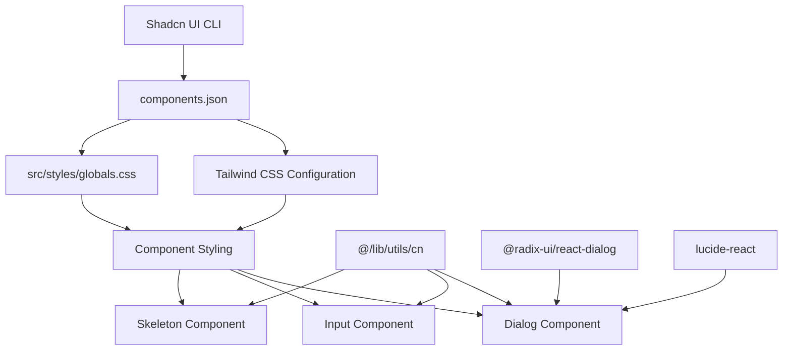
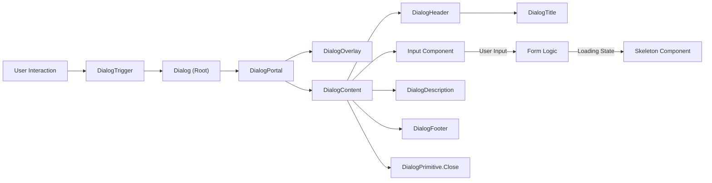

 # UI Primitives and Shadcn Components

This document outlines the foundational UI elements and components integrated into the system, primarily leveraging the `components.json` configuration for Shadcn UI. These components provide a robust, accessible, and customizable base for building the user interface, ensuring consistency and accelerated development.

## Shadcn UI Configuration (`components.json`)

The `components.json` file serves as the central configuration for how Shadcn UI components are managed and integrated into the project. It dictates styling, TypeScript usage, Tailwind CSS setup, and path aliases, streamlining the component generation and usage process.

### Configuration Overview

The configuration specifies the preferred styling, enables React Server Components (RSC) and TypeScript (TSX) support, and defines the Tailwind CSS integration, including the base color and CSS variables. It also sets up convenient aliases for importing components and utility functions.

```json
// components.json
{
  "$schema": "https://ui.shadcn.com/schema.json",
  "style": "default",
  "rsc": true,
  "tsx": true,
  "tailwind": {
    "config": "tailwind.config.ts",
    "css": "src/styles/globals.css",
    "baseColor": "slate",
    "cssVariables": true
  },
  "aliases": {
    "components": "@/components",
    "utils": "@/lib/utils"
  }
}
```

This configuration ensures that any new components generated via the Shadcn CLI (`npx shadcn-ui@latest add <component>`) adhere to the project's standards, utilizing our `tailwind.config.ts` and `src/styles/globals.css`. The `aliases` section, in particular, simplifies imports throughout the codebase.

### Aliases for Component and Utility Imports

The `aliases` defined in `components.json` are crucial for maintaining clean and readable import paths. They map logical names to physical file system locations, abstracting away the underlying directory structure.

| Alias Name   | Mapped Path           | Purpose                                  |
| :----------- | :-------------------- | :--------------------------------------- |
| `components` | `@/components`        | For importing UI components              |
| `utils`      | `@/lib/utils`         | For importing shared utility functions   |

This allows for imports like `import { Input } from "@/components/ui/input";` instead of relative paths, which can become cumbersome in larger projects.

## Core UI Components

The project utilizes several fundamental UI components from Shadcn, which are built on top of Radix UI primitives. These components offer high customizability and accessibility out-of-the-box.

### Dialog Component

The `Dialog` component provides an accessible and flexible modal dialog system. It is composed of several sub-components from `@radix-ui/react-dialog`, wrapped with Tailwind CSS for styling and `cn` utility for conditional class merging.

-   **File**: `src/components/ui/dialog.tsx` [View on GitHub](https://github.com/lande26/LandeMon/blob/main/src/components/ui/dialog.tsx)
-   **Usage**: Enables displaying interactive content, such as forms or confirmations, in an overlay.

#### Key Sub-Components

The `Dialog` component exports several primitives for granular control:

-   `Dialog`: The root component for the dialog.
-   `DialogTrigger`: The element that opens the dialog.
-   `DialogPortal`: Renders the dialog content outside the current DOM hierarchy, usually at the `body` level, for correct stacking context.
-   `DialogOverlay`: A semi-transparent overlay that covers the rest of the page when the dialog is open.
-   `DialogContent`: The main container for the dialog's content, including animations for opening and closing.
-   `DialogHeader`, `DialogFooter`, `DialogTitle`, `DialogDescription`: Semantic components for structuring the dialog's internal content.

A critical aspect of the `DialogContent` is its built-in close button, using the `X` icon from `lucide-react`, ensuring that users can easily dismiss the dialog.

```typescript
// Excerpt from src/components/ui/dialog.tsx
const DialogContent = React.forwardRef<
  React.ElementRef<typeof DialogPrimitive.Content>,
  React.ComponentPropsWithoutRef<typeof DialogPrimitive.Content>
>(({ className, children, ...props }, ref) => (
  <DialogPortal>
    <DialogOverlay />
    <DialogPrimitive.Content
      ref={ref}
      className={cn(
        'fixed left-[50%] top-[50%] z-50 grid w-full max-w-lg translate-x-[-50%] translate-y-[-50%] gap-4 border bg-background p-6 shadow-lg duration-200 data-[state=open]:animate-in data-[state=closed]:animate-out data-[state=closed]:fade-out-0 data-[state=open]:fade-in-0 data-[state=closed]:zoom-out-95 data-[state=open]:zoom-in-95 data-[state=closed]:slide-out-to-left-1/2 data-[state=closed]:slide-out-to-top-[48%] data-[state=open]:slide-in-from-left-1/2 data-[state=open]:slide-in-from-top-[48%] sm:rounded-lg',
        className,
      )}
      {...props}>
      {children}
      <DialogPrimitive.Close className="absolute right-4 top-4 z-[10] rounded-sm opacity-70 ring-offset-background transition-opacity hover:opacity-100 focus:outline-none focus:ring-2 focus:ring-ring focus:ring-offset-2 disabled:pointer-events-none data-[state=open]:bg-accent data-[state=open]:text-muted-foreground">
        <X className="h-6 w-6" />
        <span className="sr-only">Close</span>
      </DialogPrimitive.Close>
    </DialogPrimitive.Content>
  </DialogPortal>
));
DialogContent.displayName = DialogPrimitive.Content.displayName;
```

### Input Component

The `Input` component provides a styled and accessible text input field. It extends standard HTML input attributes and applies project-specific styling via Tailwind CSS.

-   **File**: `src/components/ui/input.tsx` [View on GitHub](https://github.com/lande26/LandeMon/blob/main/src/components/ui/input.tsx)
-   **Usage**: Used for collecting user text, numbers, or other data types.

The `Input` component is a simple `React.forwardRef` wrapper around a native `<input>` element. It applies a set of default Tailwind classes for consistent styling across the application, including borders, backgrounds, padding, text size, and focus states.

```typescript
// Excerpt from src/components/ui/input.tsx
const Input = React.forwardRef<HTMLInputElement, InputProps>(
  ({ className, type, ...props }, ref) => {
    return (
      <input
        type={type}
        className={cn(
          "flex h-10 w-full rounded-md border border-input bg-background px-3 py-2 text-sm ring-offset-background file:border-0 file:bg-transparent file:text-sm file:font-medium placeholder:text-muted-foreground focus-visible:outline-none focus-visible:ring-2 focus-visible:ring-ring focus-visible:ring-offset-2 disabled:cursor-not-allowed disabled:opacity-50",
          className,
        )}
        ref={ref}
        {...props}
      />
    );
  },
);
Input.displayName = "Input";
```

### Skeleton Component

The `Skeleton` component is used to display a placeholder preview of content while it is being loaded. This improves perceived performance and provides a smoother user experience.

-   **File**: `src/components/ui/skeleton.tsx` [View on GitHub](https://github.com/lande26/LandeMon/blob/main/src/components/ui/skeleton.tsx)
-   **Usage**: Typically used during data fetching or initial page load to indicate loading states for UI elements.

The `Skeleton` component is a simple `div` with an `animate-pulse` class, providing a subtle animation, and `rounded-md bg-muted` for its visual appearance.

```typescript
// Excerpt from src/components/ui/skeleton.tsx
function Skeleton({
  className,
  ...props
}: React.HTMLAttributes<HTMLDivElement>) {
  return (
    <div
      className={cn("animate-pulse rounded-md bg-muted", className)}
      {...props}
    />
  );
}
```

### Component Flow and Dependencies

The core UI components generally depend on the `cn` utility function for merging Tailwind classes and utilize `React.forwardRef` for ref forwarding, a common pattern in component libraries.





## Key Integration Points

The integration of Shadcn UI components is highly streamlined due to the `components.json` configuration and the consistent application of Tailwind CSS.

1.  **Centralized Configuration**: `components.json` acts as the single source of truth for component generation settings, ensuring all new Shadcn UI components automatically integrate with the project's styling and structure. This minimizes manual setup and configuration errors.
2.  **Consistent Styling**: By leveraging Tailwind CSS and the `cn` utility, components maintain a unified look and feel. The `baseColor` and `cssVariables` settings in `components.json` enforce design system adherence, allowing for easy theme switching or modifications.
3.  **Accessibility**: Shadcn UI components are built on Radix UI primitives, which are designed with accessibility in mind. This means essential ARIA attributes and keyboard navigation are handled out-of-the-box, significantly reducing the effort required to meet accessibility standards.
4.  **Developer Experience**: The defined aliases (`@/components`, `@/lib/utils`) improve readability and reduce boilerplate in import statements. `React.forwardRef` is widely used, allowing parent components to directly interact with the DOM elements of these primitives when necessary, for example, for focusing or measuring.

### Component Structure and Usage





This diagram illustrates a typical interaction flow, where user interaction triggers a `Dialog`, which might contain an `Input` field. During data submission or loading, a `Skeleton` component could be used to indicate pending content. The entire structure is composed using the primitives defined in this document.

Next: [Utility Functions and Hooks](./5_utility-functions-and-hooks.mdx)