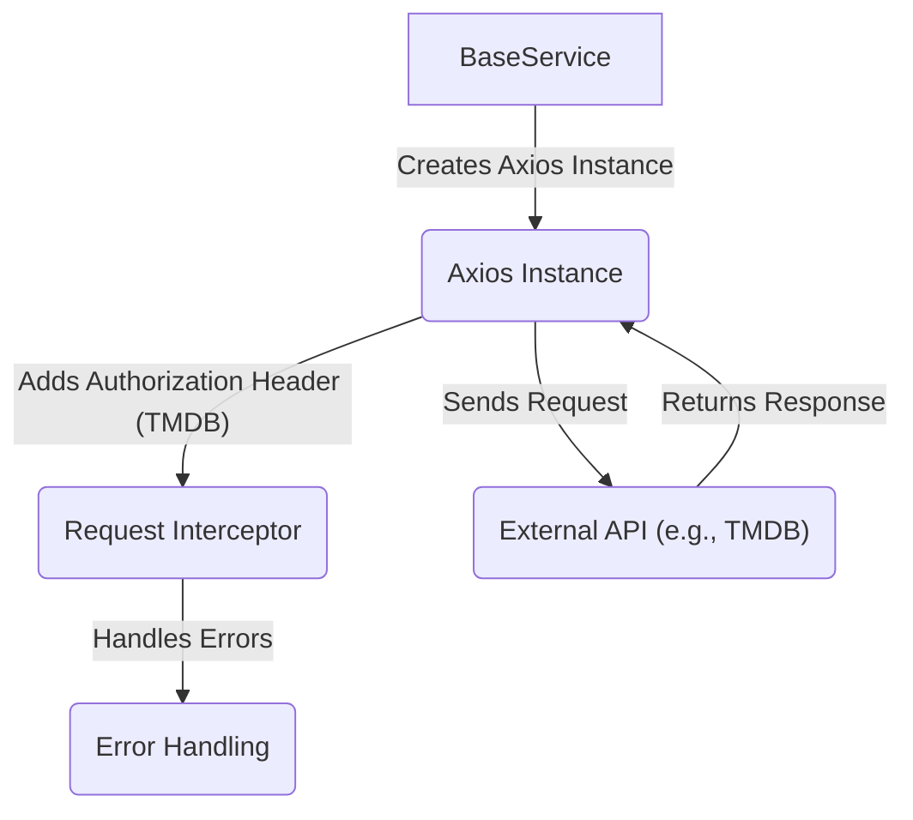
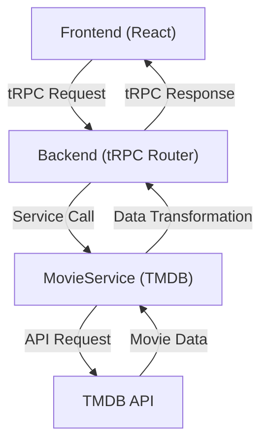

# Backend Services and APIs

This section details the backend services of LandeMon, focusing on data handling, business logic, and API endpoints. The core responsibilities include managing movie data, generating sitemaps for SEO, and providing a consistent API layer for the frontend.

## Core Components

*   **Data Fetching**:  Retrieving movie and TV show information from external APIs (primarily TMDB).
*   **Sitemap Generation**:  Dynamically creating sitemap XML files to improve search engine crawlability.
*   **API Endpoints**: Exposing data and functionality to the frontend via tRPC.
*   **Base Service**: Providing a foundation for interacting with external APIs, including configuration and error handling.

## Sitemap Generation

LandeMon dynamically generates sitemaps to ensure search engines can effectively crawl and index the site's content.  The sitemap generation is split into two main route handlers: `src/app/sitemap.xml/route.ts` and `src/app/sitemap/[id]/route.ts`.

### `src/app/sitemap.xml/route.ts`

This route generates the main sitemap index file, which points to multiple sitemap files. This is necessary because sitemaps have size limitations (e.g., a maximum number of URLs).

```typescript
// File: src/app/sitemap.xml/route.ts
import { env } from '@/env.mjs';
export function GET() {
  const sitemapIndices: string[] = [];
  // tmdb has a limit of 500 pages
  for (let i = 0; i < 501; i++) {
    sitemapIndices.push(
      `
                  <sitemap>
                    <loc>${env.NEXT_PUBLIC_APP_URL}/sitemap/${i}.xml</loc>
                  </sitemap>
      `,
    );
  }
  const sitemap = `<?xml version="1.0" encoding="UTF-8"?>
            <sitemapindex xmlns="http://www.sitemaps.org/schemas/sitemap/0.9">
              ${sitemapIndices.join('')}
            </sitemapindex>
            `;

  return new Response(sitemap, {
    status: 200,
    headers: { 'Content-Type': 'text/xml' },
  });
}
```

[View on GitHub](https://github.com/lande26/LandeMon/blob/main/src/app/sitemap.xml/route.ts)

The code iterates to create an array of sitemap index entries, each pointing to a specific sitemap file (`/sitemap/${i}.xml`). The loop limit is set to `501`, which indicates TMDB's API limits results to 500 pages. This route returns an XML response containing the sitemap index.

### `src/app/sitemap/[id]/route.ts`

This route generates individual sitemap files containing URLs for movies and TV shows.

```typescript
// File: src/app/sitemap/[id]/route.ts
import { env } from '@/env.mjs';
import { buildMovieUrl } from '@/lib/utils';
import { getTrendingAll } from '@/services/MovieService/tmdbService';

export async function GET(request: Request, ctx: { params: { id: string } }) {
  if (!ctx.params.id) return new Response('Not found', { status: 404 });
  const id = parseInt(ctx.params.id.replace('.xml', ''));
  let urls: string[] = [];
  if (id === 0) {
    urls = [
      `${env.NEXT_PUBLIC_APP_URL}`,
      `${env.NEXT_PUBLIC_APP_URL}/home`,
      `${env.NEXT_PUBLIC_APP_URL}/tv-shows`,
      `${env.NEXT_PUBLIC_APP_URL}/movies`,
      `${env.NEXT_PUBLIC_APP_URL}/new-and-popular`,
    ];
  } else {
    const data = await getTrendingAll(id);
    data.results.forEach((show) => urls.push(buildMovieUrl(show)));
  }
  const sitemap = `<urlset xmlns="https://www.sitemaps.org/schemas/sitemap/0.9" xmlns:news="http://www.google.com/schemas/sitemap-news/0.9" xmlns:xhtml="http://www.w3.org/1999/xhtml" xmlns:image="http://www.google.com/schemas/sitemap-image/1.1" xmlns:video="http://www.google.com/schemas/sitemap-video/1.1">
      ${urls
        .map((url) => {
          return `
                <url>
                    <loc>${url}</loc>
                </url>
              `;
        })
        .join('')}
    </urlset>
  `;

  return new Response(sitemap, {
    status: 200,
    headers: { 'Content-Type': 'text/xml' },
  });
}
```

[View on GitHub](https://github.com/lande26/LandeMon/blob/main/src/app/sitemap/%5Bid%5D/route.ts)

This route dynamically fetches trending movies and TV shows using the `getTrendingAll` function from `tmdbService.ts` based on the provided `id`. If the `id` is 0, it adds some static pages to the sitemap.  It then constructs an XML sitemap containing the URLs for these movies and TV shows, using `buildMovieUrl` to generate the correct URLs.

## Base Service

The `BaseService` class provides a foundation for interacting with external APIs.  It handles configuration, request interception (for adding API keys), and error handling.

```typescript
// File: src/services/BaseService/BaseService.ts
import axios, {
  type AxiosRequestConfig,
  type AxiosError,
  type AxiosInstance,
  type InternalAxiosRequestConfig,
} from 'axios';
import { env } from '@/env.mjs';

/**
 * @class BaseService
 */
class BaseService {
  constructor() {
    if (this.constructor === BaseService) {
      throw new Error("Classes can't be instantiated.");
    }
  }

  static axios(baseUrl: string) {
    const instanceConfig: AxiosRequestConfig = this.getConfig(baseUrl);
    const instance: AxiosInstance = axios.create(instanceConfig);

    const onRequest = (
      config: InternalAxiosRequestConfig,
    ): InternalAxiosRequestConfig => {
      if (config.baseURL?.includes('themoviedb')) {
        // const params = config.params as Record<string, unknown>;
        // config.params = { ...params, api_key: env.NEXT_PUBLIC_TMDB_API_KEY };
        config.headers.Authorization = `Bearer ${env.NEXT_PUBLIC_TMDB_TOKEN}`;
      }
      return config;
    };

    const onErrorResponse = (
      error: AxiosError | Error,
    ): Promise<AxiosError> => {
      console.error(`error in request: ${error.message}`);
      return Promise.reject(error);
    };

    instance.interceptors.request.use(onRequest, onErrorResponse);

    return instance;
  }

  static getConfig(baseUrl: string): AxiosRequestConfig {
    return {
      timeout: 15000,
      baseURL: baseUrl,
      responseType: 'json',
      maxContentLength: 100000,
      validateStatus: (status: number) => status >= 200 && status < 300,
      maxRedirects: 5,
    };
  }

  static isRejected = (
    input: PromiseSettledResult<unknown>,
  ): input is PromiseRejectedResult => input.status === 'rejected';

  static isFulfilled = <T>(
    input: PromiseSettledResult<T>,
  ): input is PromiseFulfilledResult<T> => input.status === 'fulfilled';
}

export default BaseService;
```

[View on GitHub](https://github.com/lande26/LandeMon/blob/main/src/services/BaseService/BaseService.ts)

Key aspects of the `BaseService`:

*   **Axios Instance Creation**:  The `axios` method creates an Axios instance with predefined configurations, including a timeout, base URL, and response type.
*   **Request Interceptor**:  The request interceptor adds the TMDB API key to the request headers before sending it. This ensures that all requests to TMDB are authenticated.
*   **Error Handling**:  The `onErrorResponse` function logs errors and rejects the promise, providing a consistent way to handle API errors.
*   **Configuration**: The `getConfig` function sets up the default Axios configuration.





## tRPC Router

The `src/server/index.ts` file defines the tRPC router for the backend. tRPC allows you to build fully typesafe APIs without schemas or code generation.

```typescript
// File: src/server/index.ts
import { helloRouter } from "@/server/routers/hello";
import { router } from "@/server/trpc";

export const appRouter = router({
  hello: helloRouter,
});

export type AppRouter = typeof appRouter;
```

[View on GitHub](https://github.com/lande26/LandeMon/blob/main/src/server/index.ts)

This example sets up a simple tRPC router with a `hello` route. The `AppRouter` type is exported, making it accessible for type inference on the frontend.

## Key Integration Points

The backend services are integrated as follows:

1.  **Frontend Requests**: The frontend uses tRPC to make requests to the backend.
2.  **tRPC Router**: The tRPC router handles the incoming requests and routes them to the appropriate service.
3.  **Services**: The services use the `BaseService` to interact with external APIs, such as TMDB.
4.  **Data Handling**: The services process the data from the APIs and return it to the frontend.
5.  **Sitemap Generation**: The sitemap routes are accessed by search engine crawlers to index the website.

Best practices for backend development in LandeMon include:

*   **Centralized API Configuration**: Using `BaseService` to manage API configuration and authentication.
*   **Type Safety**: Leveraging tRPC for end-to-end type safety between the frontend and backend.
*   **Error Handling**: Implement comprehensive error handling in all services and API endpoints.
*   **Environment Variables**: Securely manage API keys and other sensitive information using environment variables.





```typescript
//Example .env file using bash
NEXT_PUBLIC_APP_URL="https://your-landemon-app.com"
NEXT_PUBLIC_TMDB_API_KEY="your_tmdb_api_key"
NEXT_PUBLIC_TMDB_TOKEN="your_tmdb_token"
```

[View on GitHub](https://github.com/lande26/LandeMon/blob/main/.env.example)
```