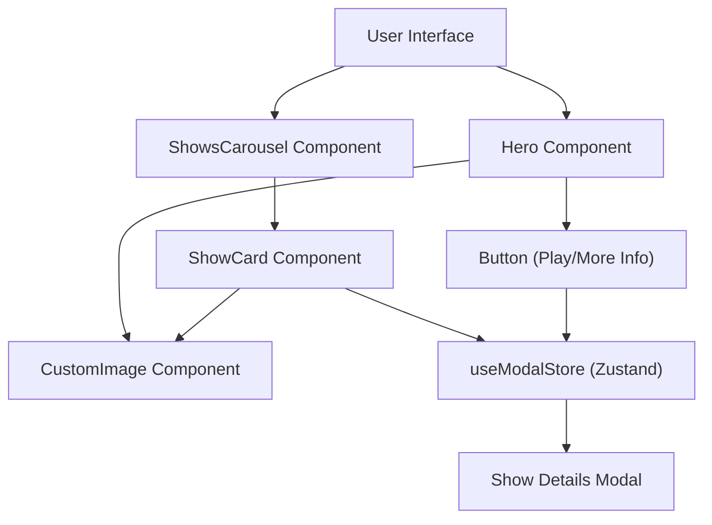

 # Reusable UI Components

This document provides a comprehensive overview of the reusable UI components implemented within the application. These components are categorized into custom-built elements and those leveraging the `ui` directory, often based on [Shadcn UI](https://ui.shadcn.com/). By centralizing these components, we ensure consistency, maintainability, and accelerated development across the application.

## Core Component Principles

*   **Reusability**: Designed to be used in multiple parts of the application without modification.
*   **Encapsulation**: Each component manages its own state and logic, minimizing side effects.
*   **Accessibility**: Built with accessibility best practices in mind, ensuring a usable experience for all users.
*   **Theming**: Adheres to the application's design system for consistent visual appeal.

## Custom-Built UI Components

These components are specifically tailored to the application's unique requirements and often integrate with various services and stores.

### Hero Component

The `Hero` component serves as the prominent display element on the main page, showcasing a randomly selected movie or TV show. It includes dynamic content loading, playback functionality, and detailed information access.

**Key Features:**

*   **Dynamic Content**: Fetches and displays a random `Show` (movie or TV series) upon initial load.
*   **Media Playback**: Integrates a "Play" button that initiates media playback or opens a modal for a specific show.
*   **Details Access**: A "More Info" button triggers a modal with comprehensive details about the displayed show.
*   **Pathname Handling**: Adjusts routing and modal behavior based on the current URL pathname (e.g., `/anime` section).
*   **Image Optimization**: Utilizes a `CustomImage` component for efficient image loading and error handling.

**Usage:**

The `Hero` component is typically rendered at the top of the main landing pages to provide an engaging first impression.

```tsx title="src/components/hero.tsx" {16-17,67-73}
interface HeroProps {
  randomShow: Show | null;
}

const Hero = ({ randomShow }: HeroProps) => {
  const path = usePathname();
  React.useEffect(() => {
    window.addEventListener('popstate', handlePopstateEvent, false);
    return () => {
      window.removeEventListener('popstate', handlePopstateEvent, false);
    };
  }, []);
  // ... (rest of the component logic)

  return (
    <section aria-label="Hero" className="w-full">
      {randomShow && (
        <>
          <div className="absolute inset-0 z-0 h-[100vw] w-full sm:h-[56.25vw]">
            <CustomImage
              src={`https://image.tmdb.org/t/p/original${
                randomShow?.backdrop_path ?? randomShow?.poster_path ?? ''
              }`}
              alt={randomShow?.title ?? 'poster'}
              className="-z-40 h-auto w-full object-cover"
              sizes="(max-width: 768px) 50vw, (max-width: 1200px) 100vw, 33vw"
              fill
              priority
            />
            <div className="absolute bottom-0 left-0 right-0 top-0">
              <div className="absolute bottom-[35%] left-[4%] top-0 z-10 flex w-[36%] flex-col justify-end space-y-2">
                <h1 className="text-[3vw] font-bold">
                  {randomShow?.title ?? randomShow?.name}
                </h1>
                {/* ... (other details) */}
                <div className="mt-[1.5vw] flex items-center space-x-2">
                  <Link prefetch={false} href={handleHref()}>
                    <Button
                      aria-label="Play video"
                      className="h-auto flex-shrink-0 gap-2 rounded-xl">
                      <Icons.play className="fill-current" aria-hidden="true" />
                      Play
                    </Button>
                  </Link>
                  <Button
                    aria-label="Open show's details modal"
                    variant="outline"
                    className="h-auto flex-shrink-0 gap-2 rounded-xl"
                    onClick={() => {
                      const name = getNameFromShow(randomShow);
                      const path: string =
                        randomShow.media_type === MediaType.TV
                          ? 'tv-shows'
                          : 'movies';
                      window.history.pushState(
                        null,
                        '',
                        `${path}/${getSlug(randomShow.id, name)}`,
                      );
                      useModalStore.setState({
                        show: randomShow,
                        open: true,
                        play: true,
                      });
                    }}>
                    <Icons.info aria-hidden="true" />
                    More Info
                  </Button>
                </div>
              </div>
            </div>{' '}
            {/* ... (gradient overlays) */}
          </div>
          <div className="relative inset-0 -z-50 mb-5 pb-[60%] sm:pb-[40%]"></div>
        </>
      )}
    </section>
  );
};
```
[View on GitHub](https://github.com/lande26/LandeMon/blob/main/src/components/hero.tsx)

### Shows Carousel Component

The `ShowsCarousel` component displays a horizontal, scrollable list of `Show` cards. It's used for showcasing various categories of movies or TV series, such as trending, popular, or genre-specific content.

**Key Features:**

*   **Horizontal Scrolling**: Allows users to scroll through a large collection of shows.
*   **Navigation Buttons**: Provides left and right chevron buttons for programmatic scrolling.
*   **Responsive Layout**: Adapts the number of visible cards based on screen size using CSS grid properties.
*   **ShowCard Sub-component**: Each item in the carousel is a `ShowCard`, displaying the show's poster and enabling interaction (e.g., opening a modal for details).

**Usage:**

Multiple `ShowsCarousel` instances can be rendered on a single page, each with a different `title` and `shows` prop, to create rich content feeds.

```tsx title="src/components/shows-carousel.tsx" {16-20,44-50}
interface ShowsCarouselProps {
  title: string;
  shows: Show[];
}

const ShowsCarousel = ({ title, shows }: ShowsCarouselProps) => {
  const pathname = usePathname();

  const showsRef = React.useRef<HTMLDivElement>(null);
  const [isScrollable, setIsScrollable] = React.useState(false);

  // handle scroll to left and right
  const scrollToDirection = (direction: 'left' | 'right') => {
    if (!showsRef.current) return;

    setIsScrollable(true);
    const { scrollLeft, offsetWidth } = showsRef.current;
    const handleSize = offsetWidth > 1400 ? 60 : 0.04 * offsetWidth;
    const offset =
      direction === 'left'
        ? scrollLeft - (offsetWidth - 2 * handleSize)
        : scrollLeft + (offsetWidth - 2 * handleSize);
    showsRef.current.scrollTo({ left: offset, behavior: 'smooth' });

    if (scrollLeft === 0 && direction === 'left') {
      showsRef.current.scrollTo({
        left: showsRef.current.scrollWidth,
        behavior: 'smooth',
      });
    } else if (
      scrollLeft + offsetWidth === showsRef.current.scrollWidth &&
      direction === 'right'
    ) {
      showsRef.current.scrollTo({
        left: 0,
        behavior: 'smooth',
      });
    }
  };

  return (
    <section aria-label="Carousel of shows" className="relative my-[3vw] p-0">
      {shows.length !== 0 && (
        <div className="space-y-1 sm:space-y-2.5">
          <h2 className="m-0 px-[4%] text-lg font-semibold text-foreground/80 transition-colors hover:text-foreground sm:text-xl 2xl:px-[60px]">
            {title ?? '-'}
          </h2>
          <div className="relative w-full items-center justify-center overflow-hidden">
            <Button
              aria-label="Scroll to left"
              variant="ghost"
              className={cn(
                'absolute left-0 top-0 z-10 mr-2 hidden h-full w-[4%] items-center justify-center rounded-l-none bg-transparent py-0 text-transparent hover:bg-secondary/90 hover:text-foreground md:block 2xl:w-[60px]',
                isScrollable ? 'md:block' : 'md:hidden',
              )}
              onClick={() => scrollToDirection('left')}>
              <Icons.chevronLeft className="h-8 w-8" aria-hidden="true" />
            </Button>
            <div
              ref={showsRef}
              className="no-scrollbar m-0 grid auto-cols-[calc(100%/3)] grid-flow-col overflow-x-auto overflow-y-hidden px-[4%] py-0 duration-500 ease-in-out sm:auto-cols-[25%] md:touch-pan-y lg:auto-cols-[20%] xl:auto-cols-[calc(100%/6)] 2xl:px-[60px]">
              {shows.map((show) => (
                <ShowCard key={show.id} show={show} pathname={pathname} />
              ))}
            </div>
            <Button
              aria-label="Scroll to right"
              variant="ghost"
              className="absolute right-0 top-0 z-10 m-0 ml-2 hidden h-full w-[4%] items-center justify-center rounded-r-none bg-transparent py-0 text-transparent hover:bg-secondary/70 hover:text-foreground md:block 2xl:w-[60px]"
              onClick={() => scrollToDirection('right')}>
              <Icons.chevronRight className="h-8 w-8" aria-hidden="true" />
            </Button>
          </div>
        </div>
      )}
    </section>
  );
};
```
[View on GitHub](https://github.com/lande26/LandeMon/blob/main/src/components/shows-carousel.tsx)

### SiteHeader Component

The `SiteHeader` component provides the main navigation and branding for the application. It acts as a wrapper for the `MainNav` component, ensuring a consistent header across all pages.

**Key Features:**

*   **Sticky Position**: Remains fixed at the top of the viewport during scrolling.
*   **Main Navigation Integration**: Renders the `MainNav` component, which contains primary navigation links.
*   **Branding**: Can incorporate application branding or logo (implicitly handled by `MainNav`).

**Usage:**

The `SiteHeader` is typically included in the root layout or a top-level component that wraps the main content of the application.

```tsx title="src/components/main/site-header.tsx" {7-8}
import { siteConfig } from "@/configs/site";
import React from "react";
import MainNav from "@/components/navigation/main-nav";

const SiteHeader = () => {
  return (
    <header className="sticky top-0 z-50">
      <MainNav items={siteConfig.mainNav} />
    </header>
  );
};

export default SiteHeader;
```
[View on GitHub](https://github.com/lande26/LandeMon/blob/main/src/components/main/site-header.tsx)

## UI Primitives (from `ui` directory)

Components within the `src/components/ui` directory are generally more generic, styled using Tailwind CSS and often built on headless UI libraries like Radix UI (via Shadcn UI). These form the foundational building blocks for more complex components.

### Button Component

The `Button` component is a highly versatile and customizable button primitive. It supports various visual styles (variants) and sizes, ensuring a consistent look and feel for all interactive elements.

**Key Features:**

*   **Variants**: `default`, `destructive`, `outline`, `secondary`, `ghost`, `link`.
*   **Sizes**: `default`, `sm` (small), `lg` (large), `icon`.
*   **Accessibility**: Inherits standard button accessibility features.
*   **`asChild` Prop**: Allows the button's styles to be applied to a child component (e.g., a `Link` from `next/link`) while maintaining its semantic HTML.

**Usage:**

The `Button` component is widely used across the application for actions, navigation, and form submissions. It's imported and used by other components like `Hero` and `ShowsCarousel`.

```tsx title="src/components/ui/button.tsx" {16-20,41-45}
import * as React from 'react';
import { Slot } from '@radix-ui/react-slot';
import { cva, type VariantProps } from 'class-variance-authority';

import { cn } from '@/lib/utils';

const buttonVariants = cva(
  'inline-flex items-center justify-center rounded-md text-sm font-medium ring-offset-background transition-colors focus-visible:outline-none disabled:pointer-events-none disabled:opacity-50',
  {
    variants: {
      variant: {
        default: 'bg-primary text-primary-foreground hover:bg-primary/90',
        destructive:
          'bg-destructive text-destructive-foreground hover:bg-destructive/90',
        outline:
          'border border-input bg-background hover:bg-accent hover:text-accent-foreground',
        secondary:
          'bg-secondary text-secondary-foreground hover:bg-secondary/80',
        ghost: 'hover:bg-accent hover:text-accent-foreground',
        link: 'text-primary underline-offset-4 hover:underline',
      },
      size: {
        default: 'h-10 px-4 py-2',
        sm: 'h-9 rounded-md px-3',
        lg: 'h-11 rounded-md px-8',
        icon: 'h-10 w-10',
      },
    },
    defaultVariants: {
      variant: 'default',
      size: 'default',
    },
  },
);

export interface ButtonProps
  extends React.ButtonHTMLAttributes<HTMLButtonElement>,
    VariantProps<typeof buttonVariants> {
  asChild?: boolean;
}

const Button = React.forwardRef<HTMLButtonElement, ButtonProps>(
  ({ className, variant, size, asChild = false, ...props }, ref) => {
    const Comp = asChild ? Slot : 'button';
    return (
      <Comp
        className={cn(buttonVariants({ variant, size, className }))}
        ref={ref}
        {...props}
      />
    );
  },
);
Button.displayName = 'Button';

export { Button, buttonVariants };
```
[View on GitHub](https://github.com/lande26/LandeMon/blob/main/src/components/ui/button.tsx)

## Component Interaction Flow

The following diagram illustrates how some of these reusable components interact, particularly in the context of displaying show details.





## Key Integration Points

*   **Zustand State Management**: Many UI components, especially `Hero` and `ShowCard`, interact directly with the `useModalStore` (a Zustand store) to manage the state of the show details modal. This centralized state ensures that clicking on any show from any component opens the same modal with the correct data.
*   **`next/link` and `usePathname`**: Navigation within components like `Hero` leverages `next/link` for client-side routing and `usePathname` to conditionally render content or adjust routing logic based on the current URL.
*   **`CustomImage` Component**: Essential for optimized image loading and error handling, `CustomImage` is a dependency for both `Hero` and `ShowCard`, ensuring performant display of media posters and backdrops.
*   **`Button` Component**: The versatile `Button` primitive from `src/components/ui` is a fundamental building block, used extensively by `Hero`, `ShowsCarousel`, and other interactive elements, ensuring UI consistency and accessibility.
*   **Utility Functions (`src/lib/utils.ts`)**: Components frequently import and use helper functions like `getNameFromShow` and `getSlug` to format data and generate friendly URLs, promoting data consistency.

Next: [UI Primitives and Shadcn Components](./4.1_ui-primitives-and-shadcn-components.mdx)