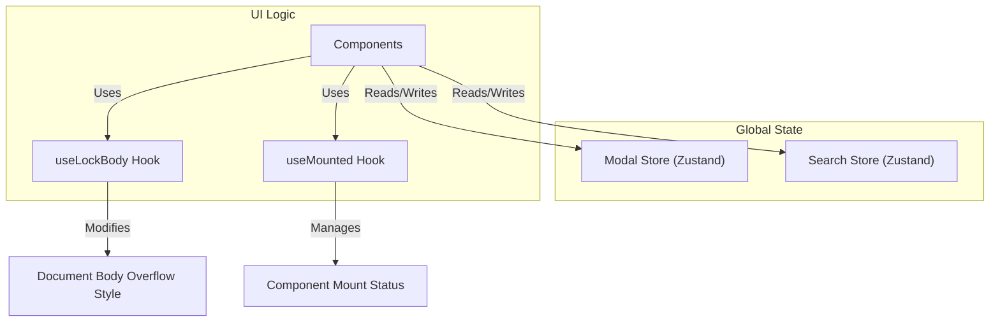

# State Management and Hooks

LandeMon employs a robust state management strategy primarily through **Zustand** for global application state and custom **React Hooks** for encapsulating reusable logic and side effects. This approach ensures a clean, maintainable, and performant application architecture.

## Global State Management with Zustand

Zustand is a small, fast, and scalable bearbones state-management solution. LandeMon utilizes Zustand to manage shared application states that need to be accessed and modified across various components.

### Modal State (`src/stores/modal.ts`)

The `modal` store manages the state related to modals, including their visibility, the content to be displayed, and playback controls.

```typescript
import type { Show } from '@/types';
import { create } from 'zustand';

interface ModalState {
  open: boolean;
  setOpen: (open: boolean) => void;
  firstLoad: boolean;
  show: Show | null;
  setShow: (show: Show | null) => void;
  play: boolean;
  setPlay: (play: boolean) => void;
  reset: () => void;
}

export const useModalStore = create<ModalState>()((set) => ({
  open: false,
  setOpen: (open: boolean) => set(() => ({ open })),
  firstLoad: false,
  setFirstLoad: (firstLoad: boolean) => set(() => ({ firstLoad })),
  show: null,
  setShow: (show: Show | null) => set(() => ({ show })),
  play: false,
  setPlay: (play: boolean) => set(() => ({ play })),
  reset: () =>
    set(() => ({
      show: null,
      open: false,
      play: false,
      firstLoad: false,
    })),
}));
```

### Search State (`src/stores/search.ts`)

The `search` store handles the state for the application's search functionality, including the search query, results, and loading indicators.

```typescript
import { clearSearch } from '@/lib/utils';
import type { Show } from '@/types';
import { create } from 'zustand';

interface SearchState {
  query: string;
  setQuery: (query: string) => void;
  shows: Show[];
  setShows: (shows: Show[]) => void;
  isOpen: boolean;
  setOpen: (value: boolean) => void;
  loading: boolean;
  setLoading: (value: boolean) => void;
  reset: () => void;
}

export const useSearchStore = create<SearchState>()((set) => ({
  query: '',
  setQuery: (query: string) => set(() => ({ query })),
  shows: [],
  setShows: (shows: Show[]) => set(() => ({ shows })),
  isOpen: false,
  setOpen: (value: boolean) => set(() => ({ isOpen: value })),
  loading: false,
  setLoading: (value: boolean) => set(() => ({ loading: value })),
  reset: () =>
    set(() => {
      clearSearch();
      return { query: '', shows: [], loading: false };
    }),
}));
```

## Custom React Hooks

Custom hooks provide a way to extract component logic into reusable functions. LandeMon leverages them for managing side effects and common UI behaviors.

### `useLockBody` Hook (`src/hooks/use-lock-body.ts`)

This hook prevents scrolling of the document body, typically used when a modal or overlay is open to ensure a better user experience.

```typescript
import * as React from "react";

// @see https://usehooks.com/useLockBodyScroll.
export function useLockBody() {
  React.useLayoutEffect((): (() => void) => {
    const originalStyle: string = window.getComputedStyle(
      document.body,
    ).overflow;
    document.body.style.overflow = "hidden";
    return () => (document.body.style.overflow = originalStyle);
  }, []);
}
```

### `useMounted` Hook (`src/hooks/use-mounted.ts`)

The `useMounted` hook returns a boolean indicating whether the component has mounted. This is useful for safely performing side effects or updates only after the component has been added to the DOM.

```typescript
import * as React from "react";

export function useMounted() {
  const [mounted, setMounted] = React.useState(false);

  React.useEffect(() => {
    setMounted(true);

    return () => setMounted(false);
  }, []);

  return mounted;
}
```

## State Management Architecture

This diagram illustrates the flow of state management within LandeMon, highlighting the interaction between Zustand stores and custom hooks.





## Key Takeaways

*   **Zustand for Global State**: Centralizes application-wide state like modal visibility, search queries, and results, making it easily accessible and manageable.
*   **Custom Hooks for Reusability**: Encapsulates common logic (e.g., body scrolling, mount detection) into reusable hooks, promoting cleaner component code.
*   **Decoupled Logic**: The separation of state management and UI logic through stores and hooks leads to a more modular and testable codebase.