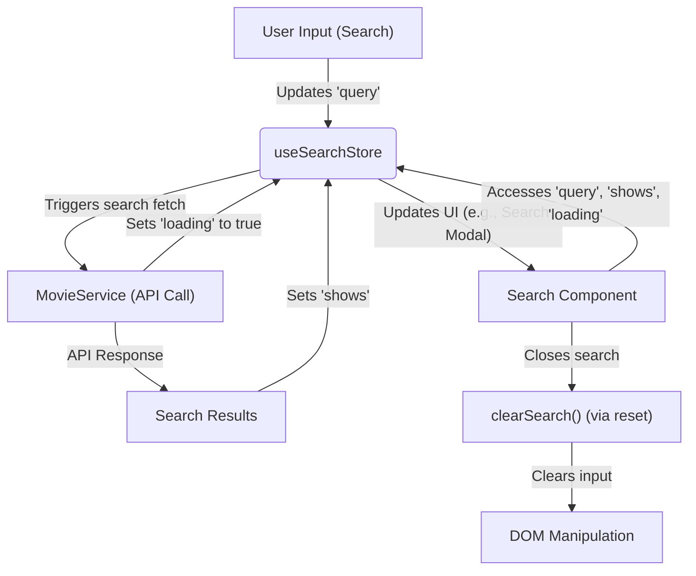

 # State Management and Utilities

This document provides a comprehensive overview of how application state is managed within the system and details a collection of shared utility functions and custom hooks. The architecture employs Zustand for efficient state management, ensuring predictable and performant handling of UI-related state such as modal visibility and search functionality. Complementing this, a rich set of utility functions and a custom React hook (`useMounted`) provide common functionalities, ranging from UI manipulation and data formatting to advanced client-side environment detection and metadata generation.

The separation of concerns—dedicated stores for state management and a centralized `utils` file for common operations—promotes maintainability and reusability across the application. This approach ensures that core functionalities are easily discoverable and consistently applied.

## State Management with Zustand

The application leverages [Zustand](https://zustand-bear.pmnd.rs/) for managing various aspects of the application's global state. Zustand is a small, fast, and scalable state-management solution that uses hooks. It's particularly well-suited for React applications, providing a simple yet powerful API for creating and consuming stores.

### Modal Store

The `useModalStore` manages the state related to the application's modal components. This includes its visibility, the content (`Show` data) it displays, and its playback state.

It includes:
*   `open`: A boolean indicating if the modal is currently open.
*   `setOpen`: Toggles the `open` state.
*   `firstLoad`: A boolean to track initial loading state, perhaps for animations or conditional rendering.
*   `setFirstLoad`: Sets the `firstLoad` state.
*   `show`: The `Show` object currently displayed within the modal.
*   `setShow`: Updates the `show` object.
*   `play`: A boolean indicating if a video within the modal should be playing.
*   `setPlay`: Toggles the `play` state.
*   `reset`: Resets all modal-related states to their initial values, ensuring a clean slate when the modal closes.

This store is crucial for dynamically presenting movie or TV show details and trailers without reloading the page.

```typescript
// src/stores/modal.ts
import type { Show } from '@/types';
import { create } from 'zustand';

interface ModalState {
  open: boolean;
  setOpen: (open: boolean) => void;
  firstLoad: boolean;
  show: Show | null;
  setShow: (show: Show | null) => void;
  play: boolean;
  setPlay: (play: boolean) => void;
  reset: () => void;
}

export const useModalStore = create<ModalState>()((set) => ({
  open: false,
  setOpen: (open: boolean) => set(() => ({ open })),
  firstLoad: false,
  setFirstLoad: (firstLoad: boolean) => set(() => ({ firstLoad })),
  show: null,
  setShow: (show: Show | null) => set(() => ({ show })),
  play: false,
  setPlay: (play: boolean) => set(() => ({ play })),
  reset: () =>
    set(() => ({
      show: null,
      open: false,
      play: false,
      firstLoad: false,
    })),
}));
```
[View on GitHub](https://github.com/lande26/LandeMon/blob/main/src/stores/modal.ts#L6-L30)

### Search Store

The `useSearchStore` manages the application's search functionality, including the search query, the results, and the UI state of the search component.

It includes:
*   `query`: The current search string entered by the user.
*   `setQuery`: Updates the search `query`.
*   `shows`: An array of `Show` objects representing the search results.
*   `setShows`: Updates the `shows` array.
*   `isOpen`: A boolean indicating if the search overlay or component is active/open.
*   `setOpen`: Toggles the `isOpen` state.
*   `loading`: A boolean indicating if search results are currently being fetched.
*   `setLoading`: Toggles the `loading` state.
*   `reset`: Resets the search state, clearing the query, results, and loading status, and also clears the search input field in the DOM.

This store centralizes all search-related data, making it easy to manage search UI and data flow.

```typescript
// src/stores/search.ts
import { clearSearch } from '@/lib/utils';
import type { Show } from '@/types';
import { create } from 'zustand';

interface SearchState {
  query: string;
  setQuery: (query: string) => void;
  shows: Show[];
  setShows: (shows: Show[]) => void;
  isOpen: boolean;
  setOpen: (value: boolean) => void;
  loading: boolean;
  setLoading: (value: boolean) => void;
  reset: () => void;
}

export const useSearchStore = create<SearchState>()((set) => ({
  query: '',
  setQuery: (query: string) => set(() => ({ query })),
  shows: [],
  setShows: (shows: Show[]) => set(() => ({ shows })),
  isOpen: false,
  setOpen: (value: boolean) => set(() => ({ isOpen: value })),
  loading: false,
  setLoading: (value: boolean) => set(() => ({ loading: value })),
  reset: () =>
    set(() => {
      clearSearch();
      return { query: '', shows: [], loading: false };
    }),
}));
```
[View on GitHub](https://github.com/lande26/LandeMon/blob/main/src/stores/search.ts#L6-L30)

### State Management Flow
The following diagram illustrates a simplified flow for how the search state is managed and interacted with:





## Shared Utilities and Hooks

The application centralizes common functions and custom hooks in `src/lib/utils.ts` and `src/hooks/use-mounted.ts` to promote code reuse and maintainability.

### `useMounted` Hook

The `useMounted` hook is a simple yet powerful utility for determining if a component has mounted in the browser environment. This is particularly useful in Next.js or other server-side rendered (SSR) applications where code might execute on the server before the component is hydrated on the client. It helps prevent hydration mismatches or running client-side specific code too early.

```typescript
// src/hooks/use-mounted.ts
import * as React from "react";

export function useMounted() {
  const [mounted, setMounted] = React.useState(false);

  React.useEffect(() => {
    setMounted(true);

    return () => setMounted(false);
  }, []);

  return mounted;
}
```
[View on GitHub](https://github.com/lande26/LandeMon/blob/main/src/hooks/use-mounted.ts#L3-L13)

### General Utility Functions (`src/lib/utils.ts`)

The `utils.ts` file is a collection of various helper functions that encapsulate common logic, ranging from UI helpers to data processing and SEO-related functionalities.

*   **`cn(...inputs: ClassValue[])`**: A utility for conditionally joining CSS class names using `clsx` and `tailwind-merge`. This helps in building dynamic and responsive UI components with Tailwind CSS.
*   **`formatDate(input: string | number)`**: Formats a date input into a localized string (e.g., "Month Day, Year").
*   **`getYear(input: string | number)`**: Extracts the full year from a date input.
*   **`absoluteUrl(path: string)`**: Constructs an absolute URL by prepending the `NEXT_PUBLIC_APP_URL` environment variable to a given path.
*   **`formatEnum(input: string)`**: Converts an underscore-separated enum string into a human-readable, title-cased string (e.g., "MEDIA_TYPE" becomes "Media Type").
*   **`getSearchValue(input: string)`**: Retrieves a specific query parameter value from the current URL's search string.
*   **`getSlug(id: number, name: string)`**: Generates a URL-friendly slug from an ID and a name, replacing special characters with hyphens.
*   **`buildMovieUrl(show: Show)`**: Constructs a full URL for a movie or TV show based on its `id`, `name`, and `media_type`.
*   **`getIdFromSlug(slug: string)`**: Extracts the numerical ID from a given slug string.
*   **`clearSearch(): void`**: Clears the value of the HTML element with `id="search-input"`, typically used to reset the search bar.
*   **`getNameFromShow(show: Show | null)`**: Safely retrieves the name or title property from a `Show` object.
*   **`debounce(func: (...args: (string | object)[]) => void, timeout: number)`**: A higher-order function that debounces another function, ensuring it's called only after a specified `timeout` has passed without further invocations. This is essential for performance in search inputs or resize handlers.
*   **`getMobileDetect(userAgent: NavigatorID['userAgent'])`**: Detects the client's device type (mobile, desktop, Android, iOS, etc.) based on the user agent string.
*   **`handleDefaultSearchBtn(): void`**: Focuses the HTML element with `id="search-btn"`.
*   **`handleDefaultSearchInp(): void`**: Populates and focuses the HTML element with `id="search-input"` with a value from the `q` query parameter.
*   **`handleMetadata = cache(async (slug: string, page: string, type: 'tv' | 'movie') => {...})`**: A cached asynchronous function that fetches movie/TV show details and keywords to generate comprehensive SEO metadata (title, description, keywords, Open Graph, Twitter cards) for dynamic pages.
*   **`handleModal(slug: string)`**: Fetches a `Show` object by its slug, typically used when a modal needs to display content linked via a URL.
*   **`getRandomShow(allShows: CategorizedShows[])`**: Selects a random show from a list of categorized shows.

### Example: `handleMetadata` Utility

The `handleMetadata` function is particularly important for SEO, generating dynamic metadata for individual movie/TV show pages. It fetches data from `MovieService` and formats it for `next/head` (or similar metadata APIs).

```typescript
// src/lib/utils.ts
export const handleMetadata = cache(
  async (slug: string, page: string, type: 'tv' | 'movie') => {
    const movieId: number = getIdFromSlug(slug);
    let keywords: string[] = [];
    let data: Show | null = null;
    try {
      const response: AxiosResponse<Show> =
        'tv' === type
          ? await MovieService.findTvSeries(movieId)
          : await MovieService.findMovie(movieId);
      data = response.data;
      const keywordResponse: AxiosResponse<KeyWordResponse> =
        await MovieService.getKeywords(movieId, type);
      const res =
        type === 'tv'
          ? keywordResponse.data.results
          : keywordResponse.data.keywords;
      keywords = res.map((item: KeyWord) => item.name);
    } catch (error) {
      console.error(error);
    }

    return {
      description: data?.overview,
      title: getNameFromShow(data),
      keywords: [
        ...keywords,
        slug.replace(`-${movieId}`, ''),
        env.NEXT_PUBLIC_SITE_NAME,
      ],
      openGraph: {
        type: 'website',
        locale: 'en_US',
        url: `${siteConfig.url}/${page}/${slug}`,
        images: `https://image.tmdb.org/t/p/original${
          data?.backdrop_path ?? data?.poster_path ?? ''
        }`,
        title: getNameFromShow(data),
        description: data?.overview ?? '',
        siteName: siteConfig.name,
      },
      twitter: {
        card: 'summary_large_image',
        title: getNameFromShow(data),
        description: data?.overview ?? '',
        images: `https://image.tmdb.org/t/p/original${
          data?.backdrop_path ?? data?.poster_path ?? ''
        }`,
        creator: siteConfig.author,
      },
    };
  },
);
```
[View on GitHub](https://github.com/lande26/LandeMon/blob/main/src/lib/utils.ts#L182-L229)

### Example: `debounce` Utility

The `debounce` function is a classic example of a utility that improves performance and user experience, especially for inputs that trigger expensive operations like API calls.

```typescript
// src/lib/utils.ts
let timer: NodeJS.Timeout;
export function debounce(
  func: (...args: (string | object)[]) => void,
  timeout: number,
): (...args: (string | object)[]) => void {
  return (...args: (string | object)[]) => {
    clearTimeout(timer);
    timer = setTimeout(() => {
      func(...args);
    }, timeout);
  };
}
```
[View on GitHub](https://github.com/lande26/LandeMon/blob/main/src/lib/utils.ts#L104-L114)

### Example: `getMobileDetect` Utility

This utility provides essential client-side device detection capabilities, enabling responsive design adjustments or conditional feature rendering.

```typescript
// src/lib/utils.ts
export function getMobileDetect(userAgent: NavigatorID['userAgent']) {
  const isAndroid = () => Boolean(userAgent.match(/Android/i));
  const isIos = () => Boolean(userAgent.match(/iPhone|iPad|iPod/i));
  const isOpera = () => Boolean(userAgent.match(/Opera Mini/i));
  const isWindows = () => Boolean(userAgent.match(/IEMobile/i));
  const isSSR = () => Boolean(userAgent.match(/SSR/i));
  const isMobile = () =>
    Boolean(isAndroid() || isIos() || isOpera() || isWindows());
  const isDesktop = () => Boolean(!isMobile() && !isSSR());
  return {
    isMobile,
    isDesktop,
    isAndroid,
    isIos,
    isSSR,
  };
}
```
[View on GitHub](https://github.com/lande26/LandeMon/blob/main/src/lib/utils.ts#L116-L132)

## Key Integration Points

The state management and utility functions work hand-in-hand to create a robust and dynamic application.

*   **UI Interactions**: User actions, such as opening a movie modal or typing in a search bar, directly interact with the Zustand stores. For example, clicking a movie poster triggers `useModalStore.setOpen(true)` and `useModalStore.setShow(movieData)`.
*   **Data Flow**: Utility functions often assist in preparing data for the stores or in handling side effects related to store updates. `handleModal(slug)` fetches movie data which is then passed to `setShow` in the modal store. The `debounce` utility is critical for optimizing search queries by only calling the API after a user has paused typing.
*   **SEO and Performance**: `handleMetadata` combines data fetching with slug parsing utilities (`getIdFromSlug`) to dynamically generate SEO-friendly content, which is vital for discoverability. The `cache` wrapper around `handleMetadata` ensures performance by avoiding redundant API calls for the same metadata requests.
*   **Client-Side Hydration**: The `useMounted` hook, along with client-side detection utilities like `getMobileDetect`, ensures that JavaScript-dependent UI components or logic execute only when the component is fully hydrated on the client, preventing errors in SSR environments.
*   **Global Search Experience**: The `useSearchStore` orchestrates the entire search flow. When a user types, `setQuery` is called, likely debounced by the `debounce` utility. This triggers an API call, `setLoading(true)`, and once results are fetched, `setShows` updates the store and `setLoading(false)`. Finally, `clearSearch` from `utils.ts` is called during a `reset` to clear the DOM input.

This layered approach ensures that the application is not only functional but also performant, scalable, and maintainable. By centralizing common logic and state concerns, developers can easily understand, extend, and debug different parts of the application.