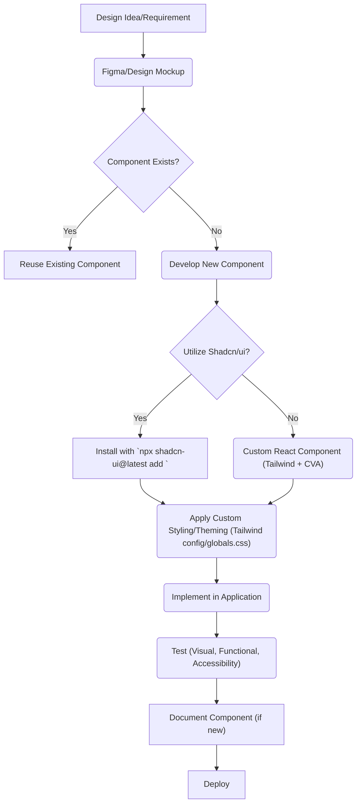
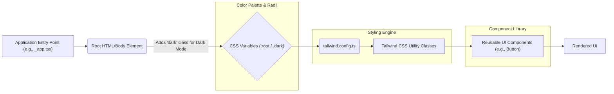

 # UI Components and Design System

This section details the foundational elements of our user interface, encompassing reusable components, established styling conventions, and the overarching design system that ensures a consistent and cohesive user experience across the application. The design system is built upon modern web technologies, primarily [Tailwind CSS](https://tailwindcss.com/) for utility-first styling and [Shadcn/ui](https://ui.shadcn.com/) for pre-built, accessible UI components.

## Core Design Principles

Our design system adheres to principles of modularity, accessibility, and consistency. By utilizing a component-driven approach, we aim to reduce development time, minimize styling inconsistencies, and provide a robust foundation for future features.

-   **Modularity**: Components are designed to be independent and reusable, allowing for flexible composition.
-   **Accessibility**: All components are built with accessibility in mind, following best practices for ARIA attributes, keyboard navigation, and semantic HTML.
-   **Consistency**: A unified visual language is maintained through a well-defined set of design tokens and styling guidelines.
-   **Responsiveness**: Components and layouts are designed to adapt seamlessly across various screen sizes and devices.

## Design System Configuration

The project leverages `components.json` to configure the integration of `shadcn/ui` components, defining the project's styling preferences and alias paths. This file acts as a central configuration point for how UI components are generated and integrated into the project's structure.

### `components.json` Overview

The `components.json` file dictates how `shadcn/ui` components are structured and styled within the project. It specifies the base styling, CSS framework, and path aliases.

```json
// components.json
{
  "$schema": "https://ui.shadcn.com/schema.json",
  "style": "default",
  "rsc": true,
  "tsx": true,
  "tailwind": {
    "config": "tailwind.config.ts",
    "css": "src/styles/globals.css",
    "baseColor": "slate",
    "cssVariables": true
  },
  "aliases": {
    "components": "@/components",
    "utils": "@/lib/utils"
  }
}
```

-   `"style": "default"`: Specifies the default style preset for components, which typically includes basic theming and sizing.
-   `"rsc": true`: Indicates support for React Server Components.
-   `"tsx": true`: Confirms that components are generated as TypeScript files with JSX syntax.
-   `"tailwind"`: Configures Tailwind CSS integration, pointing to the main config file, global CSS, base color palette, and enabling CSS variables.
-   `"aliases"`: Defines path aliases for easier imports, mapping `@/components` to `src/components` and `@/lib/utils` to `src/lib/utils`.

[View on GitHub](https://github.com/lande26/LandeMon/blob/main/components.json)

## Styling and Theming

The application's visual aesthetics are primarily driven by Tailwind CSS, configured to use CSS variables for dynamic theming, including dark mode support. This approach allows for easy customization and ensures a consistent look and feel throughout the application.

### Tailwind CSS Configuration

The `tailwind.config.ts` file is the central hub for customizing Tailwind CSS. It extends default themes, defines custom colors, fonts, screen breakpoints, and animations, all while integrating CSS variables for theming.

```typescript
// tailwind.config.ts
import { fontFamily } from "tailwindcss/defaultTheme";
/** @type {import('tailwindcss').Config} */
module.exports = {
  darkMode: ["class"],
  content: [
    "./pages/**/*.{ts,tsx}",
    "./components/**/*.{ts,tsx}",
    "./app/**/*.{ts,tsx}",
    "./src/**/*.{ts,tsx}",
  ],
  theme: {
    screens: {
      xs: "500px",
      sm: "640px",
      md: "768px",
      lg: "1024px",
      xl: "1280px",
      "2xl": "1400px",
    },
    container: {
      center: true,
      padding: "4vw",
      screens: {
        "2xl": "1400px",
      },
    },
    extend: {
      colors: {
        border: "hsl(var(--border))",
        input: "hsl(var(--input))",
        ring: "hsl(var(--ring))",
        background: "hsl(var(--background))",
        foreground: "hsl(var(--foreground))",
        primary: {
          DEFAULT: "hsl(var(--primary))",
          foreground: "hsl(var(--primary-foreground))",
        },
        // ... other colors
      },
      borderRadius: {
        lg: "var(--radius)",
        md: "calc(var(--radius) - 2px)",
        sm: "calc(var(--radius) - 4px)",
      },
      keyframes: {
        "accordion-down": {
          from: { height: 0 },
          to: { height: "var(--radix-accordion-content-height)" },
        },
        "accordion-up": {
          from: { height: "var(--radix-accordion-content-height)" },
          to: { height: 0 },
        },
      },
      animation: {
        "accordion-down": "accordion-down 0.2s ease-out",
        "accordion-up": "accordion-up 0.2s ease-out",
      },
      fontFamily: {
        sans: ["var(--font-sans)", ...fontFamily.sans],
        heading: ["var(--font-heading)", ...fontFamily.sans],
      },
    },
  },
  plugins: [require("tailwindcss-animate")],
};
```

This configuration highlights several key aspects:

-   **Dark Mode**: Enabled via `darkMode: ["class"]`, allowing dark mode to be toggled by adding a `dark` class to the HTML element.
-   **Content Paths**: `content` array specifies all files where Tailwind should look for classes to generate.
-   **Custom Screens**: Defines additional responsive breakpoints (`xs`).
-   **Container Styling**: Sets up a centered container with responsive padding and a max-width for `2xl` screens.
-   **Extended Colors**: Maps CSS variables (e.g., `--background`, `--primary`) to Tailwind color names, making the color palette dynamic and easily swappable for themes.
-   **Border Radius**: Defines `lg`, `md`, `sm` border radii using a `--radius` CSS variable, allowing global control over component roundedness.
-   **Keyframes and Animations**: Includes custom keyframes and animations, particularly for Radix UI components like `accordion-down` and `accordion-up`.
-   **Font Families**: Extends default font families to include custom fonts defined by CSS variables `--font-sans` and `--font-heading`.
-   **Plugins**: Integrates `tailwindcss-animate` for utility classes that provide CSS animations.

[View on GitHub](https://github.com/lande26/LandeMon/blob/main/tailwind.config.ts)

### Global Styles and CSS Variables

The `src/styles/globals.css` file is crucial for importing Tailwind's base, components, and utilities layers, and more importantly, defining the core CSS variables that drive the application's theming. These variables are consumed by the `tailwind.config.ts` to create a dynamic and easily customizable color scheme.

```css
/* src/styles/globals.css */
@tailwind base;
@tailwind components;
@tailwind utilities;

@layer base {
  :root {
    --background: 0 0% 100%;
    --foreground: 222.2 84% 4.9%;
    /* ... light theme color variables */
    --radius: 0.5rem;
  }

  .dark {
    --background: 222.2 84% 4.9%;
    --foreground: 210 40% 98%;
    /* ... dark theme color variables */
  }
}

@layer base {
  * {
    @apply border-border;
  }

  body {
    @apply bg-background text-foreground;
  }
}
```

-   **Tailwind Directives**: `@tailwind base;`, `@tailwind components;`, `@tailwind utilities;` import the core Tailwind styles.
-   **CSS Variables (`:root` and `.dark`)**: Defines a comprehensive set of HSL color variables for both light (`:root`) and dark (`.dark`) themes. This allows the application's entire color palette to be swapped by toggling the `.dark` class on the `html` or `body` element.
-   **Base Layer Styling**: Applies base styles such as `border-border` to all elements (`*`) and sets the default `background` and `text-foreground` colors for the `body`.

[View on GitHub](https://github.com/lande26/LandeMon/blob/main/src/styles/globals.css)

### Custom Utilities

The `globals.css` also includes some custom utility classes, such as `no-scrollbar` to hide scrollbars while maintaining scroll functionality, and various styles for UI elements like video wrappers, panels, and seasonal content.

```css
/* src/styles/globals.css - Custom Utilities */
@layer utilities {
  .no-scrollbar::-webkit-scrollbar {
    display: none;
  }

  .no-scrollbar {
    -ms-overflow-style: none; /* IE and Edge */
    scrollbar-width: none; /* Firefox */
  }
}

.video-wrapper {
  width: 100%;
  height: 100%;
  position: relative;
  aspect-ratio: 16/9;
  /* ... other video-wrapper styles */
}

.panel {
  position: fixed;
  left: 0;
  top: 0;
  bottom: 0;
  background-color: rgba(0, 0, 0, 0.5);
  backdrop-filter: blur(25px);
  /* ... other panel styles */
}
```

These custom utilities demonstrate how the styling system can be extended beyond pure Tailwind utilities for specific, complex UI patterns or for styles that don't fit the utility-first paradigm.

[View on GitHub](https://github.com/lande26/LandeMon/blob/main/src/styles/globals.css#L31-L157)

## Reusable UI Components

A key aspect of the design system is its collection of reusable UI components. These components are built using React and styled with Tailwind CSS, often leveraging libraries like `radix-ui` for accessibility and `class-variance-authority` (cva) for managing variant-based styling.

### Button Component Example

The `Button` component is a prime example of a reusable UI element. It demonstrates the use of `cva` for defining variant-based styles and `radix-ui/react-slot` for flexible rendering.

```tsx
// src/components/ui/button.tsx
import * as React from 'react';
import { Slot } from '@radix-ui/react-slot';
import { cva, type VariantProps } from 'class-variance-authority';
import { cn } from '@/lib/utils'; // Utility for combining class names

const buttonVariants = cva(
  'inline-flex items-center justify-center rounded-md text-sm font-medium ring-offset-background transition-colors focus-visible:outline-none disabled:pointer-events-none disabled:opacity-50',
  {
    variants: {
      variant: {
        default: 'bg-primary text-primary-foreground hover:bg-primary/90',
        destructive: 'bg-destructive text-destructive-foreground hover:bg-destructive/90',
        outline: 'border border-input bg-background hover:bg-accent hover:text-accent-foreground',
        secondary: 'bg-secondary text-secondary-foreground hover:bg-secondary/80',
        ghost: 'hover:bg-accent hover:text-accent-foreground',
        link: 'text-primary underline-offset-4 hover:underline',
      },
      size: {
        default: 'h-10 px-4 py-2',
        sm: 'h-9 rounded-md px-3',
        lg: 'h-11 rounded-md px-8',
        icon: 'h-10 w-10',
      },
    },
    defaultVariants: {
      variant: 'default',
      size: 'default',
    },
  },
);

export interface ButtonProps
  extends React.ButtonHTMLAttributes<HTMLButtonElement>,
    VariantProps<typeof buttonVariants> {
  asChild?: boolean;
}

const Button = React.forwardRef<HTMLButtonElement, ButtonProps>(
  ({ className, variant, size, asChild = false, ...props }, ref) => {
    const Comp = asChild ? Slot : 'button';
    return (
      <Comp
        className={cn(buttonVariants({ variant, size, className }))}
        ref={ref}
        {...props}
      />
    );
  },
);
Button.displayName = 'Button';

export { Button, buttonVariants };
```

Key features of the `Button` component:

-   **`class-variance-authority` (cva)**: This library allows for defining different "variants" of a component based on props (e.g., `variant`, `size`). It generates the appropriate Tailwind CSS classes dynamically.
    -   `variants.variant`: Defines visual styles like `default`, `destructive`, `outline`, `secondary`, `ghost`, and `link`.
    -   `variants.size`: Defines sizing options like `default`, `sm`, `lg`, and `icon`.
    -   `defaultVariants`: Sets the default `variant` and `size` if not explicitly provided.
-   **`@radix-ui/react-slot`**: The `Slot` component from Radix UI enables the `Button` to render as its child element instead of a `<button>` tag, while still inheriting all button props and behaviors. This is controlled by the `asChild` prop, which defaults to `false`.
-   **`cn` utility**: The `cn` function (likely from `@/lib/utils`) is used to conditionally combine and merge Tailwind CSS classes, resolving conflicts and ensuring the correct classes are applied.

[View on GitHub](https://github.com/lande26/LandeMon/blob/main/src/components/ui/button.tsx)

## Design System Workflow

The process of designing and implementing UI components follows a structured workflow to ensure consistency and efficiency.





## Theming Architecture

The theming architecture is designed for flexibility and ease of maintenance, utilizing CSS variables to allow for easy theme switching (e.g., light/dark mode) without altering component-level styles.





## Key Integration Points

The integration of these UI components and the design system into the broader application workflow is critical for maintaining consistency and accelerating development.

-   **Component Library Structure**: All reusable UI components are organized under `src/components/ui/`. This clear structure makes components easy to locate, import, and manage.
-   **Utility Functions**: A shared `cn` utility (from `@/lib/utils`) is essential for merging Tailwind classes effectively, preventing class conflicts, and enabling dynamic styling based on props.
-   **Theming Switch**: The `dark` class applied at the root of the HTML document (or `body`) serves as the primary toggle for the application's theme, leveraging the CSS variables defined in `globals.css`.
-   **Development Workflow**: When developing new UI elements, always check if a `shadcn/ui` component or an existing custom component can be adapted. If not, follow the pattern established in components like `Button.tsx` using `cva` for variant styling and `radix-ui` for accessibility where appropriate.
-   **Accessibility Audits**: Regularly conduct accessibility audits on new and updated components to ensure they meet WCAG guidelines. Radix UI provides a strong foundation for accessible components, but proper implementation is still necessary.
-   **Documentation**: New components, or significant updates to existing ones, should be documented within this design system guide to ensure all developers understand their purpose, props, and usage patterns. This includes live examples and code snippets where possible.
-   **Consistent Usage**: Encourage developers to use the provided UI components rather than creating ad-hoc styling. This reinforces the design system and minimizes UI inconsistencies.
-   **Global Styling Impact**: Be mindful of changes to `globals.css` or `tailwind.config.ts` as they can have a widespread impact. Always test thoroughly when modifying these core configuration files.