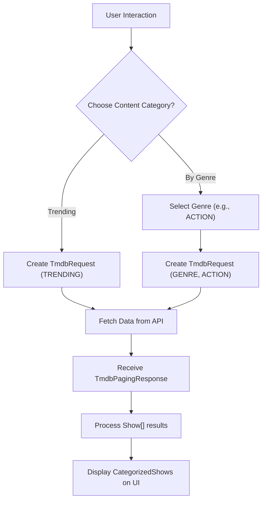

 # Configuration and Types

This section provides an in-depth look at the foundational configurations, constants, enums, and TypeScript type definitions that underpin the project. Understanding these core components is crucial for comprehending how data is structured, how the application behaves, and how various parts of the system interact.

We will explore `site.ts` for global application settings, `genre.ts` and `request-type.ts` for defining specific data categories and API interaction patterns, and `index.ts` within the `types` directory for a comprehensive overview of shared data structures.

## Site-wide Configuration: `src/configs/site.ts`

The `src/configs/site.ts` file is the central hub for all site-wide configuration settings. It defines crucial metadata such as the application's name, description, keywords for SEO, external links, and the structure of navigation elements. This configuration is dynamically populated using environment variables, ensuring flexibility across different deployment environments.

```typescript filename="src/configs/site.ts"
export type SiteConfig = typeof siteConfig;

export const siteConfig = {
  name: env.NEXT_PUBLIC_SITE_NAME,
  author: env.NEXT_PUBLIC_SITE_NAME,
  slogan: 'Cinema at Your Fingertips.',
  description:
    'Watch movies & TV shows online or stream right to your smart TV, game console, PC, Mac, mobile, tablet and more.',
  keywords: [
    'watch movies',
    'movies online',
    'watch TV',
    // ... more keywords
    env.NEXT_PUBLIC_SITE_NAME,
  ],
  url: env.NEXT_PUBLIC_APP_URL,
  ogImage: `${env.NEXT_PUBLIC_APP_URL}/images/hero.jpg`,
  links: {
    twitter: `${env.NEXT_PUBLIC_TWITTER}`,
    github: 'https://github.com/lande26/LandeMon',
    githubAccount: '',
  },
  footerItems: [
    { title: 'About', href: '/' },
    { title: 'Help Center', href: '/' },
    { title: 'Contact Us', href: '/' },
    { title: 'Privacy Policy', href: '/' },
  ],
  mainNav: [
    {
      title: 'Home',
      href: '/home',
    },
    {
      title: 'TV Shows',
      href: '/tv-shows',
    },
    // ... more navigation items
  ],
};
```

[View on GitHub](https://github.com/lande26/LandeMon/blob/main/src/configs/site.ts)

This configuration object, `siteConfig`, dictates:
*   **`name`**: The primary name of the site.
*   **`author`**: The author or owner of the site.
*   **`slogan`**: A short, catchy phrase for the site.
*   **`description`**: A detailed description used for meta tags and general context.
*   **`keywords`**: An array of strings used to improve search engine visibility.
*   **`url`**: The base URL of the application.
*   **`ogImage`**: The URL for the Open Graph image, used when sharing the site on social media.
*   **`links`**: An object containing various social media and external links.
*   **`footerItems`**: An array defining the links present in the site's footer.
*   **`mainNav`**: An array defining the primary navigation links, including their titles and target `href` paths.

The `SiteConfig` type ensures that any usage of `siteConfig` adheres to this defined structure, providing type safety throughout the application.

## Enum Definitions

Enums are used to define a set of named constants, making code more readable and less prone to errors by limiting a variable to a predefined set of values.

### Genre Types: `src/enums/genre.ts`

The `src/enums/genre.ts` file defines the `Genre` enum, which maps human-readable genre names to their corresponding numerical IDs, typically used when interacting with external APIs like TMDB for filtering content.

```typescript filename="src/enums/genre.ts"
export enum Genre {
  ACTION = 28,
  ADVENTURE = 12,
  ANIMATION = 16,
  COMEDY = 35,
  CRIME = 80,
  DOCUMENTARY = 99,
  DRAMA = 18,
  FAMILY = 10751,
  FANTASY = 14,
  HISTORY = 36,
  HORROR = 27,
  MUSIC = 10402,
  MYSTERY = 9648,
  ROMANCE = 10749,
  SCIENCE_FICTION = 878,
  TV_MOVIE = 10770,
  THRILLER = 53,
  WAR = 10752,
  WESTERN = 37,
  // ... more genres
}
```

[View on GitHub](https://github.com/lande26/LandeMon/blob/main/src/enums/genre.ts)

This enum is crucial for standardizing genre identification across the application, especially when constructing API requests that require genre IDs.

### API Request Types: `src/enums/request-type.ts`

The `src/enums/request-type.ts` file defines the `RequestType` enum, which categorizes different types of content requests that can be made to the API, such as trending, top-rated, or genre-specific content. It also introduces several type definitions related to API responses and request parameters.

```typescript filename="src/enums/request-type.ts"
import { type MediaType, type Show } from '@/types';
import { type Genre } from './genre';

export enum RequestType {
  TRENDING = 'trending',
  TOP_RATED = 'top_rated',
  NETFLIX = 'netflix',
  POPULAR = 'popular',
  GENRE = 'genre',
  ANIME_GENRE = 'anime_genre',
  KOREAN = 'korean',
  DEFAULT = 'default',
  // ... more request types
}

export type TmdbPagingResponse = {
  results: Show[];
  page: number;
  totalPages: number;
  totalResults: number;
};

export type TmdbRequest = {
  requestType: RequestType;
  mediaType: MediaType;
  genre?: Genre;
  page?: number;
};

export type ShowRequest = {
  title: string;
  req: TmdbRequest;
  visible: boolean;
};
```

[View on GitHub](https://github.com/lande26/LandeMon/blob/main/src/enums/request-type.ts)

*   **`RequestType`**: Provides a standardized way to specify the intent of a content request.
*   **`TmdbPagingResponse`**: Defines the structure for paginated responses from a TMDB-like API, including an array of `Show` objects, current page, total pages, and total results.
*   **`TmdbRequest`**: A type that encapsulates parameters for making a TMDB-style request, combining a `RequestType`, `MediaType`, optional `Genre`, and `page` number.
*   **`ShowRequest`**: Represents a specific request to display a list of shows on the UI, including a title for the section, the `TmdbRequest` details, and a visibility flag.





## Core Type Definitions: `src/types/index.ts`

The `src/types/index.ts` file serves as a central repository for many of the application's core TypeScript type definitions. These types are crucial for defining the structure of data objects used throughout the frontend, ensuring consistency and type safety.

```typescript filename="src/types/index.ts"
export enum MediaType {
  ALL = 'all',
  TV = 'tv',
  MOVIE = 'movie',
  ANIME = 'anime',
}

export type CategorizedShows = {
  title: string;
  shows: Show[];
  visible: boolean;
};

export type NavItem = {
  title: string;
  href?: string;
  disabled?: boolean;
  external?: boolean;
  icon?: React.ComponentType<React.SVGProps<SVGSVGElement>>;
  onClick?: () => void;
};

export type Show = {
  adult: boolean;
  backdrop_path: string | null;
  media_type: MediaType;
  budget: number | null;
  homepage: string | null;
  showId: string;
  id: number;
  // ... more properties
  keywords: KeyWordResponse;
  seasons: ISeason[];
};

export type VideoType =
  | 'Bloopers'
  | 'Featurette'
  | 'Behind the Scenes'
  | 'Clip'
  | 'Trailer'
  | 'Teaser';

export type ShowWithGenreAndVideo = Show & {
  genres: Genre[];
  videos?: {
    results: VideoResult[];
  };
};

export interface IStack<T> {
  push(item: T): void;
  pop(): T | undefined;
  peek(): T | undefined;
  size(): number;
}
```

[View on GitHub](https://github.com/lande26/LandeMon/blob/main/src/types/index.ts)

Let's break down some of the most significant types:

*   **`MediaType`**: An enum that categorizes content into `ALL`, `TV`, `MOVIE`, or `ANIME`. This is distinct from the `media_type` string property found in the `Show` type, offering a more constrained set of options for application logic.

    ```typescript filename="src/types/index.ts"
    export enum MediaType {
      ALL = 'all',
      TV = 'tv',
      MOVIE = 'movie',
      ANIME = 'anime',
    }
    ```
    [View on GitHub](https://github.com/lande26/LandeMon/blob/main/src/types/index.ts#L3-L8)

*   **`CategorizedShows`**: Represents a collection of `Show` objects, typically displayed together under a specific title (e.g., "Trending Movies").
*   **`NavItem`**: Defines the structure for navigation items, used for both `mainNav` and `footerItems` in `site.ts`. It can include an optional icon and click handler.
*   **`Show`**: This is a fundamental type representing a single movie or TV show. It encompasses a vast array of properties fetched from an external API, such as `title`, `overview`, `poster_path`, `media_type`, and more detailed information like `keywords` and `seasons`. Note the `media_type` property within `Show` can be `tv`, `movie`, or `person`.

    ```typescript filename="src/types/index.ts"
    export type Show = {
      adult: boolean;
      backdrop_path: string | null;
      media_type: MediaType; // Here, it's our internal MediaType enum
      budget: number | null;
      homepage: string | null;
      showId: string;
      id: number;
      imdb_id: string | null;
      original_language: string;
      original_title: string | null;
      overview: string | null;
      popularity: number;
      poster_path: string | null;
      number_of_seasons: number | null;
      number_of_episodes: number | null;
      release_date: string | null;
      first_air_date: string | null;
      last_air_date: string | null;
      revenue: number | null;
      runtime: number | null;
      status: string | null;
      tagline: string | null;
      title: string | null;
      name: string | null;
      video: boolean;
      vote_average: number;
      vote_count: number;
      original_name?: string;
      keywords: KeyWordResponse;
      seasons: ISeason[];
    };
    ```
    [View on GitHub](https://github.com/lande26/LandeMon/blob/main/src/types/index.ts#L22-L59)

*   **`KeyWord`** and **`KeyWordResponse`**: Define the structure for keywords associated with a show.
*   **`Genre` (type)**: This type, also found in `index.ts`, defines the structure for a genre object with `id` and `name` properties, as typically returned by APIs. This is distinct from the `Genre` enum in `src/enums/genre.ts` which maps names to IDs.
*   **`VideoType`** and **`VideoResult`**: Define the different types of videos (e.g., Trailer, Clip) and their detailed properties for a show.
*   **`ShowWithGenreAndVideo`**: An intersection type that extends the `Show` type by adding `genres` (array of `Genre` objects) and an optional `videos` object containing `VideoResult`s. This is useful for representing a `Show` object with enriched data.

    ```typescript filename="src/types/index.ts"
    export type ShowWithGenreAndVideo = Show & {
      genres: Genre[];
      videos?: {
        results: VideoResult[];
      };
    };
    ```
    [View on GitHub](https://github.com/lande26/LandeMon/blob/main/src/types/index.ts#L93-L98)

*   **`ISeason`** and **`IEpisode`**: Define the hierarchical structure for seasons and individual episodes within a TV show, including details like air dates, overview, and episode numbers.
*   **`IStack`**: A generic interface defining the contract for a stack data structure, including methods like `push`, `pop`, `peek`, and `size`. This indicates that the project may utilize a custom stack implementation for certain functionalities.

## Key Integration Points

The configurations and types described above are not isolated; they are deeply integrated into the application's data fetching, state management, and UI rendering processes.

For example, when the application fetches a list of movies, it might use a `TmdbRequest` constructed with a `RequestType` (from `src/enums/request-type.ts`) and a `MediaType` (from `src/types/index.ts`). The API response would then be mapped to an array of `Show` objects, potentially augmented to `ShowWithGenreAndVideo` for detailed display. These `Show` objects are then grouped into `CategorizedShows` for presentation on the home page or specific category pages.

The `siteConfig` from `src/configs/site.ts` is globally available, informing the structure of the navigation bars, footer, and crucial SEO metadata. Any changes to the `mainNav` array, for instance, would directly reflect in the application's primary navigation menu, guided by the `NavItem` type.

This robust type system ensures that data flows consistently and predictably throughout the application, from fetching external content to rendering complex UI components.