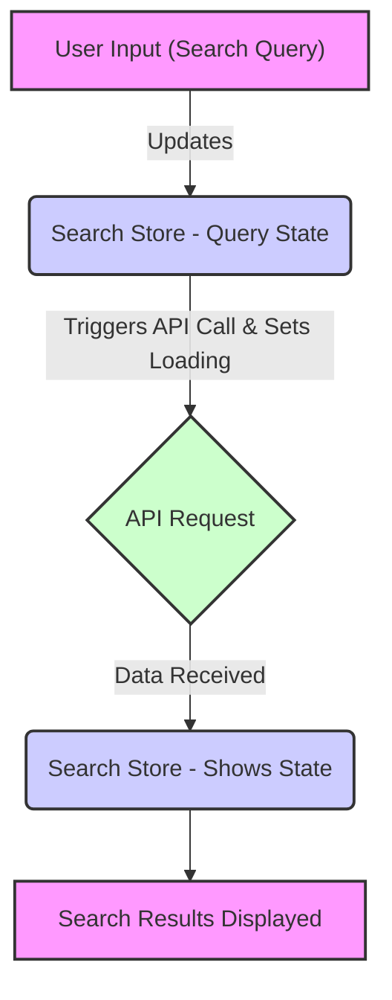

# State Management

This document outlines the state management approach used in the LandeMon application. We leverage Zustand, a small, fast, and scalable bearbones state-management solution, to manage the application's state efficiently.  Zustand is particularly well-suited for React applications due to its simplicity and ease of use. We primarily use Zustand to handle modal state and search-related state.

## Overview

State management is crucial for maintaining and updating application data in a predictable manner. In LandeMon, we utilize Zustand stores to manage different aspects of the application's state. Two key stores are:

*   `useModalStore`: Manages the state of the modal, including its open/closed status, the currently displayed show, playback state, and initial load status.
*   `useSearchStore`: Manages the state related to search functionality, including the search query, search results (shows), search panel open state, and loading status.

## `useModalStore`: Managing Modal State

The `useModalStore` is responsible for controlling the visibility and content of the modal.

```typescript title="src/stores/modal.ts"
import type { Show } from '@/types';
import { create } from 'zustand';

interface ModalState {
  open: boolean;
  setOpen: (open: boolean) => void;
  firstLoad: boolean;
  show: Show | null;
  setShow: (show: Show | null) => void;
  play: boolean;
  setPlay: (play: boolean) => void;
  reset: () => void;
}

export const useModalStore = create<ModalState>()((set) => ({
  open: false,
  setOpen: (open: boolean) => set(() => ({ open })),
  firstLoad: false,
  setFirstLoad: (firstLoad: boolean) => set(() => ({ firstLoad })),
  show: null,
  setShow: (show: Show | null) => set(() => ({ show })),
  play: false,
  setPlay: (play: boolean) => set(() => ({ play })),
  reset: () =>
    set(() => ({
      show: null,
      open: false,
      play: false,
      firstLoad: false,
    })),
}));
```

[View on GitHub](https://github.com/lande26/LandeMon/blob/main/src/stores/modal.ts)

The `ModalState` interface defines the structure of the modal's state, including properties like `open`, `firstLoad`, `show`, and `play`. The `useModalStore` hook provides access to this state and functions to update it. The `reset` function allows for a clean state reset, particularly useful when closing the modal and needing to clear previous data.

Here's a breakdown of the state variables:

*   `open`:  A boolean indicating whether the modal is currently visible.
*   `firstLoad`: A boolean to determine if the modal content is loading for the first time.
*   `show`:  The `Show` object representing the data displayed in the modal.  This is typed as `Show | null` since there might not always be a show to display.
*   `play`:  A boolean indicating whether the video/content within the modal is currently playing.

The `setOpen`, `setShow`, and `setPlay` functions are used to update the corresponding state variables.  Each function uses the `set` function provided by Zustand to update the state immutably.

```typescript title="Example Usage: Opening the Modal"
import { useModalStore } from './src/stores/modal';

function MyComponent() {
  const setOpen = useModalStore((state) => state.setOpen);

  const handleOpenModal = () => {
    setOpen(true);
  };

  return (
    <button onClick={handleOpenModal}>Open Modal</button>
  );
}
```

[View on GitHub](https://github.com/lande26/LandeMon/blob/main/src/stores/modal.ts)

This snippet shows how to use the `useModalStore` hook within a React component to access the `setOpen` function and open the modal when a button is clicked.

## `useSearchStore`: Managing Search State

The `useSearchStore` manages the state associated with the search functionality. This includes the search query, the array of shows returned as search results, the open state of the search interface, and a loading indicator.

```typescript title="src/stores/search.ts"
import { clearSearch } from '@/lib/utils';
import type { Show } from '@/types';
import { create } from 'zustand';

interface SearchState {
  query: string;
  setQuery: (query: string) => void;
  shows: Show[];
  setShows: (shows: Show[]) => void;
  isOpen: boolean;
  setOpen: (value: boolean) => void;
  loading: boolean;
  setLoading: (value: boolean) => void;
  reset: () => void;
}

export const useSearchStore = create<SearchState>()((set) => ({
  query: '',
  setQuery: (query: string) => set(() => ({ query })),
  shows: [],
  setShows: (shows: Show[]) => set(() => ({ shows })),
  isOpen: false,
  setOpen: (value: boolean) => set(() => ({ isOpen: value })),
  loading: false,
  setLoading: (value: boolean) => set(() => ({ loading: value })),
  reset: () =>
    set(() => {
      clearSearch();
      return { query: '', shows: [], loading: false };
    }),
}));
```

[View on GitHub](https://github.com/lande26/LandeMon/blob/main/src/stores/search.ts)

The `SearchState` interface defines the structure of the search state.  Key properties include:

*   `query`:  The current search query string.
*   `shows`: An array of `Show` objects that match the search query.
*   `isOpen`: A boolean indicating whether the search interface is currently open.
*   `loading`:  A boolean indicating whether a search request is currently in progress.

The `setQuery`, `setShows`, `setOpen`, and `setLoading` functions are used to update the corresponding state variables. The `reset` function clears the search query, the search results, and sets the loading state to false. Critically, it also calls `clearSearch()` from the `lib/utils` file.

```typescript title="Example Usage: Performing a Search"
import { useSearchStore } from './src/stores/search';

function SearchComponent() {
  const query = useSearchStore((state) => state.query);
  const setQuery = useSearchStore((state) => state.setQuery);
  const setShows = useSearchStore((state) => state.setShows);
  const setLoading = useSearchStore((state) => state.setLoading);

  const handleSearch = async (newQuery: string) => {
    setQuery(newQuery);
    setLoading(true);
    // Simulate an API call
    setTimeout(() => {
      const results = [{ title: 'Example Show', id: '1' }]; // Replace with actual API call
      setShows(results);
      setLoading(false);
    }, 500);
  };

  return (
    <div>
      <input
        type="text"
        value={query}
        onChange={(e) => handleSearch(e.target.value)}
      />
    </div>
  );
}
```

[View on GitHub](https://github.com/lande26/LandeMon/blob/main/src/stores/search.ts)

This example demonstrates how the `useSearchStore` hook can be used in a React component to manage the search query, trigger a search, and update the search results. The simulated API call represents the process of fetching data based on the search query.

```javascript title="src/lib/utils.ts"
export const clearSearch = () => {
  // Implementation to clear search-related data (e.g., from localStorage)
  console.log("Clearing search data...");
  localStorage.removeItem('searchQuery');
};
```

[View on GitHub](https://github.com/lande26/LandeMon/blob/main/src/lib/utils.ts)

This function, called in the `reset` method of `useSearchStore`, suggests that search data might be persisted in local storage.  This is a common pattern for retaining search history or preferences across sessions.  A more complete implementation would involve clearing relevant keys from `localStorage`.

```typescript title="Resetting Search State"
import { useSearchStore } from './src/stores/search';

function ClearSearchButton() {
  const resetSearch = useSearchStore((state) => state.reset);

  const handleClearSearch = () => {
    resetSearch();
  };

  return (
    <button onClick={handleClearSearch}>Clear Search</button>
  );
}
```

[View on GitHub](https://github.com/lande26/LandeMon/blob/main/src/stores/search.ts)

This snippet showcases how to use the `reset` function to clear the search state. It is triggered when the "Clear Search" button is clicked.





This Mermaid diagram illustrates the flow of data during a search operation.

## Key Integration Points

*   **Component Interaction:**  React components subscribe to the Zustand stores using the `useModalStore` and `useSearchStore` hooks.  This allows components to access and update the state as needed.
*   **Event Handling:**  User interactions, such as clicking a button to open a modal or entering a search query, trigger updates to the Zustand stores.
*   **Asynchronous Operations:** The `useSearchStore` handles asynchronous operations like API calls to fetch search results. The `loading` state is used to provide visual feedback to the user during these operations.
*   **State Resetting:** The `reset` functions in both stores provide a mechanism for clearing the state when necessary, such as when closing a modal or clearing a search.

## Best Practices

*   **Keep Stores Focused:** Each store should manage a specific aspect of the application's state. This promotes modularity and makes the code easier to maintain.
*   **Use Selectors:** Selectors allow components to subscribe only to the specific parts of the state they need. This can improve performance by reducing unnecessary re-renders.  Zustand's selector syntax is simple and efficient.
*   **Immutability:**  Zustand encourages immutable state updates.  This makes it easier to reason about state changes and helps prevent unexpected side effects.
*   **Testing:**  Write unit tests for your Zustand stores to ensure they behave as expected.  This helps to catch bugs early and prevent regressions.
```