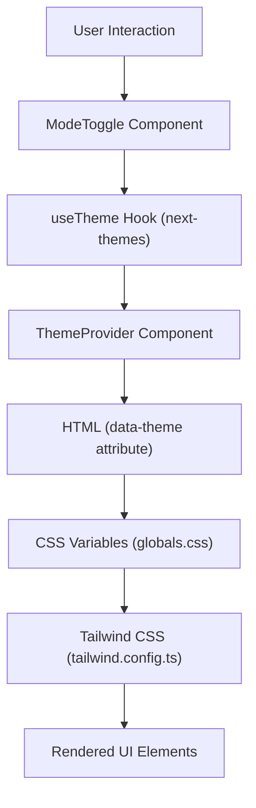

# Styling and Theming

LandeMon leverages a robust styling and theming system to provide a flexible and visually appealing user experience. This section details the core technologies and their implementation.

## Tailwind CSS Integration

Tailwind CSS is the foundation of LandeMon's styling. It provides a utility-first CSS framework that enables rapid UI development. The `tailwind.config.ts` file configures Tailwind's behavior, including breakpoint definitions, container settings, color palettes, border-radius, and animations.

The `theme.extend.colors` section in `tailwind.config.ts` is particularly important. It defines a customizable color palette using CSS variables, allowing for seamless theme switching. These CSS variables are defined in `src/styles/globals.css`.

```typescript
// tailwind.config.ts
import { fontFamily } from "tailwindcss/defaultTheme";
/** @type {import('tailwindcss').Config} */
module.exports = {
  darkMode: ["class"],
  content: [
    "./pages/**/*.{ts,tsx}",
    "./components/**/*.{ts,tsx}",
    "./app/**/*.{ts,tsx}",
    "./src/**/*.{ts,tsx}",
  ],
  theme: {
    screens: {
      xs: "500px",
      sm: "640px",
      md: "768px",
      lg: "1024px",
      xl: "1280px",
      "2xl": "1400px",
    },
    container: {
      center: true,
      padding: "4vw",
      screens: {
        "2xl": "1400px",
      },
    },
    extend: {
      colors: {
        border: "hsl(var(--border))",
        input: "hsl(var(--input))",
        ring: "hsl(var(--ring))",
        background: "hsl(var(--background))",
        foreground: "hsl(var(--foreground))",
        primary: {
          DEFAULT: "hsl(var(--primary))",
          foreground: "hsl(var(--primary-foreground))",
        },
        // ... other color definitions
      },
      borderRadius: {
        lg: "var(--radius)",
        md: "calc(var(--radius) - 2px)",
        sm: "calc(var(--radius) - 4px)",
      },
      // ... other theme extensions
    },
  },
  plugins: [require("tailwindcss-animate")],
};
```

## Global Styles and Theme Variables

The `src/styles/globals.css` file contains global styles and defines the color variables used for theming. It applies Tailwind's base, component, and utility classes. The `:root` and `.dark` rules within `@layer base` set up the color schemes for light and dark modes, respectively.

```css
/* src/styles/globals.css */
@tailwind base;
@tailwind components;
@tailwind utilities;

html,
body,
:root {
  height: 100%;
}

/* ... other global styles and utility classes */

@layer base {
  :root {
    --background: 0 0% 100%;
    --foreground: 222.2 84% 4.9%;
    /* ... other light mode variables */
  }

  .dark {
    --background: 222.2 84% 4.9%;
    --foreground: 210 40% 98%;
    /* ... other dark mode variables */
  }
}

@layer base {
  * {
    @apply border-border;
  }

  body {
    @apply bg-background text-foreground;
  }
}

/* ... other custom CSS rules */
```

## Theme Management with `next-themes`

LandeMon utilizes the `next-themes` library for robust theme management. The `ThemeProvider` component, found in `src/components/theme-provider.tsx`, wraps the application and enables theme persistence. It allows for switching between "light," "dark," and "system" themes.

The `ModeToggle` component (`src/components/theme-toggle.tsx`) provides a user interface element for changing the theme. It uses `useTheme` hook from `next-themes` to access and update the current theme.

```tsx
// src/components/theme-provider.tsx
"use client";

import * as React from "react";
import { ThemeProvider as NextThemesProvider } from "next-themes";
import { type ThemeProviderProps } from "next-themes/dist/types";

export function ThemeProvider({ children, ...props }: ThemeProviderProps) {
  return <NextThemesProvider {...props}>{children}</NextThemesProvider>;
}
```

```tsx
// src/components/theme-toggle.tsx
"use client";

import * as React from "react";
import { Moon, Sun } from "lucide-react";
import { useTheme } from "next-themes";

import { Button } from "@/components/ui/button";
import {
  DropdownMenu,
  DropdownMenuContent,
  DropdownMenuItem,
  DropdownMenuTrigger,
} from "@/components/ui/dropdown-menu";

export function ModeToggle() {
  const { setTheme } = useTheme();

  return (
    <DropdownMenu>
      <DropdownMenuTrigger asChild>
        <Button className="hover:bg-transparent" variant="ghost" size="icon">
          <Sun className="h-[1.2rem] w-[1.2rem] rotate-0 scale-100 transition-all dark:-rotate-90 dark:scale-0" />
          <Moon className="absolute h-[1.2rem] w-[1.2rem] rotate-90 scale-0 transition-all dark:rotate-0 dark:scale-100" />
          <span className="sr-only">Toggle theme</span>
        </Button>
      </DropdownMenuTrigger>
      <DropdownMenuContent align="end">
        <DropdownMenuItem onClick={() => setTheme("light")}>
          Light
        </DropdownMenuItem>
        <DropdownMenuItem onClick={() => setTheme("dark")}>
          Dark
        </DropdownMenuItem>
        <DropdownMenuItem onClick={() => setTheme("system")}>
          System
        </DropdownMenuItem>
      </DropdownMenuContent>
    </DropdownMenu>
  );
}
```

## Architecture Overview

The styling and theming architecture in LandeMon can be visualized as follows:





## Key Takeaways

*   **Tailwind CSS**: Provides a utility-first styling system for efficient UI development.
*   **CSS Variables**: Defined in `globals.css` for customizable theming.
*   **`next-themes`**: Enables seamless theme switching (light, dark, system) and persistence.
*   **`ThemeProvider`**: Wraps the application to manage theme context.
*   **`ModeToggle`**: Offers a UI component for users to change themes.