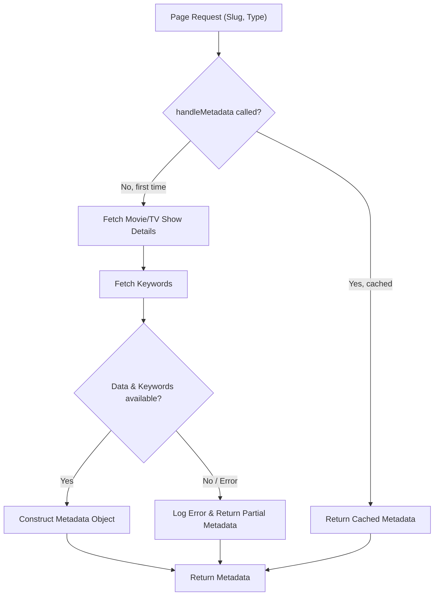
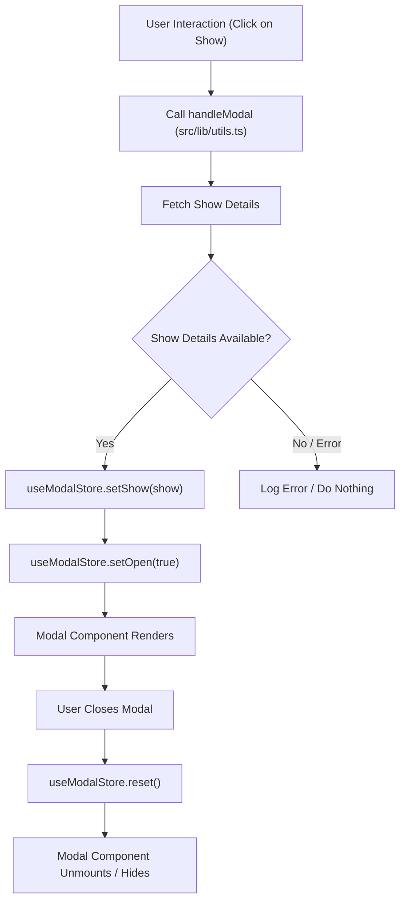

 # Utilities, Hooks, and State Management

This section provides a comprehensive overview of the helper functions, custom React hooks, and the state management patterns employed across the application. These foundational components are crucial for maintaining a clean, efficient, and scalable codebase, addressing common challenges such as component lifecycle management, data formatting, URL manipulation, and global state synchronization. By centralizing these functionalities, we ensure consistency, reduce redundancy, and improve the overall developer experience.

## Custom Hooks

Custom hooks in React encapsulate reusable logic, allowing components to share stateful behavior without complex patterns like higher-order components or render props.

### `useMounted` Hook

The `useMounted` hook is a simple yet powerful utility that tracks whether a component has mounted on the client-side. This is particularly useful in Next.js applications or any server-rendered environment where certain client-only effects or components need to be deferred until the browser environment is fully available. It prevents hydration mismatches and ensures that DOM-dependent operations are performed at the correct time.

```typescript
// src/hooks/use-mounted.ts
import * as React from "react";

export function useMounted() {
  const [mounted, setMounted] = React.useState(false);

  React.useEffect(() => {
    setMounted(true);

    return () => setMounted(false);
  }, []);

  return mounted;
}
```

This hook returns `true` once the component has mounted and `false` before that or if unmounted. It leverages `React.useEffect` with an empty dependency array to run only once after the initial render.

**Usage Example:**

```jsx
import { useMounted } from "@/hooks/use-mounted";

function ClientOnlyComponent() {
  const mounted = useMounted();

  if (!mounted) {
    return null; // Render nothing on the server or until mounted
  }

  return (
    <div>
      <p>This content is only visible on the client-side after mounting.</p>
      {/* Client-side specific logic or components */}
    </div>
  );
}
```

This ensures that any client-side specific rendering or logic, like interactions with `window` or `document` objects, only occurs when the component is fully interactive in the browser. You can [view this hook on GitHub](https://github.com/lande26/LandeMon/blob/main/src/hooks/use-mounted.ts).

## Application Constants

Centralizing constants helps maintain consistency and makes configuration easier to manage across the application. The `src/lib/constants.ts` file is dedicated to storing global application constants, including configuration for animation libraries like Framer Motion.

### Framer Motion Variants

The `itemsReveal` and `itemFade` variants are predefined animation configurations for Framer Motion. They provide standardized entry animations for UI elements, ensuring a cohesive visual experience.

```typescript
// src/lib/constants.ts
import type { Variants } from 'framer-motion';

// framer motion
export const itemsReveal: Variants = {
  hidden: { opacity: 0 },
  visible: {
    opacity: 1,
    transition: {
      staggerChildren: 0.25,
    },
  },
};

export const itemFade: Variants = {
  hidden: { opacity: 0 },
  visible: {
    opacity: 1,
  },
};
```

*   `itemsReveal`: Designed for parent containers, it orchestrates a staggered reveal effect for its children. When a parent element uses this variant, its children can inherit and animate in sequence using a `staggerChildren` transition.
*   `itemFade`: A simple fade-in animation, useful for individual elements that need to appear smoothly without complex orchestrations.

By exporting these as constants, they can be easily imported and applied to any Framer Motion component, reducing repetition and standardizing animation timing and appearance. [View this file on GitHub](https://github.com/lande26/LandeMon/blob/main/src/lib/constants.ts).

## Utility Functions

The `src/lib/utils.ts` file is a collection of helper functions designed to perform common, repetitive tasks throughout the application. These utilities cover a wide range of functionalities, from UI-related tasks to data processing and URL manipulation, significantly contributing to the codebase's maintainability and efficiency. [View the full utils file on GitHub](https://github.com/lande26/LandeMon/blob/main/src/lib/utils.ts).

### Class Name Utility (`cn`)

The `cn` function is a crucial utility for managing CSS class names, especially when working with Tailwind CSS. It combines the power of `clsx` for conditional class joining and `tailwind-merge` for intelligently merging Tailwind classes, resolving conflicts gracefully.

```typescript
// src/lib/utils.ts
import { clsx, type ClassValue } from 'clsx';
import { twMerge } from 'tailwind-merge';

export function cn(...inputs: ClassValue[]) {
  return twMerge(clsx(inputs));
}
```

**Usage Example:**

```jsx
import { cn } from "@/lib/utils";

<div
  className={cn(
    "p-4 border",
    isActive && "bg-blue-500 text-white",
    "hover:shadow-lg",
  )}
>
  Content
</div>;
```

This utility ensures that styles are applied predictably and efficiently, preventing common class conflict issues.

### Date and Time Formatting

`formatDate` and `getYear` provide consistent ways to display dates across the application.

```typescript
// src/lib/utils.ts
export function formatDate(input: string | number): string {
  const date = new Date(input);
  return date.toLocaleDateString('en-US', {
    month: 'long',
    day: 'numeric',
    year: 'numeric',
  });
}

export function getYear(input: string | number): number {
  const date = new Date(input);
  return date.getFullYear();
}
```

*   `formatDate`: Takes a date string or number and returns a human-readable date string (e.g., "January 1, 2023").
*   `getYear`: Extracts the full year from a date string or number.

These functions are essential for presenting temporal data uniformly throughout the user interface, such as release dates for movies or TV shows.

### URL Management

A set of utilities are dedicated to constructing, parsing, and managing URLs for navigation and API requests.

```typescript
// src/lib/utils.ts
export function absoluteUrl(path: string) {
  return `${env.NEXT_PUBLIC_APP_URL}${path}`;
}

export function getSlug(id: number, name: string): string {
  const regex = /([^\x00-\x7F]|[&$\+,:;=\?@#\s<>\[\]\{\}|\\\^%])+/gm;
  return `${name.toLowerCase().replace(regex, '-')}-${id}`;
}

export function buildMovieUrl(show: Show): string {
  const name = getNameFromShow(show);
  const id = show.id;
  return `${env.NEXT_PUBLIC_APP_URL}/${
    show.media_type === MediaType.MOVIE ? 'movies' : 'tv-shows'
  }/${getSlug(id, name)}`;
}

export function getIdFromSlug(slug: string): number {
  const id: string | undefined = slug.split('-').pop();
  return id ? parseInt(id) : 0;
}
```

*   `absoluteUrl`: Constructs a full absolute URL using the `NEXT_PUBLIC_APP_URL` environment variable.
*   `getSlug`: Generates a URL-friendly slug from an item's name and ID, crucial for SEO-friendly URLs. It sanitizes the name by replacing special characters and spaces with hyphens, then appends the ID.
*   `buildMovieUrl`: Dynamically generates the complete URL for a movie or TV show based on its `media_type`, name, and ID.
*   `getIdFromSlug`: Extracts the numerical ID from a given slug, useful for fetching detailed information from an API using the ID embedded in the URL.

These functions ensure consistent and robust URL handling for both internal navigation and external linking.

### Debounce Function

The `debounce` utility is critical for performance optimization, especially for input fields or events that trigger frequent updates.

```typescript
// src/lib/utils.ts
let timer: NodeJS.Timeout;
export function debounce(
  func: (...args: (string | object)[]) => void,
  timeout: number,
): (...args: (string | object)[]) => void {
  return (...args: (string | object)[]) => {
    clearTimeout(timer);
    timer = setTimeout(() => {
      func(...args);
    }, timeout);
  };
}
```

It delays the execution of a function until a specified amount of time has passed without any further invocations. This is commonly used to limit the rate at which search queries are sent to a server or resize events are processed.

**Usage Example:**

```typescript
import { debounce } from "@/lib/utils";

const handleSearchInput = (value: string) => {
  console.log("Searching for:", value);
  // Perform API call or filter data
};

const debouncedSearch = debounce(handleSearchInput, 500); // 500ms delay

// In an input's onChange handler:
// <input onChange={(e) => debouncedSearch(e.target.value)} />
```

This prevents excessive function calls, improving responsiveness and reducing server load.

### Metadata Handling (`handleMetadata`)

The `handleMetadata` function is a `cache`-wrapped asynchronous utility responsible for fetching data and generating metadata (title, description, keywords, Open Graph, Twitter cards) for specific movie or TV show pages. This is crucial for SEO and social media sharing.

```typescript
// src/lib/utils.ts
// ... (imports) ...
import { cache } from 'react';

export const handleMetadata = cache(
  async (slug: string, page: string, type: 'tv' | 'movie') => {
    const movieId: number = getIdFromSlug(slug);
    let keywords: string[] = [];
    let data: Show | null = null;
    try {
      const response: AxiosResponse<Show> =
        'tv' === type
          ? await MovieService.findTvSeries(movieId)
          : await MovieService.findMovie(movieId);
      data = response.data;
      const keywordResponse: AxiosResponse<KeyWordResponse> =
        await MovieService.getKeywords(movieId, type);
      const res =
        type === 'tv'
          ? keywordResponse.data.results
          : keywordResponse.data.keywords;
      keywords = res.map((item: KeyWord) => item.name);
    } catch (error) {
      console.error(error);
    }

    return {
      description: data?.overview,
      title: getNameFromShow(data),
      keywords: [
        ...keywords,
        slug.replace(`-${movieId}`, ''),
        env.NEXT_PUBLIC_SITE_NAME,
      ],
      openGraph: {
        type: 'website',
        locale: 'en_US',
        url: `${siteConfig.url}/${page}/${slug}`,
        images: `https://image.tmdb.org/t/p/original${
          data?.backdrop_path ?? data?.poster_path ?? ''
        }`,
        title: getNameFromShow(data),
        description: data?.overview ?? '',
        siteName: siteConfig.name,
      },
      twitter: {
        card: 'summary_large_image',
        title: getNameFromShow(data),
        description: data?.overview ?? '',
        images: `https://image.tmdb.org/t/p/original${
          data?.backdrop_path ?? data?.poster_path ?? ''
        }`,
        creator: siteConfig.author,
      },
    };
  },
);
```

This function leverages React's `cache` utility to prevent redundant API calls for metadata generation during server-side rendering or static site generation. It fetches show details and associated keywords, then structures the response into the format expected by Next.js's `generateMetadata` function.

### Utility Functions Flow





This diagram illustrates how `handleMetadata` uses caching to optimize metadata generation. If metadata for a given slug and type is already in the cache, it's returned immediately; otherwise, API calls are made, and the results are cached.

## State Management with Zustand

Global application state is managed using [Zustand](https://zustand-bear.netlify.app/), a lightweight and flexible state management library. The `src/stores/modal.ts` file defines a store specifically for managing the state of a global modal component, which is used to display movie or TV show details.

### `useModalStore`

The `useModalStore` is a Zustand store that encapsulates all state related to the global modal: its open/closed status, the currently displayed show, and playback status.

```typescript
// src/stores/modal.ts
import type { Show } from '@/types';
import { create } from 'zustand';

interface ModalState {
  open: boolean;
  setOpen: (open: boolean) => void;
  firstLoad: boolean; // Tracks if the modal has been loaded at least once
  setFirstLoad: (firstLoad: boolean) => void;
  show: Show | null;
  setShow: (show: Show | null) => void;
  play: boolean;
  setPlay: (play: boolean) => void;
  reset: () => void;
}

export const useModalStore = create<ModalState>()((set) => ({
  open: false,
  setOpen: (open: boolean) => set(() => ({ open })),
  firstLoad: false,
  setFirstLoad: (firstLoad: boolean) => set(() => ({ firstLoad })),
  show: null,
  setShow: (show: Show | null) => set(() => ({ show })),
  play: false,
  setPlay: (play: boolean) => set(() => ({ play })),
  reset: () =>
    set(() => ({
      show: null,
      open: false,
      play: false,
      firstLoad: false,
    })),
}));
```

*   `open`: A boolean indicating whether the modal is currently visible.
*   `setOpen`: A function to toggle the modal's visibility.
*   `firstLoad`: A boolean to track if the modal content has been loaded once, potentially for lazy-loading or initial animation purposes.
*   `setFirstLoad`: Sets the `firstLoad` state.
*   `show`: Stores the `Show` object (movie or TV series details) to be displayed in the modal.
*   `setShow`: Updates the `show` object.
*   `play`: A boolean indicating if a video or trailer within the modal should be playing.
*   `setPlay`: Sets the `play` state.
*   `reset`: A utility function to revert all modal-related states to their initial values, ensuring a clean slate when the modal is closed or its content is reset.

This store centralizes modal state management, allowing any component to interact with the modal's state without prop drilling or complex context consumers. [View this store on GitHub](https://github.com/lande26/LandeMon/blob/main/src/stores/modal.ts).

### Modal State Management Flow





This Mermaid diagram illustrates the lifecycle of the modal. A user interaction triggers the `handleModal` utility, which fetches show details. If successful, the `useModalStore` is updated, opening the modal and displaying the content. When the user closes the modal, the `reset` action in the store clears its state, preparing it for future use.

## Key Integration Points

The utilities, hooks, and state management patterns described above are deeply intertwined, forming a cohesive system for application functionality:

*   **UI/UX Enhancements:** `useMounted` ensures client-side specific UI elements and effects, particularly those dependent on `window` or `document` objects, render correctly and without hydration issues in a Next.js environment. Framer Motion constants (`itemsReveal`, `itemFade`) provide consistent and reusable animation effects across interactive elements, improving the overall user experience.
*   **Data & URL Management:** The `src/lib/utils.ts` file acts as a central hub for data manipulation and URL construction. Functions like `getSlug`, `getIdFromSlug`, and `buildMovieUrl` work together to create SEO-friendly URLs and parse them efficiently for data retrieval. This tightly integrates with the `MovieService` for fetching show details.
*   **Performance Optimization:** The `debounce` utility is crucial for optimizing user input, such as search queries. It ensures that expensive operations are not triggered excessively, leading to a more responsive application and reduced load on backend services. `handleMetadata` leverages `React.cache` to prevent redundant data fetches during SSR, further enhancing performance for static pages.
*   **Global State Synchronization:** The `useModalStore` (powered by Zustand) provides a global, reactive state for the movie/TV show detail modal. When a user clicks on a show, `handleModal` (from `src/lib/utils.ts`) fetches the show's data, and then `useModalStore.setShow()` updates the global state. This automatically triggers the modal component to open and display the new data, creating a seamless user flow. Similarly, the `reset` action ensures the modal state is cleaned up, preventing stale data.

These components collectively form the backbone of the application's client-side logic, promoting modularity, reusability, and maintainability. They abstract away complexities, allowing developers to focus on feature development rather than repetitive boilerplate. The combination of custom hooks for component lifecycle, robust utilities for common tasks, and a lightweight state management solution like Zustand ensures that the application is both performant and easy to scale.