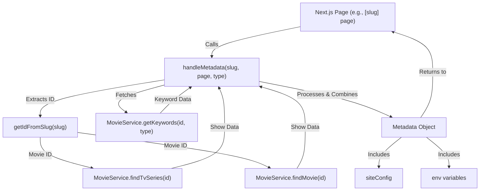

 # Utility Functions and Hooks

This section provides a detailed overview of the utility functions, custom React hooks, and shared constants that are fundamental to the application's functionality and maintainability. These components encapsulate common logic, provide reusable UI behaviors, and define global configurations, ensuring consistency and reducing redundancy across the codebase.

The utilities and hooks are organized logically within the `src/lib` and `src/hooks` directories, promoting a clear separation of concerns and making them easily discoverable and importable.

## Custom React Hooks

Custom hooks in this application provide encapsulated, reusable stateful logic for React components. They help abstract away complex imperative code, allowing components to focus solely on rendering UI.

### `useMounted` Hook

The `useMounted` hook is a simple yet crucial utility for client-side rendering scenarios, especially when dealing with server-side rendering (SSR) frameworks like Next.js. It helps determine if a component has successfully mounted on the client, which is vital for operations that should only occur in a browser environment (e.g., direct DOM manipulation, using certain browser-only APIs).

This hook prevents hydration mismatches and ensures that effects requiring a fully mounted component are only executed when appropriate.

```tsx
import * as React from "react";

export function useMounted() {
  const [mounted, setMounted] = React.useState(false);

  React.useEffect(() => {
    setMounted(true);

    return () => setMounted(false);
  }, []);

  return mounted;
}
```
**Explanation**:
*   Initializes `mounted` state to `false`.
*   Uses `React.useEffect` to set `mounted` to `true` after the component mounts.
*   The effect runs only once after the initial render (`[]` dependency array).
*   Returns the `mounted` state, which becomes `true` after the first render cycle on the client.

[View on GitHub](https://github.com/lande26/LandeMon/blob/main/src/hooks/use-mounted.ts)

### `useLockBody` Hook

The `useLockBody` hook provides a convenient way to prevent scrolling on the `body` element. This is particularly useful for modals, overlays, or any full-screen experiences where background scrolling should be disabled to maintain focus on the overlaid content.

It leverages `React.useLayoutEffect` to synchronously apply and revert the `overflow: hidden` style, ensuring no visual flickers during component lifecycle changes.

```tsx
import * as React from "react";

// @see https://usehooks.com/useLockBodyScroll.
export function useLockBody() {
  React.useLayoutEffect((): (() => void) => {
    const originalStyle: string = window.getComputedStyle(
      document.body,
    ).overflow;
    document.body.style.overflow = "hidden";
    return () => (document.body.style.overflow = originalStyle);
  }, []);
}
```
**Explanation**:
*   Uses `useLayoutEffect` to run synchronously after DOM mutations but before the browser paints.
*   Stores the `originalStyle` of `document.body.style.overflow`.
*   Sets `document.body.style.overflow` to `"hidden"` to disable scrolling.
*   Returns a cleanup function that restores the `originalStyle` when the component unmounts.

[View on GitHub](https://github.com/lande26/LandeMon/blob/main/src/hooks/use-lock-body.ts)

## Shared Constants

Constants define immutable values used throughout the application, preventing magic strings/numbers and centralizing configuration. This enhances readability, makes updates easier, and reduces the chance of errors.

### `framer-motion` Animation Variants

The `src/lib/constants.ts` file primarily houses `framer-motion` animation variants. These objects define predefined animation sequences and properties that can be reused across different components, ensuring consistent and branded motion design.

```tsx
import type { Variants } from 'framer-motion';

// framer motion
export const itemsReveal: Variants = {
  hidden: { opacity: 0 },
  visible: {
    opacity: 1,
    transition: {
      staggerChildren: 0.25,
    },
  },
};

export const itemFade: Variants = {
  hidden: { opacity: 0 },
  visible: {
    opacity: 1,
  },
};
```
**Explanation**:
*   `itemsReveal`: A variant for animating a container of children, where `staggerChildren` ensures each child animates with a delay, creating a reveal effect.
*   `itemFade`: A simple variant for fading an individual element in from `opacity: 0` to `opacity: 1`.

[View on GitHub](https://github.com/lande26/LandeMon/blob/main/src/lib/constants.ts)

## Utility Functions

The `src/lib/utils.ts` file is a collection of general-purpose utility functions designed to perform common tasks such as formatting, URL manipulation, and DOM interaction. These functions promote code reusability and encapsulate specific logic, keeping components cleaner and more focused.

### Core UI Utilities

Functions like `cn` (a wrapper for `clsx` and `tailwind-merge`) are essential for conditional styling and managing Tailwind CSS classes effectively.

```tsx
import { clsx, type ClassValue } from 'clsx';
import { twMerge } from 'tailwind-merge';

export function cn(...inputs: ClassValue[]) {
  return twMerge(clsx(inputs));
}
```
**Explanation**:
*   `cn` combines `clsx` (for conditional class joining) and `tailwind-merge` (for resolving Tailwind CSS conflicts), providing a robust way to manage CSS classes.

[View on GitHub](https://github.com/lande26/LandeMon/blob/main/src/lib/utils.ts#L17-L19)

### Date and URL Formatting

Utilities for handling dates and constructing URLs are critical for consistent data presentation and navigation.

```tsx
export function formatDate(input: string | number): string {
  const date = new Date(input);
  return date.toLocaleDateString('en-US', {
    month: 'long',
    day: 'numeric',
    year: 'numeric',
  });
}

export function getYear(input: string | number): number {
  const date = new Date(input);
  return date.getFullYear();
}

export function absoluteUrl(path: string) {
  return `${env.NEXT_PUBLIC_APP_URL}${path}`;
}
```
**Explanation**:
*   `formatDate`: Formats a date string or number into a readable "Month Day, Year" format.
*   `getYear`: Extracts the full year from a date string or number.
*   `absoluteUrl`: Constructs a full absolute URL using the base application URL from environment variables.

[View on GitHub](https://github.com/lande26/LandeMon/blob/main/src/lib/utils.ts#L21-L38)

### Slug and Search Parameter Management

Functions for creating and parsing URL slugs, as well as managing search query parameters, are vital for dynamic content routing and filtering.

```tsx
export function getSlug(id: number, name: string): string {
  // build slug from name and id
  const regex = /([^\x00-\x7F]|[&$\+,:;=\?@#\s<>\[\]\{\}|\\\^%])+/gm;
  return `${name.toLowerCase().replace(regex, '-')}-${id}`;
}

export function getIdFromSlug(slug: string): number {
  // get id from slug
  const id: string | undefined = slug.split('-').pop();
  return id ? parseInt(id) : 0;
}

export function getSearchValue(input: string): string {
  const search = window.location.search;
  if (!search) return '';
  const urlParams = new URLSearchParams(window.location.search);
  return urlParams.get(input) ?? '';
}
```
**Explanation**:
*   `getSlug`: Generates a URL-friendly slug from an item's name and ID, cleaning special characters.
*   `getIdFromSlug`: Extracts the numeric ID from the end of a slug string.
*   `getSearchValue`: Retrieves the value of a specified query parameter from the current URL.

[View on GitHub](https://github.com/lande26/LandeMon/blob/main/src/lib/utils.ts#L48-L70)

### Utility Function Dependencies Diagram

This diagram illustrates the general dependencies of common utility functions, showing how they might interact with browser APIs or external services.


```mermaid
graph TD
    A["Browser Environment"] --> B["getSearchValue()"]
    A --> C["clearSearch()"]
    A --> D["handleDefaultSearchInp()"]
    A --> E["handleDefaultSearchBtn()"]
    F["Data Service (MovieService)"] --> G["handleMetadata()"]
    F --> H["handleModal()"]
    I["Input Data"] --> J["formatDate()"]
    I --> K["getYear()"]
    I --> L["getSlug()"]
    I --> M["getIdFromSlug()"]
    J --> "Formatted Date"
    K --> "Year Number"
    L --> "URL Slug"
    M --> "Numeric ID"
    N["Caching Mechanism"] --> G
    O["Environment Variables"] --> P["absoluteUrl()"]
    O --> G
    O --> Q["buildMovieUrl()"]
    P --> "Absolute URL"
    Q --> "Movie/TV URL"
    R["User Agent String"] --> S["getMobileDetect()"]
    S --> "Device Detection"
```


## Key Integration Points

The utility functions and hooks are integrated across various layers of the application, contributing to its overall robustness and user experience.

*   **`useMounted`**: Crucial for ensuring client-side only operations, especially in Next.js applications where code can run on both server and client. It prevents hydration errors and ensures UI stability. For example, any component that uses `window` or `document` directly, or relies on client-side state, should check `useMounted()` before execution.
*   **`useLockBody`**: Primarily used by modal components or full-screen overlays to prevent unwanted background scrolling, enhancing the user's focus on the active UI element.
*   **`cn`**: Central to managing Tailwind CSS classes, `cn` is used in almost every component that requires dynamic or conditional styling. It ensures that class conflicts are resolved gracefully.
*   **Date & URL Utilities (`formatDate`, `getYear`, `absoluteUrl`, `getSlug`, `buildMovieUrl`, `getIdFromSlug`)**: These are extensively used in data display components, navigation links, and dynamic routing to ensure data is presented consistently and URLs are well-formed and navigable.
*   **`getSearchValue`, `clearSearch`, `handleDefaultSearchInp`, `handleDefaultSearchBtn`**: These functions are key to the search functionality, managing URL query parameters, and controlling the behavior of search input fields and buttons.
*   **`debounce`**: A critical utility for optimizing performance, especially for input fields that trigger API calls (e.g., search suggestions) or frequent event handlers. It limits the rate at which a function can fire.
*   **`getMobileDetect`**: Used for responsive design logic or conditionally rendering components based on the detected device type (mobile vs. desktop).
*   **`handleMetadata`**: A cached utility, heavily integrated with Next.js's metadata API for SEO. It fetches movie/TV show details and keywords to dynamically generate rich metadata for individual content pages. This function depends on `MovieService` for data retrieval and `getIdFromSlug` for parsing the URL.
*   **`handleModal`**: Integrated with UI components that trigger a modal to display detailed movie/TV show information. It uses `MovieService` to fetch specific content data.
*   **`getRandomShow`**: Used in sections like homepages or recommendation engines to pick a random show for display, adding dynamic variety to content presentation.

### Data Flow for Metadata Handling

The `handleMetadata` utility function showcases a complex interaction pattern, involving fetching data, processing, and integrating with external configurations.





Next: [Data Services and API Integration](./6_data-services-and-api-integration.mdx)