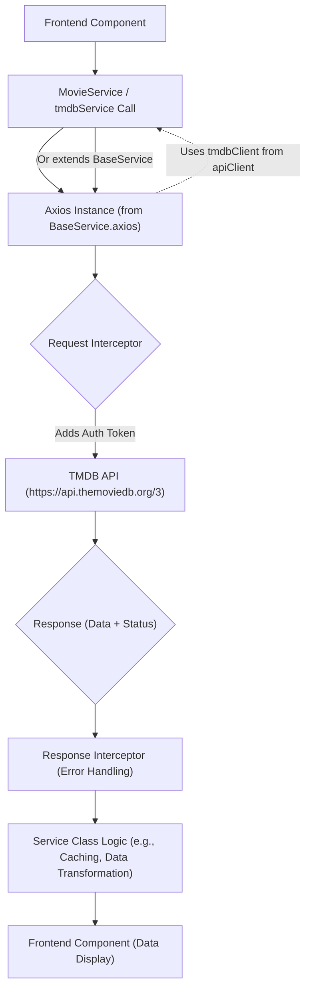
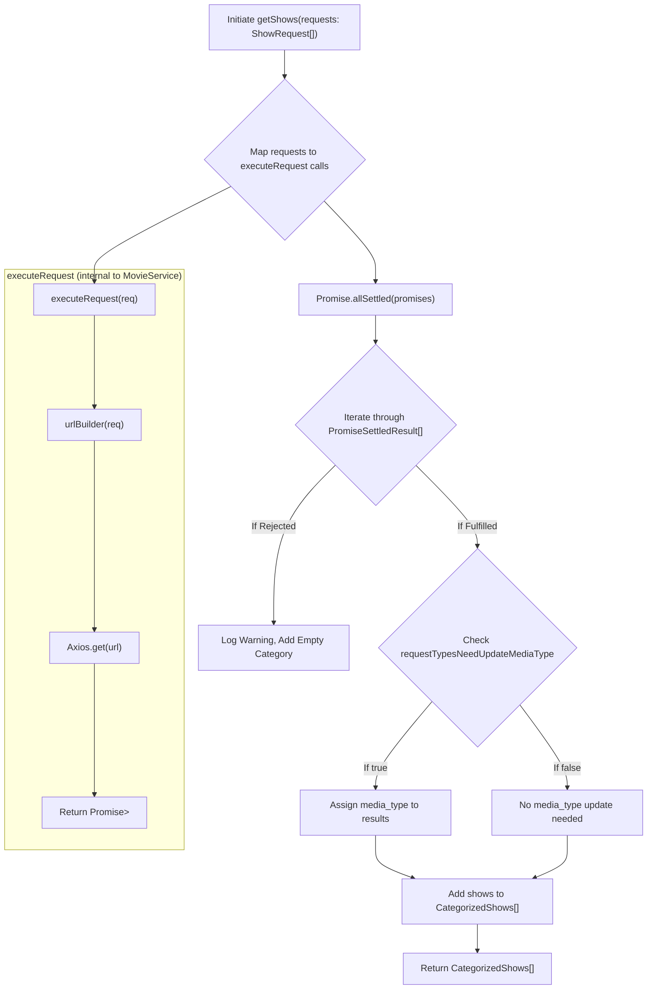

 # Data Services and API Integration

This section details the architectural approach to consuming and managing external APIs, with a specific focus on The Movie Database (TMDB). It outlines the use of dedicated service classes, a centralized Axios client, and robust error handling to ensure efficient and reliable data retrieval. The system is designed for extensibility, allowing for easy integration of additional third-party APIs while maintaining a consistent interface.

## Core Components for API Interaction

The API integration strategy is built around several key files that work in concert to provide a streamlined and secure way to interact with external services.

### `BaseService`

The `BaseService` class is the foundation for all API interactions. It encapsulates common configurations and functionalities required for making HTTP requests, such as setting up Axios instances, defining request interceptors for authentication, and handling common error responses. This promotes reusability and ensures a consistent approach across all service classes.

```typescript
// src/services/BaseService/BaseService.ts
import axios, {
  type AxiosRequestConfig,
  type AxiosError,
  type AxiosInstance,
  type InternalAxiosRequestConfig,
} from 'axios';
import { env } from '@/env.mjs';

/**
 * @class BaseService
 * Provides a base for API service classes with Axios instance creation and interceptors.
 */
class BaseService {
  constructor() {
    // Prevent direct instantiation of BaseService
    if (this.constructor === BaseService) {
      throw new Error("Classes can't be instantiated.");
    }
  }

  static axios(baseUrl: string) {
    const instanceConfig: AxiosRequestConfig = this.getConfig(baseUrl);
    const instance: AxiosInstance = axios.create(instanceConfig);

    // Request interceptor for authentication
    const onRequest = (
      config: InternalAxiosRequestConfig,
    ): InternalAxiosRequestConfig => {
      if (config.baseURL?.includes('themoviedb')) {
        config.headers.Authorization = `Bearer ${env.NEXT_PUBLIC_TMDB_TOKEN}`;
      }
      return config;
    };

    // Error response interceptor
    const onErrorResponse = (
      error: AxiosError | Error,
    ): Promise<AxiosError> => {
      console.error(`error in request: ${error.message}`);
      return Promise.reject(error);
    };

    instance.interceptors.request.use(onRequest, onErrorResponse);

    return instance;
  }

  // ... other static methods like getConfig, isRejected, isFulfilled
}

export default BaseService;
```

The `BaseService` prevents direct instantiation, serving purely as a static utility class. Its `axios` factory method creates and configures an Axios instance, applying a request interceptor to automatically add the TMDB bearer token for requests to the TMDB API. It also includes an error interceptor for centralized error logging.
[View on GitHub](https://github.com/lande26/LandeMon/blob/main/src/services/BaseService/BaseService.ts)

### `apiClient`

The `apiClient.ts` file is responsible for creating a pre-configured Axios client specifically for the TMDB API using the `BaseService`. This client is then exported for use by other service classes, providing a singleton instance that adheres to the established base configurations.

```typescript
// src/lib/apiClient.ts
import BaseService from '@/services/BaseService/BaseService';

const tmdbClient = BaseService.axios(`https://api.themoviedb.org/3/`);
export default tmdbClient;
```

This ensures that all direct calls to TMDB through `tmdbClient` automatically benefit from the `BaseService`'s interceptors, particularly the authorization header injection.
[View on GitHub](https://github.com/lande26/LandeMon/blob/main/src/lib/apiClient.ts)

### `MovieService`

The `MovieService` extends `BaseService` and provides specific methods for interacting with the TMDB API to fetch movie and TV show data. It leverages the `BaseService`'s Axios instance creation while adding application-specific logic like URL construction, caching, and handling various request types.

```typescript
// src/services/MovieService/MovieService.ts
import { getNameFromShow, getSlug } from '@/lib/utils';
import type {
  CategorizedShows,
  ISeason,
  KeyWordResponse,
  MediaType,
  Show,
  ShowWithGenreAndVideo,
} from '@/types';
import { type AxiosResponse } from 'axios';
import BaseService from '../BaseService/BaseService';
import {
  RequestType,
  type ShowRequest,
  type TmdbPagingResponse,
  type TmdbRequest,
} from '@/enums/request-type';
import { Genre } from '@/enums/genre';
import { cache } from 'react'; // React's cache function for memoization

const baseUrl = 'https://api.themoviedb.org/3';

class MovieService extends BaseService {
  // Finds a movie or TV series based on ID and pathname
  static async findCurrentMovie(id: number, pathname: string): Promise<Show> {
    // ... logic for finding movie/tv based on id
  }

  // Caching mechanism for specific requests
  static findMovie = cache(async (id: number) => {
    return this.axios(baseUrl).get<Show>(
      `/movie/${id}?append_to_response=keywords`,
    );
  });

  // URL builder for different TMDB request types
  static urlBuilder(req: TmdbRequest) {
    switch (req.requestType) {
      case RequestType.ANIME_LATEST:
        return `/discover/${req.mediaType}?with_keywords=210024%2C&language=en-US&sort_by=primary_release_date.desc&release_date.lte=2024-11-10&with_runtime.gte=1`;
      // ... other request types
      default:
        throw new Error(
          `request type ${req.requestType} is not implemented yet`,
        );
    }
  }

  // Executes a request constructed by urlBuilder
  static executeRequest(req: {
    requestType: RequestType;
    mediaType: MediaType;
    page?: number;
  }) {
    return this.axios(baseUrl).get<TmdbPagingResponse>(this.urlBuilder(req));
  }

  // Fetches multiple categories of shows concurrently
  static getShows = cache(async (requests: ShowRequest[]) => {
    // ... logic for executing multiple requests and processing responses
  });

  // Searches for movies/tv shows
  static searchMovies = cache(async (query: string, page?: number) => {
    const { data } = await this.axios(baseUrl).get<TmdbPagingResponse>(
      `/search/multi?query=${encodeURIComponent(query)}&language=en-US&page=${
        page ?? 1
      }`,
    );
    // ... sort and return data
  });
}

export default MovieService;
```

`MovieService` utilizes React's `cache` function to memoize network requests, reducing redundant API calls and improving performance. The `urlBuilder` method dynamically constructs TMDB API endpoints based on various `RequestType` enums, centralizing URL generation logic.
[View on GitHub](https://github.com/lande26/LandeMon/blob/main/src/services/MovieService/MovieService.ts)

### `tmdbService`

The `tmdbService.ts` file provides a collection of individual asynchronous functions for specific TMDB API calls. Unlike `MovieService` which extends `BaseService` and manages its own Axios instances (using `this.axios(baseUrl)`), `tmdbService` directly imports and uses the pre-configured `tmdbClient` from `src/lib/apiClient.ts`. This difference in approach offers flexibility: `MovieService` for complex, integrated logic, and `tmdbService` for simpler, direct API calls.

```typescript
// src/services/MovieService/tmdbService.ts
import { type Genre } from '@/enums/genre';
import { type TmdbPagingResponse } from '@/enums/request-type';
import tmdbClient from '@/lib/apiClient'; // Directly imports the configured client
import { type MediaType } from '@/types';

export async function getTrendingMovies(mediaType: MediaType, page: number) {
  const { data } = await tmdbClient.get<TmdbPagingResponse>(
    `/trending/${mediaType}/day?language=en-US&page=${page}`,
  );
  return data;
}

export async function getTopRatedMovies(mediaType: MediaType, page: number) {
  const { data } = await tmdbClient.get<TmdbPagingResponse>(
    `/${mediaType}/top_rated?page=${page}&language=en-US`,
  );
  data.results.forEach((movie) => (movie.media_type = mediaType));
  return data;
}

// ... other similar direct API call functions
```

Functions in `tmdbService` are straightforward wrappers around `tmdbClient.get()`, making them easy to use for direct data retrieval where complex URL building or request processing is not needed. Each function also ensures that `media_type` is correctly assigned to results, which is crucial for consistent data handling across the application.
[View on GitHub](https://github.com/lande26/LandeMon/blob/main/src/services/MovieService/tmdbService.ts)

## Data Flow for TMDB Integration

The following diagram illustrates the high-level data flow when fetching information from the TMDB API, highlighting the roles of `BaseService`, `apiClient`, and the specific service classes.





## Detailed Request Handling in `MovieService`

The `MovieService` class manages a variety of request types for retrieving categorized lists of movies and TV shows. This process involves building dynamic URLs, executing multiple requests concurrently, and processing their results.





This diagram illustrates how `MovieService.getShows` efficiently fetches data for multiple categories in parallel, robustly handles both successful and failed requests, and performs necessary data transformations before returning the aggregated results to the frontend.

## Key Integration Points

### Centralized Axios Configuration
The `BaseService` provides a centralized mechanism for creating and configuring Axios instances. This ensures that all HTTP requests, especially to sensitive APIs like TMDB, automatically include necessary headers (e.g., Authorization tokens) and adhere to global settings like timeouts and error handling policies. This reduces boilerplate and potential configuration errors across different service classes.

### Request Interceptors for Authentication
A critical component of `BaseService` is its request interceptor. By checking `config.baseURL?.includes('themoviedb')`, the system intelligently applies the `Bearer` token to only relevant TMDB requests. This method keeps API keys and tokens secure, prevents their accidental exposure to other endpoints, and centralizes authentication logic.

### Service-Specific Logic and Caching
`MovieService` demonstrates how to extend the base functionality with application-specific logic. Methods like `urlBuilder` dynamically construct API endpoints based on various `RequestType` enums, promoting flexibility in data fetching. The extensive use of React's `cache` function in `MovieService` and `tmdbService` functions is vital for performance optimization. It prevents redundant network requests for the same data within the same request lifecycle, reducing server load and improving user experience by speeding up data retrieval.

### Error Handling and Fallbacks
Both `BaseService` (via `onErrorResponse`) and `MovieService` (within `getShows` and `Promise.allSettled`) incorporate robust error handling. Requests that fail are logged, and `getShows` gracefully handles rejected promises by providing empty categories, preventing the entire application from crashing due to a single failed API call. This makes the data fetching process resilient and improves the application's stability.

### Separation of Concerns (`MovieService` vs. `tmdbService`)
The existence of both `MovieService` (an extended class with complex logic and internal Axios instance management) and `tmdbService` (a collection of direct functions using a shared `apiClient`) demonstrates a thoughtful separation of concerns. `MovieService` is suitable for scenarios requiring aggregated data, complex request types, and internal caching, while `tmdbService` offers quick, direct access for simpler, isolated API calls. This allows developers to choose the most appropriate pattern based on the complexity and requirements of the data interaction.

Next: [Global State Management](./7_global-state-management.mdx)