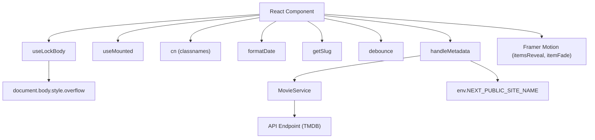

# Hooks and Utilities

This section documents the custom hooks and utility functions used within the LandeMon application. These tools enhance code reusability, improve component logic, and provide convenient ways to perform common tasks.

## Custom Hooks

### `useLockBody`

This hook is designed to prevent scrolling on the `body` element. This is particularly useful when displaying modals or overlays where you want to disable background scrolling.

```typescript
import * as React from "react";

// @see https://usehooks.com/useLockBodyScroll.
export function useLockBody() {
  React.useLayoutEffect((): (() => void) => {
    const originalStyle: string = window.getComputedStyle(
      document.body,
    ).overflow;
    document.body.style.overflow = "hidden";
    return () => (document.body.style.overflow = originalStyle);
  }, []);
}
```

**Explanation:**

1.  The hook uses `React.useLayoutEffect` to ensure the style change is applied before the browser paints the screen, preventing potential flickering.
2.  It captures the original `overflow` style of the `body`.
3.  It sets the `overflow` of the `body` to `"hidden"`, effectively disabling scrolling.
4.  It returns a cleanup function that resets the `overflow` style to its original value when the component unmounts or the effect is re-run.

[View on GitHub](https://github.com/lande26/LandeMon/blob/main/src/hooks/use-lock-body.ts)

### `useMounted`

This hook provides a simple way to track whether a component has been mounted. This is useful for avoiding state updates on unmounted components, which can lead to errors.

```typescript
import * as React from "react";

export function useMounted() {
  const [mounted, setMounted] = React.useState(false);

  React.useEffect(() => {
    setMounted(true);

    return () => setMounted(false);
  }, []);

  return mounted;
}
```

**Explanation:**

1.  The hook uses `React.useState` to create a `mounted` state variable, initialized to `false`.
2.  `React.useEffect` is used to set `mounted` to `true` after the component has been mounted.
3.  The effect also returns a cleanup function that sets `mounted` back to `false` when the component unmounts.
4.  The hook returns the `mounted` state variable, which can be used to conditionally execute code.

[View on GitHub](https://github.com/lande26/LandeMon/blob/main/src/hooks/use-mounted.ts)

## Utility Functions

### `cn`

This utility function simplifies the process of conditionally applying CSS classes using `clsx` and `tailwind-merge`.

```typescript
import { clsx, type ClassValue } from 'clsx';
import { twMerge } from 'tailwind-merge';

export function cn(...inputs: ClassValue[]) {
  return twMerge(clsx(inputs));
}
```

**Explanation:**

1.  `clsx` is used to conditionally include class names based on truthy values.
2.  `tailwind-merge` is used to resolve conflicts between Tailwind CSS classes, ensuring that the correct styles are applied.

**Example:**

```typescript jsx
<div className={cn("px-4 py-2 rounded-md", props.isPrimary ? "bg-blue-500 text-white" : "bg-gray-200")}>
  {props.children}
</div>
```

[View on GitHub](https://github.com/lande26/LandeMon/blob/main/src/lib/utils.ts)

### `formatDate`

This utility function formats a date string or number into a human-readable format.

```typescript
export function formatDate(input: string | number): string {
  const date = new Date(input);
  return date.toLocaleDateString('en-US', {
    month: 'long',
    day: 'numeric',
    year: 'numeric',
  });
}
```

**Explanation:**

1.  The function takes a date string or number as input.
2.  It creates a `Date` object from the input.
3.  It uses `toLocaleDateString` to format the date into a "Month Day, Year" format.

**Example:**

```typescript
formatDate("2023-10-27") // Returns "October 27, 2023"
```

[View on GitHub](https://github.com/lande26/LandeMon/blob/main/src/lib/utils.ts)

### `getSlug`

This function generates a URL-friendly slug from a name and an ID.

```typescript
export function getSlug(id: number, name: string): string {
  // build slug from name and id
  const regex = /([^\x00-\x7F]|[&$\+,:;=\?@#\s<>\[\]\{\}|\\\^%])+/gm;
  return `${name.toLowerCase().replace(regex, '-')}-${id}`;
}
```

**Explanation:**

1.  Converts the input name to lowercase.
2.  Replaces any non-ASCII characters, special symbols, or whitespace with hyphens.
3.  Appends the ID to the end of the processed name, separated by a hyphen. This ensures each URL is unique, even if titles are the same.

[View on GitHub](https://github.com/lande26/LandeMon/blob/main/src/lib/utils.ts)

### `debounce`

This utility function implements a debounce technique, which limits the rate at which a function can fire.

```typescript
let timer: NodeJS.Timeout;
export function debounce(
  func: (...args: (string | object)[]) => void,
  timeout: number,
): (...args: (string | object)[]) => void {
  return (...args: (string | object)[]) => {
    clearTimeout(timer);
    timer = setTimeout(() => {
      func(...args);
    }, timeout);
  };
}
```

**Explanation:**

1.  It takes a function `func` and a `timeout` value as input.
2.  It returns a new function that, when called, will delay the execution of `func` until after `timeout` milliseconds have elapsed since the last time the returned function was called.
3.  `clearTimeout` is used to prevent the function from being executed if it is called again within the `timeout` period.

**Use Case**:
Used to delay search input, so it doesn't overwhelm the server with calls, but waits for the user to finish typing before searching

[View on GitHub](https://github.com/lande26/LandeMon/blob/main/src/lib/utils.ts)

### `handleMetadata`

This function asynchronously fetches and formats metadata for movies or TV shows, specifically tailored for SEO purposes. It constructs data for `<meta>` tags, including descriptions, titles, keywords, and Open Graph/Twitter cards.

```typescript
export const handleMetadata = cache(
  async (slug: string, page: string, type: 'tv' | 'movie') => {
    const movieId: number = getIdFromSlug(slug);
    let keywords: string[] = [];
    let data: Show | null = null;
    try {
      const response: AxiosResponse<Show> =
        'tv' === type
          ? await MovieService.findTvSeries(movieId)
          : await MovieService.findMovie(movieId);
      data = response.data;
      const keywordResponse: AxiosResponse<KeyWordResponse> =
        await MovieService.getKeywords(movieId, type);
      const res =
        type === 'tv'
          ? keywordResponse.data.results
          : keywordResponse.data.keywords;
      keywords = res.map((item: KeyWord) => item.name);
    } catch (error) {
      console.error(error);
    }

    return {
      description: data?.overview,
      title: getNameFromShow(data),
      keywords: [
        ...keywords,
        slug.replace(`-${movieId}`, ''),
        env.NEXT_PUBLIC_SITE_NAME,
      ],
      openGraph: {
        type: 'website',
        locale: 'en_US',
        url: `${siteConfig.url}/${page}/${slug}`,
        images: `https://image.tmdb.org/t/p/original${
          data?.backdrop_path ?? data?.poster_path ?? ''
        }`,
        title: getNameFromShow(data),
        description: data?.overview ?? '',
        siteName: siteConfig.name,
      },
      twitter: {
        card: 'summary_large_image',
        title: getNameFromShow(data),
        description: data?.overview ?? '',
        images: `https://image.tmdb.org/t/p/original${
          data?.backdrop_path ?? data?.poster_path ?? ''
        }`,
        creator: siteConfig.author,
      },
    };
  },
);
```

**Explanation**:

1.  **Data Fetching:** Fetches movie or TV show details and keywords using `MovieService` based on the provided `slug` and `type`.
2.  **Metadata Construction:** Constructs metadata for SEO, including title, description, keywords, and Open Graph/Twitter card information.
3.  **Caching**: Uses react `cache` to cache responses from API calls.

[View on GitHub](https://github.com/lande26/LandeMon/blob/main/src/lib/utils.ts)

## Constants

### `itemsReveal` and `itemFade`

These constants define Framer Motion variants for animations.

```typescript
import type { Variants } from 'framer-motion';

// framer motion
export const itemsReveal: Variants = {
  hidden: { opacity: 0 },
  visible: {
    opacity: 1,
    transition: {
      staggerChildren: 0.25,
    },
  },
};

export const itemFade: Variants = {
  hidden: { opacity: 0 },
  visible: {
    opacity: 1,
  },
};
```

**Explanation:**

*   `itemsReveal`: Used for staggered reveal animations of child elements.
*   `itemFade`:  Used for simple fade-in animations.

[View on GitHub](https://github.com/lande26/LandeMon/blob/main/src/lib/constants.ts)

## Key Integration Points

These hooks and utility functions are used throughout the LandeMon application to:

*   Manage the UI state (e.g., disabling scrolling, tracking component mount status).
*   Format data for display (e.g., dates).
*   Generate URLs and slugs.
*   Implement common UI patterns (e.g., debouncing).
*   Provide SEO metadata.
*   Add animations.





This diagram illustrates how components interact with these hooks and utilities, highlighting their role in managing the UI, formatting data, and interacting with external services.

The `handleMetadata` function exemplifies a critical integration point, demonstrating how asynchronously fetched data is transformed and used to construct metadata for SEO purposes. It coordinates the fetch of the data, formatting, and response. By caching the results, it reduces load on the API endpoint, making the website faster and more responsive.