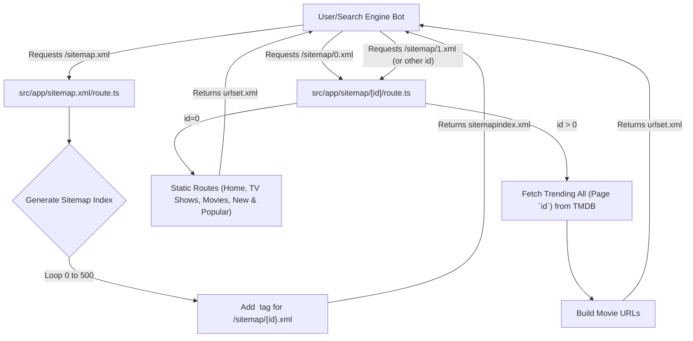

 # Internationalization and SEO

Building a web application that reaches a global audience and is easily discoverable by search engines requires a robust strategy for Internationalization (I18n) and Search Engine Optimization (SEO). This document outlines how the application addresses these critical aspects, leveraging Next.js features and custom sitemap generation.

## Internationalization (I18n) Foundations

While the provided codebase primarily focuses on a single language (`en`), it lays the groundwork for future internationalization efforts, particularly through metadata configuration.

### Setting the Document Language

The root `layout.tsx` file defines the primary language for the entire application, which is a fundamental step for I18n. This attribute informs browsers and search engines about the default language of the content.

```tsx filename="src/app/layout.tsx" {94}
export default function RootLayout({
  children,
}: {
  children: React.ReactNode;
}) {
  return (
    <html lang="en" suppressHydrationWarning>
      <body
        className={cn(
          'overlflow-y-auto min-h-screen overflow-x-hidden bg-background font-sans antialiased',
          fontSans.variable,
          fontHeading.variable,
        )}>
        {/* ... */}
      </body>
    </html>
  );
}
```

The `lang="en"` attribute explicitly sets the document's language to English. For multi-language support, this attribute would dynamically change based on the user's preferred locale or the detected language of the content, often managed through a middleware or routing strategy.

[View on GitHub](https://github.com/lande26/LandeMon/blob/main/src/app/layout.tsx#L94)

### Metadata Locale

The `metadata` object in `layout.tsx` also specifies a locale for Open Graph metadata. This is important for social media sharing platforms to understand the language context of your content.

```tsx filename="src/app/layout.tsx" {55}
export const metadata: Metadata = {
  // ...
  openGraph: {
    type: 'website',
    locale: 'en_US',
    url: siteConfig.url,
    title: siteConfig.name,
    images: siteConfig.ogImage,
    description: siteConfig.description,
    siteName: siteConfig.name,
  },
  // ...
};
```

[View on GitHub](https://github.com/lande26/LandeMon/blob/main/src/app/layout.tsx#L55-L62)

To support multiple languages, the `locale` property would be dynamically updated, and additional Open Graph tags for alternate locales (e.g., `og:locale:alternate`) could be added.

## Search Engine Optimization (SEO)

Effective SEO ensures that the application's content is discoverable and ranks well in search engine results. This application implements several key SEO strategies, including comprehensive metadata, sitemap generation, and integration with analytics tools.

### Comprehensive Metadata

Next.js's `metadata` API in the `layout.tsx` file allows for robust control over how search engines perceive and index the site. This includes defining titles, descriptions, keywords, and rich social media previews.

```tsx filename="src/app/layout.tsx" {37-88}
export const metadata: Metadata = {
  metadataBase: new URL(env.NEXT_PUBLIC_APP_URL),
  title: {
    default: siteConfig.name,
    template: `%s - ${siteConfig.name}`,
  },
  description: siteConfig.description,
  keywords: siteConfig.keywords,
  authors: [
    {
      name: siteConfig.author,
      url: siteConfig.url,
    },
  ],
  creator: siteConfig.author,
  openGraph: {
    type: 'website',
    locale: 'en_US',
    url: siteConfig.url,
    title: siteConfig.name,
    images: siteConfig.ogImage,
    description: siteConfig.description,
    siteName: siteConfig.name,
  },
  twitter: {
    card: 'summary_large_image',
    title: siteConfig.name,
    description: siteConfig.description,
    images: [siteConfig.ogImage],
    creator: siteConfig.author,
  },
  icons: {
    icon: '/favicon.ico',
  },
  other: { referrer: 'no-referrer-when-downgrade' },
};
```

[View on GitHub](https://github.com/lande26/LandeMon/blob/main/src/app/layout.tsx#L37-L88)

Key metadata fields and their SEO impact:
*   **`metadataBase`**: Defines the base URL for all relative URLs in the metadata, crucial for absolute links.
*   **`title` & `description`**: Primary elements for search engine results pages (SERPs). The `template` allows for dynamic page titles while maintaining a consistent brand.
*   **`keywords`**: Provides additional context to search engines about the content.
*   **`authors` & `creator`**: Establishes authorship and builds trust.
*   **`openGraph`**: Enhances how content appears when shared on platforms like Facebook and LinkedIn, with specific `type`, `url`, `title`, `description`, `images`, and `siteName`.
*   **`twitter`**: Customizes appearance on Twitter, using `summary_large_image` for richer previews.
*   **`icons`**: Specifies the favicon, improving brand recognition in browser tabs.
*   **`other: { referrer: 'no-referrer-when-downgrade' }`**: Manages referrer information, a security and privacy consideration.

The values for many of these metadata fields are sourced from `src/configs/site.ts`, centralizing site-wide configuration.

```tsx filename="src/configs/site.ts" {15-38}
export const siteConfig = {
  name: env.NEXT_PUBLIC_SITE_NAME,
  author: env.NEXT_PUBLIC_SITE_NAME,
  slogan: 'Cinema at Your Fingertips.',
  description:
    'Watch movies & TV shows online or stream right to your smart TV, game console, PC, Mac, mobile, tablet and more.',
  keywords: [
    'watch movies',
    'movies online',
    'watch TV',
    'TV online',
    'TV shows online',
    'watch TV shows',
    'stream movies',
    'stream tv',
    'instant streaming',
    'watch online',
    'movies',
    'watch TV online',
    'no download',
    'full length movies',
    env.NEXT_PUBLIC_SITE_NAME,
  ],
  url: env.NEXT_PUBLIC_APP_URL,
  ogImage: `${env.NEXT_PUBLIC_APP_URL}/images/hero.jpg`,
  // ...
};
```

[View on GitHub](https://github.com/lande26/LandeMon/blob/main/src/configs/site.ts#L15-L38)

### Dynamic Sitemap Generation

Sitemaps are crucial for search engines to discover all relevant pages on a website, especially for large sites with frequently updated content. This application implements a dynamic, paginated sitemap strategy.





#### Sitemap Index (`src/app/sitemap.xml/route.ts`)

This route generates a sitemap index file, which points to multiple smaller sitemap files. This approach helps manage large numbers of URLs and adheres to sitemap protocol limits (e.g., 50,000 URLs per sitemap file).

```tsx filename="src/app/sitemap.xml/route.ts" {2-18}
import { env } from '@/env.mjs';
export function GET() {
  const sitemapIndices: string[] = [];
  // tmdb has a limit of 500 pages
  for (let i = 0; i < 501; i++) {
    sitemapIndices.push(
      `
                  <sitemap>
                    <loc>${env.NEXT_PUBLIC_APP_URL}/sitemap/${i}.xml</loc>
                  </sitemap>
      `,
    );
  }
  const sitemap = `<?xml version="1.0" encoding="UTF-8"?>
            <sitemapindex xmlns="http://www.sitemaps.org/schemas/sitemap/0.9">
              ${sitemapIndices.join('')}
            </sitemapindex>
            `;

  return new Response(sitemap, {
    status: 200,
    headers: { 'Content-Type': 'text/xml' },
  });
}
```

[View on GitHub](https://github.com/lande26/LandeMon/blob/main/src/app/sitemap.xml/route.ts#L2-L18)

The code iterates 501 times (from 0 to 500) to create individual sitemap entries, reflecting the pagination structure used for content (e.g., from TMDB, which is limited to 500 pages of trending content). This means the application can effectively map and make discoverable up to 501 * 50,000 (standard sitemap limit) = 25,050,000 URLs.

#### Individual Sitemaps (`src/app/sitemap/[id]/route.ts`)

This dynamic route generates an individual sitemap XML file based on the `id` parameter.

```tsx filename="src/app/sitemap/[id]/route.ts" {3-29}
import { env } from '@/env.mjs';
import { buildMovieUrl } from '@/lib/utils';
import { getTrendingAll } from '@/services/MovieService/tmdbService';

export async function GET(request: Request, ctx: { params: { id: string } }) {
  if (!ctx.params.id) return new Response('Not found', { status: 404 });
  const id = parseInt(ctx.params.id.replace('.xml', ''));
  let urls: string[] = [];
  if (id === 0) {
    urls = [
      `${env.NEXT_PUBLIC_APP_URL}`,
      `${env.NEXT_PUBLIC_APP_URL}/home`,
      `${env.NEXT_PUBLIC_APP_URL}/tv-shows`,
      `${env.NEXT_PUBLIC_APP_URL}/movies`,
      `${env.NEXT_PUBLIC_APP_URL}/new-and-popular`,
    ];
  } else {
    const data = await getTrendingAll(id);
    data.results.forEach((show) => urls.push(buildMovieUrl(show)));
  }
  const sitemap = `<urlset xmlns="https://www.sitemaps.org/schemas/sitemap/0.9" xmlns:news="http://www.google.com/schemas/sitemap-news/0.9" xmlns:xhtml="http://www.w3.org/1999/xhtml" xmlns:image="http://www.google.com/schemas/sitemap-image/1.1" xmlns:video="http://www.google.com/schemas/sitemap-video/1.1">
      ${urls
        .map((url) => {
          return `
                <url>
                    <loc>${url}</loc>
                </url>
              `;
        })
        .join('')}
    </urlset>
  `;

  return new Response(sitemap, {
    status: 200,
    headers: { 'Content-Type': 'text/xml' },
  });
}
```

[View on GitHub](https://github.com/lande26/LandeMon/blob/main/src/app/sitemap/[id]/route.ts#L3-L29)

*   **`id = 0`**: For the initial sitemap (`sitemap/0.xml`), it includes key static pages like `/`, `/home`, `/tv-shows`, `/movies`, and `/new-and-popular`.
*   **`id > 0`**: For subsequent sitemaps (e.g., `sitemap/1.xml`), it fetches trending content (movies/TV shows) using `getTrendingAll(id)` from an external service (TMDB in this case). Each item's URL is constructed using `buildMovieUrl` and added to the sitemap. This ensures that dynamic content, which might not be linked extensively internally, is still discovered by search engines.

### Analytics Integration

Understanding user behavior is vital for improving both user experience and SEO. The application integrates Google Analytics to track user interactions.

```tsx filename="src/app/layout.tsx" {105-119}
export default function RootLayout({
  children,
}: {
  children: React.ReactNode;
}) {
  return (
    <html lang="en" suppressHydrationWarning>
      <body
        className={cn(
          'overlflow-y-auto min-h-screen overflow-x-hidden bg-background font-sans antialiased',
          fontSans.variable,
          fontHeading.variable,
        )}>
        <ThemeProvider
          attribute="class"
          defaultTheme="system"
          enableSystem
          disableTransitionOnChange>
          {/* ... */}
          {env.NEXT_PUBLIC_GOOGLE_ANALYTICS_ID && (
            <>
              <Script
                id="_next-ga-init"
                dangerouslySetInnerHTML={{
                  __html: `
          window.dataLayer = window.dataLayer || [];
          function gtag(){window.dataLayer.push(arguments);}
          gtag('js', new Date());

          gtag('config', '${env.NEXT_PUBLIC_GOOGLE_ANALYTICS_ID}', { cookie_flags: 'max-age=86400;secure;samesite=none' });`,
                }}
              />
              <Script
                id="_next-ga"
                src={`https://www.googletagmanager.com/gtag/js?id=${env.NEXT_PUBLIC_GOOGLE_ANALYTICS_ID}`}
              />
            </>
          )}
        </ThemeProvider>
      </body>
    </html>
  );
}
```

[View on GitHub](https://github.com/lande26/LandeMon/blob/main/src/app/layout.tsx#L105-L119)

The Google Analytics script is conditionally loaded based on the `NEXT_PUBLIC_GOOGLE_ANALYTICS_ID` environment variable. This ensures that analytics are only enabled in environments where tracking is desired. The use of `next/script` for loading Google Analytics asynchronously and deferring its execution is an SEO best practice as it prevents render-blocking and improves page load performance.

## Key Integration Points

The strategies for Internationalization and SEO are deeply integrated into the core Next.js application structure:

*   **`src/app/layout.tsx`**: This file is central for both I18n and SEO, defining the default language, comprehensive metadata, and integrating analytics scripts. Its role as the root layout ensures consistent application-wide settings.
*   **`src/configs/site.ts`**: Acts as a single source of truth for site-wide SEO-related information such as `name`, `description`, `keywords`, `url`, and `ogImage`. This centralization simplifies management and ensures consistency across metadata.
*   **`src/app/sitemap.xml/route.ts` & `src/app/sitemap/[id]/route.ts`**: These API routes are dedicated to dynamically generating sitemap files, ensuring that all discoverable content, both static and dynamic, is presented to search engines in an optimized format.
*   **Environment Variables (`env.mjs`)**: Critical configurations like `NEXT_PUBLIC_APP_URL`, `NEXT_PUBLIC_SITE_NAME`, and `NEXT_PUBLIC_GOOGLE_ANALYTICS_ID` are managed via environment variables, promoting flexibility and security across different deployment environments.

By adhering to these practices, the application not only offers a solid foundation for future multi-language expansion but also maximizes its visibility and ranking potential in search engine results.