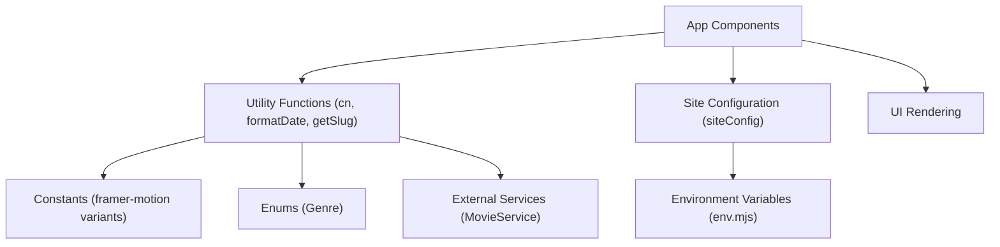

# Utility Functions and Configurations

This section provides an overview of the utility functions, constants, and site configurations used within the LandeMon project. These components are crucial for managing application logic, defining essential values, and tailoring the site's behavior and appearance.

## Site Configuration (`src/configs/site.ts`)

The `siteConfig` object centralizes key information about the application, including its name, description, social links, navigation structure, and footer links. This configuration is essential for branding, SEO, and defining the primary user interface elements.

```typescript
import { Icons } from '@/components/icons';
import { env } from '@/env.mjs';

export type SiteConfig = typeof siteConfig;

export const siteConfig = {
  name: env.NEXT_PUBLIC_SITE_NAME,
  author: env.NEXT_PUBLIC_SITE_NAME,
  slogan: 'Cinema at Your Fingertips.',
  description:
    'Watch movies & TV shows online or stream right to your smart TV, game console, PC, Mac, mobile, tablet and more.',
  keywords: [
    'watch movies',
    'movies online',
    'watch TV',
    'TV online',
    'TV shows online',
    'watch TV shows',
    'stream movies',
    'stream tv',
    'instant streaming',
    'watch online',
    'movies',
    'watch TV online',
    'no download',
    'full length movies',
    env.NEXT_PUBLIC_SITE_NAME,
  ],
  url: env.NEXT_PUBLIC_APP_URL,
  ogImage: `${env.NEXT_PUBLIC_APP_URL}/images/hero.jpg`,
  links: {
    twitter: `${env.NEXT_PUBLIC_TWITTER}`,
    github: 'https://github.com/lande26/LandeMon',
    githubAccount: '',
  },
  footerItems: [
    { title: 'About', href: '/' },
    { title: 'Help Center', href: '/' },
    { title: 'Contact Us', href: '/' },
    { title: 'Privacy Policy', href: '/' },
  ],
  mainNav: [
    {
      title: 'Home',
      href: '/home',
    },
    {
      title: 'TV Shows',
      href: '/tv-shows',
    },
    {
      title: 'Movies',
      href: '/movies',
    },
    {
      title: 'Anime',
      href: '/anime',
    },
    {
      title: 'New & Popular',
      href: '/new-and-popular',
    },
  ],
};
```

## Utility Functions (`src/lib/utils.ts`)

This file houses a collection of utility functions designed to streamline common development tasks, such as:

*   **String Manipulation:** Formatting dates, extracting years from dates, generating slugs, and formatting enum values.
*   **URL Handling:** Creating absolute URLs and extracting search parameters.
*   **DOM Manipulation:** Clearing search inputs and handling default search input/button states.
*   **Conditional Styling:** The `cn` function merges Tailwind CSS classes.
*   **Data Fetching Helpers:** Functions like `handleDefaultSearchInp` and `handleMetadata` interact with services and environment variables to prepare data for display or SEO.
*   **Debouncing:** The `debounce` function helps optimize performance by limiting the rate at which a function can be called.
*   **Device Detection:** `getMobileDetect` provides information about the user's device.
*   **Data Processing:** `getNameFromShow` safely retrieves a show's name or title, and `getRandomShow` selects a random item from a categorized list.

```typescript
export function cn(...inputs: ClassValue[]) {
  return twMerge(clsx(inputs));
}

export function formatDate(input: string | number): string {
  const date = new Date(input);
  return date.toLocaleDateString('en-US', {
    month: 'long',
    day: 'numeric',
    year: 'numeric',
  });
}

export function getSlug(id: number, name: string): string {
  const regex = /([^\x00-\x7F]|[&$\+,:;=\?@#\s<>\[\]\{\}|\\\^%])+/gm;
  return `${name.toLowerCase().replace(regex, '-')}-${id}`;
}

export const handleMetadata = cache(
  async (slug: string, page: string, type: 'tv' | 'movie') => {
    // ... (implementation details)
    return {
      description: data?.overview,
      title: getNameFromShow(data),
      keywords: [
        ...keywords,
        slug.replace(`-${movieId}`, ''),
        env.NEXT_PUBLIC_SITE_NAME,
      ],
      openGraph: {
        type: 'website',
        locale: 'en_US',
        url: `${siteConfig.url}/${page}/${slug}`,
        images: `https://image.tmdb.org/t/p/original${
          data?.backdrop_path ?? data?.poster_path ?? ''
        }`,
        title: getNameFromShow(data),
        description: data?.overview ?? '',
        siteName: siteConfig.name,
      },
      twitter: {
        card: 'summary_large_image',
        title: getNameFromShow(data),
        description: data?.overview ?? '',
        images: `https://image.tmdb.org/t/p/original${
          data?.backdrop_path ?? data?.poster_path ?? ''
        }`,
        creator: siteConfig.author,
      },
    };
  },
);
```

## Constants (`src/lib/constants.ts`)

This file defines constants used throughout the application. Primarily, it includes `framer-motion` animation variants, which are essential for creating smooth and engaging UI transitions.

```typescript
import type { Variants } from 'framer-motion';

// framer motion
export const itemsReveal: Variants = {
  hidden: { opacity: 0 },
  visible: {
    opacity: 1,
    transition: {
      staggerChildren: 0.25,
    },
  },
};

export const itemFade: Variants = {
  hidden: { opacity: 0 },
  visible: {
    opacity: 1,
  },
};
```

## Genre Enumeration (`src/enums/genre.ts`)

The `Genre` enum provides a clear and type-safe way to represent various movie and TV show genres, mapping them to their corresponding numerical IDs. This is crucial for consistent data handling and API interactions.

```typescript
export enum Genre {
  ACTION = 28,
  ADVENTURE = 12,
  ANIMATION = 16,
  COMEDY = 35,
  CRIME = 80,
  DOCUMENTARY = 99,
  DRAMA = 18,
  FAMILY = 10751,
  FANTASY = 14,
  HISTORY = 36,
  HORROR = 27,
  MUSIC = 10402,
  MYSTERY = 9648,
  ROMANCE = 10749,
  SCIENCE_FICTION = 878,
  TV_MOVIE = 10770,
  THRILLER = 53,
  WAR = 10752,
  WESTERN = 37,
  ACTION_ADVENTURE = 10759,
  KIDS = 10762,
  NEWS = 10763,
  REALITY = 10764,
  SCIFI_FANTASY = 10765,
  SOAP = 10766,
  TALK = 10767,
  WAR_POLITICS = 10768,
}
```

## Architecture Overview

The following diagram illustrates the basic flow of how utility functions and configurations are utilized within the application.





## Key Takeaways

*   **Centralized Configuration**: `siteConfig` acts as a single source of truth for site-wide information, ensuring consistency.
*   **Code Reusability**: Utility functions promote DRY principles, making the codebase more maintainable and efficient.
*   **Type Safety**: Enums like `Genre` enhance code clarity and reduce the likelihood of errors.
*   **Performance Optimization**: Constants like animation variants contribute to a smoother user experience.
*   **Environment-Specific Settings**: The integration with `env.mjs` allows for flexible deployment and customization.