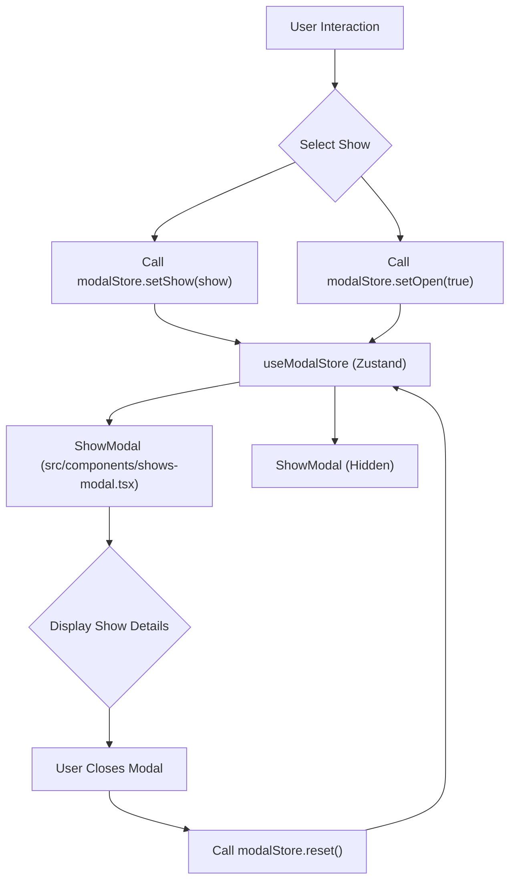
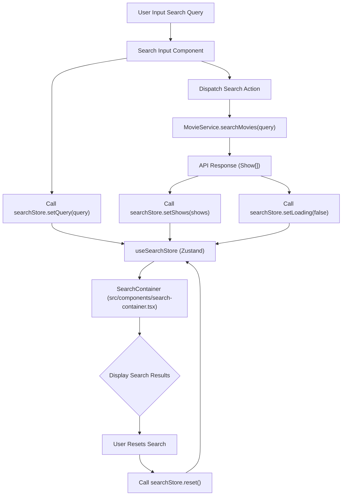

 # Global State Management

Effective global state management is crucial for maintaining a consistent and responsive user interface across a complex application. In this project, global state is primarily managed using [Zustand](https://zustand-bear.github.io/zustand/), a fast, scalable, and tiny state-management solution based on simplified Flux principles. This document outlines the mechanisms and dedicated stores for managing critical global states such as modal visibility and search functionality.

The primary goal of these global stores is to centralize application-wide data that influences multiple components, preventing prop drilling and ensuring a single source of truth for dynamic UI elements.

## State Stores

Two main Zustand stores handle distinct global state concerns: `useModalStore` for managing the display and content of the `ShowModal`, and `useSearchStore` for handling search queries and results.

### Modal Store (`src/stores/modal.ts`)

The `useModalStore` is responsible for managing the state related to the `ShowModal` component. This includes controlling its visibility, the data of the show being displayed, and playback state.

<br />

```typescript
// src/stores/modal.ts
import type { Show } from '@/types';
import { create } from 'zustand';

interface ModalState {
  open: boolean;
  setOpen: (open: boolean) => void;
  firstLoad: boolean;
  show: Show | null;
  setShow: (show: Show | null) => void;
  play: boolean;
  setPlay: (play: boolean) => void;
  reset: () => void;
}

export const useModalStore = create<ModalState>()((set) => ({
  open: false,
  setOpen: (open: boolean) => set(() => ({ open })),
  firstLoad: false,
  setFirstLoad: (firstLoad: boolean) => set(() => ({ firstLoad })),
  show: null,
  setShow: (show: Show | null) => set(() => ({ show })),
  play: false,
  setPlay: (play: boolean) => set(() => ({ play })),
  reset: () =>
    set(() => ({
      show: null,
      open: false,
      play: false,
      firstLoad: false,
    })),
}));
```

[View on GitHub](https://github.com/lande26/LandeMon/blob/main/src/stores/modal.ts#L1-L28)

**Key Properties:**

*   `open`: A boolean indicating whether the modal is currently visible.
*   `show`: An object of type `Show` (or `null`) representing the media content whose details are displayed in the modal.
*   `play`: A boolean to control video playback within the modal.
*   `firstLoad`: A boolean flag used to manage initial loading states, particularly for muting video playback on mobile devices or initial page loads.

**Actions:**

*   `setOpen(open: boolean)`: Toggles the visibility of the modal.
*   `setShow(show: Show | null)`: Sets the `Show` object to be displayed in the modal.
*   `setPlay(play: boolean)`: Controls the play state of the media in the modal.
*   `reset()`: Resets all modal-related state properties to their initial values, effectively closing the modal and clearing its content.

### Search Store (`src/stores/search.ts`)

The `useSearchStore` is dedicated to managing all aspects of the application's search functionality. This includes the search query string, the array of search results, and the loading state.

<br />

```typescript
// src/stores/search.ts
import { clearSearch } from '@/lib/utils';
import type { Show } from '@/types';
import { create } from 'zustand';

interface SearchState {
  query: string;
  setQuery: (query: string) => void;
  shows: Show[];
  setShows: (shows: Show[]) => void;
  isOpen: boolean;
  setOpen: (value: boolean) => void;
  loading: boolean;
  setLoading: (value: boolean) => void;
  reset: () => void;
}

export const useSearchStore = create<SearchState>()((set) => ({
  query: '',
  setQuery: (query: string) => set(() => ({ query })),
  shows: [],
  setShows: (shows: Show[]) => set(() => ({ shows })),
  isOpen: false,
  setOpen: (value: boolean) => set(() => ({ isOpen: value })),
  loading: false,
  setLoading: (value: boolean) => set(() => ({ loading: value })),
  reset: () =>
    set(() => {
      clearSearch();
      return { query: '', shows: [], loading: false };
    }),
}));
```

[View on GitHub](https://github.com/lande26/LandeMon/blob/main/src/stores/search.ts#L1-L28)

**Key Properties:**

*   `query`: The current search string entered by the user.
*   `shows`: An array of `Show` objects representing the results of the search query.
*   `isOpen`: A boolean indicating whether the search results container is open or active.
*   `loading`: A boolean flag to indicate if a search operation is currently in progress.

**Actions:**

*   `setQuery(query: string)`: Updates the search query string.
*   `setShows(shows: Show[])`: Sets the array of `Show` objects returned by a search.
*   `setOpen(value: boolean)`: Toggles the visibility or active state of the search UI.
*   `setLoading(value: boolean)`: Updates the loading state during search operations.
*   `reset()`: Resets the search query, results, and loading state to their initial values. This action also calls `clearSearch()` from `lib/utils` to clear any search-related data from local storage or URL.

## Component Integration

Global stores are consumed by relevant components to manage their UI and data.

### `ShowModal` (`src/components/shows-modal.tsx`)

The `ShowModal` component extensively uses `useModalStore` to display detailed information about a selected show.

The modal's visibility and content are directly driven by the store's `open` and `show` states. When a user interacts with content that triggers the modal, the `useModalStore.setShow()` and `useModalStore.setOpen(true)` actions are dispatched.

<br />

```typescript
// src/components/shows-modal.tsx
// ... (imports)
import { useModalStore } from '@/stores/modal';
// ... (type definitions)

const ShowModal = () => {
  // stores
  const modalStore = useModalStore();
  // ... (component state and refs)

  // get trailer and genres of show
  React.useEffect(() => {
    if (modalStore.firstLoad || IS_MOBILE) {
      setOptions((state: Record<string, object>) => ({
        ...state,
        playerVars: { ...state.playerVars, mute: 1 },
      }));
    }
    void handleGetData();
  }, []);

  // ... (other effects and handlers)

  const handleCloseModal = () => {
    modalStore.reset(); // Resets the store when modal closes
    if (!modalStore.show || modalStore.firstLoad) {
      window.history.pushState(null, '', '/home');
    } else {
      window.history.back();
    }
  };

  // ... (JSX render)
  return (
    <Dialog
      open={modalStore.open} // Controls open state from store
      onOpenChange={handleCloseModal} // Closes modal and resets store
      aria-label="Modal containing show's details">
      {/* ... modal content ... */}
      <DialogTitle className="text-lg font-medium leading-6 text-slate-50 sm:text-xl">
        {modalStore.show?.title ?? modalStore.show?.name} {/* Display show details */}
      </DialogTitle>
      {/* ... more show details ... */}
    </Dialog>
  );
};

export default ShowModal;
```

[View on GitHub](https://github.com/lande26/LandeMon/blob/main/src/components/shows-modal.tsx#L49-L136)

Upon closing, `modalStore.reset()` is called, clearing the `show` data and setting `open` to `false`, ensuring a clean slate for the next modal interaction. This design ensures that the `ShowModal` is a pure consumer of the global state, promoting reusability and separation of concerns.

### `SearchContainer` (`src/components/search-container.tsx`)

The `SearchContainer` component is responsible for displaying search results based on the `useSearchStore`. It initializes the store with data received via props and then relies on the store for rendering its contents.

<br />

```typescript
// src/components/search-container.tsx
'use client';

import React from 'react';
import type { Show } from '@/types';
import ShowsGrid from '@/components/shows-grid';
import { useSearchStore } from '@/stores/search'; // Import search store
import { handleDefaultSearchBtn, handleDefaultSearchInp } from '@/lib/utils';

interface SearchContainer {
  query: string;
  shows: Show[];
}

function SearchContainer({ shows, query }: SearchContainer) {
  const searchStore = useSearchStore(); // Consume search store

  React.useEffect(() => {
    searchStore.setOpen(true); // Open the search container
    searchStore.setQuery(query); // Set initial query from props
    searchStore.setShows(shows); // Set initial shows from props
    // ... (setTimeout for UI interactions)

    return () => {
      // ... (clear timeouts)
    };
  }, []);

  return <ShowsGrid shows={searchStore.shows} query={searchStore.query} />; // Render based on store data
}

export default SearchContainer;
```

[View on GitHub](https://github.com/lande26/LandeMon/blob/main/src/components/search-container.tsx#L1-L32)

Upon mounting, `SearchContainer` populates `useSearchStore` with the initial `query` and `shows` data it receives as props. Subsequent updates to the search results or query within the application (e.g., from a search input elsewhere) would directly modify `useSearchStore`, and `SearchContainer` would reactively update. This ensures that the search results are globally accessible and consistent.

## Global State Flow Diagrams

The following diagrams illustrate the interaction patterns between components and the Zustand global stores.

### Modal State Management Flow

This diagram shows how user interaction with a show, the `ShowModal` component, and the `useModalStore` interact to manage the display of show details.





### Search State Management Flow

This diagram depicts the flow of data when a user performs a search, from the input component to the `SearchContainer` via `useSearchStore`.





## Key Integration Points

*   **Centralized State:** Zustand allows for a clear separation of concerns, with each store managing a specific slice of the global state (e.g., `modal` for modal interactions, `search` for search data).
*   **Decoupling Components:** Components like `ShowModal` and `SearchContainer` do not need to manage their own internal state for data that is global. Instead, they subscribe to the relevant Zustand stores, ensuring they always reflect the latest application-wide state.
*   **Action Dispatch:** State mutations are performed through well-defined actions (e.g., `setOpen`, `setShow`, `reset`). This promotes predictable state changes and makes debugging easier.
*   **Reactive UI:** Components consuming the stores automatically re-render when the relevant state changes, providing a highly reactive and dynamic user experience without complex manual updates.
*   **URL Synchronization:** For search, the initial `query` and `shows` might be populated from URL parameters, ensuring that shared search links work correctly. When a modal opens, the URL might also change, and `handleCloseModal` handles history state to provide intuitive navigation.

By leveraging Zustand, the application maintains a clean, scalable, and easy-to-understand state management architecture for its global concerns.

Next: [Configurations and Enums](./8_configurations-and-enums.mdx)